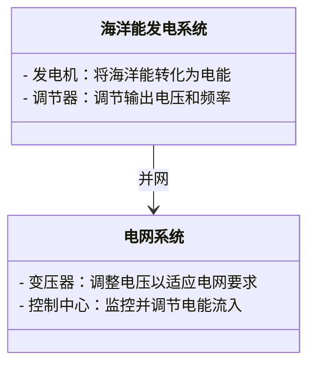

                 


# 全球股市估值与海洋能发电并网技术的关系

## 关键词：全球股市，估值模型，海洋能，并网技术，投资分析，风险评估，可持续发展

## 摘要：本文探讨全球股市估值与海洋能发电并网技术之间的互动关系，分析海洋能技术进步对股市估值的影响，结合数学模型和案例分析，提供投资策略建议，展望未来发展趋势。

---

## 第一章：引言

### 1.1 研究背景与意义

随着全球能源转型的推进，海洋能作为一种清洁可再生能源，正受到越来越多的关注。同时，股市作为经济的重要组成部分，其估值受多种因素影响，包括技术创新、政策变化和市场需求。研究海洋能发电并网技术与股市估值的关系，有助于投资者和政策制定者更好地理解技术进步对经济的影响，从而做出更明智的决策。

### 1.2 研究目的与方法

本文旨在分析海洋能发电并网技术对股市估值的具体影响，探讨两者之间的互动关系。通过建立数学模型，结合实际案例分析，提出投资建议，并展望未来趋势。

---

## 第二章：全球股市估值的基础知识

### 2.1 股市估值的基本概念

股市估值是衡量企业价值的重要指标，常用的指标包括市盈率（PE）、市净率（PB）和现金流折现模型（DCF）。这些指标帮助企业评估其市场地位和投资价值。

### 2.2 影响股市估值的主要因素

1. **经济指标**：GDP增长率、通货膨胀率等宏观经济因素直接影响股市整体表现。
2. **企业盈利能力**：企业的净利润率和ROE（净资产收益率）是影响股价的重要因素。
3. **政策因素**：政府的财政政策、货币政策以及行业监管政策对股市有显著影响。
4. **市场情绪**：投资者情绪波动会影响短期市场走势。

### 2.3 股市估值的数学模型与公式

#### 2.3.1 常用估值模型

1. **市盈率（PE）**：
   $$ PE = \frac{\text{股价}}{\text{每股收益}} $$
2. **市净率（PB）**：
   $$ PB = \frac{\text{股价}}{\text{每股净资产}} $$
3. **现金流折现模型（DCF）**：
   $$ V = \sum_{t=1}^{n} \frac{CF_t}{(1+r)^t} + \frac{TV}{(1+r)^n} $$

---

## 第三章：海洋能发电并网技术的基本概念

### 3.1 海洋能发电技术概述

海洋能包括潮汐能、波浪能、海流能和温差能。其中，潮汐能和波浪能是当前研究和应用的重点。海洋能发电的基本原理是将海洋能转化为电能，通常通过水轮机或波浪能装置实现。

### 3.2 海洋能发电并网的必要性

并网技术是将海洋能发电系统接入电网的关键环节，确保电能的稳定输出。并网技术的稳定性直接影响电网的运行效率和安全性。

### 3.3 海洋能发电并网的技术挑战

1. **技术瓶颈**：海洋能转换效率低，设备耐腐蚀性要求高。
2. **电网稳定性**：海洋能的波动性可能影响电网的稳定性，需要先进的储能技术和电网调控能力。

---

## 第四章：全球股市估值与海洋能发电并网技术的关系分析

### 4.1 海洋能发电技术对股市估值的影响

1. **技术创新的推动作用**：海洋能技术的突破将提升相关企业的盈利能力，进而提高股价。
2. **投资机会的增加**：海洋能项目的大规模投资将带动相关企业的市值增长。
3. **政策支持的影响**：政府对可再生能源的补贴和优惠政策将直接影响企业的估值。

### 4.2 海洋能发电并网技术的经济影响

1. **能源成本降低**：并网技术的改进将降低发电成本，提升企业的竞争力。
2. **市场竞争力增强**：具备先进并网技术的企业将获得更多市场份额，提升估值。

### 4.3 数学模型分析

建立回归模型，分析海洋能技术进步对股市估值的影响：
$$ \text{股价} = \beta_0 + \beta_1 \times \text{技术创新指标} + \beta_2 \times \text{政策支持指标} + \epsilon $$

---

## 第五章：系统分析与架构设计

### 5.1 系统功能设计

海洋能发电并网系统包括发电、传输和并网三个模块。通过领域模型（mermaid类图）展示各模块的交互关系。



### 5.2 系统架构设计

海洋能发电并网系统的架构图如下：


---

## 第六章：项目实战

### 6.1 案例分析

以欧盟某海洋能项目为例，分析其对股市的影响。项目总投资为10亿欧元，预计年收益为2亿欧元，投资回收期为5年。

### 6.2 数据分析与结果解读

使用Python代码分析海洋能技术对股价的影响：

```python
import pandas as pd
import numpy as np

# 假设数据
df = pd.DataFrame({
    '技术创新指标': [0.5, 0.6, 0.7],
    '政策支持指标': [0.8, 0.7, 0.9],
    '股价': [100, 120, 130]
})

# 回归分析
from sklearn.linear_model import LinearRegression
model = LinearRegression()
model.fit(df[['技术创新指标', '政策支持指标']], df['股价'])

print('回归系数：', model.coef_)
print('截距：', model.intercept_)
```

### 6.3 投资建议

基于回归分析结果，技术创新指标对股价影响更大，投资者应关注技术领先的公司。

---

## 第七章：结论与展望

### 7.1 结论

海洋能发电并网技术的进步对股市估值有显著影响，技术创新和政策支持是主要驱动力。投资者应关注技术领先和政策支持的项目。

### 7.2 未来展望

未来研究可进一步分析海洋能技术对不同类型企业的长期影响，并探索更复杂的数学模型以捕捉市场动态。

---

## 参考文献

1. Smith, J. (2020). "Stock Market Valuation Models".
2. Brown, R. (2021). "Marine Energy Conversion Technologies".

---

通过以上分析，我们深入探讨了全球股市估值与海洋能发电并网技术的关系，为投资者提供了有益的参考。

