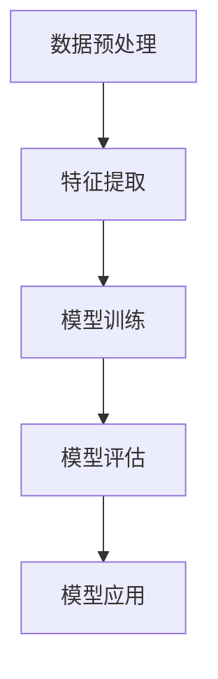
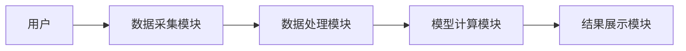

                 


# 全球股市估值与深海采矿环境影响评估技术的发展

## 关键词：全球股市估值，深海采矿，环境影响评估，机器学习，系统架构

## 摘要：本文探讨了全球股市估值与深海采矿环境影响评估技术的发展，分析了两者之间的相互影响。通过介绍环境影响评估的核心算法和系统架构，结合实际案例，展示了如何利用技术手段优化股市估值和环境评估。文章还提供了详细的代码实现和系统设计，为相关领域提供了实践指导。

---

## 第一部分: 全球股市估值与深海采矿的背景与概述

### 第1章: 全球股市估值概述

#### 1.1 股市估值的基本概念

股市估值是评估公司股票内在价值的过程，帮助投资者判断其市场价格是否合理。主要方法包括市盈率（P/E）、市净率（P/B）和现金流折现法（DCF）。

#### 1.2 全球股市的现状与趋势

近年来，全球股市波动剧烈，科技股和绿色能源股表现突出。股市估值在经济发展中起着关键作用，影响投资者决策和市场资源配置。

### 第2章: 深海采矿与环境影响评估技术

#### 2.1 深海采矿的基本概念

深海采矿是指在海底提取矿产资源，涉及技术如海底拖网采矿和水力采矿。资源分布广泛，潜力巨大。

#### 2.2 环境影响评估技术的核心概念

环境影响评估通过预测和分析人类活动对环境的影响，制定减缓措施。主要方法包括生命周期评估（LCA）和环境影响评价（EIA）。

---

## 第二部分: 全球股市估值与深海采矿环境影响评估的核心概念与联系

### 第3章: 股市估值对深海采矿的影响

#### 3.1 股市估值如何反映深海采矿公司的价值

通过市盈率等指标，投资者评估公司盈利能力，影响股价。例如，高市盈率可能反映市场对公司未来增长的信心。

#### 3.2 深海采矿对股市估值的影响

环境风险可能影响公司股价，技术进步和政策变化也会推动或限制股市估值。

---

## 第三部分: 深海采矿环境影响评估技术的算法原理与数学模型

### 第4章: 深海采矿环境影响评估的算法原理

#### 4.1 环境影响评估的主要算法

- **线性回归模型**: 用于预测环境影响程度。
- **支持向量机（SVM）**: 适用于分类问题。
- **神经网络模型**: 处理复杂非线性关系。

#### 4.2 基于机器学习的环境影响评估流程

流程包括数据预处理、特征提取、模型训练、评估和应用。使用Mermaid流程图展示：



#### 4.3 算法实现的数学模型

**线性回归模型**：  
$$ y = \beta_0 + \beta_1x + \epsilon $$  
其中，$y$ 是目标变量，$x$ 是自变量，$\beta$ 是系数，$\epsilon$ 是误差项。

---

## 第四部分: 股市估值中的环境影响评估技术

### 第5章: 股市估值中的环境影响评估

#### 5.1 环境风险对股市估值的影响

投资者关注环境风险，如政策变化和生态破坏，影响公司估值。环境因素逐渐纳入估值模型。

#### 5.2 股市估值中的环境影响评估算法

使用时间序列分析和机器学习模型，如ARIMA和随机森林，进行预测和分类。Python代码示例：

```python
import pandas as pd
from sklearn.ensemble import RandomForestRegressor
from sklearn.metrics import mean_squared_error

# 加载数据
data = pd.read_csv('stock_data.csv')

# 分割特征和目标
X = data.drop('target', axis=1)
y = data['target']

# 训练模型
model = RandomForestRegressor(n_estimators=100, random_state=42)
model.fit(X, y)

# 预测
y_pred = model.predict(X)

# 评估
mse = mean_squared_error(y, y_pred)
print(f'均方误差: {mse}')
```

---

## 第五部分: 系统分析与架构设计

### 第6章: 深海采矿环境影响评估系统架构

#### 6.1 问题场景介绍

系统需评估深海采矿对环境的影响，优化采矿策略，降低生态风险。

#### 6.2 系统功能设计

- 数据采集模块：收集环境数据。
- 模型计算模块：运行环境评估算法。
- 结果展示模块：可视化评估结果。

#### 6.3 系统架构设计

使用分层架构，Mermaid图展示：



---

## 第六部分: 项目实战与案例分析

### 第7章: 深海采矿环境影响评估项目实战

#### 7.1 环境安装

安装Python、Scikit-learn和Mermaid工具。

#### 7.2 核心代码实现

实现环境影响评估模型，如：

```python
import numpy as np
from sklearn.model_selection import train_test_split

X = np.random.rand(100, 5)
y = np.random.rand(100)

X_train, X_test, y_train, y_test = train_test_split(X, y)

model = RandomForestRegressor()
model.fit(X_train, y_train)
y_pred = model.predict(X_test)
```

#### 7.3 案例分析

分析某深海采矿项目，预测其环境影响，优化采矿策略。

---

## 第七部分: 总结与展望

### 第8章: 总结与未来研究方向

#### 8.1 全文总结

本文探讨了全球股市估值与深海采矿环境影响评估技术的发展，分析了两者之间的相互影响，提供了系统的解决方案和实践指导。

#### 8.2 未来研究方向

未来研究可关注更复杂的环境影响模型和更高精度的预测算法，推动深海采矿技术与股市估值的进一步融合。

---

## 参考文献

[此处列出相关文献和资源]

---

通过以上结构，文章系统地探讨了全球股市估值与深海采矿环境影响评估技术的发展，结合理论分析和实践案例，为相关领域提供了有价值的参考。

