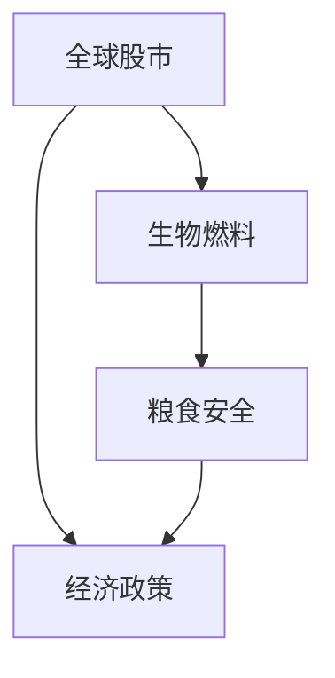

                 


# 全球股市估值与生物燃料与粮食安全的平衡策略

**关键词：** 全球股市估值、生物燃料、粮食安全、平衡策略、经济影响、数学模型

**摘要：**  
本文探讨了全球股市估值与生物燃料、粮食安全之间的复杂关系，并提出了一种平衡策略。通过分析生物燃料的生产对粮食价格的影响，以及全球股市对这些因素的敏感性，本文构建了一个数学模型，以帮助投资者和政策制定者在经济波动中找到平衡点。文章还通过案例分析和系统设计，展示了如何在实际中应用这些策略。

---

## 第一部分: 背景介绍

### 第1章: 问题背景与问题描述

#### 1.1 全球化背景下的经济挑战
- **全球化对经济体系的影响**：全球化促进了国际贸易和资本流动，但也带来了经济波动的风险。
- **生物燃料与粮食安全的矛盾**：生物燃料的生产消耗大量粮食作物，导致粮食价格上涨，威胁粮食安全。
- **全球股市估值的波动性**：股市对经济政策、能源价格和粮食供应的变化高度敏感。

#### 1.2 问题的提出与研究意义
- **问题的提出**：生物燃料的推广与粮食安全的冲突，以及其对全球股市的影响，需要系统性研究。
- **研究的必要性与重要性**：理解这些因素的相互作用，有助于制定更有效的经济政策和投资策略。
- **问题解决的潜在影响**：通过平衡策略，可以在促进可再生能源发展的同时，保障粮食安全和经济稳定。

---

## 第二部分: 核心概念与问题分析

### 第2章: 核心概念与问题分析

#### 2.1 核心概念定义
- **全球股市估值**：衡量市场整体表现的指标，如道琼斯指数、纳斯达克指数等。
- **生物燃料**：由生物材料制成的替代能源，如乙醇和生物柴油。
- **粮食安全**：确保所有人在任何时候都能获得足够、安全和营养的食品。

#### 2.2 核心概念的属性特征对比
| 概念       | 属性                     | 特征对比                       |
|------------|--------------------------|--------------------------------|
| 全球股市估值 | 敏感性、波动性、政策影响 | 高度依赖经济政策和能源价格     |
| 生物燃料   | 原料依赖性、生产成本     | 受粮食价格和政府补贴影响       |
| 粮食安全   | 供给稳定性、价格波动     | 受气候、生产技术影响           |

#### 2.3 核心概念的ER实体关系图


---

## 第三部分: 生物燃料与粮食安全的关系分析

### 第3章: 生物燃料的生产与粮食安全

#### 3.1 生物燃料的生产过程
- **原料选择**：主要使用玉米、大豆等粮食作物。
- **生产技术**：发酵法、酯交换法等。
- **产量与成本分析**：生产成本受原料价格和政府补贴影响。

#### 3.2 生物燃料对粮食价格的影响
- **需求与供给矛盾**：生物燃料的需求增加了粮食作物的使用，导致供给减少。
- **价格波动**：生物燃料价格波动直接影响粮食价格。

---

## 第四部分: 全球股市估值的分析

### 第4章: 全球股市估值的波动性

#### 4.1 全球股市估值与生物燃料的关系
- **生物燃料的推广**：增加了能源供应的不确定性，影响股市表现。
- **投资者行为**：投资者对生物燃料的前景持乐观态度，推动股市上涨。

#### 4.2 生物燃料对粮食安全的影响
- **粮食价格波动**：生物燃料的生产导致粮食价格上涨，威胁粮食安全。
- **政策干预**：政府通过补贴和贸易政策来平衡粮食供应。

---

## 第五部分: 平衡策略与解决方案

### 第5章: 生物燃料与粮食安全的平衡策略

#### 5.1 平衡策略的设计
- **政策制定**：政府应制定合理的生物燃料补贴政策，避免过度依赖粮食作物。
- **技术创新**：开发非粮食原料的生物燃料，减少对粮食作物的依赖。

#### 5.2 数学模型构建
- **供需模型**：建立生物燃料和粮食作物的供需关系模型。
  $$ Q_b = \alpha P_b + \beta P_f $$
  其中，\( Q_b \) 是生物燃料的需求量，\( P_b \) 是生物燃料价格，\( P_f \) 是粮食价格，\( \alpha \) 和 \( \beta \) 是参数。
- **价格影响模型**：分析生物燃料价格对粮食价格的影响。
  $$ P_f = \gamma Q_b + \delta P_b $$

---

## 第六部分: 项目实战与案例分析

### 第6章: 项目实战

#### 6.1 环境安装与数据准备
- **数据来源**：收集全球股市指数、生物燃料产量和粮食价格数据。
- **工具安装**：安装Python、Pandas、Matplotlib等工具。

#### 6.2 系统核心实现源代码
```python
import pandas as pd
import matplotlib.pyplot as plt

# 数据加载
data = pd.read_csv('data.csv')

# 绘制生物燃料价格与粮食价格的关系图
plt.figure(figsize=(10,6))
plt.plot(data['生物燃料价格'], data['粮食价格'], 'b-', label='关系线')
plt.xlabel('生物燃料价格')
plt.ylabel('粮食价格')
plt.legend()
plt.show()
```

#### 6.3 案例分析与详细解读
- **案例分析**：分析某国生物燃料政策对股市和粮食价格的影响。
- **详细解读**：通过数据可视化，展示政策实施前后的变化。

---

## 第七部分: 总结与展望

### 第7章: 总结与展望

#### 7.1 小结
- 本文通过分析全球股市估值、生物燃料和粮食安全的关系，提出了平衡策略。
- 数学模型和案例分析为政策制定和投资决策提供了依据。

#### 7.2 注意事项
- 模型假设可能简化实际问题，需进一步验证。
- 数据的准确性和完整性影响分析结果。

#### 7.3 拓展阅读
- 建议进一步研究气候变化对粮食安全的影响。
- 探索更多替代能源技术，减少对粮食作物的依赖。

---

通过本文的分析，读者可以理解全球股市估值、生物燃料和粮食安全之间的复杂关系，并掌握如何制定平衡策略以应对经济挑战。

