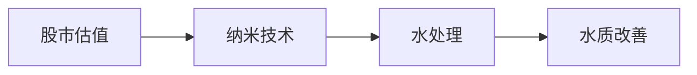
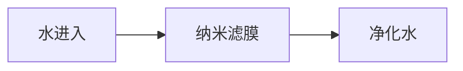
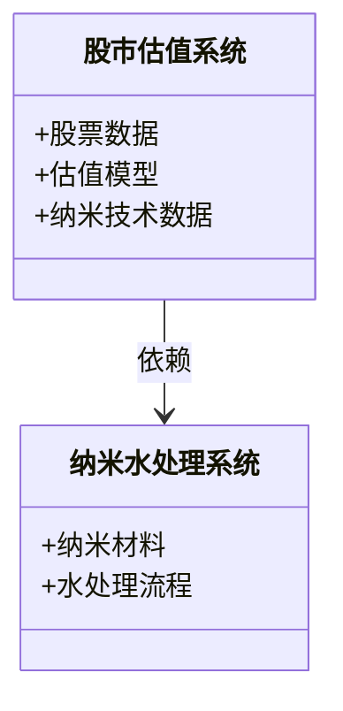
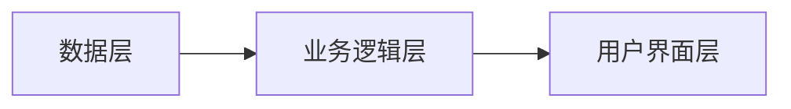

                 


# 全球股市估值与纳米技术在水处理中的应用

## 关键词：
- 全球股市估值
- 纳米技术
- 水处理
- 股市分析
- 纳米材料

## 摘要：
本文探讨了全球股市估值与纳米技术在水处理中的应用之间的潜在联系。通过分析股市估值的核心算法和纳米技术在水处理中的创新应用，本文展示了这两者如何相互影响，并为未来的投资决策和技术创新提供了新的视角。

---

# 第1章：背景介绍

## 1.1 股市估值的基本概念

股市估值是指对上市公司股票的合理价格进行评估的过程，是投资决策的重要依据。常见的估值指标包括市盈率（P/E）、市净率（P/B）和现金流折现模型（DCF）等。

## 1.2 纳米技术的基本原理

纳米技术是指在纳米尺度（1-100纳米）研究和应用材料的科学技术。纳米材料因其独特的物理、化学性质，在水处理中具有广阔的应用前景。

## 1.3 背景与问题

随着全球水资源短缺问题的加剧，水处理技术的创新显得尤为重要。同时，股市估值作为投资决策的核心，需要关注新兴技术的市场潜力。本文将探讨纳米技术在水处理中的应用如何影响股市估值。

---

# 第2章：核心概念与联系

## 2.1 核心概念术语说明

- **股市估值**：对股票价格的合理评估。
- **纳米技术**：在纳米尺度研究和应用材料的技术。
- **水处理**：通过物理、化学或生物方法改善水质的过程。

## 2.2 问题背景与描述

全球水资源短缺和水污染问题日益严重，水处理技术的创新成为解决这一问题的关键。同时，股市估值需要准确评估新兴技术公司的市场价值。

## 2.3 问题解决与边界

本文探讨纳米技术在水处理中的应用如何影响相关公司的市值，进而影响股市估值。研究范围限定在纳米材料的应用和股市估值模型的创新。

## 2.4 概念结构与核心要素

通过表格和Mermaid图展示股市估值和纳米技术的关系：

```markdown
| 概念 | 定义 | 关联性 |
|------|------|--------|
| 股市估值 | 股票价格评估 | 受纳米技术影响 |
| 纳米技术 | 纳米尺度材料技术 | 改善水处理效率 |
```



---

# 第3章：算法原理讲解

## 3.1 股市估值算法

### 3.1.1 市盈率模型

市盈率（P/E）是衡量股票价值的重要指标，公式为：

$$P/E = \frac{Price}{Earnings}$$

其中，Price为股票价格，Earnings为每股收益。

### 3.1.2 现金流折现模型（DCF）

DCF模型通过折现未来现金流来评估公司价值：

$$DCF = \sum_{t=1}^{n} \frac{CF_t}{(1+r)^t} + \frac{TV}{(1+r)^n}$$

其中，CF_t为第t年的现金流，r为折现率，TV为终值。

## 3.2 纳米技术在水处理中的应用算法

### 3.2.1 纳米过滤技术

纳米过滤利用纳米材料的孔隙结构进行水过滤，其流程如下：



---

# 第4章：数学模型与公式

## 4.1 股市估值模型

市盈率模型：

$$P/E = \frac{Price}{Earnings}$$

## 4.2 纳米催化反应

纳米催化在水处理中的反应方程：

$$A + B \rightarrow C + D$$

---

# 第5章：系统分析与架构设计

## 5.1 项目介绍

本文将探讨纳米技术在水处理中的应用及其对股市估值的影响。

## 5.2 系统功能设计

系统功能模块包括数据采集、纳米材料制备和估值分析。



## 5.3 系统架构设计

系统架构包括数据层、业务逻辑层和用户界面层。



---

# 第6章：项目实战

## 6.1 环境安装

安装必要的软件，如Python、Pandas、Matplotlib。

## 6.2 核心实现代码

```python
import pandas as pd

# 示例代码：计算市盈率
df = pd.DataFrame({'Price': [100, 200, 300], 'Earnings': [20, 30, 40]})
df['P/E'] = df.Price / df.Earnings
print(df)
```

## 6.3 实际案例分析

以某纳米水处理公司为例，分析其市盈率变化。

---

# 第7章：最佳实践与小结

## 7.1 最佳实践

- 定期更新数据和模型。
- 关注纳米技术的最新进展。

## 7.2 小结

本文探讨了全球股市估值与纳米技术在水处理中的应用，展示了两者如何相互影响。未来的研究可以进一步结合大数据和人工智能技术，提升估值模型的准确性。

---

# 结束语

通过本文的分析，读者可以更好地理解股市估值与纳米技术在水处理中的应用之间的联系，并为未来的投资和技术创新提供有价值的参考。

