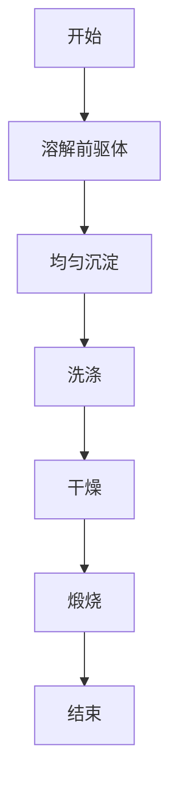

                 


# 全球股市估值与纳米材料在食品包装中的应用

## 关键词
- 全球股市估值
- 纳米材料
- 食品包装
- 纳米技术
- 股市分析

## 摘要
全球股市估值是投资决策的重要依据，而纳米材料在食品包装中的应用则为食品行业带来了革命性的变化。本文将分别探讨这两部分的内容，分析其核心概念、应用方法和实际案例，揭示它们在各自领域的独特价值及相互关联。

## 第一部分：全球股市估值

### 第1章：股市估值概述

#### 1.1 股市估值的基本概念
- 股市估值是评估股票内在价值的过程，帮助投资者确定其合理价格。
- 通过分析公司财务状况、行业地位和市场前景，为投资决策提供依据。

#### 1.2 估值的重要性
- 帮助投资者避免市场波动带来的盲目决策。
- 为长期投资策略提供科学依据。

### 第2章：估值方法

#### 2.1 基本估值指标
- 市盈率（P/E Ratio）：$$市盈率 = \frac{股价}{每股收益}$$
- 市净率（P/B Ratio）：$$市净率 = \frac{股价}{每股净资产}$$
- 股息率：$$股息率 = \frac{每股股息}{股价}$$

#### 2.2 现金流折现法
- 自由现金流（FCF）：$$FCF = 净利润 - 折旧 - 资本支出$$
- 现金流折现模型（DCF）：
  1. 估算未来现金流
  2. 选择合适的折现率
  3. 计算现值
  4. 与当前股价对比

#### 2.3 技术分析与基本面分析结合
- 技术分析：使用K线图、移动平均线等工具识别趋势。
- 基本面分析：评估公司财务健康状况和行业前景。

### 第3章：影响估值的因素

#### 3.1 宏观经济因素
- 利率水平：影响股市整体估值水平。
- 经济增长：推动企业盈利增长，提升股价。
- 通货膨胀：推高股价的同时影响购买力。

#### 3.2 行业因素
- 行业周期：不同周期下估值标准不同。
- 竞争格局：行业垄断或寡头垄断影响估值。

#### 3.3 公司因素
- 盈利能力：ROE（净资产收益率）$$ROE = \frac{净利润}{股东权益}$$
- 偿债能力：债务比率 $$债务比率 = \frac{总负债}{总资产}$$
- 管理层质量：影响公司长期发展。

### 第4章：系统架构设计

#### 4.1 估值系统设计
- 数据收集模块：采集公司财务数据和市场数据。
- 估值模型模块：应用DCF模型或市盈率法。
- 风险评估模块：分析宏观经济和行业风险。

#### 4.2 系统实现
- 使用Python编写数据处理脚本。
- 通过Matplotlib绘制财务图表。
- 实现交互式估值界面。

## 第二部分：纳米材料在食品包装中的应用

### 第5章：纳米材料概述

#### 5.1 纳米材料特性
- 小尺寸效应：纳米材料具有较大的比表面积，增强物理化学性质。
- 表面效应：表面原子比例增加，导致材料性能变化。
- 量子效应：纳米材料在不同尺寸下表现出不同的量子特性。

#### 5.2 纳米材料制备方法
- 物理法：机械 milling 或者气相沉积。
- 化学法：溶胶-凝胶法、沉淀法。

### 第6章：纳米材料在食品包装中的应用

#### 6.1 纳米材料在食品包装中的功能
- 保鲜：通过控制气体分子渗透，保持食品新鲜。
- 杀菌：纳米银或氧化锌抑制细菌生长。
- 智能包装：温度敏感变色材料指示食品状态。

#### 6.2 应用案例
- 纳米二氧化钛用于食品包装防紫外线。
- 纳米银用于食品包装杀菌。
- 温度敏感纳米材料用于食品保质期监测。

### 第7章：纳米材料应用的系统设计

#### 7.1 应用系统设计
- 材料选择模块：根据不同需求选择纳米材料。
- 制备工艺模块：设计纳米材料制备流程。
- 性能测试模块：评估材料的保鲜、杀菌效果。

#### 7.2 项目实现
- 使用纳米材料制备技术，如溶胶-凝胶法。
- 测试纳米材料的物理化学性能。
- 应用于实际食品包装，监测效果。

## 结论
全球股市估值和纳米材料在食品包装中的应用分别在金融和材料科学领域具有重要意义。通过科学的估值方法和创新的纳米技术，投资者和食品行业都能获得显著的效益。未来，随着技术进步，这两者的应用将更加广泛和深入。

## 参考文献
- 《股市估值分析》
- 《纳米材料制备与应用》
- 《食品包装技术》

---

### 附录

#### 附录A：股市估值代码示例
```python
import pandas as pd
import numpy as np

# 示例数据
data = {'公司': ['A', 'B', 'C'], 
        '净利润': [10, 15, 20], 
        '股价': [50, 60, 70]}
df = pd.DataFrame(data)

# 计算市盈率
df['市盈率'] = df['股价'] / df['净利润']
print(df)
```

#### 附录B：纳米材料制备流程图


通过以上结构，文章详细探讨了全球股市估值和纳米材料在食品包装中的应用，结合理论与实践，为读者提供了全面的知识框架。

