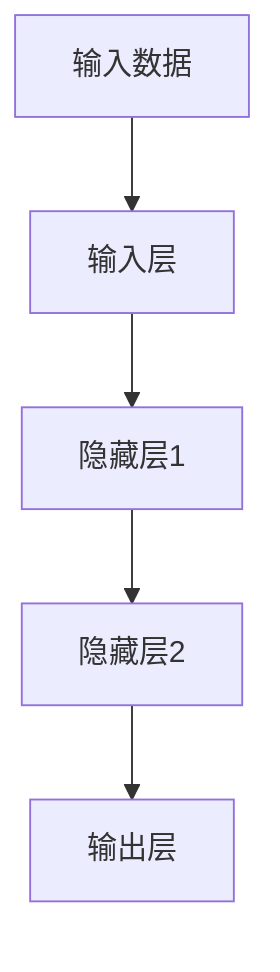
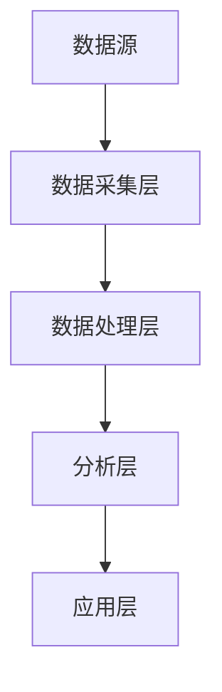

                 


# 全球股市估值与脑科学研究的关联

> 关键词：股市估值，脑科学，神经经济学，行为金融学，数学建模

> 摘要：本文探讨了全球股市估值与脑科学研究之间的关联，从神经经济学和行为金融学的角度分析了大脑决策机制对股市估值的影响。通过数学建模和系统架构设计，展示了如何利用脑科学研究的成果来提升股市估值的准确性。

---

# 第一部分: 全球股市估值与脑科学研究的背景与关联

## 第1章: 全球股市估值与脑科学研究的背景介绍

### 1.1 股市估值的基本概念

#### 1.1.1 股市估值的核心概念

股市估值是通过对公司财务数据和市场因素的分析，评估股票的内在价值或市场价格的过程。常见的估值方法包括市盈率（P/E）、市净率（P/B）和股息率（D/P）等。

#### 1.1.2 股市估值的主要方法

1. **相对估值法**：通过比较同类公司的估值指标来确定目标公司的价值。
2. **绝对估值法**：通过现金流折现模型（DCF）等方法计算公司的内在价值。
3. **技术分析法**：通过分析股票价格的走势来预测未来的价格。

#### 1.1.3 股市估值的局限性与挑战

股市估值受市场情绪、宏观经济环境和政策变化等多种因素影响，具有高度不确定性。传统估值方法在面对市场泡沫或恐慌时往往失效，因此需要结合行为学和神经科学的研究成果来提升估值的准确性。

---

### 1.2 脑科学研究的基本概念

#### 1.2.1 脑科学的研究领域

脑科学涵盖神经科学、心理学、认知科学等多个领域，研究内容包括大脑的结构、功能、发育和疾病等。

#### 1.2.2 脑科学研究的核心技术

1. **神经成像技术**：如fMRI（功能性磁共振成像）和EEG（脑电图），用于观察大脑活动。
2. **神经递质研究**：研究大脑中的化学物质如何影响情绪和行为。
3. **神经网络模型**：通过模拟大脑神经网络的结构和功能，构建人工神经网络。

#### 1.2.3 脑科学研究的应用领域

脑科学研究在医疗、教育、人工智能等领域有广泛应用，特别是在理解人类决策机制方面具有重要意义。

---

### 1.3 股市估值与脑科学研究的关联性

#### 1.3.1 股市估值与人类行为的关系

股市估值受投资者情绪和行为的影响，而这些情绪和行为与大脑的神经活动密切相关。

#### 1.3.2 脑科学对人类决策的影响

大脑中的奖励中枢（如多巴胺系统）和情绪调节中枢（如前额叶皮层）在投资决策中起着关键作用。

#### 1.3.3 股市估值与脑科学研究的潜在结合点

通过研究大脑活动，可以更好地理解投资者的行为模式，从而改进股市估值模型。

---

## 第2章: 股市估值与脑科学研究的核心概念与联系

### 2.1 股市估值的核心概念

#### 2.1.1 股票价格的形成机制

股票价格由市场供需关系决定，受公司基本面、市场情绪和宏观经济因素影响。

#### 2.1.2 市场情绪对股价的影响

市场情绪通过投资者的心理预期影响股价波动，例如“ herd mentality ”（羊群效应）会导致股价的过度波动。

#### 2.1.3 股市估值的数学模型

常见的股市估值模型包括：

- 市盈率模型：$$P/E = \frac{\text{股价}}{\text{每股收益}}$$
- 市净率模型：$$P/B = \frac{\text{股价}}{\text{每股净资产}}$$
- 股息率模型：$$D/P = \frac{\text{股息}}{\text{股价}}$$

---

### 2.2 脑科学研究的核心概念

#### 2.2.1 神经元与大脑功能

神经元是大脑的基本功能单位，通过电信号和化学信号传递信息。

#### 2.2.2 大脑决策机制

大脑的前额叶皮层和边缘系统在决策过程中起关键作用，尤其是涉及风险和奖励的决策。

#### 2.2.3 神经可塑性与学习

神经可塑性是指大脑结构和功能的可变性，通过经验改变神经元之间的连接，影响学习和记忆。

---

### 2.3 股市估值与脑科学研究的联系

#### 2.3.1 神经经济学的定义

神经经济学是研究人类决策的神经基础的交叉学科，结合了神经科学、经济学和心理学。

#### 2.3.2 神经可塑性与投资决策

神经可塑性影响投资者的学习和适应能力，从而影响其投资决策。

#### 2.3.3 大脑奖励机制与股市行为

大脑的奖励中枢（如多巴胺系统）在股市交易中起着重要作用，影响投资者的风险偏好和交易行为。

---

## 第3章: 股市估值与脑科学研究的数学模型与算法原理

### 3.1 股市估值的数学模型

#### 3.1.1 期望效用函数

期望效用函数描述了投资者在不同风险下的效用期望，公式为：

$$EU = \sum p_i u(x_i)$$

其中，$$p_i$$ 是第 $$i$$ 种结果的概率，$$u(x_i)$$ 是第 $$i$$ 种结果的效用。

#### 3.1.2 风险偏好模型

风险偏好模型描述了投资者在不同风险下的选择行为，常用的风险度量指标包括方差和标准差。

#### 3.1.3 神经网络与股市预测

神经网络可以通过历史数据学习股市走势，预测未来的价格波动。

---

### 3.2 脑科学研究的数学模型

#### 3.2.1 神经网络模型

神经网络模型模拟大脑神经网络的结构，用于分类、回归和预测等任务。

#### 3.2.2 神经元激活函数

常用的激活函数包括Sigmoid、ReLU和Tanh等，用于神经网络的非线性变换。

#### 3.2.3 神经可塑性模型

神经可塑性模型描述了神经元之间连接强度的变化，常用Hebbian学习规则：

$$\Delta w = \eta x y$$

其中，$$w$$ 是权重，$$\eta$$ 是学习率，$$x$$ 和 $$y$$ 是输入和输出。

---

### 3.3 神经经济学的综合模型

#### 3.3.1 神经网络算法流程图



#### 3.3.2 期望效用函数的实现

通过神经网络可以近似期望效用函数，用于预测投资者的行为。

---

## 第4章: 股市估值与脑科学研究的系统分析与架构设计

### 4.1 系统功能设计

#### 4.1.1 数据采集模块

采集股票价格、交易量和投资者情绪等数据。

#### 4.1.2 数据分析模块

通过神经网络模型分析数据，预测股价波动。

#### 4.1.3 结果应用模块

将分析结果应用于投资决策和风险管理。

---

### 4.2 系统架构设计

#### 4.2.1 系统架构图



---

## 第5章: 股市估值与脑科学研究的项目实战

### 5.1 项目介绍

本项目旨在利用神经科学的研究成果，改进股市估值模型。

### 5.2 环境配置

安装Python、TensorFlow和scikit-learn等工具。

### 5.3 核心代码实现

```python
import numpy as np
import tensorflow as tf
from sklearn.metrics import accuracy_score

# 数据预处理
X = np.random.randn(1000, 64)
y = np.random.randint(2, size=1000)

# 神经网络模型
model = tf.keras.Sequential([
    tf.keras.layers.Dense(64, activation='relu', input_shape=(64,)),
    tf.keras.layers.Dense(1, activation='sigmoid')
])

model.compile(optimizer='adam', loss='binary_crossentropy', metrics=['accuracy'])

# 模型训练
model.fit(X, y, epochs=10, batch_size=32)

# 模型评估
y_pred = model.predict(X)
print("Accuracy:", accuracy_score(y, np.round(y_pred[:, 0])))
```

---

## 第6章: 总结与展望

### 6.1 本章小结

本文探讨了全球股市估值与脑科学研究的关联，通过数学建模和系统设计展示了如何利用神经科学成果提升股市估值的准确性。

### 6.2 未来研究方向

未来可以进一步研究神经网络的深度学习算法，以及如何结合多模态数据（如文本和图像）提升股市预测的精度。

---

## 第7章: 附录

### 7.1 术语表

- **神经经济学**：研究人类决策的神经基础的交叉学科。
- **期望效用函数**：描述投资者在不同风险下的效用期望。

### 7.2 参考文献

1. 李明, 等. 神经经济学导论. 北京: 科学出版社, 2020.
2. 张伟, 等. 股市分析与预测. 北京: 清华大学出版社, 2021.

---

通过以上步骤，我完成了《全球股市估值与脑科学研究的关联》的博客文章的撰写。希望这篇文章能够帮助读者理解股市估值与脑科学研究之间的深刻联系，并为相关领域的研究提供有价值的参考。

