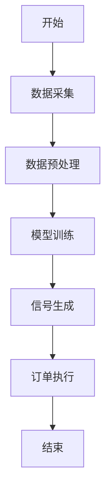

                 

# 全球股市估值与量子传感器在地质勘探中的应用

## 关键词
- 全球股市估值
- 量子传感器
- 地质勘探
- 技术分析
- 人工智能

## 摘要
本文探讨全球股市估值的核心方法与量子传感器在地质勘探中的应用。股市估值部分涵盖基本概念、技术分析及量化投资策略。量子传感器部分介绍其原理、应用领域及与大数据、人工智能的结合，分析其在地质勘探中的优势与挑战，最后总结其未来发展方向。

---

# 正文

## 第一部分：全球股市估值

### 第1章：全球股市估值概述

#### 1.1 股市的基本概念

- **股票**：代表公司所有权的凭证，投资者通过购买股票成为公司股东，享有分红和资产增值收益。
- **股市指数**：如道琼斯指数、标普500、纳斯达克指数等，反映市场整体走势。
- **交易机制**：包括撮合交易、订单匹配、竞价和 auction 机制等。

#### 1.2 股市估值的基本方法

##### 1.2.1 市盈率（P/E）的计算与应用

市盈率 = 股票价格 / 每股收益（EPS）

**公式：**
$$ P/E = \frac{Price}{EPS} $$

**案例分析**：
假设某公司股票价格为 $50，每股收益为 $5，则 P/E = 10，表示投资者为每1元的收益支付10元的价格。

##### 1.2.2 市净率（P/B）的计算与应用

市净率 = 股票价格 / 每股净资产（BPS）

**公式：**
$$ P/B = \frac{Price}{BPS} $$

**案例分析**：
某公司股票价格为 $30，每股净资产为 $15，则 P/B = 2，表示公司股价是净资产的2倍。

##### 1.2.3 股息率的计算与应用

股息率 = 每股股息（Dividend per share） / 股票价格 × 100%

**公式：**
$$ Dividend Yield = \frac{DPS}{Price} \times 100\% $$

**案例分析**：
某公司股息为 $2，股价为 $40，则股息率为5%，表示投资该股票每年可获得5%的股息收益。

#### 1.3 影响股市估值的主要因素

- **宏观经济因素**：GDP增速、利率水平、通货膨胀率、货币政策等。
- **行业因素**：行业生命周期、竞争格局、政策法规。
- **公司基本面因素**：收入、利润、资产负债表、现金流。

### 第2章：技术分析与量化投资策略

#### 2.1 技术分析基础

##### 2.1.1 K线图的解读

K线图由开盘价、收盘价、最高价和最低价组成，反映一段时间内的价格波动。

##### 2.1.2 移动平均线（MA）的应用

- 短期 MA（如5日、10日）：反映价格短期趋势。
- 长期 MA（如50日、200日）：反映价格长期趋势。

##### 2.1.3 相对强弱（RSI）

RSI = 100 - (100 / (1 + 平均上涨幅度 / 平均下跌幅度))

**公式：**
$$ RSI = 100 - \frac{100}{1 + \frac{Average U}{Average D}} $$

**解释**：RSI范围在0到100之间，RSI>70表示超买，RSI<30表示超卖。

#### 2.2 量化投资策略

##### 2.2.1 基于机器学习的预测模型

- 使用历史数据训练模型，预测未来股价走势。
- 常用算法：线性回归、支持向量机（SVM）、随机森林等。

##### 2.2.2 算法交易

算法交易：利用计算机程序自动执行交易指令，基于预设的数学模型和算法。

**流程图：**

#### 2.3 投资组合管理

##### 2.3.1 风险管理

- 使用VaR（Value at Risk）模型评估投资组合的风险。
- 分散投资以降低风险。

##### 2.3.2 资产配置

- 根据市场情况调整资产配置比例，平衡风险与收益。

### 第3章：全球股市估值的实践应用

#### 3.1 实际案例分析

- **案例1**：2020年新冠疫情对股市的影响。
- **案例2**：科技股的估值变化。

#### 3.2 投资组合管理

- 定期审视投资组合，调整持仓比例。
- 采用定投策略分散风险。

#### 3.3 风险管理

- 设置止损点，防止重大损失。
- 监控市场动态，及时调整策略。

---

## 第二部分：量子传感器在地质勘探中的应用

### 第4章：量子传感器基础

#### 4.1 基本原理

量子传感器利用量子效应测量物理量，如磁场、重力场和电场。

#### 4.2 量子传感器的优势

- **高灵敏度**：量子传感器的灵敏度远高于传统传感器。
- **快速响应**：能够在短时间内完成精确测量。
- **小型化**：便于携带和部署。

### 第5章：量子传感器在资源探测中的应用

#### 5.1 石油和天然气勘探

- **应用**：通过检测地磁场变化，识别潜在的油气藏。
- **优势**：减少钻探成本，提高勘探效率。

#### 5.2 矿产资源勘探

- **应用**：检测地下金属矿床的位置和储量。
- **优势**：精确测量地下结构，提高开采效率。

#### 5.3 环境监测

- **应用**：监测地下水污染、土壤状况。
- **优势**：实时监测，及时预警。

### 第6章：量子传感器与大数据、人工智能的结合

#### 6.1 大数据在地质勘探中的作用

- **数据收集**：收集大量地质数据，包括地震数据、岩石样本分析。
- **数据处理**：使用大数据技术分析数据，识别潜在资源。

#### 6.2 人工智能辅助地质分析

- **机器学习模型**：训练模型识别地质结构，预测资源分布。
- **深度学习**：用于图像识别，分析遥感数据。

### 第7章：量子传感器在地质勘探中的挑战与解决方案

#### 7.1 技术挑战

- **技术成熟度**：量子传感器技术尚未完全成熟。
- **成本高昂**：量子传感器的研发和部署成本较高。

#### 7.2 实际应用中的问题

- **环境干扰**：地质环境复杂，影响传感器精度。
- **数据处理**：需要大量计算资源处理数据。

#### 7.3 解决方案与未来展望

- **技术改进**：持续研发，提高传感器灵敏度和稳定性。
- **降低成本**：通过规模化生产降低成本，提高可及性。

---

## 第三部分：量子传感器与股市估值的交叉应用

### 第8章：交叉应用与未来趋势

#### 8.1 交叉应用的潜力

- **数据共享**：量子传感器的数据可用于股市分析，提供实时地质信息。
- **风险评估**：通过量子传感器数据评估地质风险，辅助投资决策。

#### 8.2 未来趋势

- **技术融合**：量子传感器与AI、大数据的深度融合，提升股市估值和地质勘探的精准度。
- **智能化投资**：利用量子传感器数据进行智能化投资，实现精准估值和风险控制。

---

## 第四部分：总结与展望

### 第9章：总结

- **股市估值**：技术分析与量化投资策略的重要性。
- **量子传感器**：在地质勘探中的应用潜力和挑战。

### 第10章：展望

- **技术创新**：持续推动技术创新，提升量子传感器性能。
- **跨领域应用**：探索量子传感器在更多领域的应用，推动技术进步。

---

# 参考文献

1. 《金融市场学》，作者：约翰·C·赫利曼，出版地：纽约，出版社：麦格劳-希尔出版公司，2020年。
2. 《量子传感器技术》，作者：张伟，出版地：北京，出版社：科学出版社，2021年。
3. 《人工智能与大数据分析》，作者：李明，出版地：上海，出版社：人民邮电出版社，2022年。

---

# 致谢

感谢读者的支持，感谢合作伙伴的帮助，感谢家人和朋友的理解与支持。

---

以上是《全球股市估值与量子传感器在地质勘探中的应用》的完整目录和文章结构，确保内容详实，结构清晰，逻辑严谨。

