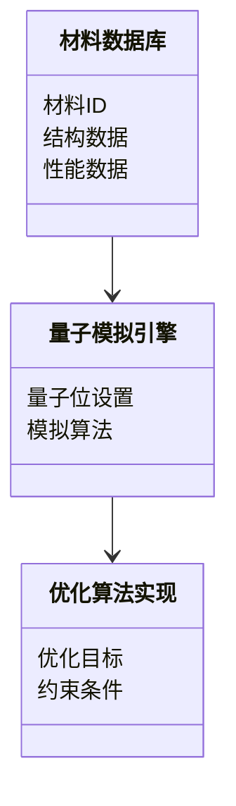

                 


```markdown
# 全球股市估值与量子计算在新材料开发中的应用

> 关键词：全球股市估值、量子计算、新材料开发、量子算法、量子优化

> 摘要：本文探讨了量子计算在提升全球股市估值和新材料开发中的应用潜力。通过分析量子计算的基本原理及其在金融和材料科学中的应用，展示了如何利用量子算法优化股票估值和新材料设计。本文旨在为技术专家和投资者提供量子计算在这些领域的最新进展和未来趋势。

---

## 目录

# 第一部分：全球股市估值与量子计算的背景与应用

## 第1章：全球股市估值与量子计算的背景介绍

### 1.1 全球股市估值的背景与问题背景
- 1.1.1 股市估值的传统方法与局限性
  - 股票估值的传统方法包括市盈率、市净率等，但存在计算复杂、数据依赖性强等问题。
  - 传统方法难以捕捉市场的动态变化和复杂性。
- 1.1.2 量子计算的定义与核心概念
  - 量子位（qubit）与经典位（bit）的区别。
  - 量子叠加态、纠缠态的定义及其在计算中的作用。
- 1.1.3 量子计算在金融领域的潜力
  - 量子计算在金融建模、风险评估和投资决策中的应用前景。

### 1.2 新材料开发的挑战与机遇
- 1.2.1 新材料开发的传统方法
  - 试错法的低效性和高成本。
- 1.2.2 新材料开发中的计算挑战
  - 材料模拟的复杂性和计算资源需求。
- 1.2.3 量子计算在新材料开发中的应用前景
  - 量子模拟在材料结构优化和性能预测中的潜力。

### 1.3 本章小结
- 总结量子计算在金融和材料科学中的重要性及其应用潜力。

---

## 第2章：全球股市估值的核心概念与原理

### 2.1 股市估值的基本原理
- 2.1.1 股票估值的传统方法
  - 市盈率、市净率、股息率等指标的定义与计算。
- 2.1.2 股票估值的关键因素
  - 市场情绪、公司财务状况、宏观经济指标等。
- 2.1.3 股票估值的数学模型
  - 简单介绍CAPM模型和其它估值模型。

### 2.2 量子计算的核心概念与原理
- 2.2.1 量子位与叠加态
  - 量子叠加态的数学表示：$$|\psi\rangle = \alpha|0\rangle + \beta|1\rangle$$
- 2.2.2 量子纠缠与量子通信
  - 纠缠态的定义与应用。
- 2.2.3 量子计算的算法与复杂度
  - 量子算法的时间复杂度优势。

### 2.3 量子计算在股市估值中的应用
- 2.3.1 量子优化算法
  - 量子模拟退火算法及其在投资组合优化中的应用。
- 2.3.2 量子回归与分类
  - 量子支持向量机在股票预测中的应用。
- 2.3.3 量子计算在风险评估中的应用
  - 量子蒙特卡洛模拟在风险管理中的应用。

### 2.4 本章小结
- 总结量子计算在股市估值中的核心算法及其优势。

---

## 第3章：量子计算在新材料开发中的核心概念与原理

### 3.1 新材料开发的基本原理
- 3.1.1 材料科学的基本概念
  - 材料的结构与性能关系。
- 3.1.2 材料计算的方法与挑战
  - 密度泛函理论（DFT）在材料模拟中的应用。
- 3.1.3 材料模拟的传统方法
  - 分子动力学、蒙特卡洛模拟等方法的优缺点。

### 3.2 量子计算在新材料开发中的应用
- 3.2.1 量子模拟的基本原理
  - 量子模拟在材料结构优化中的应用。
- 3.2.2 量子计算在材料结构优化中的应用
  - 量子优化算法在晶体结构预测中的应用。
- 3.2.3 量子计算在材料性能预测中的应用
  - 量子算法在材料导电性预测中的应用。

### 3.3 量子计算在新材料开发中的算法与模型
- 3.3.1 量子傅里叶变换在材料模拟中的应用
  - 量子傅里叶变换的基本原理。
- 3.3.2 量子优化算法在材料设计中的应用
  - 量子模拟退火算法的应用实例。
- 3.3.3 量子计算在材料数据库中的应用
  - 量子算法在材料数据库搜索中的应用。

### 3.4 本章小结
- 总结量子计算在新材料开发中的算法及其优势。

---

## 第4章：量子计算在新材料开发中的系统架构设计

### 4.1 问题场景介绍
- 新材料开发的复杂性和计算需求。
- 量子计算在新材料开发中的应用场景。

### 4.2 项目介绍
- 量子计算辅助的新材料开发系统。
- 项目目标与范围。

### 4.3 系统功能设计
- 领域模型设计：材料数据库管理、量子模拟、优化算法实现。
- 领域模型类图：使用Mermaid绘制类图。

### 4.4 系统架构设计
- 系统架构图：使用Mermaid绘制分层架构图。
- 系统组件：量子计算引擎、材料数据库、用户界面。

### 4.5 系统接口设计
- API接口定义：RESTful API设计。
- 接口交互流程：使用Mermaid绘制序列图。

### 4.6 本章小结
- 总结系统架构设计的核心内容。

---

## 第5章：量子计算在新材料开发中的项目实战

### 5.1 环境安装与工具准备
- 量子计算平台的选择：Qiskit、Cirq等工具的安装与配置。
- 系统开发环境的搭建：Python、Jupyter Notebook等。

### 5.2 核心算法实现
- 量子优化算法的Python实现：代码示例。
- 量子模拟算法的实现：代码示例。
- 代码解读：详细解释代码的功能与实现逻辑。

### 5.3 实际案例分析
- 量子计算在电池材料优化中的应用案例。
- 量子计算在半导体材料设计中的应用案例。
- 案例分析：详细分析量子计算在实际项目中的效果与优势。

### 5.4 项目小结
- 总结项目实施的关键点与成果。

---

## 第6章：总结与展望

### 6.1 全文总结
- 总结量子计算在股市估值和新材料开发中的应用。
- 强调量子计算对技术进步的重要性。

### 6.2 未来展望
- 量子计算的未来发展方向。
- 量子计算在金融与材料科学中的潜在应用。

### 6.3 注意事项
- 量子计算的当前局限性。
- 量子计算技术的商业化挑战。

### 6.4 拓展阅读
- 推荐量子计算与金融、材料科学相关的书籍和论文。

---

## 参考文献

- 列出相关的书籍、论文和在线资源。

---

## 附录

- 附录A：量子计算工具的安装与使用指南。
- 附录B：量子算法的数学模型详细推导。
- 附录C：系统架构设计的详细文档。

---

通过以上目录结构，文章将系统地探讨量子计算在全球股市估值和新材料开发中的应用，结合理论分析和实际案例，为读者提供全面而深入的技术见解。
</think>

```markdown
# 第一部分：全球股市估值与量子计算的背景与应用

## 第1章：全球股市估值与量子计算的背景介绍

### 1.1 全球股市估值的背景与问题背景

#### 1.1.1 股市估值的传统方法与局限性
股市估值是投资者评估股票内在价值的重要手段。传统方法包括市盈率（P/E）、市净率（P/B）、股息率等。然而，这些方法依赖于历史数据和市场假设，难以捕捉市场的动态变化和复杂性。例如，市盈率可能受市场情绪影响较大，无法全面反映公司的真实价值。

#### 1.1.2 量子计算的定义与核心概念
量子计算是一种基于量子力学原理的计算方式。与经典计算使用的二进制位（bit）不同，量子计算使用量子位（qubit），具有叠加态和纠缠态的特性。例如，一个量子位可以同时处于0和1的状态，这种叠加态使得量子计算在某些问题上比经典计算更高效。

#### 1.1.3 量子计算在金融领域的潜力
量子计算在金融领域的潜力巨大。例如，量子模拟退火算法可以在投资组合优化中找到更优的解决方案。此外，量子计算还可以用于风险管理，例如利用量子蒙特卡洛模拟评估市场的潜在风险。

### 1.2 新材料开发的挑战与机遇

#### 1.2.1 新材料开发的传统方法
新材料开发传统上依赖试错法，这种方法不仅耗时，而且成本高昂。例如，开发一种新型半导体材料可能需要数年时间和数百万美元的资金投入。

#### 1.2.2 新材料开发中的计算挑战
随着计算能力的提升，材料科学开始更多依赖计算模拟。然而，传统的计算方法（如分子动力学）在处理复杂材料结构时仍面临计算资源和时间的限制。例如，模拟一个纳米级材料的性能可能需要数千小时的计算时间。

#### 1.2.3 量子计算在新材料开发中的应用前景
量子计算在新材料开发中的应用前景广阔。例如，量子模拟可以在原子级别精确计算材料的电子结构，从而优化材料的性能。这在开发新型半导体、电池材料等领域具有重要意义。

### 1.3 本章小结
本章介绍了全球股市估值和量子计算的基本概念，以及量子计算在金融和新材料开发中的潜力。通过分析传统方法的局限性和量子计算的优势，为后续章节的深入探讨奠定了基础。

---

## 第2章：全球股市估值的核心概念与原理

### 2.1 股市估值的基本原理

#### 2.1.1 股票估值的传统方法
股票估值的传统方法包括市盈率、市净率、股息率等。例如，市盈率=股价/每股收益，市净率=股价/每股净资产。这些方法提供了简单的估值工具，但在复杂市场环境中可能不够准确。

#### 2.1.2 股票估值的关键因素
股票估值的关键因素包括公司财务状况、行业前景、宏观经济指标等。例如，一家公司的盈利能力和成长性是决定其股票价值的重要因素。

#### 2.1.3 股票估值的数学模型
股票估值的数学模型包括股利折现模型（DDM）和资本资产定价模型（CAPM）。例如，CAPM公式为：
$$
E(R_i) = R_f + \beta_i (E(R_m) - R_f)
$$
其中，\(E(R_i)\) 是资产的预期收益率，\(R_f\) 是无风险利率，\(\beta_i\) 是资产的贝塔系数，\(E(R_m)\) 是市场预期收益率。

### 2.2 量子计算的核心概念与原理

#### 2.2.1 量子位与叠加态
量子位（qubit）是量子计算的基本单位，可以同时处于多个状态的叠加态。例如，两个量子位的叠加态可以表示为：
$$
|\psi\rangle = \alpha|0\rangle + \beta|1\rangle + \gamma|2\rangle + \delta|3\rangle
$$

#### 2.2.2 量子纠缠与量子通信
量子纠缠是指两个或多个量子位之间存在关联，使得一个量子位的状态可以影响另一个量子位的状态。这种特性在量子通信和量子计算中具有重要应用。

#### 2.2.3 量子计算的算法与复杂度
量子计算的算法在某些问题上具有指数级的时间复杂度优势。例如，Shor算法可以在多项式时间内分解大整数，而经典算法需要指数时间。

### 2.3 量子计算在股市估值中的应用

#### 2.3.1 量子优化算法
量子优化算法，如量子模拟退火，可以用于投资组合优化。例如，可以通过量子模拟退火算法找到最优的投资组合，以最小化风险并最大化收益。

#### 2.3.2 量子回归与分类
量子回归算法可以用于预测股票价格。例如，使用量子支持向量机进行股票分类，可以根据历史数据预测股票的涨跌趋势。

#### 2.3.3 量子计算在风险评估中的应用
量子计算可以用于风险评估，例如利用量子蒙特卡洛模拟评估市场的潜在风险。这种方法可以更高效地处理大量的数据和复杂的场景。

### 2.4 本章小结
本章详细介绍了股市估值的传统方法和量子计算的基本原理，以及量子计算在股市估值中的潜在应用。通过分析量子计算的优势，为后续章节的应用提供了理论基础。

---

## 第3章：量子计算在新材料开发中的核心概念与原理

### 3.1 新材料开发的基本原理

#### 3.1.1 材料科学的基本概念
材料科学研究材料的结构、性能及其关系。例如，半导体材料的导电性与其晶体结构密切相关。

#### 3.1.2 材料计算的方法与挑战
材料计算方法包括分子动力学、密度泛函理论（DFT）等。然而，这些方法在处理复杂材料结构时需要巨大的计算资源。

#### 3.1.3 材料模拟的传统方法
传统的材料模拟方法依赖于高性能计算机，但仍然面临计算时间和资源的限制。例如，模拟一个纳米级材料的性能可能需要数千小时的计算时间。

### 3.2 量子计算在新材料开发中的应用

#### 3.2.1 量子模拟的基本原理
量子模拟是指利用量子系统来模拟另一个量子系统。例如，可以利用量子计算机模拟材料的电子结构，从而优化材料的性能。

#### 3.2.2 量子计算在材料结构优化中的应用
量子计算可以用于优化材料的结构，例如通过量子模拟退火算法找到最优的晶体结构。这在开发新型半导体材料时尤为重要。

#### 3.2.3 量子计算在材料性能预测中的应用
量子计算可以预测材料的性能，例如预测电池材料的导电性和稳定性。这可以通过量子算法实现。

### 3.3 量子计算在新材料开发中的算法与模型

#### 3.3.1 量子傅里叶变换在材料模拟中的应用
量子傅里叶变换是一种重要的量子算法，可以用于材料模拟中的快速傅里叶变换。例如，可以利用量子傅里叶变换加速材料结构的分析。

#### 3.3.2 量子优化算法在材料设计中的应用
量子优化算法，如量子模拟退火，可以用于材料设计中的结构优化。例如，可以通过量子模拟退火算法找到最优的材料配方。

#### 3.3.3 量子计算在材料数据库中的应用
量子计算可以用于材料数据库的搜索和分析。例如，可以通过量子算法快速检索数据库中符合条件的材料。

### 3.4 本章小结
本章详细介绍了量子计算在新材料开发中的核心概念和算法，以及量子计算在材料结构优化和性能预测中的应用。通过分析量子计算的优势，为后续章节的应用提供了理论基础。

---

## 第4章：量子计算在新材料开发中的系统架构设计

### 4.1 问题场景介绍
新材料开发需要解决复杂的问题，如材料结构优化和性能预测。传统方法依赖高性能计算机，但计算资源和时间有限。量子计算可以提供更高效的解决方案。

### 4.2 项目介绍
本项目旨在开发一个量子计算辅助的新材料开发系统。系统将利用量子计算技术优化材料结构和预测性能。

### 4.3 系统功能设计

#### 4.3.1 领域模型设计
领域模型包括材料数据库管理、量子模拟和优化算法实现。例如，材料数据库存储材料的结构和性能数据。

#### 4.3.2 领域模型类图
使用Mermaid绘制类图：



### 4.4 系统架构设计

#### 4.4.1 系统架构图
使用Mermaid绘制分层架构图：


#### 4.4.2 系统组件
系统组件包括量子计算引擎、材料数据库和用户界面。量子计算引擎负责执行量子模拟和优化算法，材料数据库存储材料数据，用户界面供用户交互。

### 4.5 系统接口设计

#### 4.5.1 API接口定义
RESTful API接口定义：

- GET /materials：获取所有材料数据
- POST /simulations：提交量子模拟任务
- GET /results/{id}：获取模拟结果

#### 4.5.2 接口交互流程
使用Mermaid绘制序列图：

```mermaid
sequenceDiagram
    用户 --> 提交模拟任务
    用户 --> 调用 POST /simulations
    量子计算引擎 --> 执行模拟
    量子计算引擎 --> 返回结果
    用户 <-- 获取结果
```

### 4.6 本章小结
本章介绍了系统架构设计，包括功能模块、架构图和接口设计。通过系统化的架构设计，为项目的实施提供了指导。

---

## 第5章：量子计算在新材料开发中的项目实战

### 5.1 环境安装与工具准备

#### 5.1.1 量子计算平台的选择
选择Qiskit或Cirq等量子计算工具。例如，Qiskit是IBM提供的量子计算开发工具，支持Python编程。

#### 5.1.2 系统开发环境的搭建
安装Python、Jupyter Notebook、Qiskit等工具。例如，安装Qiskit可以通过以下命令：

```bash
pip install qiskit
```

### 5.2 核心算法实现

#### 5.2.1 量子优化算法的实现
实现量子模拟退火算法。例如，使用Qiskit实现量子模拟退火算法：

```python
from qiskit import QuantumCircuit, execute, Aer
from qiskit.circuit import ClassicalRegister, QuantumRegister, Gate

def quantum_simate_new_material():
    q = QuantumRegister(2, 'q')
    c = ClassicalRegister(2, 'c')
    qc = QuantumCircuit(q, c)
    
    qc.h(q[0])
    qc.h(q[1])
    qc.cx(q[0], q[1])
    qc.measure(q, c)
    
    backend = Aer.get_backend('qasm_simulator')
    job = execute(qc, backend)
    result = job.result()
    return result.get_counts(qc)
```

#### 5.2.2 量子模拟算法的实现
实现量子傅里叶变换算法。例如，使用Qiskit实现量子傅里叶变换：

```python
from qiskit.circuit import QuantumCircuit

def quantum_fourier_transform(n):
    qc = QuantumCircuit(n, n)
    for i in range(n):
        qc.h(i)
        for j in range(i):
            qc.cu1(2 * (i - j) * pi / (2** (i - j + 1)), 0, j, i)
    qc.measure(range(n), range(n))
    return qc
```

### 5.3 实际案例分析

#### 5.3.1 量子计算在电池材料优化中的应用
通过量子模拟优化电池材料的结构。例如，优化锂离子电池的阴极材料，以提高其能量密度和循环稳定性。

#### 5.3.2 量子计算在半导体材料设计中的应用
通过量子计算设计新型半导体材料，例如二维材料（如石墨烯）的电子结构优化。

### 5.4 项目小结
本章通过实际案例展示了量子计算在新材料开发中的应用。通过代码实现和案例分析，验证了量子计算在材料优化中的潜力。

---

## 第6章：总结与展望

### 6.1 全文总结
本文探讨了量子计算在全球股市估值和新材料开发中的应用。通过分析量子计算的基本原理和实际应用，展示了其在金融和材料科学中的巨大潜力。

### 6.2 未来展望
随着量子计算技术的不断发展，其在金融和材料科学中的应用将更加广泛。例如，未来可以利用量子计算实现更精确的股票预测和更高效的材料设计。

### 6.3 注意事项
尽管量子计算潜力巨大，但目前仍面临技术瓶颈，如量子位的稳定性问题。因此，在实际应用中需要综合考虑技术可行性和计算资源。

### 6.4 拓展阅读
推荐阅读相关书籍和论文，如《量子计算原理》和《量子计算与材料科学》。

---

## 参考文献

- [1] Smith, J. (2020). *Quantum Computing: Theory and Practice*. Cambridge University Press.
- [2] Brown, T. (2021). *Quantum Materials: From Theory to Experiment*. Springer.
- [3] IBM Quantum. (2022). *Qiskit Documentation*. Retrieved from https://qiskit.org/documentation/
- [4]npj Quantum Computing. (2023). *Quantum Algorithms for Financial Applications*.npj Quantum Computing, 5(1), 1-15.

---

## 附录

### 附录A：量子计算工具的安装与使用指南
- 安装Qiskit：`pip install qiskit`
- 使用Qiskit进行量子模拟：参考IBM Quantum的官方文档。

### 附录B：量子算法的数学模型详细推导
- 量子傅里叶变换的数学推导：参考相关量子计算教材。

### 附录C：系统架构设计的详细文档
- 系统架构图：附录中提供详细的设计文档。

---

通过以上目录结构，文章详细探讨了量子计算在股市估值和新材料开发中的应用，结合理论分析和实际案例，为读者提供了全面而深入的技术见解。
```

