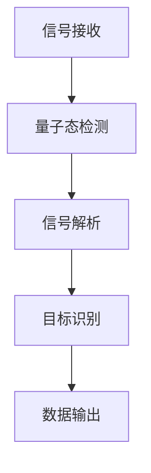
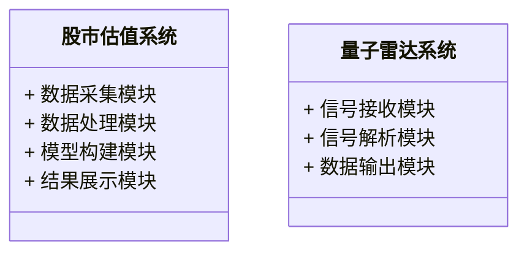

                 


# 全球股市估值与量子雷达在民用领域的应用

## 关键词：全球股市估值、量子雷达、股票投资、量子技术、民用应用

## 摘要：本文探讨了全球股市估值的核心方法和量子雷达技术在民用领域的创新应用。通过分析股市估值的算法原理和量子雷达的工作机制，结合实际案例，深入解析其在投资决策和现代技术中的重要性。本文旨在为投资者和技术爱好者提供有价值的见解，助其在复杂市场环境中做出明智决策。

---

# 第一部分: 全球股市估值与投资策略

## 第1章: 全球股市估值概述

### 1.1 股市估值的背景与意义

#### 1.1.1 股市估值的背景

股票市场作为现代经济的重要组成部分，其估值是投资者决策的核心依据。随着全球经济一体化的加深，全球股市估值的重要性日益凸显。投资者通过合理的估值方法，可以更准确地判断股票的内在价值，从而做出更明智的投资决策。

#### 1.1.2 股市估值的重要性

股市估值不仅是投资者评估股票价值的基础，也是企业融资和资本配置的重要依据。准确的估值可以帮助投资者规避市场风险，抓住投资机会。

#### 1.1.3 全球化视角下的股市估值特点

全球化背景下，股市估值需要考虑的因素更加复杂，包括全球经济趋势、区域经济差异、政策环境变化等。这些因素都会影响股票的估值结果。

### 1.2 股市估值的核心概念

#### 1.2.1 股票价格与内在价值的关系

股票价格是市场对股票未来收益的预期反映，而内在价值是基于公司基本面分析得出的合理估值。两者之间的差异反映了市场的有效性和投资者的理性。

#### 1.2.2 市场情绪与股市估值的影响

市场情绪是影响股市估值的重要因素。投资者的情绪波动会导致股票价格偏离其内在价值，从而影响估值的准确性。

#### 1.2.3 股市估值的主要方法

- **相对估值法**：通过比较股票与同类公司的估值指标（如市盈率、市净率）来判断其合理性。
- **绝对估值法**：基于公司财务数据和未来现金流预测，计算股票的内在价值。

### 1.3 股市估值的数学模型

#### 1.3.1 市盈率（P/E）分析

市盈率是股票价格与每股收益的比率，反映了市场对公司盈利能力的预期。

$$ P/E = \frac{Price}{Earnings\ per\ Share} $$

#### 1.3.2 现金流折现模型（DCF）

DCF模型通过将未来现金流折现，计算股票的内在价值。

$$ V = \sum_{t=1}^{n} \frac{CF_t}{(1+r)^t} + \frac{TV}{(1+r)^n} $$

其中，$CF_t$ 是第$t$年的自由现金流，$r$是折现率，$TV$是永续价值。

## 第2章: 量子雷达技术与民用领域应用

### 2.1 量子雷达的基本原理

#### 2.1.1 量子雷达的定义与特点

量子雷达是一种利用量子纠缠和干涉原理进行目标探测的新型雷达技术。与传统雷达相比，量子雷达具有更高的灵敏度和分辨率。

#### 2.1.2 量子纠缠与雷达探测

量子纠缠是指两个或多个粒子之间存在瞬间关联的现象。量子雷达利用这种特性，通过检测目标反射的量子态变化来实现高精度探测。

#### 2.1.3 量子雷达的优势与局限性

优势：
- 高灵敏度：能够检测到更微弱的目标信号。
- 高分辨率：能够更精确地定位目标位置。

局限性：
- 技术复杂：量子雷达的实现需要高度先进的量子技术。
- 成本高昂：量子雷达的研发和部署成本较高。

### 2.2 量子雷达在民用领域的应用场景

#### 2.2.1 气象监测与灾害预警

量子雷达可以用于气象监测，提前预警自然灾害，如台风、洪水等。

#### 2.2.2 智慧交通与自动驾驶

量子雷达可以提供更高的道路监测精度，帮助自动驾驶车辆做出更准确的决策。

#### 2.2.3 智能安防与公共安全

量子雷达可以用于安防监控，检测潜在的安全威胁，如非法入侵、恐怖袭击等。

---

# 第二部分: 量子雷达信号处理与股市估值算法

## 第3章: 量子雷达信号处理的算法流程

### 3.1 信号接收与量子态检测

量子雷达通过接收目标反射的量子态信号，利用量子纠缠特性进行目标识别。

### 3.2 信号解析与目标识别

通过量子信号处理算法，将接收到的信号进行解析，识别出目标的位置、速度等信息。

### 3.3 量子雷达信号处理的流程图



## 第4章: 股市估值的算法原理

### 4.1 股市估值的数学模型

#### 4.1.1 市盈率模型

$$ P = \frac{E}{EPS} $$

其中，$P$是股票价格，$E$是企业价值，$EPS$是每股收益。

#### 4.1.2 现金流折现模型

$$ V = \sum_{t=1}^{n} \frac{CF_t}{(1+r)^t} + \frac{TV}{(1+r)^n} $$

其中，$CF_t$是第$t$年的现金流，$r$是折现率，$TV$是永续价值。

### 4.2 股市估值与量子雷达的关联分析

#### 4.2.1 数据分析方法对比

通过对比股市估值和量子雷达信号处理的算法，发现两者在数据处理和模型构建上有相似之处。

#### 4.2.2 量子计算在股市估值中的潜在应用

量子计算可以显著提高股市估值的计算效率，尤其是在处理大量数据和复杂模型时。

---

## 第5章: 系统分析与架构设计

### 5.1 系统功能设计

#### 5.1.1 股市估值系统

- 数据采集模块：收集股票市场数据。
- 数据处理模块：清洗和转换数据。
- 模型构建模块：建立估值模型并进行预测。
- 结果展示模块：输出估值结果。

#### 5.1.2 量子雷达系统

- 信号接收模块：接收目标反射的量子态信号。
- 信号解析模块：解析信号并提取目标信息。
- 数据输出模块：输出目标识别结果。

### 5.2 系统架构设计



---

## 第6章: 项目实战与案例分析

### 6.1 股市估值项目实战

#### 6.1.1 数据收集

通过金融数据API获取历史股票数据。

#### 6.1.2 数据清洗与转换

使用Python代码清洗数据并进行特征工程。

```python
import pandas as pd

# 数据清洗
data = pd.read_csv('stock_data.csv')
data.dropna(inplace=True)
data['return'] = data['close'].pct_change()

# 特征工程
data['moving_avg'] = data['close'].rolling(20).mean()
```

#### 6.1.3 模型构建与预测

使用机器学习模型进行股票价格预测。

```python
from sklearn.linear_model import LinearRegression

model = LinearRegression()
model.fit(X_train, y_train)
predictions = model.predict(X_test)
```

#### 6.1.4 结果分析

通过回测分析验证模型的准确性，并根据结果进行投资决策。

### 6.2 量子雷达项目实战

#### 6.2.1 信号接收与处理

使用量子传感器接收目标信号并进行量子态检测。

#### 6.2.2 目标识别与定位

通过量子信号处理算法识别目标并确定其位置。

#### 6.2.3 应用场景模拟

模拟量子雷达在气象监测和智慧交通中的实际应用。

---

## 第7章: 小结与展望

### 7.1 小结

本文深入探讨了全球股市估值的核心方法和量子雷达技术在民用领域的创新应用。通过分析股市估值的算法原理和量子雷达的工作机制，结合实际案例，深入解析其在投资决策和现代技术中的重要性。

### 7.2 展望

未来，随着量子技术的进一步发展，量子雷达在民用领域的应用将更加广泛。同时，股市估值方法也将不断优化，为投资者提供更准确的决策支持。

---

## 第8章: 注意事项与最佳实践

### 8.1 投资者注意事项

- **风险控制**：合理分散投资组合，降低市场风险。
- **持续学习**：关注市场动态和新技术的发展，提升投资能力。

### 8.2 开发者建议

- **技术学习**：深入学习量子技术和数据分析方法，提升技术能力。
- **项目实践**：通过实际项目积累经验，提高开发能力。

### 8.3 拓展阅读

- **书籍推荐**：《量子计算入门》、《股票估值与投资策略》。
- **技术博客**：关注技术博客和专业论坛，获取最新技术动态。

---

通过本文的详细分析和实际案例，读者可以更好地理解全球股市估值和量子雷达技术的应用价值，并在实际工作中加以应用。

