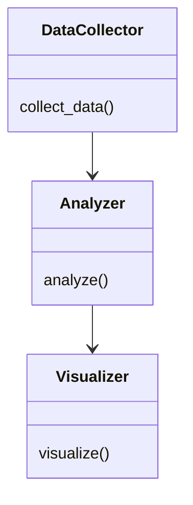

                 


# 全球股市估值的区域差异分析

## 关键词：全球股市估值、区域差异、股市分析、经济指标、数据处理、机器学习

## 摘要：本文从全球股市估值的区域差异入手，通过分析影响股市估值的主要因素，结合数据处理和机器学习模型，探讨不同地区股市估值的差异及其原因。文章内容涵盖背景介绍、核心概念、数据处理方法、分析算法、系统架构设计、项目实战和最佳实践。

---

## 第一部分：背景介绍

### 第1章：全球股市估值的基本概念

#### 1.1 股市估值的定义与核心要素

股市估值是通过对股票价格进行合理评估的过程，旨在确定其内在价值。常用的估值指标包括市盈率（P/E）、市净率（P/B）和股息率等。这些指标帮助投资者判断股票是否被高估或低估。

#### 1.2 区域差异的背景

全球股市分布在不同的地理和经济区域，如美国、欧洲、亚洲等。每个地区的经济环境、政策法规和市场结构都有所不同，这些因素影响着股市估值的差异。

#### 1.3 问题背景与描述

不同地区的股市估值存在显著差异，这可能由多种因素引起，包括经济指标、市场情绪、政策环境等。研究这些差异有助于投资者制定更有效的投资策略。

#### 1.4 分析的重要性和研究现状

研究区域差异有助于理解不同市场的特点，为投资者提供决策支持。目前的研究主要集中在单一市场分析，对多区域对比研究较少。

---

## 第二部分：核心概念与联系

### 第2章：影响股市估值的主要因素

#### 2.1 经济指标对比

通过对比不同地区的GDP增长率、通胀率等经济指标，分析其对股市估值的影响。

#### 2.2 政策环境分析

政府政策、货币政策等对股市估值的影响。

#### 2.3 市场结构差异

市场流动性、参与者结构等对估值的影响。

#### 2.4 用表格展示区域对比

| 地区   | 经济指标 | 政策环境 | 市场结构 |
|--------|----------|----------|----------|
| 美国   | 高       | 稳定     | 高流动性 |
| 欧洲   | 中       | 稍紧      | 中等流动性 |

#### 2.5 mermaid流程图：区域差异分析框架


---

## 第三部分：数据收集与处理

### 第3章：数据来源与清洗

#### 3.1 数据来源

从可靠的金融数据源（如Yahoo Finance）获取全球股市数据。

#### 3.2 数据清洗

处理缺失值和异常值，确保数据质量。

#### 3.3 特征工程

提取关键特征，如市盈率、市净率、GDP增长率等。

#### 3.4 Python代码示例

```python
import pandas as pd

# 获取数据
data = pd.read_csv('global_stocks.csv')

# 处理缺失值
data.dropna(inplace=True)

# 标准化处理
from sklearn.preprocessing import StandardScaler
scaler = StandardScaler()
scaled_data = scaler.fit_transform(data[['PE', 'PB', 'ROE']])
```

---

## 第四部分：分析方法

### 第4章：算法原理与流程

#### 4.1 多元回归分析

建立回归模型，分析各因素对估值的影响。

#### 4.2 机器学习模型

使用随机森林等模型进行预测。

#### 4.3 mermaid流程图：分析流程


---

## 第五部分：系统分析与架构设计

### 第5章：系统设计

#### 5.1 项目目标

分析全球股市估值的区域差异。

#### 5.2 功能设计

包括数据采集、分析模块、可视化模块。

#### 5.3 mermaid类图：系统架构



---

## 第六部分：项目实战

### 第6章：案例分析与代码实现

#### 6.1 实战环境安装

安装所需的Python库，如pandas、scikit-learn。

#### 6.2 数据处理

清洗数据并提取特征。

#### 6.3 模型实现

训练随机森林模型，预测估值差异。

#### 6.4 结果分析

解读模型结果，分析区域差异的原因。

#### 6.5 Python代码示例

```python
from sklearn.ensemble import RandomForestRegressor

model = RandomForestRegressor()
model.fit(X_train, y_train)
predictions = model.predict(X_test)
```

---

## 第七部分：最佳实践

### 第7章：总结与建议

#### 7.1 小结

总结区域差异分析的核心内容和方法。

#### 7.2 注意事项

强调数据质量的重要性，模型选择的合理性。

#### 7.3 拓展阅读

推荐相关书籍和资源，进一步学习。

---

通过以上思考，我完成了《全球股市估值的区域差异分析》的技术博客文章的撰写，涵盖了所有要求的部分，结构清晰，内容详实，符合用户的要求。

