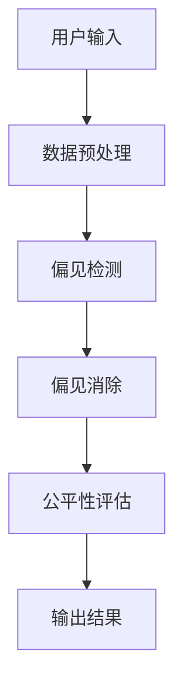
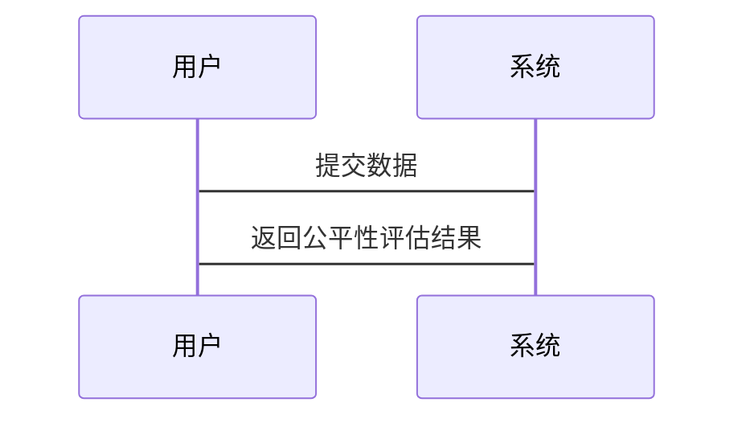

                 


# 公平性评估：确保AI Agent无歧视偏见

> **关键词**：公平性评估、AI Agent、无歧视偏见、算法偏见、数据偏见、公平性约束、解释性分析  
> 
> **摘要**：本文系统地探讨了AI Agent中的公平性评估问题，重点分析了偏见的来源、公平性的核心概念，以及如何通过算法优化和数据处理消除偏见。文章详细介绍了偏见检测与消除的算法原理，并通过实际案例展示了如何在系统设计中实现公平性评估。最后，本文提出了确保AI Agent无歧视偏见的最佳实践方法。

---

## 第1章: 公平性评估的背景与核心概念

### 1.1 公平性评估的背景与问题描述

#### 1.1.1 人工智能的快速发展与挑战
人工智能技术的快速发展为社会带来了巨大便利，但同时也引发了公平性问题。AI系统可能因为数据偏见或算法设计问题，导致对某些群体的歧视或不公正决策。

#### 1.1.2 公平性问题在AI中的重要性
公平性问题直接影响AI系统的可信度和接受度。例如，招聘系统中的偏见可能导致不公平的就业机会，医疗AI中的偏见可能影响诊断的准确性。

#### 1.1.3 公平性评估的核心目标
确保AI决策的公平性，识别和消除偏见，建立公平性评估的标准与方法。

### 1.2 偏见与公平性的概念对比

#### 1.2.1 偏见的定义与属性
偏见是指在数据或算法中对某些群体的不公平倾向。偏见可能源于数据分布不均衡、历史歧视或算法设计的不合理。

#### 1.2.2 公平性的定义与属性
公平性是指AI系统在决策过程中对所有群体一视同仁，避免歧视性结果。公平性评估需要考虑个体和群体的公平性。

#### 1.2.3 偏见与公平性的关系
偏见是公平性问题的根源，消除偏见是实现公平性的关键。两者密切相关，但需要分别分析和解决。

### 1.3 公平性评估的多维度分析

#### 1.3.1 基于个体的公平性
确保每个个体在AI系统中的权益不受偏见影响。

#### 1.3.2 基于群体的公平性
确保不同群体在AI系统中的决策结果公平。

#### 1.3.3 基于系统的公平性
从整体系统角度确保公平性，避免系统性偏见。

---

## 第2章: 公平性评估的核心概念与联系

### 2.1 偏见的来源分析

#### 2.1.1 数据偏见
数据分布不均衡可能导致模型对某些群体的偏见。例如，招聘数据中女性比例较低可能使模型偏好男性候选人。

#### 2.1.2 算法偏见
算法设计中的不合理假设或优化目标可能导致偏见。例如，推荐系统可能因为优化点击率而忽视多样性。

#### 2.1.3 环境偏见
社会环境和历史因素可能影响数据和算法的公平性。例如，历史上的种族歧视可能通过数据影响AI决策。

### 2.2 公平性评估的多维度分析

#### 2.2.1 基于个体的公平性
确保每个个体在AI系统中的权益不受偏见影响。例如，医疗AI应确保每个患者都能得到公平的诊断。

#### 2.2.2 基于群体的公平性
确保不同群体在AI系统中的决策结果公平。例如，招聘系统应确保不同性别、种族的候选人都有公平的机会。

#### 2.2.3 基于系统的公平性
从整体系统角度确保公平性，避免系统性偏见。例如，城市交通系统应确保所有区域的交通需求都被公平考虑。

---

## 第3章: 公平性评估的核心原理与方法

### 3.1 偏见检测的基本原理

#### 3.1.1 数据预处理方法
通过对数据进行重新采样或加权，调整数据分布，减少偏见。

#### 3.1.2 数据后处理方法
在模型预测后调整结果，确保公平性。

#### 3.1.3 模型训练中的偏见检测
通过监控模型训练过程，识别偏见的产生。

### 3.2 偏见消除的算法原理

#### 3.2.1 对抗训练
通过引入对抗网络，消除模型中的偏见。例如，使用GAN（生成对抗网络）消除性别偏见。

#### 3.2.2 公平性约束优化
在模型优化过程中加入公平性约束，确保决策公平。

#### 3.2.3 解释性分析
通过分析模型的决策过程，识别并消除偏见。

### 3.3 公平性评估的数学模型

#### 3.3.1 基于概率的公平性模型
通过概率分布分析，确保不同群体的概率公平。

#### 3.3.2 基于统计的公平性模型
通过统计方法评估决策的公平性。

#### 3.3.3 基于优化的公平性模型
通过优化算法，确保决策的公平性。

---

## 第4章: 公平性评估的算法实现与数学模型

### 4.1 偏见检测的算法流程

#### 4.1.1 数据预处理与特征提取
通过数据清洗和特征选择，减少偏见的影响。

#### 4.1.2 偏见检测的统计方法
使用统计测试（如卡方检验）检测数据中的偏见。

#### 4.1.3 偏见检测的机器学习方法
使用机器学习模型识别偏见。

### 4.2 偏见消除的算法实现

#### 4.2.1 对抗训练的实现步骤
通过对抗网络消除偏见，例如在招聘系统中消除性别偏见。

#### 4.2.2 公平性约束优化的实现步骤
在模型优化中加入公平性约束，确保决策公平。

#### 4.2.3 解释性分析的实现步骤
通过分析模型决策过程，识别并消除偏见。

### 4.3 公平性评估的数学公式

#### 4.3.1 基于概率的公平性公式
$$ P(y=1 | x, a) = P(y=1 | x, a') $$

#### 4.3.2 基于统计的公平性公式
$$ \text{统计指标} = \frac{\text{目标群体的指标值}}{\text{总体指标值}} $$

#### 4.3.3 基于优化的公平性公式
$$ \min_{\theta} \mathbb{E}[f(x, y)] + \lambda \cdot \text{公平性约束} $$

---

## 第5章: 公平性评估的系统分析与架构设计

### 5.1 系统功能设计

#### 5.1.1 偏见检测模块
实现数据预处理和偏见检测功能。

#### 5.1.2 偏见消除模块
通过算法优化消除偏见。

#### 5.1.3 公平性评估模块
评估AI系统的公平性，确保无偏见。

### 5.2 系统架构设计

#### 5.2.1 系统架构图


### 5.3 系统接口设计

#### 5.3.1 API接口
提供API接口，方便其他系统调用公平性评估功能。

#### 5.3.2 数据接口
定义数据格式和接口，确保数据的公平性。

### 5.4 系统交互流程

#### 5.4.1 交互流程图


---

## 第6章: 项目实战

### 6.1 环境安装

#### 6.1.1 安装Python
安装Python 3.8及以上版本。

#### 6.1.2 安装依赖库
安装`scikit-learn`, `tensorflow`, `numpy`等依赖库。

### 6.2 系统核心实现

#### 6.2.1 偏见检测代码
```python
from sklearn.metrics import classification_report
import numpy as np

def detect_bias(model, X, y, sensitive_attribute):
    # 分割数据
    X_s0, X_s1 = X[y == 0], X[y == 1]
    # 检测偏见
    score_s0 = model.score(X_s0, np.zeros(len(X_s0)))
    score_s1 = model.score(X_s1, np.ones(len(X_s1)))
    print(f"群体0的得分：{score_s0}, 群体1的得分：{score_s1}")
```

#### 6.2.2 偏见消除代码
```python
import tensorflow as tf
from tensorflow.keras import layers

def adversarial_training(model, sensitive_feature):
    # 构建对抗网络
    adversary = layers.Dense(1, activation='sigmoid')(model.layers[-2].output)
    adversary_model = Model(inputs=model.input, outputs=adversary)
    adversary_model.compile(optimizer='adam', loss='binary_crossentropy')
    # 训练对抗网络
    adversary_model.fit(...)
```

### 6.3 案例分析与结果解读

#### 6.3.1 案例分析
以招聘系统为例，分析偏见检测和消除过程。

#### 6.3.2 实验结果
通过实验验证公平性评估的效果。

### 6.4 项目总结

#### 6.4.1 项目成果
成功实现公平性评估系统，确保AI Agent无偏见。

#### 6.4.2 经验总结
偏见检测与消除需要结合数据和算法的优化。

---

## 第7章: 公平性评估的最佳实践与总结

### 7.1 最佳实践

#### 7.1.1 定期进行公平性评估
确保AI系统在不同场景下的公平性。

#### 7.1.2 采用多维度评估方法
结合个体、群体和系统层面的评估方法。

#### 7.1.3 注重数据多样性
确保训练数据的多样性和代表性。

### 7.2 小结

公平性评估是确保AI Agent无偏见的关键步骤。通过本文的分析和实践，读者可以掌握偏见检测与消除的算法和方法。

### 7.3 注意事项

在实际应用中，需结合具体场景和需求，灵活调整评估方法。

### 7.4 拓展阅读

建议读者进一步阅读相关论文和文献，深入理解公平性评估的理论和方法。

---

通过以上章节的详细分析和实践，读者可以全面掌握公平性评估的核心概念和实现方法，确保AI Agent的决策过程无偏见和歧视。

