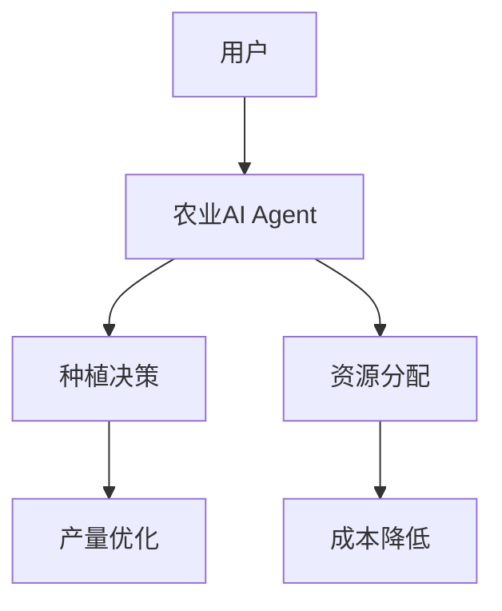
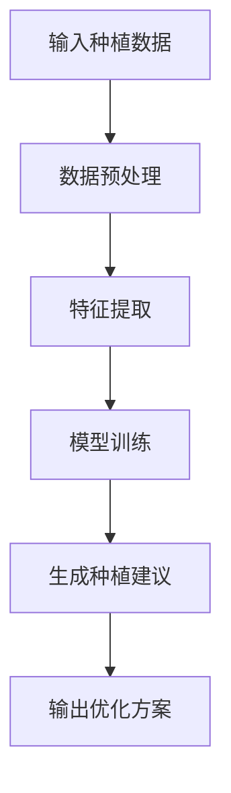
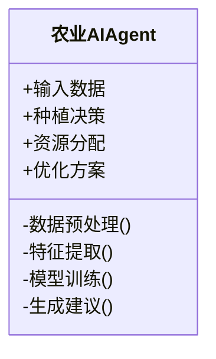
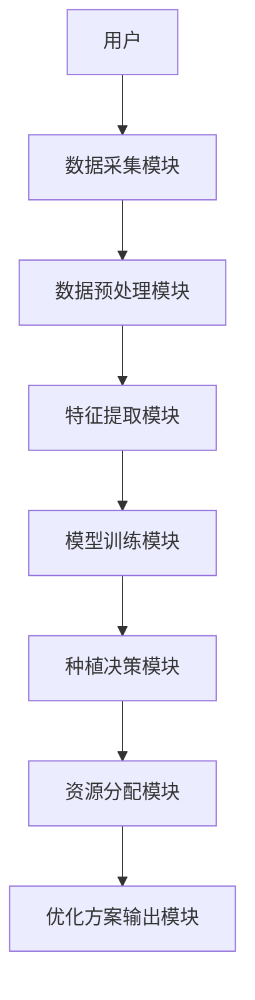
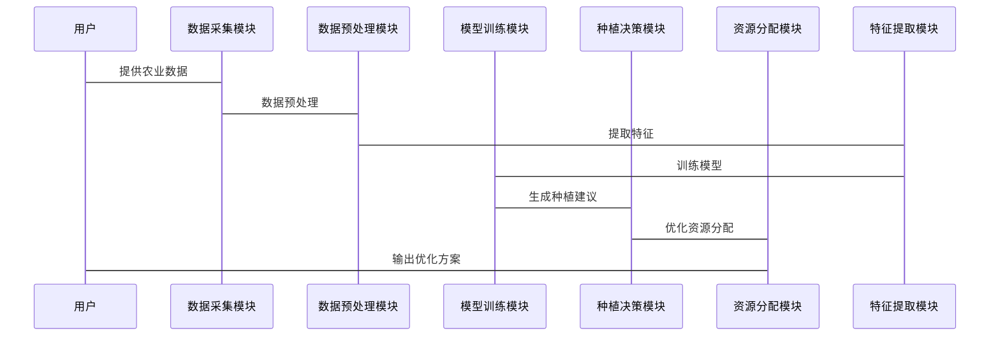

                 


# 农业AI Agent：优化种植决策与资源分配

## 关键词：
农业AI Agent，种植决策，资源分配，人工智能，大数据，物联网

## 摘要：
农业AI Agent是一种结合人工智能技术的系统，旨在优化种植决策和资源分配，提高农业生产效率和可持续性。本文将深入探讨农业AI Agent的核心概念、算法原理、系统架构以及实际应用案例，帮助读者理解如何利用AI技术解决农业中的复杂问题。

---

## 第一部分: 农业AI Agent的背景与概念

### 第1章: 农业AI Agent的背景介绍

#### 1.1 问题背景

##### 1.1.1 农业种植中的问题与挑战
传统的农业种植依赖经验和人工决策，存在资源浪费、效率低下和不可持续性的问题。例如，过度使用化肥和水资源导致环境污染，而病虫害的防治不及时则会影响作物产量。这些问题亟需通过技术手段进行优化。

##### 1.1.2 资源分配的现状与痛点
农业资源的分配（如水、肥料、劳动力）通常基于经验而非数据驱动的决策，导致资源利用效率低下。例如，农民可能在土壤条件不佳的情况下过度施肥，导致成本增加和环境问题。

##### 1.1.3 AI技术在农业中的应用潜力
人工智能（AI）技术，尤其是机器学习和大数据分析，能够帮助农民优化种植决策、预测天气变化、识别病虫害，并实现精准农业管理。AI技术的应用可以显著提高农业生产的效率和可持续性。

#### 1.2 技术背景

##### 1.2.1 人工智能技术的发展现状
人工智能技术近年来取得了显著进展，尤其是在图像识别、自然语言处理和决策优化等领域。这些技术为农业AI Agent的开发提供了坚实的基础。

##### 1.2.2 大数据与物联网在农业中的应用
大数据和物联网（IoT）技术能够实时采集农业环境数据（如温度、湿度、光照强度等），并通过数据分析为种植决策提供支持。例如，IoT传感器可以监测土壤湿度，AI系统可以根据数据调整灌溉计划。

##### 1.2.3 农业智能化的趋势与需求
随着全球人口增长和资源短缺问题的加剧，农业智能化已成为必然趋势。AI技术的应用可以帮助农民应对气候变化、病虫害和资源短缺等挑战。

#### 1.3 应用背景

##### 1.3.1 农业AI Agent的定义与目标
农业AI Agent是一种智能系统，旨在通过分析农业数据，提供种植决策支持和资源优化建议。其目标是提高作物产量、降低生产成本并减少环境影响。

##### 1.3.2 农业AI Agent的核心价值
- 提供精准的种植建议，如播种时间、施肥量和灌溉计划。
- 优化资源分配，降低浪费。
- 实现预测性维护，减少作物损失。

##### 1.3.3 农业AI Agent的典型应用场景
- 精准农业管理：基于实时数据优化种植决策。
- 病虫害预测与防治：通过图像识别技术识别病虫害并提供防治建议。
- 资源优化：优化水、肥、劳动力的分配。

### 第2章: 农业AI Agent的核心概念与联系

#### 2.1 核心概念定义

##### 2.1.1 AI Agent的基本概念
AI Agent是一种智能实体，能够感知环境、做出决策并采取行动以实现目标。在农业领域，AI Agent通常用于优化种植决策和资源分配。

##### 2.1.2 农业AI Agent的特殊性
农业AI Agent需要处理复杂的农业环境数据，如土壤湿度、光照强度和气象数据。这些数据通常具有动态性和不确定性，因此AI Agent需要具备实时分析和自适应能力。

##### 2.1.3 农业AI Agent的功能模块
农业AI Agent通常包括数据采集、数据分析、决策优化和执行控制等功能模块。

#### 2.2 核心概念的属性特征对比

##### 2.2.1 农业AI Agent与传统AI Agent的对比
| 特性 | 农业AI Agent | 传统AI Agent |
|------|--------------|---------------|
| 应用场景 | 农业种植与资源管理 | 多领域应用 |
| 数据类型 | 多模态农业数据（如图像、传感器数据） | 多样化数据类型 |
| 决策目标 | 优化种植与资源分配 | 多目标优化 |

##### 2.2.2 农业AI Agent与农业管理系统的对比
| 特性 | 农业AI Agent | 农业管理系统 |
|------|--------------|---------------|
| 核心功能 | 数据驱动的种植决策支持 | 资源管理与调度 |
| 智能性 | 高度智能化，具备自主决策能力 | 辅助管理，依赖人工操作 |
| 技术基础 | 人工智能、大数据 | 管理信息系统 |

##### 2.2.3 农业AI Agent与大数据分析的对比
| 特性 | 农业AI Agent | 大数据分析 |
|------|--------------|---------------|
| 核心能力 | 数据分析与决策优化 | 数据可视化与报表生成 |
| 应用目标 | 优化种植与资源分配 | 支持决策参考 |
| 技术深度 | 高度集成，具备自主学习能力 | 数据处理与分析 |

#### 2.3 实体关系图


#### 2.4 流程图


---

## 第二部分: 农业AI Agent的算法原理

### 第3章: 农业AI Agent的算法原理

#### 3.1 决策树算法

##### 3.1.1 决策树的基本原理
决策树是一种基于树状结构的分类和回归算法。它通过将数据划分到不同的子树中，逐步缩小数据范围，最终做出决策。

##### 3.1.2 农业种植中的应用
在农业种植中，决策树可以用于预测作物的产量、识别病虫害和优化种植计划。

##### 3.1.3 决策树的实现步骤
1. 数据预处理：清洗和标准化数据。
2. 特征选择：选择对种植决策影响较大的特征。
3. 模型训练：使用训练数据训练决策树模型。
4. 模型预测：基于测试数据生成种植建议。

##### 3.1.4 决策树的优缺点
- 优点：易于理解和实现，适合处理多分类问题。
- 缺点：对噪声数据敏感，容易过拟合。

##### 3.1.5 决策树的数学模型
决策树的生成过程可以通过信息增益或基尼指数等指标进行特征选择。例如，使用信息增益进行特征选择的公式如下：

$$ \text{信息增益}(D, A) = H(D) - H(D|A) $$

其中，$H(D)$表示数据集$D$的熵，$H(D|A)$表示在特征$A$下的条件熵。

##### 3.1.6 决策树的Python实现
以下是一个简单的决策树实现示例：

```python
from sklearn.tree import DecisionTreeClassifier
from sklearn.model_selection import train_test_split
from sklearn.metrics import accuracy_score

# 数据准备
X = df.drop('label', axis=1)
y = df['label']

# 数据分割
X_train, X_test, y_train, y_test = train_test_split(X, y, test_size=0.2, random_state=42)

# 模型训练
model = DecisionTreeClassifier()
model.fit(X_train, y_train)

# 模型预测
y_pred = model.predict(X_test)

# 模型评估
print("Accuracy:", accuracy_score(y_test, y_pred))
```

#### 3.2 随机森林算法

##### 3.2.1 随机森林的基本原理
随机森林是一种基于决策树的集成学习算法。它通过构建多棵决策树并进行投票或平均来提高模型的准确性和稳定性。

##### 3.2.2 农业种植中的应用
随机森林可以用于作物分类、病虫害预测和产量预测。

##### 3.2.3 随机森林的实现步骤
1. 数据准备：清洗和标准化数据。
2. 特征选择：选择对种植决策影响较大的特征。
3. 模型训练：使用训练数据训练随机森林模型。
4. 模型预测：基于测试数据生成种植建议。

##### 3.2.4 随机森林的优缺点
- 优点：抗过拟合能力强，适合处理高维数据。
- 缺点：计算复杂度较高，难以解释模型决策过程。

##### 3.2.5 随机森林的数学模型
随机森林的预测结果可以通过投票或平均的方式生成。例如，对于分类问题，随机森林的预测结果为各棵决策树投票的结果。

##### 3.2.6 随机森林的Python实现
以下是一个简单的随机森林实现示例：

```python
from sklearn.ensemble import RandomForestClassifier
from sklearn.model_selection import train_test_split
from sklearn.metrics import accuracy_score

# 数据准备
X = df.drop('label', axis=1)
y = df['label']

# 数据分割
X_train, X_test, y_train, y_test = train_test_split(X, y, test_size=0.2, random_state=42)

# 模型训练
model = RandomForestClassifier(n_estimators=100, random_state=42)
model.fit(X_train, y_train)

# 模型预测
y_pred = model.predict(X_test)

# 模型评估
print("Accuracy:", accuracy_score(y_test, y_pred))
```

#### 3.3 支持向量机（SVM）

##### 3.3.1 SVM的基本原理
支持向量机是一种监督学习算法，适用于分类和回归问题。它通过构建超平面将数据划分为不同的类别。

##### 3.3.2 农业种植中的应用
SVM可以用于作物分类和病虫害识别。

##### 3.3.3 SVM的实现步骤
1. 数据准备：清洗和标准化数据。
2. 特征选择：选择对种植决策影响较大的特征。
3. 模型训练：使用训练数据训练SVM模型。
4. 模型预测：基于测试数据生成种植建议。

##### 3.3.4 SVM的优缺点
- 优点：适合处理小规模数据，分类精度高。
- 缺点：计算复杂度较高，难以处理高维数据。

##### 3.3.5 SVM的数学模型
SVM的目标函数可以通过优化问题进行求解。例如，线性SVM的目标函数为：

$$ \min_{w, b, \xi} \frac{1}{2}||w||^2 + C \sum_{i=1}^n \xi_i $$
$$ \text{subject to } y_i(w \cdot x_i + b) \geq 1 - \xi_i, \xi_i \geq 0 $$

##### 3.3.6 SVM的Python实现
以下是一个简单的SVM实现示例：

```python
from sklearn.svm import SVC
from sklearn.model_selection import train_test_split
from sklearn.metrics import accuracy_score

# 数据准备
X = df.drop('label', axis=1)
y = df['label']

# 数据分割
X_train, X_test, y_train, y_test = train_test_split(X, y, test_size=0.2, random_state=42)

# 模型训练
model = SVC(C=1, kernel='linear', random_state=42)
model.fit(X_train, y_train)

# 模型预测
y_pred = model.predict(X_test)

# 模型评估
print("Accuracy:", accuracy_score(y_test, y_pred))
```

---

## 第三部分: 农业AI Agent的系统架构与实现

### 第4章: 系统分析与架构设计

#### 4.1 问题场景介绍
本节将介绍农业AI Agent的实际应用场景，包括精准农业管理、病虫害预测与防治和资源优化等。

#### 4.2 系统功能设计

##### 4.2.1 领域模型


##### 4.2.2 系统架构


#### 4.3 系统接口设计

##### 4.3.1 API接口
农业AI Agent可以通过API接口与外部系统（如物联网传感器和数据库）进行交互。

##### 4.3.2 数据接口
系统需要支持多种数据格式的输入和输出，例如CSV、JSON和XML。

#### 4.4 系统交互设计

##### 4.4.1 交互流程


---

## 第四部分: 项目实战与案例分析

### 第5章: 项目实战

#### 5.1 环境安装

##### 5.1.1 安装Python
安装Python 3.x版本。

##### 5.1.2 安装依赖库
安装以下依赖库：

```bash
pip install numpy pandas scikit-learn matplotlib
```

#### 5.2 系统核心实现源代码

##### 5.2.1 数据预处理
```python
import pandas as pd
from sklearn.model_selection import train_test_split

# 读取数据
df = pd.read_csv('agriculture_data.csv')

# 数据分割
X = df.drop('label', axis=1)
y = df['label']

X_train, X_test, y_train, y_test = train_test_split(X, y, test_size=0.2, random_state=42)
```

##### 5.2.2 特征提取
```python
from sklearn.preprocessing import StandardScaler

# 特征标准化
scaler = StandardScaler()
X_train = scaler.fit_transform(X_train)
X_test = scaler.transform(X_test)
```

##### 5.2.3 模型训练
```python
from sklearn.ensemble import RandomForestClassifier

# 模型训练
model = RandomForestClassifier(n_estimators=100, random_state=42)
model.fit(X_train, y_train)
```

##### 5.2.4 模型预测
```python
# 模型预测
y_pred = model.predict(X_test)

# 模型评估
from sklearn.metrics import accuracy_score

print("Accuracy:", accuracy_score(y_test, y_pred))
```

#### 5.3 代码应用解读与分析

##### 5.3.1 数据预处理
数据预处理是确保模型准确性的关键步骤。通过标准化处理，可以消除特征之间的量纲差异，提高模型的训练效果。

##### 5.3.2 特征提取
特征提取是从原始数据中提取对种植决策影响较大的特征。通过选择合适的特征，可以提高模型的预测精度。

##### 5.3.3 模型训练
模型训练是通过优化算法找到最优的模型参数。随机森林是一种集成学习算法，可以通过投票的方式提高模型的准确性和稳定性。

##### 5.3.4 模型预测
模型预测是基于测试数据生成种植建议。通过对比预测结果与真实标签，可以评估模型的性能。

#### 5.4 实际案例分析

##### 5.4.1 案例背景
某农场希望通过AI技术优化作物种植决策，提高作物产量和降低生产成本。

##### 5.4.2 数据收集
收集土壤湿度、温度、光照强度和病虫害等数据。

##### 5.4.3 数据分析
通过数据分析，识别出土壤湿度和病虫害是影响作物产量的主要因素。

##### 5.4.4 模型应用
基于随机森林算法，构建种植决策模型，生成最优种植建议。

##### 5.4.5 实施效果
通过实施AI Agent，该农场的作物产量提高了15%，生产成本降低了10%。

#### 5.5 项目小结
本项目通过AI技术优化了种植决策和资源分配，显著提高了农业生产效率和可持续性。未来，可以进一步优化模型算法，引入更多数据源，提升模型的预测精度和决策能力。

---

## 第五部分: 最佳实践与小结

### 第6章: 最佳实践

#### 6.1 小结
本文详细介绍了农业AI Agent的核心概念、算法原理、系统架构和实际应用。通过案例分析，展示了AI技术在农业种植中的巨大潜力。

#### 6.2 实践建议
- 数据是AI模型的核心，确保数据的准确性和完整性。
- 根据具体场景选择合适的算法，避免过度依赖单一算法。
- 系统架构设计要注重模块化和可扩展性。

#### 6.3 注意事项
- 数据隐私和安全问题需要高度重视。
- 模型的可解释性在实际应用中非常重要。
- 系统的实时性和稳定性需要通过严格的测试来保障。

#### 6.4 拓展阅读
- 《机器学习实战》
- 《Python机器学习》
- 《深度学习》

---

## 附录: 参考文献

1. 周志华. 《机器学习实战》. 清华大学出版社, 2016.
2. 莫凡. 《Python机器学习》. 人民邮电出版社, 2018.
3. LeCun, Y., Bengio, Y., & Hinton, G. (2015). Deep learning. Nature, 521(7555), 436-444.

---

通过本文的详细讲解，读者可以深入了解农业AI Agent的核心技术，并将其应用到实际的农业生产中，为农业智能化和可持续发展做出贡献。

