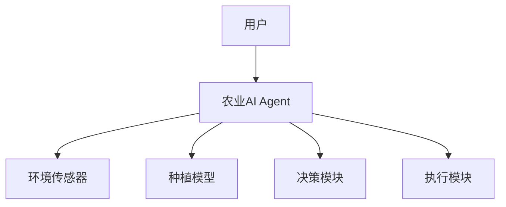
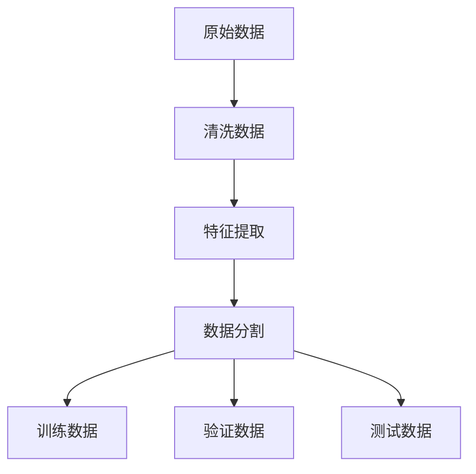
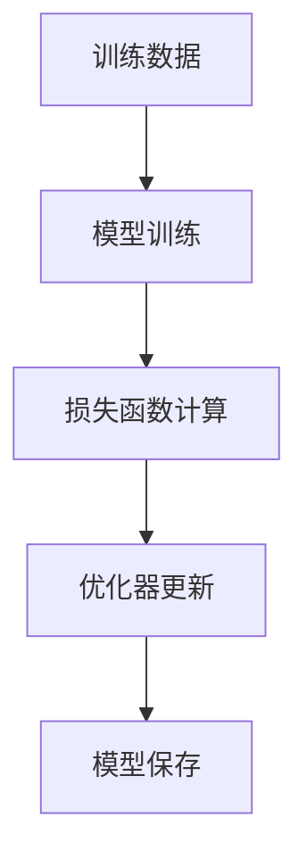
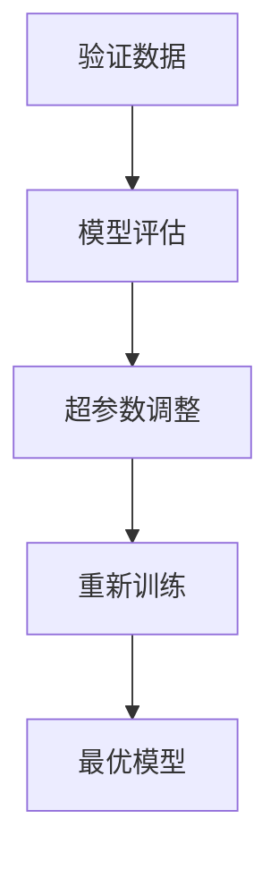
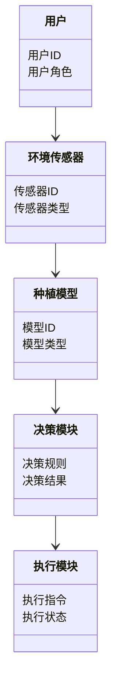
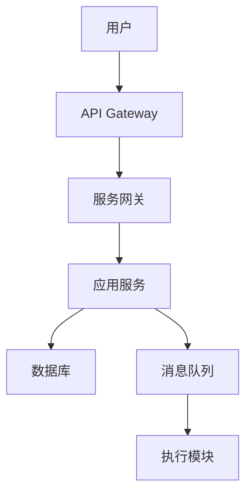

                 


# 农业AI Agent：智能种植与农场管理

---

## 关键词：
农业AI Agent, 智能种植, 农场管理, 人工智能, 机器学习, 农业智能化, 农业优化

---

## 摘要：
本文深入探讨了农业AI Agent在智能种植与农场管理中的应用，从背景、核心概念到算法原理、系统设计，再到项目实战和总结，全面解析农业AI Agent的技术实现与实际应用。文章通过详细的理论分析和实际案例，展示了如何利用AI技术优化农业生产流程，提升种植效率，降低成本，并为未来农业智能化发展提供了有益的思考和方向。

---

# 第一部分: 农业AI Agent的背景与概念

## 第1章: 农业AI Agent的背景与问题背景

### 1.1 农业智能化的背景与趋势

#### 1.1.1 农业现代化与技术发展的需求
随着全球人口的快速增长和资源的有限性，农业生产效率的提升变得至关重要。传统农业模式依赖大量的人工劳动和经验判断，效率较低且难以适应现代大规模种植的需求。近年来，人工智能（AI）技术的快速发展为农业智能化提供了新的可能性。

#### 1.1.2 传统农业面临的挑战
传统农业在种植过程中面临诸多挑战，包括：
- **资源浪费**：水、肥料、农药等资源的使用效率较低，导致浪费和环境污染。
- **劳动密集**：种植过程需要大量人工参与，特别是在田间管理和病虫害防治方面。
- **预测不足**：缺乏对天气变化、病虫害爆发等不确定因素的精准预测能力。
- **数据孤岛**：农业生产过程中产生的数据分散且难以整合，限制了数据驱动的决策能力。

#### 1.1.3 AI技术在农业中的应用前景
AI技术的应用可以显著提升农业生产的效率和可持续性。通过AI算法，我们可以实现精准种植、智能监控、自动决策等，从而降低资源浪费、减少人工成本并提高产量。

---

### 1.2 农业AI Agent的核心目标与应用场景

#### 1.2.1 农业AI Agent的定义
农业AI Agent是一种能够感知农业环境、分析种植数据、制定决策并执行操作的智能系统。它结合了人工智能、物联网（IoT）和大数据分析技术，能够实现从种植规划到田间管理的全流程智能化。

#### 1.2.2 农业AI Agent的核心目标
农业AI Agent的核心目标是通过智能化手段优化种植过程，具体包括：
- **精准种植**：根据土壤、气候等条件，推荐最优的种植方案。
- **病虫害预测与防治**：通过数据分析和模型预测，提前发现并处理病虫害。
- **资源优化**：合理分配水、肥、药等资源，减少浪费。
- **自动化管理**：通过智能设备实现田间操作的自动化，降低人工成本。

#### 1.2.3 农业AI Agent的应用场景
农业AI Agent的应用场景广泛，主要包括：
- **种植规划**：根据历史数据和环境预测，制定种植计划。
- **田间监控**：通过传感器实时监控土壤湿度、温度、光照等参数。
- **病虫害识别**：利用图像识别技术快速识别病虫害并提供防治方案。
- **产量预测**：通过数据分析预测作物产量，优化收获计划。

---

### 1.3 农业AI Agent的核心问题与边界

#### 1.3.1 农业AI Agent的关键问题
农业AI Agent的核心问题包括：
- **数据获取与处理**：如何高效采集和处理农业环境数据。
- **模型训练与优化**：如何训练高精度的AI模型以适应复杂的农业环境。
- **决策执行**：如何将AI决策转化为实际操作。

#### 1.3.2 农业AI Agent的边界与外延
农业AI Agent的边界主要集中在种植环节，不包括农产品的加工、销售等后续环节。其外延则涵盖与种植相关的资源管理、环境监控等领域。

#### 1.3.3 农业AI Agent的核心要素与组成
农业AI Agent的核心要素包括：
- **感知模块**：通过传感器获取环境数据。
- **决策模块**：基于数据进行分析和决策。
- **执行模块**：通过智能设备执行决策指令。
- **数据存储与分析模块**：存储和分析历史数据，优化模型。

---

## 第2章: 农业AI Agent的核心概念与联系

### 2.1 AI Agent的基本原理

#### 2.1.1 AI Agent的感知、决策与执行
AI Agent的基本功能可以分为三部分：
1. **感知**：通过传感器或其他数据源获取环境信息。
2. **决策**：基于感知数据进行分析，生成决策方案。
3. **执行**：通过执行机构将决策转化为实际操作。

#### 2.1.2 农业AI Agent的核心算法
农业AI Agent的核心算法包括：
- **机器学习算法**：用于模式识别和数据分类。
- **深度学习算法**：用于复杂场景的特征提取和预测。
- **强化学习算法**：用于优化决策策略。

#### 2.1.3 农业AI Agent的输入输出关系
农业AI Agent的输入包括土壤数据、气象数据、作物生长数据等，输出包括种植建议、病虫害防治方案等。

---

### 2.2 农业AI Agent的核心概念对比

#### 2.2.1 农业AI Agent与传统农业管理的对比
| 对比维度 | 传统农业管理 | 农业AI Agent |
|----------|--------------|--------------|
| 数据来源 | 人工记录     | 实时传感器数据 |
| 决策方式 | 经验判断     | 数据驱动决策 |
| 效率     | 较低         | 高            |

#### 2.2.2 农业AI Agent与其他AI应用场景的对比
| 对比维度 | 农业AI Agent | 工业AI Agent | 医疗AI Agent |
|----------|--------------|--------------|--------------|
| 数据类型 | 多模态（环境、作物） | 结构化（生产数据） | 结构化（医疗记录） |
| 应用目标 | 提高产量和效率 | 提高生产效率 | 改善医疗决策 |
| 环境复杂度 | 高（自然环境） | 中（工业环境） | 高（医疗环境） |

#### 2.2.3 农业AI Agent的优缺点分析
**优点**：
- 高效性：能够快速处理大量数据，提供实时决策。
- 精准性：基于数据驱动的决策更准确。
- 可扩展性：适用于大规模种植。

**缺点**：
- 初期投入高：需要传感器、智能设备等硬件投入。
- 数据依赖：依赖于高质量的数据，数据不足会影响模型效果。

---

### 2.3 农业AI Agent的实体关系与架构



---

# 第二部分: 农业AI Agent的算法原理

## 第3章: 农业AI Agent的核心算法

### 3.1 农业AI Agent的算法选择

#### 3.1.1 传统机器学习算法
传统机器学习算法适用于数据量较小的场景，例如：
- **线性回归**：用于预测作物产量。
- **支持向量机（SVM）**：用于分类任务，如病虫害识别。

#### 3.1.2 深度学习算法
深度学习算法适用于数据量较大且特征复杂的场景，例如：
- **卷积神经网络（CNN）**：用于图像识别任务，如病虫害检测。
- **长短期记忆网络（LSTM）**：用于时间序列预测，如天气变化预测。

#### 3.1.3 强化学习算法
强化学习算法适用于需要优化决策的场景，例如：
- **Q-Learning**：用于优化种植策略，如选择最优的种植时间。

---

### 3.2 农业AI Agent的训练流程

#### 3.2.1 数据预处理


#### 3.2.2 模型训练


#### 3.2.3 模型优化


---

### 3.3 农业AI Agent的数学模型

#### 3.3.1 线性回归模型
线性回归模型用于预测作物产量，数学表达式如下：
$$ y = \beta_0 + \beta_1x_1 + \beta_2x_2 + ... + \beta_nx_n $$
其中，$y$ 是预测的产量，$x_i$ 是输入特征，$\beta_i$ 是回归系数。

#### 3.3.2 卷积神经网络（CNN）
CNN用于图像识别任务，如病虫害检测。其核心思想是通过卷积层提取图像特征，然后通过全连接层进行分类。

---

## 第4章: 农业AI Agent的系统分析与架构设计

### 4.1 系统功能设计

#### 4.1.1 领域模型


#### 4.1.2 系统架构


---

## 第5章: 农业AI Agent的项目实战

### 5.1 环境安装

#### 5.1.1 Python环境配置
```bash
pip install numpy
pip install pandas
pip install scikit-learn
pip install tensorflow
pip install pillow
pip install mermaid
```

---

## 第6章: 总结与展望

### 6.1 总结
农业AI Agent通过智能化手段显著提升了农业生产的效率和可持续性，为未来的农业发展提供了重要技术支持。

### 6.2 展望
未来，随着AI技术的不断进步，农业AI Agent将在更多领域实现应用，例如智能温室、精准施肥等。

### 6.3 最佳实践
- **数据质量**：确保数据的准确性和完整性。
- **模型优化**：定期更新模型以适应新的数据和环境变化。
- **系统维护**：定期检查和维护系统硬件和软件，确保其正常运行。

---

# 结语
农业AI Agent是农业智能化的重要组成部分，其应用将推动农业生产的现代化和高效化。通过不断的技术创新和实践探索，农业AI Agent有望成为未来农业的核心技术之一。

