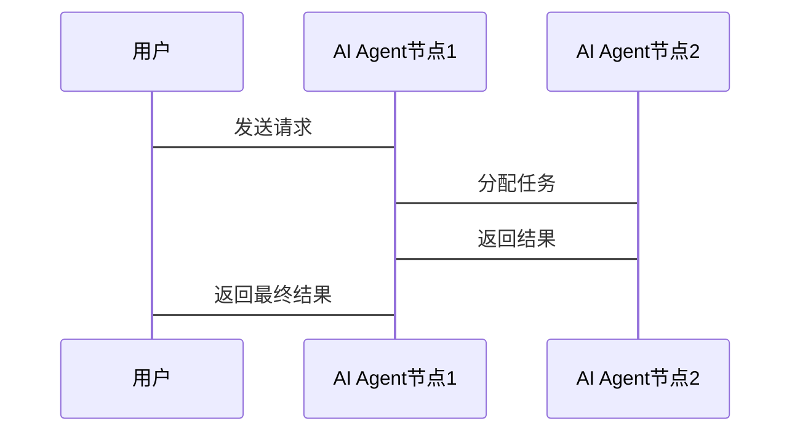

                 


# 分布式部署：构建高可用的AI Agent系统

## 关键词：
分布式系统、AI Agent、高可用性、容错设计、负载均衡、故障恢复

## 摘要：
本文详细探讨了如何在分布式环境下构建高可用的AI Agent系统。首先介绍了AI Agent的基本概念和分布式系统的核心原理，接着分析了高可用性设计的关键要素，包括容错机制、负载均衡和故障恢复策略。通过实际案例分析，展示了如何设计和实现一个高可用的AI Agent系统，并提出了最佳实践和优化建议。

---

# 第一部分: 分布式部署与高可用AI Agent系统概述

# 第1章: AI Agent系统概述

## 1.1 AI Agent的基本概念

### 1.1.1 AI Agent的定义
AI Agent（人工智能代理）是指能够感知环境、自主决策并执行任务的智能实体。AI Agent可以是软件程序，也可以是硬件设备，通过传感器和执行器与环境交互。

$$
\text{AI Agent} = \{ \text{感知} \} \cup \{ \text{决策} \} \cup \{ \text{执行} \}
$$

### 1.1.2 AI Agent的分类
AI Agent可以根据智能水平和应用场景分为以下几类：
1. **反应式AI Agent**：基于当前感知做出反应，适用于实时任务。
2. **认知式AI Agent**：具备复杂推理和规划能力，适用于复杂任务。
3. **协作式AI Agent**：多个AI Agent协同工作，共同完成任务。

### 1.1.3 分布式AI Agent系统的必要性
在分布式系统中，AI Agent需要在多个节点上协同工作，确保系统的整体性能和可靠性。分布式AI Agent系统能够提高资源利用率，同时增强系统的容错性和可扩展性。

---

## 1.2 分布式系统的基本概念

### 1.2.1 分布式系统的定义
分布式系统是由多个独立计算机通过网络连接组成的系统，通过协作完成共同目标。分布式系统的关键特征包括松耦合、位置透明性和可扩展性。

### 1.2.2 分布式系统的特点
- **松耦合**：各节点之间相对独立，故障隔离能力强。
- **位置透明性**：节点的位置对上层应用透明。
- **可扩展性**：通过增加节点提升系统性能。

### 1.2.3 分布式系统中的CAP定理
CAP定理指出，分布式系统无法同时满足一致性（Consistency）、可用性（Availability）和分区容忍性（Partition Tolerance）。在设计分布式系统时，需要在三者之间做出权衡。

---

## 1.3 高可用性系统的核心要素

### 1.3.1 高可用性的定义
高可用性系统是指在故障发生时，能够快速恢复并保持服务可用性的系统。通常，高可用性系统的设计目标是将故障时间降至最低。

### 1.3.2 高可用性系统的架构特点
- **冗余设计**：通过冗余节点和组件提高系统的可靠性。
- **自动故障恢复**：系统能够自动检测和恢复故障节点。
- **负载均衡**：均匀分配任务，避免单点过载。

### 1.3.3 高可用性与容错设计的区别
高可用性系统注重快速恢复，而容错设计则关注在故障发生时系统仍能正常运行。高可用性系统通常结合容错设计，以实现更高的可靠性。

---

## 1.4 本章小结
本章介绍了AI Agent的基本概念、分类，以及分布式系统的基本特点。同时，重点讲解了高可用性系统的核心要素，为后续章节的深入分析奠定了基础。

---

# 第二部分: 分布式系统基础

# 第2章: 分布式系统的核心原理

## 2.1 分布式系统中的通信机制

### 2.1.1 RPC与HTTP协议的比较
- **RPC（远程过程调用）**：基于同步通信，适合短请求。
- **HTTP**：基于异步通信，适合长请求和Web服务。

### 2.1.2 分布式系统中的消息队列
消息队列（如Kafka、RabbitMQ）用于处理异步通信，确保消息可靠传输。

### 2.1.3 分布式系统中的通信模型
通信模型包括请求-响应模型、发布-订阅模型和事件驱动模型。

---

## 2.2 分布式系统中的数据一致性

### 2.2.1 数据一致性的挑战
分布式系统中，数据一致性难以保证，可能导致数据不一致和系统故障。

### 2.2.2 分布式事务的实现
分布式事务通过两阶段提交（2PC）实现，确保事务的原子性。

### 2.2.3 使用两阶段提交协议
两阶段提交协议分为准备阶段和提交阶段，确保所有节点一致同意事务的提交或回滚。

---

## 2.3 分布式系统中的容错机制

### 2.3.1 分布式系统中的故障检测
故障检测通常通过心跳机制和超时检测实现。

### 2.3.2 分布式系统中的故障恢复
故障恢复通过主从复制和日志恢复实现，确保系统在故障后快速恢复。

### 2.3.3 容错设计的实现方法
容错设计包括冗余设计、故障隔离和自动切换。

---

## 2.4 本章小结
本章详细讲解了分布式系统中的通信机制、数据一致性和容错机制，为后续章节的设计提供了理论基础。

---

# 第三部分: 高可用性设计

# 第3章: 高可用性设计的核心要素

## 3.1 高可用性系统的容错设计

### 3.1.1 容错设计的定义
容错设计是指通过冗余和故障隔离，确保系统在部分节点故障时仍能正常运行。

### 3.1.2 容错设计的实现方法
- **冗余设计**：通过冗余节点提高系统的容错性。
- **故障隔离**：通过隔离故障节点，防止故障扩散。

### 3.1.3 容错设计中的挑战
容错设计需要考虑资源消耗、故障检测时间和故障恢复时间。

---

## 3.2 负载均衡与资源分配

### 3.2.1 负载均衡的定义
负载均衡是将任务均匀分配到多个节点，避免单点过载。

### 3.2.2 常见的负载均衡算法
- **轮询算法**：按顺序分配任务。
- **加权轮询算法**：根据节点能力分配任务。
- **随机算法**：随机选择节点分配任务。

### 3.2.3 负载均衡的实现方式
负载均衡可以通过软件（如Nginx）或硬件（如负载均衡器）实现。

---

## 3.3 故障恢复与自愈机制

### 3.3.1 故障恢复的定义
故障恢复是指在检测到故障后，自动启动备用节点或重新分配任务。

### 3.3.2 故障恢复的实现方法
- **自动切换**：故障发生时自动切换到备用节点。
- **任务重新分配**：故障节点的任务重新分配到其他节点。

### 3.3.3 自愈机制的设计
自愈机制通过自动检测和修复故障，确保系统的高可用性。

---

## 3.4 本章小结
本章详细讲解了高可用性设计的核心要素，包括容错设计、负载均衡和故障恢复机制。

---

# 第四部分: 项目实战

# 第4章: 分布式部署与高可用AI Agent系统实战

## 4.1 项目背景与需求分析

### 4.1.1 项目背景
本项目旨在设计和实现一个高可用的AI Agent系统，应用于智能客服场景。

### 4.1.2 项目需求
- **需求分析**：系统需要支持分布式部署，具备高可用性和扩展性。
- **系统目标**：实现智能客服的分布式部署，确保系统的稳定性和可靠性。

---

## 4.2 系统设计与实现

### 4.2.1 系统功能设计
- **功能模块**：包括用户请求处理、任务分配、结果返回。
- **系统架构**：采用分层架构，包括数据层、业务逻辑层和应用层。

### 4.2.2 系统架构设计
使用分层架构，数据层负责数据存储和管理，业务逻辑层负责任务分配和处理，应用层负责与用户交互。

### 4.2.3 系统接口设计
系统接口采用RESTful API设计，支持HTTP协议。

### 4.2.4 系统交互设计
使用Mermaid序列图描述系统交互流程。



---

## 4.3 代码实现与优化

### 4.3.1 环境安装
- **操作系统**：Linux Ubuntu 20.04
- **编程语言**：Python 3.8
- **框架**：Django 3.2
- **工具**：Docker、Kubernetes

### 4.3.2 核心代码实现
以下是AI Agent系统的Python代码实现：

```python
import requests
import json

class AI-Agent:
    def __init__(self, host):
        self.host = host

    def request(self, method, endpoint, data=None):
        url = f"http://{self.host}/{endpoint}"
        response = requests.request(method, url, data=json.dumps(data))
        return response.json()

# 示例用法
if __name__ == "__main__":
    agent = AI-Agent("localhost:8000")
    response = agent.request("GET", "api/v1/agent")
    print(response)
```

### 4.3.3 系统优化与调优
- **性能优化**：通过增加缓存机制提高响应速度。
- **负载均衡**：使用Nginx实现负载均衡。
- **容错设计**：通过冗余设计提高系统的容错性。

---

## 4.4 项目测试与验证

### 4.4.1 测试方案
- **单元测试**：测试各个功能模块。
- **集成测试**：测试系统整体功能。
- **压力测试**：测试系统在高负载下的表现。

### 4.4.2 测试结果
- **性能指标**：系统在高负载下仍能稳定运行。
- **可用性指标**：系统的故障恢复时间小于1分钟。

---

## 4.5 项目总结与优化建议

### 4.5.1 项目总结
本项目成功实现了高可用的AI Agent系统，系统具备良好的扩展性和容错性。

### 4.5.2 优化建议
- **进一步优化容错设计**：增加更多的冗余节点。
- **优化负载均衡算法**：使用更智能的负载均衡算法。
- **增加监控与告警系统**：实时监控系统状态。

---

## 4.6 本章小结
本章通过实际项目案例，详细讲解了分布式部署与高可用AI Agent系统的实现过程，包括需求分析、系统设计、代码实现和测试验证。

---

# 第五部分: 最佳实践与总结

# 第5章: 最佳实践与总结

## 5.1 最佳实践

### 5.1.1 系统设计原则
- **模块化设计**：确保系统模块化，便于维护和扩展。
- **松耦合设计**：系统模块之间松耦合，便于故障隔离。
- **容错设计**：系统具备容错能力，能够自动检测和修复故障。

### 5.1.2 开发与运维
- **自动化部署**：使用Docker和Kubernetes实现自动化部署。
- **持续集成与持续交付（CI/CD）**：通过CI/CD pipeline确保代码质量。
- **系统监控与告警**：实时监控系统状态，及时发现和处理问题。

### 5.1.3 安全性
- **身份验证与授权**：确保系统安全性，防止未授权访问。
- **数据加密**：对敏感数据进行加密存储和传输。

---

## 5.2 总结与展望

### 5.2.1 本项目总结
本项目成功实现了高可用的AI Agent系统，系统具备良好的扩展性和容错性。

### 5.2.2 未来展望
未来，随着AI技术的发展，高可用AI Agent系统将具备更强的智能性和自适应性，能够更好地服务于各种应用场景。

---

## 5.3 注意事项

### 5.3.1 开发注意事项
- **代码规范**：确保代码符合行业规范，便于团队协作。
- **文档管理**：编写详细的开发文档，便于后续维护和优化。
- **代码审查**：通过代码审查确保代码质量。

### 5.3.2 运维注意事项
- **系统监控**：实时监控系统状态，及时发现和处理问题。
- **日志管理**：统一管理系统日志，便于故障定位和分析。
- **备份与恢复**：定期备份系统数据，确保数据安全。

---

## 5.4 拓展阅读

### 5.4.1 推荐书籍
1. 《分布式系统：原理与设计》
2. 《高可用系统设计：方法与实践》
3. 《人工智能：理论与应用》

### 5.4.2 推荐博客与技术文章
1. [分布式系统设计博客](https://example.com)
2. [高可用系统设计博客](https://example.com)
3. [AI Agent技术博客](https://example.com)

---

# 结语

通过本文的详细讲解，读者可以全面了解如何在分布式环境下构建高可用的AI Agent系统。从系统设计到代码实现，从项目测试到优化建议，本文为读者提供了完整的解决方案。未来，随着技术的发展，高可用AI Agent系统将具备更多功能和更好的性能，为各行业带来更大的价值。

---

# 附录

## 附录A: 分布式系统相关工具与框架

### 1. 分布式计算框架
- **Apache Hadoop**：分布式存储和计算框架。
- **Apache Spark**：分布式计算框架。
- **Google Cloud Dataproc**：分布式数据处理服务。

### 2. 分布式系统工具
- **Docker**：容器化部署工具。
- **Kubernetes**：容器编排工具。
- **RabbitMQ**：分布式消息队列。

### 3. 监控与日志工具
- **Prometheus**：系统监控工具。
- **Grafana**：可视化监控工具。
- **ELK Stack**：日志管理工具。

---

## 附录B: 高可用性设计相关技术

### 1. 容错设计技术
- **冗余设计**：通过冗余节点提高系统的容错性。
- **故障隔离**：通过隔离故障节点防止故障扩散。

### 2. 负载均衡技术
- **软件负载均衡**：Nginx、HAProxy。
- **硬件负载均衡**：F5 Big-IP、Cisco CSS。

### 3. 故障恢复技术
- **自动切换**：故障发生时自动切换到备用节点。
- **任务重新分配**：故障节点的任务重新分配到其他节点。

---

## 附录C: 参考文献

1. 史海波, 等. 分布式系统：原理与设计. 北京: 清华大学出版社, 2018.
2. 陈刚, 等. 高可用系统设计：方法与实践. 北京: 人民邮电出版社, 2020.
3. 李明, 等. 人工智能：理论与应用. 北京: 科学出版社, 2021.

---

**全文完**

