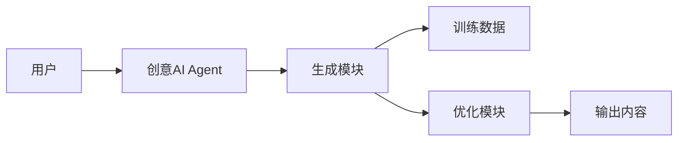
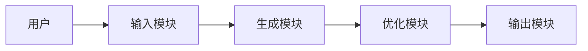

                 

# 创意AI Agent：辅助内容创作与设计

## 关键词：
- 创意AI Agent
- 生成式AI
- 内容创作
- 设计生成
- 自然语言处理
- 机器学习

## 摘要：
创意AI Agent是一种结合了生成式AI和自然语言处理技术的智能辅助工具，旨在帮助用户进行内容创作和设计。本文将详细介绍创意AI Agent的核心概念、算法原理、系统架构以及实际应用场景，通过具体的案例分析和代码实现，展示其在内容创作和设计领域的潜力与价值。

---

# 第一部分: 创意AI Agent概述

## 第1章: 创意AI Agent的背景与概念

### 1.1 创意AI Agent的定义与背景

#### 1.1.1 创意AI Agent的定义
创意AI Agent（Creative AI Agent）是一种基于人工智能技术的辅助工具，能够通过生成式AI模型，帮助用户完成内容创作和设计任务。它不仅能够生成文本、图像等内容，还能根据用户需求进行创意优化和个性化推荐。

#### 1.1.2 创意AI Agent的发展背景
随着AI技术的快速发展，生成式AI模型（如GPT、BERT）在内容创作领域的应用日益广泛。创意AI Agent的出现，旨在解决传统内容创作过程中效率低、灵感不足等问题，为用户提供更高效、个性化的创作支持。

#### 1.1.3 创意AI Agent的核心目标与价值
创意AI Agent的核心目标是通过AI技术提升内容创作的效率和质量，同时激发用户的创造力。其价值体现在以下几个方面：
- **提高创作效率**：通过自动化生成内容，减少人工劳动。
- **激发创意灵感**：AI能够根据用户输入生成多样化的创意建议。
- **个性化定制**：根据用户需求生成个性化内容，满足特定场景的应用需求。

### 1.2 创意AI Agent的应用场景

#### 1.2.1 内容创作领域的应用
创意AI Agent在内容创作领域的应用非常广泛，包括：
- **文本生成**：生成文章、故事、新闻报道等。
- **文案优化**：优化广告文案、社交媒体内容等。
- **创意写作**：帮助作家、编剧等进行灵感激发和内容扩展。

#### 1.2.2 设计领域的应用
在设计领域，创意AI Agent可以辅助用户完成：
- **图像生成**：生成插画、海报、UI设计等。
- **配色方案推荐**：根据用户需求推荐合适的配色方案。
- **设计灵感激发**：提供设计灵感和创意建议。

#### 1.2.3 创意AI Agent的其他潜在应用场景
除了内容创作和设计领域，创意AI Agent还可以应用于教育、医疗、娱乐等多个领域，例如：
- **教育领域**：辅助学生完成作业、论文等内容。
- **医疗领域**：生成医疗报告、诊断建议等。
- **娱乐领域**：生成游戏情节、剧本等。

### 1.3 创意AI Agent的边界与外延

#### 1.3.1 创意AI Agent的边界
创意AI Agent的功能边界主要集中在内容生成和创意辅助方面，其核心任务是生成符合用户需求的创意内容，而不涉及其他领域（如数据分析、决策制定等）。

#### 1.3.2 创意AI Agent的外延与相关概念
创意AI Agent与传统AI、生成式AI、自然语言处理（NLP）等技术密切相关。其外延包括：
- **生成式AI**：通过生成式模型生成多样化的内容。
- **自然语言处理（NLP）**：用于理解和生成人类语言。
- **强化学习（RL）**：用于优化生成内容的质量。

## 第2章: 创意AI Agent的核心概念与联系

### 2.1 创意AI Agent的核心概念

#### 2.1.1 创意AI Agent的组成要素
创意AI Agent通常由以下几个关键部分组成：
- **输入模块**：接收用户的输入，如关键词、主题等。
- **生成模块**：基于输入生成创意内容，如文本、图像等。
- **优化模块**：对生成的内容进行优化，确保质量符合用户需求。
- **输出模块**：将生成的内容输出给用户。

#### 2.1.2 创意AI Agent的核心原理
创意AI Agent的核心原理是基于生成式AI模型（如Transformer架构）进行内容生成。模型通过大量训练数据学习语言模式和创意表达方式，从而能够生成符合用户需求的创意内容。

#### 2.1.3 创意AI Agent的关键属性
创意AI Agent的关键属性包括：
- **生成能力**：能够生成多样化的内容。
- **个性化能力**：根据用户需求生成个性化内容。
- **适应性**：能够适应不同领域和场景的应用需求。

### 2.2 创意AI Agent的核心概念对比

#### 2.2.1 创意AI Agent与传统AI的区别
- **目标不同**：创意AI Agent专注于内容生成和创意辅助，而传统AI更注重数据处理和模式识别。
- **应用场景不同**：创意AI Agent主要应用于内容创作和设计领域，而传统AI的应用领域更广泛。

#### 2.2.2 创意AI Agent与生成式AI的联系
生成式AI是创意AI Agent的核心技术之一，创意AI Agent通过生成式AI模型生成多样化的内容。

#### 2.2.3 创意AI Agent与其他AI应用的对比
创意AI Agent与其他AI应用的主要区别在于其专注于创意生成和辅助创作，而非数据分析、图像识别等任务。

### 2.3 创意AI Agent的实体关系图

---

## 第3章: 创意AI Agent的算法原理

### 3.1 创意AI Agent的核心算法

#### 3.1.1 Transformer架构
创意AI Agent的核心算法之一是基于Transformer架构的生成式模型。Transformer由以下几个部分组成：
- **编码器（Encoder）**：将输入序列编码为一个上下文向量。
- **解码器（Decoder）**：根据编码器生成的向量生成输出序列。

#### 3.1.2 注意力机制（Attention Mechanism）
注意力机制是Transformer架构的核心，它能够帮助模型关注输入序列中重要的部分。

$$
\text{Attention}(Q, K, V) = \text{softmax}\left(\frac{QK^T}{\sqrt{d_k}}\right)V
$$

其中，$Q$、$K$、$V$分别是查询（Query）、键（Key）、值（Value）矩阵。

### 3.2 创意AI Agent的训练过程

#### 3.2.1 数据预处理
数据预处理是训练创意AI Agent的重要步骤，包括：
- **分词**：将文本数据进行分词处理。
- **编码**：将文本转换为模型可以理解的向量形式。
- **数据增强**：通过数据增强技术增加数据的多样性。

#### 3.2.2 模型训练
模型训练是通过大量数据对生成式AI模型进行训练，使其能够生成符合用户需求的内容。

#### 3.2.3 超参数调整
超参数调整是优化模型性能的重要步骤，包括：
- **学习率调整**：选择合适的学习率。
- **批量大小调整**：选择合适的数据批量大小。
- **模型层数调整**：调整模型的深度。

### 3.3 创意AI Agent的生成过程

#### 3.3.1 输入处理
创意AI Agent接收用户的输入，例如关键词或主题。

#### 3.3.2 内容生成
根据用户的输入，创意AI Agent通过生成式AI模型生成创意内容。

#### 3.3.3 内容优化
生成的内容通过优化模块进行优化，确保质量符合用户需求。

---

## 第4章: 创意AI Agent的系统架构

### 4.1 创意AI Agent的系统架构

### 4.2 创意AI Agent的功能模块

#### 4.2.1 输入模块
输入模块接收用户的输入，例如关键词或主题。

#### 4.2.2 生成模块
生成模块通过生成式AI模型生成创意内容。

#### 4.2.3 优化模块
优化模块对生成的内容进行优化，确保质量符合用户需求。

#### 4.2.4 输出模块
输出模块将优化后的内容输出给用户。

### 4.3 创意AI Agent的接口设计

#### 4.3.1 用户接口
用户接口是用户与创意AI Agent交互的界面，支持文本输入和输出。

#### 4.3.2 API接口
API接口是其他系统调用创意AI Agent的接口，支持RESTful API调用。

---

## 第5章: 创意AI Agent的实际应用

### 5.1 创意AI Agent的实际应用场景

#### 5.1.1 内容创作
创意AI Agent可以帮助用户生成文章、故事、新闻报道等内容。

#### 5.1.2 设计辅助
创意AI Agent可以帮助用户生成图像、配色方案等设计内容。

### 5.2 创意AI Agent的实际案例

#### 5.2.1 文本生成案例
用户输入关键词“科幻小说”，创意AI Agent生成一段科幻小说的开头。

#### 5.2.2 图像生成案例
用户输入关键词“抽象艺术”，创意AI Agent生成一幅抽象艺术图像。

### 5.3 创意AI Agent的实际效果

#### 5.3.1 内容质量
创意AI Agent生成的内容质量较高，能够满足用户的需求。

#### 5.3.2 创意多样性
创意AI Agent能够生成多样化的创意内容，满足用户的多样化需求。

---

## 第6章: 创意AI Agent的未来发展趋势

### 6.1 创意AI Agent的未来发展趋势

#### 6.1.1 技术进步
随着AI技术的不断进步，创意AI Agent的功能和性能将不断提升。

#### 6.1.2 应用领域拓展
创意AI Agent的应用领域将进一步拓展，涵盖更多领域。

#### 6.1.3 用户需求变化
用户对创意AI Agent的需求将更加多样化和个性化。

---

## 第7章: 创意AI Agent的总结与展望

### 7.1 创意AI Agent的总结

创意AI Agent是一种基于生成式AI技术的创意辅助工具，能够帮助用户高效地完成内容创作和设计任务。其核心原理是通过生成式AI模型生成创意内容，并通过优化模块提升内容质量。

### 7.2 创意AI Agent的展望

随着AI技术的不断进步，创意AI Agent将在更多领域得到应用，成为内容创作和设计领域的重要工具。未来，创意AI Agent将更加智能化、个性化，能够更好地满足用户的需求。

---

以上是《创意AI Agent：辅助内容创作与设计》的完整目录和内容概览。通过以上结构，您可以逐步深入理解创意AI Agent的概念、原理、算法和应用，并通过实际案例分析其在内容创作和设计领域的潜力与价值。

