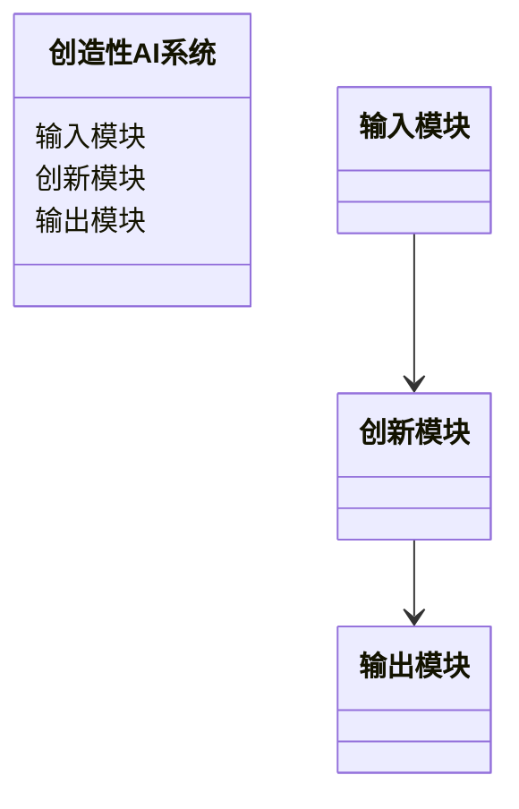
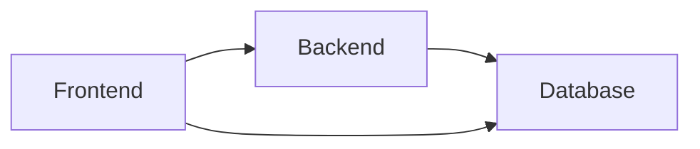

                 


# 创造性AI：激发AI Agent的创新思维

> **关键词**：创造性AI、AI Agent、创新思维、神经网络、生成模型、系统架构

> **摘要**：本文探讨了创造性AI的核心概念、创新思维的实现机制、系统架构设计以及实际应用案例。通过分析创造性思维的神经科学基础、AI创新算法的实现、系统架构设计和项目实战，本文为读者提供了从理论到实践的全面指导，帮助读者理解并激发AI Agent的创新思维能力。

---

## 第一部分：创造性AI的背景与概念

### 第1章：创造性AI的背景与问题背景

#### 1.1 创造性AI的定义与问题背景

创造性AI（Creative AI）是一种能够模拟和实现创造性思维的AI系统。与传统AI相比，创造性AI不仅能够处理结构化的问题，还能生成新颖且有价值的输出，如艺术作品、创新解决方案或创造性思维过程。

**问题背景**：
- **挑战1**：传统AI依赖于规则和数据，难以应对开放性、模糊性和创造性的问题。
- **挑战2**：AI系统需要具备灵活性和适应性，以应对不断变化的环境和需求。
- **挑战3**：如何在AI中实现创造性思维，使其能够生成独特的、具有价值的输出。

#### 1.2 创造性AI的核心概念与问题描述

创造性AI的核心概念包括：
- **创新性**：生成新颖的、独特的输出。
- **价值性**：输出具有实际价值或意义。
- **适应性**：能够根据环境和需求调整创新思维的过程。

**问题描述**：
- 如何设计AI系统，使其具备创造性思维的能力？
- 如何评估和量化创造性AI的创新性和价值性？

#### 1.3 创造性AI的创新机制与问题解决

创造性AI的创新机制包括：
- **分解与重组**：将问题分解为多个部分，重新组合以生成新的解决方案。
- **联想与跳跃**：通过联想和非线性思维，跳出现有的框架，生成新的想法。
- **迭代与优化**：通过多次尝试和优化，提升创新思维的质量。

**问题解决**：
- 如何设计算法，模拟创造性思维的过程？
- 如何在AI系统中实现创新思维的灵活性和适应性？

---

## 第二部分：创新思维的机制与原理

### 第2章：人类创新思维的机制与AI模拟

#### 2.1 人类创新思维的核心机制

人类创新思维的核心机制包括：
- **发散思维**：从多个角度思考问题，寻找不同的解决方案。
- **收敛思维**：将多个想法聚焦于一个最优解。
- **联想与类比**：通过联想和类比，将不同领域的知识结合，生成新的想法。

#### 2.2 AI创新思维的模拟与实现

AI创新思维的模拟与实现包括：
- **神经网络模型**：通过深度学习模型模拟人类的创新思维过程。
- **生成模型**：如GAN（生成对抗网络）和VAE（变分自编码器），用于生成新颖的输出。
- **强化学习**：通过奖励机制，强化创新思维中的有益行为。

#### 2.3 创造性思维的数学模型与公式

**数学模型**：
创造性思维的过程可以用以下公式表示：
$$
I = f_{\text{创新}}(P, K)
$$
其中，$I$ 表示创新输出，$P$ 表示问题，$K$ 表示知识库，$f_{\text{创新}}$ 表示创新函数。

**创新函数的实现**：
创新函数可以基于概率模型或神经网络模型。例如，基于概率的创新函数可以表示为：
$$
P(I) = \prod_{i=1}^{n} p(I_i | I_{i-1})
$$
其中，$p(I_i | I_{i-1})$ 表示在给定前一状态下的概率。

---

## 第三部分：创造性AI的核心算法与实现

### 第3章：创造性AI的核心算法与实现

#### 3.1 基于神经网络的创造性AI

**神经网络模型**：
创造性AI可以基于深度神经网络，如LSTM和Transformer，用于生成文本、图像或其他形式的创造性输出。

**LSTM模型**：
LSTM（长短期记忆网络）用于生成序列数据，如文本创作。其结构如下：

```mermaid
graph LR
    LSTM->InputGate
    LSTM->ForgetGate
    LSTM->OutputGate
```

#### 3.2 基于生成模型的创造性AI

**生成模型**：
生成模型，如GAN和VAE，用于生成新颖的输出。例如，GAN通过生成器和判别器的对抗训练，生成高质量的图像。

**GAN模型**：
生成器和判别器的对抗过程可以用以下公式表示：
$$
\min_{G} \max_{D} \mathbb{E}_{z \sim p_z}[\log D(G(z))] + \mathbb{E}_{x \sim p_x}[\log(1 - D(x))]
$$

---

## 第四部分：创造性AI的系统架构与设计

### 第4章：创造性AI系统的架构与设计

#### 4.1 系统功能设计

**功能模块**：
- 输入模块：接收问题或输入数据。
- 创新模块：生成创新的输出。
- 输出模块：输出创新结果。

**领域模型**：
领域模型可以用类图表示：



#### 4.2 系统架构设计

**系统架构**：
创造性AI系统的架构可以基于微服务架构，包括前端、后端和数据库。

**系统架构图**：



---

## 第五部分：创造性AI的项目实战

### 第5章：创造性AI的项目实战

#### 5.1 环境安装

**安装步骤**：
1. 安装Python和依赖库：
   ```bash
   pip install tensorflow keras matplotlib
   ```

2. 安装TensorFlow和Keras：
   ```bash
   pip install tensorflow-gpu keras
   ```

#### 5.2 源代码实现

**生成模型代码示例**：

```python
import tensorflow as tf
from tensorflow import keras

# 定义生成模型
def create_generator():
    model = keras.Sequential([
        keras.layers.Dense(256, activation='relu'),
        keras.layers.Dense(128, activation='relu'),
        keras.layers.Dense(784, activation='sigmoid')
    ])
    return model

# 定义判别器模型
def create_discriminator():
    model = keras.Sequential([
        keras.layers.Dense(256, activation='relu'),
        keras.layers.Dense(128, activation='relu'),
        keras.layers.Dense(1, activation='sigmoid')
    ])
    return model

# 编写GAN训练代码
generator = create_generator()
discriminator = create_discriminator()

# 定义损失函数
cross_entropy = keras.losses.BinaryCrossentropy()

# 编译模型
generator.compile(optimizer='adam', loss=cross_entropy)
discriminator.compile(optimizer='adam', loss=cross_entropy)
```

#### 5.3 案例分析与结果解读

**案例分析**：
以图像生成为例，训练GAN模型生成新的图像。

**结果解读**：
生成的图像质量逐渐提高，表明模型正在学习数据的分布。

---

## 第六部分：创造性AI的最佳实践与未来展望

### 第6章：创造性AI的最佳实践与未来展望

#### 6.1 小结

创造性AI通过模拟人类的创新思维，能够生成新颖的输出。其核心在于算法的设计和系统的架构。

#### 6.2 注意事项

- 数据质量对创新结果的影响。
- 模型的训练时间和计算资源需求。

#### 6.3 未来展望

未来的创造性AI将更加智能化和人性化，能够更好地理解和适应人类的需求，实现更高质量的创新。

---

## 结语

创造性AI是一个充满挑战和机遇的领域。通过理解创造性思维的机制、设计高效的算法和优化系统架构，我们可以开发出更具创新性的AI系统，为人类社会的发展做出更大的贡献。

---

**全文完**。

