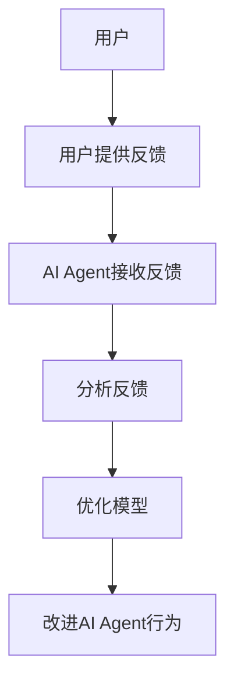

                 


# 利用用户反馈改进AI Agent的方法

## 关键词：
- 用户反馈
- AI Agent
- 监督学习
- 强化学习
- 机器学习

## 摘要：
本文详细探讨了如何利用用户反馈改进AI Agent的方法。首先介绍了用户反馈的重要性及其在AI Agent改进中的价值，然后从核心概念、算法原理、数学模型、系统设计、项目实战等多个维度进行了深入分析。通过具体案例和代码示例，展示了如何从用户反馈中学习并优化AI Agent的性能，帮助读者系统地掌握相关知识和技能。

---

## 第一部分：利用用户反馈改进AI Agent的背景与核心概念

### 第1章：用户反馈与AI Agent概述

#### 1.1 用户反馈的重要性
##### 1.1.1 什么是用户反馈
用户反馈是指用户在与AI Agent交互过程中提供的意见、评价或行为数据。这些反馈可以是显式的（如评分、点击、打分）或隐式的（如浏览时间、行为模式）。

##### 1.1.2 用户反馈在AI Agent中的作用
用户反馈是AI Agent改进的核心驱动力。通过分析用户反馈，可以识别AI Agent的不足之处，优化其行为策略，提高用户体验。

##### 1.1.3 用户反馈的分类与特点
用户反馈可以分为以下几类：
- **显式反馈**：直接表达用户意见，如评分、点赞、投诉。
- **隐式反馈**：通过用户行为间接反映偏好，如点击率、停留时间。
- **情感反馈**：用户对内容的情感倾向，如正面、负面或中性。
- **任务反馈**：用户对任务完成情况的评价。

---

#### 1.2 AI Agent的基本概念
##### 1.2.1 什么是AI Agent
AI Agent（人工智能代理）是指能够感知环境、自主决策并执行任务的智能实体。AI Agent可以是软件程序、机器人或其他智能系统。

##### 1.2.2 AI Agent的类型与应用场景
AI Agent的类型包括：
- **简单反射型AI Agent**：基于规则的反应式系统。
- **基于模型的AI Agent**：利用内部模型进行决策。
- **学习型AI Agent**：通过机器学习不断优化自身行为。

应用场景包括智能助手（如Siri）、推荐系统、自动驾驶等。

##### 1.2.3 AI Agent与传统软件的区别
AI Agent的核心区别在于其自主性、适应性和学习能力。传统软件依赖于固定的规则，而AI Agent能够通过反馈不断优化行为。

---

#### 1.3 用户反馈在AI Agent改进中的价值
##### 1.3.1 提高用户体验的核心驱动力
用户反馈是提高用户体验的核心工具。通过分析用户反馈，可以发现AI Agent的不足之处，并针对性地进行优化。

##### 1.3.2 用户反馈对AI Agent性能的提升作用
用户反馈可以帮助AI Agent更好地理解用户需求，优化决策策略，提高准确性和效率。

##### 1.3.3 用户反馈在AI Agent迭代中的具体应用
用户反馈可以用于：
- 优化自然语言处理模型。
- 改进推荐算法。
- 提升对话系统的交互能力。

---

### 第2章：用户反馈与AI Agent的核心概念

#### 2.1 用户反馈的特征与属性
##### 2.1.1 用户反馈的类型分析
用户反馈的类型包括显式反馈、隐式反馈、情感反馈和任务反馈。

##### 2.1.2 用户反馈的来源与渠道
用户反馈的来源可以是用户输入、日志数据、用户调查等。渠道包括网页、移动应用、对话界面等。

##### 2.1.3 用户反馈的质量评估标准
用户反馈的质量可以从以下几个方面评估：
- **准确性**：反馈是否真实反映了用户的意图。
- **及时性**：反馈是否能够及时被AI Agent处理。
- **可操作性**：反馈是否能够被系统理解和利用。

---

#### 2.2 AI Agent的核心功能与组件
##### 2.2.1 AI Agent的感知模块
感知模块负责接收用户反馈并将其转化为可处理的数据。

##### 2.2.2 AI Agent的决策模块
决策模块基于用户反馈和内部模型生成优化策略。

##### 2.2.3 AI Agent的执行模块
执行模块负责根据优化策略执行具体操作。

---

#### 2.3 用户反馈在AI Agent改进中的作用流程图


---

### 第3章：用户反馈的收集与处理方法

#### 3.1 用户反馈的收集策略
##### 3.1.1 主动收集方法
主动收集方法包括用户调查、问卷和访谈。

##### 3.1.2 被动收集方法
被动收集方法包括日志分析和行为跟踪。

##### 3.1.3 混合收集策略
混合收集策略结合了主动和被动方法，能够更全面地获取用户反馈。

---

#### 3.2 用户反馈的处理流程
##### 3.2.1 数据清洗与预处理
数据清洗包括去除噪声数据和异常值。

##### 3.2.2 反馈分类与标注
反馈分类包括情感分析和意图识别。

---

## 第二部分：用户反馈的算法与数学模型

### 第4章：基于用户反馈的监督学习算法

#### 4.1 监督学习的基本原理
监督学习是一种通过标记数据训练模型的方法。

#### 4.2 用户反馈在监督学习中的应用
用户反馈可以作为标签数据，用于训练分类器或回归模型。

#### 4.3 监督学习算法的数学模型
分类问题的数学模型可以表示为：
$$ P(y|x) = \frac{e^{\beta_0 + \beta_1x_1 + \dots + \beta_nx_n}}{1 + e^{\beta_0 + \beta_1x_1 + \dots + \beta_nx_n}} $$

---

## 第三部分：系统分析与架构设计

### 第5章：用户反馈驱动的AI Agent系统设计

#### 5.1 系统功能设计
系统功能包括用户反馈收集、分析、优化和执行。

#### 5.2 系统架构设计
系统架构包括数据层、算法层和应用层。

---

## 第四部分：项目实战

### 第6章：基于用户反馈改进AI Agent的实现

#### 6.1 环境安装
需要安装Python、TensorFlow和Keras。

#### 6.2 核心代码实现
以下是基于用户反馈的监督学习代码示例：

```python
import numpy as np
from sklearn.model_selection import train_test_split
from sklearn.linear_model import LogisticRegression

# 数据预处理
X = np.array([[特征1, 特征2, ...], [...]])
y = np.array([标签1, 标签2, ...])

# 划分训练集和测试集
X_train, X_test, y_train, y_test = train_test_split(X, y, test_size=0.2)

# 模型训练
model = LogisticRegression()
model.fit(X_train, y_train)

# 模型预测
y_pred = model.predict(X_test)

# 模型评估
print("准确率:", model.score(X_test, y_test))
```

---

### 第7章：总结与展望

#### 7.1 总结
本文详细介绍了如何利用用户反馈改进AI Agent的方法，包括核心概念、算法原理和系统设计。

#### 7.2 展望
未来的研究方向包括更高效的学习算法和更智能的反馈机制。

---

以上是文章的完整目录和内容概要，希望对您有所帮助！

