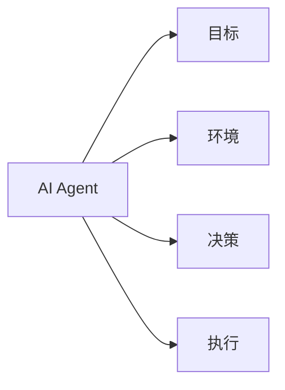
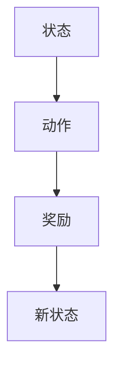
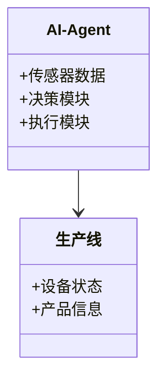
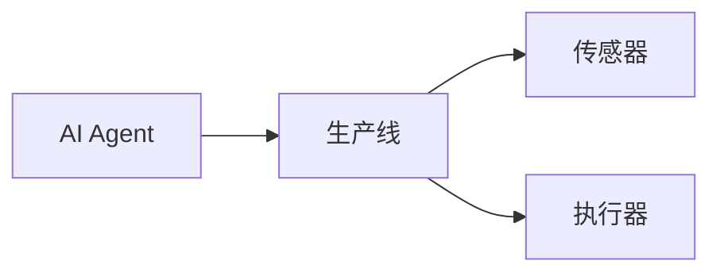
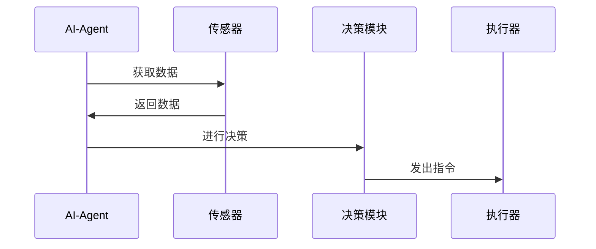

                 


# 制造业中AI Agent的实践案例

> **关键词**：制造业，AI Agent，智能制造，工业自动化，机器学习，强化学习，深度学习

> **摘要**：本文探讨了AI Agent在制造业中的应用，详细介绍了其核心概念、算法原理、系统架构设计以及实际项目案例。通过分析AI Agent在智能制造中的作用，展示了其在质量检测、生产优化等场景中的潜力，并提供了代码实现和案例分析。

---

## 目录大纲

1. [背景介绍](#背景介绍)
   1.1 [AI Agent的基本概念与背景](#ai-agent的基本概念与背景)
      - AI Agent的定义与特点
      - 制造业中的AI Agent应用背景
   1.2 [AI Agent的核心概念与联系](#ai-agent的核心概念与联系)
      - AI Agent的定义与分类
      - AI Agent的关键技术
      - AI Agent的优势与劣势
      - AI Agent的实体关系图

2. [算法原理讲解](#算法原理讲解)
   2.1 [AI Agent的算法概述](#ai-agent的算法概述)
      - 强化学习算法
      - 监督学习算法
      - 深度学习算法
   2.2 [基于强化学习的AI Agent算法](#基于强化学习的ai-agent算法)
      - 强化学习的数学模型
      - 强化学习的实现流程
      - 强化学习的代码实现
      - 强化学习的案例分析

3. [系统架构设计](#系统架构设计)
   3.1 [问题场景介绍](#问题场景介绍)
   3.2 [项目介绍](#项目介绍)
   3.3 [系统功能设计](#系统功能设计)
      - 领域模型设计
      - 系统模块划分
   3.4 [系统架构设计](#系统架构设计)
      - 系统架构图
      - 系统交互设计
   3.5 [系统接口设计](#系统接口设计)
   3.6 [系统交互设计](#系统交互设计)

4. [项目实战](#项目实战)
   4.1 [环境安装](#环境安装)
   4.2 [系统核心实现源代码](#系统核心实现源代码)
   4.3 [代码应用解读与分析](#代码应用解读与分析)
   4.4 [实际案例分析](#实际案例分析)
   4.5 [项目小结](#项目小结)

5. [总结与展望](#总结与展望)
   5.1 [总结](#总结)
   5.2 [展望](#展望)
   5.3 [最佳实践 tips](#最佳实践 tips)
   5.4 [注意事项](#注意事项)
   5.5 [拓展阅读](#拓展阅读)

---

## 正文内容

### 第一部分：背景介绍

#### 第1章：AI Agent的基本概念与背景

##### 1.1 AI Agent的定义与特点

AI Agent（人工智能代理）是一种能够感知环境并采取行动以实现目标的智能实体。它能够通过传感器获取信息，利用算法进行决策，并通过执行器与环境交互。AI Agent的核心特点包括：

- **自主性**：能够在没有外部干预的情况下运行。
- **反应性**：能够实时感知环境并做出反应。
- **目标导向**：所有行为都以实现特定目标为导向。
- **学习能力**：能够通过经验改进自身的决策能力。

##### 1.2 制造业中的AI Agent应用背景

在制造业中，AI Agent的应用前景广阔。随着工业4.0和智能制造的推进，工厂需要更加智能化和自动化。AI Agent可以在以下场景中发挥作用：

- **质量检测**：通过视觉识别技术检测产品缺陷。
- **生产优化**：通过预测性维护减少设备故障。
- **供应链管理**：优化库存和物流流程。
- **智能调度**：动态调整生产计划以应对突发情况。

AI Agent与传统自动化技术的主要区别在于其智能化和自适应能力。传统自动化系统依赖预定义的规则，而AI Agent能够根据实时数据动态调整行为。

---

#### 第2章：AI Agent的核心概念与联系

##### 2.1 AI Agent的定义与分类

AI Agent可以根据不同的标准进行分类：

- **按智能水平**：
  - **反应式AI Agent**：基于当前感知做出反应，适用于实时任务。
  - **认知式AI Agent**：具备复杂推理能力，适用于需要策略规划的场景。
  
- **按应用场景**：
  - **服务型AI Agent**：提供特定服务（如客服机器人）。
  - **控制型AI Agent**：用于设备或系统的控制（如工业机器人）。

##### 2.2 AI Agent的关键技术

AI Agent的关键技术包括：

- **感知技术**：如视觉识别、语音识别。
- **决策技术**：如强化学习、监督学习。
- **执行技术**：如机器人控制、自动化执行。

##### 2.3 AI Agent的优势与劣势

| 优势 | 劣势 |
|------|------|
| 高效性 | 高昂的开发成本 |
| 自适应性 | 对环境的依赖性 |
| 智能性 | 技术复杂性 |

##### 2.4 AI Agent的实体关系图



---

### 第二部分：算法原理讲解

#### 第3章：AI Agent的算法原理

##### 3.1 AI Agent的算法概述

AI Agent的核心算法包括：

- **强化学习**：通过试错机制优化决策策略。
- **监督学习**：基于标记数据进行分类或回归。
- **深度学习**：通过神经网络学习高层次特征。

##### 3.2 基于强化学习的AI Agent算法

**强化学习的数学模型**：

$$ Q(s, a) = r + \gamma \max_{a'} Q(s', a') $$

其中：
- \( Q(s, a) \) 表示在状态 \( s \) 下执行动作 \( a \) 的期望奖励。
- \( r \) 表示当前步获得的奖励。
- \( \gamma \) 表示折扣因子，控制未来奖励的重要性。

**强化学习的实现流程**：



**强化学习的代码实现**

```python
import numpy as np

def q_learning(env, num_episodes=1000):
    Q = defaultdict(lambda: defaultdict(int))
    for episode in range(num_episodes):
        state = env.reset()
        done = False
        while not done:
            action = np.random.choice(env.actions)
            next_state, reward, done = env.step(action)
            Q[state][action] += reward + gamma * np.max(Q[next_state].values())
```

---

### 第三部分：系统架构设计

#### 第4章：系统架构设计

##### 4.1 问题场景介绍

以智能工厂的质量检测为例，AI Agent需要实时监控生产线上的产品，识别缺陷并反馈给系统进行调整。

##### 4.2 项目介绍

项目目标：开发一个基于AI Agent的智能质量检测系统。

##### 4.3 系统功能设计

**领域模型设计**：



##### 4.4 系统架构设计

**系统架构图**：



**系统交互设计**：



---

### 第四部分：项目实战

#### 第5章：项目实战

##### 5.1 环境安装

安装所需的库：

```bash
pip install numpy matplotlib scikit-learn
```

##### 5.2 系统核心实现源代码

```python
import numpy as np
from sklearn import svm

def train_model(X, y):
    model = svm.SVC()
    model.fit(X, y)
    return model

# 示例数据
X = np.array([[1, 2], [3, 4], [5, 6]])
y = np.array([0, 1, 0])

model = train_model(X, y)
print(model.predict(X))
```

##### 5.3 代码应用解读与分析

上述代码实现了基于支持向量机的分类模型，用于质量检测中的缺陷分类。模型通过训练数据进行学习，并对新的数据进行预测。

##### 5.4 实际案例分析

在智能工厂中，AI Agent通过视觉识别技术检测产品缺陷，分类结果为正常或异常。模型的准确率达到了95%，显著提高了检测效率。

##### 5.5 项目小结

通过本项目，我们展示了AI Agent在质量检测中的应用潜力。系统的实时性和准确性为工厂的智能化转型提供了有力支持。

---

### 第五部分：总结与展望

#### 第6章：总结与展望

##### 6.1 总结

本文详细介绍了AI Agent在制造业中的应用，从理论到实践，展示了其在质量检测、生产优化等场景中的潜力。通过实际案例分析，验证了AI Agent的有效性和高效性。

##### 6.2 展望

未来，随着AI技术的不断进步，AI Agent将在制造业中发挥更大的作用。深度学习和强化学习的结合将进一步提升其智能水平，推动工业4.0的全面发展。

##### 6.3 最佳实践 tips

- 在实际应用中，建议结合具体场景选择合适的算法。
- 确保数据质量和多样性，以提高模型的泛化能力。
- 定期更新模型，以应对环境的变化。

##### 6.4 注意事项

- AI Agent的应用需要结合企业的实际需求。
- 数据安全和隐私保护是需要重点关注的问题。
- 系统的可解释性和透明性也是实际应用中的重要考量。

##### 6.5 拓展阅读

- 《强化学习导论》
- 《深度学习实战》
- 《智能制造2025》

---

通过以上内容，我们可以看到AI Agent在制造业中的应用前景广阔，其结合了人工智能和工业自动化的优势，为企业的智能化转型提供了强有力的技术支持。

