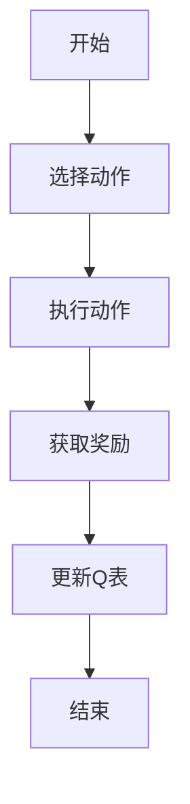
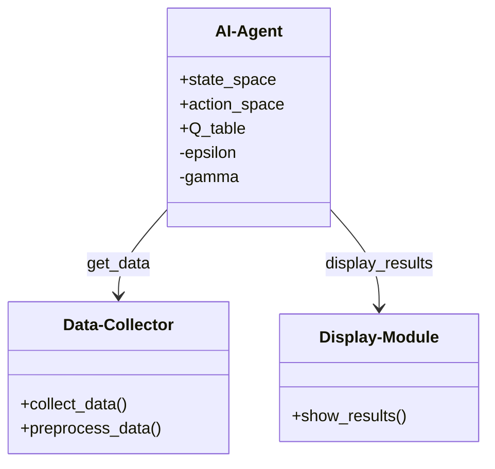

                 


# 医疗健康领域的AI Agent解决方案

## 关键词：AI Agent，医疗健康，人工智能，解决方案，算法原理，系统架构，项目实战

## 摘要：  
本文探讨了AI Agent在医疗健康领域的应用，详细介绍了AI Agent的基本概念、工作原理、核心算法、系统架构以及实际项目案例。通过理论与实践相结合的方式，分析了AI Agent如何在医疗健康领域中实现智能化服务，解决实际问题，并展望了其未来的发展前景。

---

## 第1章：AI Agent的基本概念与背景

### 1.1 AI Agent的定义与核心概念

#### 1.1.1 AI Agent的基本定义
AI Agent（人工智能代理）是一种能够感知环境、自主决策并执行任务的智能体。在医疗领域，AI Agent可以辅助医生诊断、优化治疗方案、管理患者数据等。

#### 1.1.2 医疗健康领域中的AI Agent
医疗AI Agent可以执行多种任务，如分析病历、推荐治疗方案、监控患者健康状况等。它的核心目标是提高医疗效率和准确性，同时降低医疗成本。

#### 1.1.3 AI Agent的优势与应用场景
- **优势**：提高诊断准确率，减少人为错误，提升医疗服务效率。
- **应用场景**：疾病诊断、药物推荐、治疗方案优化、患者管理等。

### 1.2 医疗健康领域的AI Agent解决方案背景

#### 1.2.1 医疗行业的痛点与挑战
医疗资源分配不均、医生工作压力大、医疗效率低下等问题亟待解决。AI技术的引入为医疗行业提供了新的解决方案。

#### 1.2.2 AI技术在医疗行业的应用现状
AI技术已在医疗影像分析、药物研发、疾病预测等领域取得显著进展，但AI Agent的应用仍处于发展阶段。

#### 1.2.3 AI Agent在医疗健康中的潜在价值
AI Agent能够通过整合多源数据，提供个性化的医疗建议，优化医疗流程，从而显著提升医疗服务的质量和效率。

---

## 第2章：AI Agent的核心原理与工作流程

### 2.1 AI Agent的核心原理

#### 2.1.1 感知层：数据采集与处理
AI Agent通过传感器、数据库等途径获取医疗数据，包括病历、检查结果、患者行为等。数据预处理包括清洗、特征提取和格式转换。

#### 2.1.2 决策层：算法与模型
AI Agent利用机器学习和深度学习算法进行决策。常用算法包括强化学习（如Q-learning）和监督学习（如随机森林、支持向量机）。

#### 2.1.3 执行层：结果输出与反馈
AI Agent将决策结果输出，并根据反馈进行优化和调整。

### 2.2 AI Agent在医疗健康中的工作流程

#### 2.2.1 病例分析与诊断建议
AI Agent通过分析病历和检查结果，提供诊断建议。例如，在疾病诊断中，AI Agent可以辅助医生识别疾病类型。

#### 2.2.2 药物推荐与治疗方案优化
AI Agent基于患者病情和药物信息，推荐最优治疗方案。例如，在药物推荐中，AI Agent可以考虑患者的过敏史和药物相互作用。

#### 2.2.3 医疗流程优化与患者管理
AI Agent可以优化医疗流程，如预约挂号、检查安排等。同时，它可以监控患者的健康状况，提供个性化的健康建议。

---

## 第3章：AI Agent的核心算法与实现

### 3.1 强化学习算法

#### 3.1.1 Q-learning算法
Q-learning是一种经典的强化学习算法，适用于离散动作空间的问题。其更新公式如下：

$$ Q(s, a) = (1 - \alpha) \cdot Q(s, a) + \alpha \cdot (r + \max Q(s', a')) $$

其中，$s$ 是当前状态，$a$ 是动作，$r$ 是奖励，$\alpha$ 是学习率，$s'$ 是下一个状态。

#### 3.1.2 算法流程图（Mermaid）


#### 3.1.3 Python代码实现
```python
import numpy as np

class AI-Agent:
    def __init__(self, state_space, action_space):
        self.Q = np.zeros((state_space, action_space))
    
    def choose_action(self, state, epsilon=0.1):
        if np.random.random() < epsilon:
            return np.random.randint(0, action_space)
        return np.argmax(self.Q[state])
    
    def update_Q(self, state, action, reward, next_state, gamma=0.99):
        self.Q[state, action] = self.Q[state, action] + 0.1 * (reward + gamma * np.max(self.Q[next_state]) - self.Q[state, action])
```

---

## 第4章：AI Agent系统的架构设计

### 4.1 系统模块划分

#### 4.1.1 数据采集模块
- 负责收集医疗数据，如病历、检查结果等。

#### 4.1.2 算法处理模块
- 实现AI Agent的核心算法，如Q-learning、随机森林等。

#### 4.1.3 结果展示模块
- 将AI Agent的决策结果以可视化形式呈现给用户。

### 4.2 系统架构图（Mermaid）



---

## 第5章：医疗AI Agent项目实战

### 5.1 项目环境安装

#### 5.1.1 Python环境配置
安装必要的库，如numpy、pandas、scikit-learn、tensorflow等。

#### 5.1.2 数据集准备
获取医疗相关数据集，如电子病历数据、疾病预测数据等。

### 5.2 核心代码实现

#### 5.2.1 数据预处理
```python
import pandas as pd

# 读取数据
data = pd.read_csv('medical_data.csv')

# 数据清洗
data.dropna()
data = pd.get_dummies(data)
```

#### 5.2.2 模型训练
```python
from sklearn.ensemble import RandomForestClassifier

# 训练模型
model = RandomForestClassifier()
model.fit(X_train, y_train)
```

### 5.3 实际案例分析

#### 5.3.1 智能问诊系统
AI Agent通过自然语言处理技术，理解患者的症状，推荐可能的疾病，并提供治疗建议。

#### 5.3.2 治疗方案优化
AI Agent根据患者的病情和药物信息，优化治疗方案，减少副作用和治疗成本。

---

## 第6章：总结与展望

### 6.1 总结
AI Agent在医疗健康领域的应用前景广阔，能够显著提升医疗服务的效率和质量。

### 6.2 未来展望
随着AI技术的不断发展，AI Agent将更加智能化和个性化，为医疗行业带来更多的创新和变革。

---

通过以上章节的详细讲解，我们全面探讨了AI Agent在医疗健康领域的解决方案，从理论到实践，为读者提供了系统化的知识和实际操作的经验。

