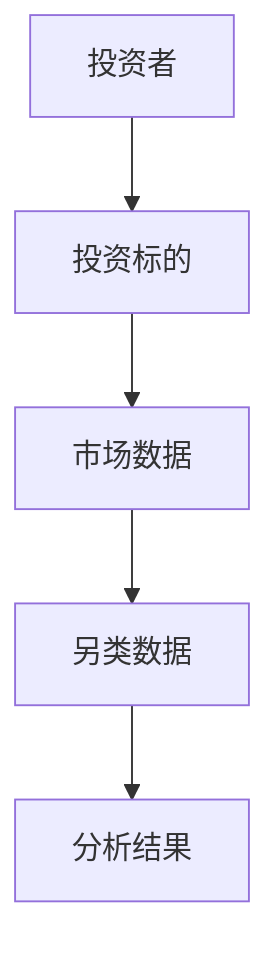
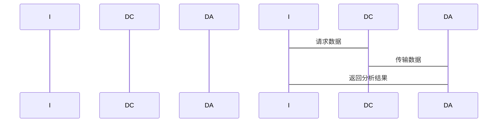

                 


# 另类数据在投资分析中的价值

## 关键词：
另类数据、投资分析、数据来源、算法原理、系统架构、项目实战、数据预处理

## 摘要：
本文深入探讨了另类数据在投资分析中的应用价值，详细介绍了另类数据的定义、来源及其在投资决策中的优势。通过分析预处理方法、算法原理和系统架构，本文展示了如何利用另类数据提升投资分析的准确性和洞察力。结合实际案例，本文还探讨了在项目实战中的具体应用，为读者提供了全面的指导和启示。

---

# 第一部分: 另类数据在投资分析中的价值概述

## 第1章: 另类数据的背景与定义

### 1.1 另类数据的背景
#### 1.1.1 传统金融数据的局限性
传统金融数据主要依赖历史价格、财务报表等结构性数据，但这些数据往往具有滞后性，无法捕捉市场情绪和新兴趋势。

#### 1.1.2 另类数据的兴起与原因
随着大数据技术的发展，投资者开始关注社交媒体、新闻、供应链等非传统数据源，以获取更全面的市场洞察。

#### 1.1.3 另类数据在投资分析中的意义
另类数据能够提供实时市场动态，帮助投资者发现潜在机会和风险，增强投资决策的前瞻性。

### 1.2 另类数据的定义与特点
#### 1.2.1 另类数据的定义
另类数据是指传统金融数据以外的非结构化或低结构化数据，包括文本、图像、音频等形式。

#### 1.2.2 另类数据的主要特点
- **实时性**：能够捕捉市场动态的即时变化。
- **多样性**：涵盖社交媒体、新闻、供应链等多种数据源。
- **复杂性**：非结构化数据需要复杂的处理和分析。

### 1.3 另类数据的主要来源
#### 1.3.1 社交媒体数据
社交媒体上的用户评论和情绪可以反映市场参与者的态度，帮助预测股价走势。

#### 1.3.2 卫生数据
包括药品销售数据、医院就诊记录等，可用于分析公共卫生事件对经济的影响。

#### 1.3.3 零售交易数据
零售销售数据能够反映消费者行为，帮助预测经济趋势。

### 1.4 另类数据在投资分析中的应用价值
#### 1.4.1 提供新的投资信号
通过分析社交媒体情绪，投资者可以提前发现市场趋势。

#### 1.4.2 增强投资决策的准确性
结合另类数据和传统数据，投资者能够获得更全面的市场分析。

#### 1.4.3 识别市场趋势与拐点
另类数据能够帮助投资者发现传统数据难以捕捉的市场变化。

### 1.5 本章小结

---

# 第二部分: 另类数据的核心概念与理论

## 第2章: 另类数据的核心概念与联系

### 2.1 另类数据的核心概念
#### 2.1.1 数据的可解释性
另类数据的分析结果需要能够被投资者理解和解释。

#### 2.1.2 数据的实时性
实时数据能够提供最新的市场动态，帮助投资者快速做出决策。

#### 2.1.3 数据的关联性
分析另类数据时，需要考虑其与传统数据的关联性，以增强分析的准确性。

### 2.2 另类数据的属性特征对比
| 数据类型 | 数据质量 | 数据处理难度 |
|----------|----------|--------------|
| 文本数据 | 低结构化 | 高           |
| 图像数据 | 非结构化 | 高           |
| 音频数据 | 非结构化 | 中           |

### 2.3 另类数据的ER实体关系图


---

# 第三部分: 另类数据的算法原理与数学模型

## 第3章: 另类数据的算法原理

### 3.1 另类数据的预处理方法
#### 3.1.1 数据清洗
去除噪声数据，保留有价值的信息。

#### 3.1.2 数据标准化
将数据转换为统一格式，便于后续分析。

#### 3.1.3 数据特征
提取关键特征，例如情感分析中的关键词。

### 3.2 另类数据的算法实现
#### 3.2.1 聚类算法
```python
from sklearn.cluster import KMeans
from sklearn.preprocessing import StandardScaler

# 示例数据预处理
data = StandardScaler().fit_transform(text_data)

# 聚类模型训练
kmeans = KMeans(n_clusters=3)
clusters = kmeans.fit_predict(data)
```

#### 3.2.2 回归算法
```python
from sklearn.linear_model import LinearRegression

# 示例回归模型
model = LinearRegression()
model.fit(features, labels)
```

#### 3.2.3 分类算法
```python
from sklearn.svm import SVC

# 示例分类模型
model = SVC()
model.fit(features, labels)
```

### 3.3 另类数据的数学模型
$$ y = \beta_0 + \beta_1x_1 + \beta_2x_2 + \epsilon $$

---

# 第四部分: 系统分析与架构设计方案

## 第4章: 系统分析与架构设计

### 4.1 系统架构设计


### 4.2 功能模块设计
- 数据采集模块：收集社交媒体、新闻等数据。
- 数据处理模块：清洗和转换数据。
- 数据分析模块：应用机器学习算法进行预测。
- 结果展示模块：将分析结果可视化。

### 4.3 系统接口设计
- 数据采集接口：接收外部数据源的数据。
- 分析接口：提供预测结果和可视化图表。

### 4.4 系统交互流程


---

# 第五部分: 项目实战与案例分析

## 第5章: 项目实战

### 5.1 项目背景
分析社交媒体数据，预测股票价格走势。

### 5.2 项目环境配置
```python
# 环境配置示例
import pandas as pd
import numpy as np
from sklearn.model_selection import train_test_split
```

### 5.3 数据获取与处理
```python
# 数据获取示例
data = pd.read_csv('social_media.csv')
data_processed = data.dropna().astype(float)
```

### 5.4 特征工程
```python
# 特征工程示例
from sklearn.feature_extraction.text import TfidfVectorizer

vectorizer = TfidfVectorizer()
features = vectorizer.fit_transform(text_data)
```

### 5.5 模型训练
```python
# 模型训练示例
from sklearn.svm import SVC

model = SVC()
model.fit(features, labels)
```

### 5.6 模型评估
```python
# 模型评估示例
from sklearn.metrics import accuracy_score

y_pred = model.predict(test_features)
print("准确率:", accuracy_score(y_true, y_pred))
```

### 5.7 结果分析
分析模型预测结果，评估其在投资决策中的价值。

### 5.8 项目小结

---

# 第六部分: 总结与展望

## 第6章: 总结与展望

### 6.1 总结
本文全面探讨了另类数据在投资分析中的价值，展示了其在提升投资决策中的潜力。

### 6.2 未来展望
随着技术的进步，另类数据的应用将更加广泛，投资者需要不断学习和适应新的数据源和技术。

### 6.3 最佳实践 tips
- **数据质量**：确保数据的准确性和完整性。
- **模型选择**：根据具体场景选择合适的算法。
- **持续学习**：关注技术发展，保持对新数据源的敏感性。

### 6.4 注意事项
- 数据隐私和合规性问题需要高度重视。
- 模型的可解释性是投资者信任的关键。

### 6.5 拓展阅读
推荐相关书籍和论文，帮助读者深入学习。

---

通过以上目录，我们可以看到，另类数据在投资分析中的价值是一个复杂但极具潜力的领域。投资者需要结合多种数据源和先进算法，才能在竞争激烈的市场中获得优势。

