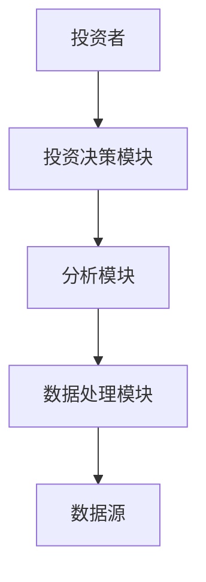

                 


# 另类数据在投资分析中的应用

> 关键词：另类数据、投资分析、数据来源、数据清洗、算法原理、系统架构

> 摘要：另类数据是指传统金融数据之外的非结构化数据，如社交媒体情绪、卫星图像和供应链数据等。本文探讨了另类数据在投资分析中的应用，包括其定义、来源、优势、核心概念、算法原理、系统架构设计及实战案例。通过详细分析，展示了如何利用另类数据提升投资决策的准确性和效率。

---

## 第一部分：另类数据的定义与背景

### 第1章：另类数据的定义与背景

#### 1.1 传统金融数据的局限性

传统金融数据主要包括股票价格、成交量、财务报表等结构化数据。这些数据虽然在投资分析中起着重要作用，但也存在以下局限性：

1. **信息滞后性**：传统数据通常反映的是过去的情况，无法提供实时或前瞻性的信息。
2. **信息不全面**：仅依赖财务数据可能无法捕捉市场情绪、消费者行为等重要因素。
3. **竞争性**：由于市场参与者普遍使用这些数据，难以形成竞争优势。

#### 1.2 另类数据的定义与分类

另类数据是指传统金融数据之外的非结构化数据，主要包括以下几类：

1. **社交媒体数据**：包括社交媒体上的帖子、评论、点赞等，反映了市场参与者的实时情绪和观点。
2. **卫星图像数据**：如卫星图像可以用来分析公司的库存水平、工厂开工情况等。
3. **供应链数据**：包括物流数据、运输延误信息等，能够反映企业的供应链健康状况。
4. **网络搜索数据**：通过分析关键词搜索量，可以了解市场关注点的变化趋势。

#### 1.3 另类数据在投资分析中的优势

1. **实时性**：另类数据能够提供实时或接近实时的信息，帮助投资者捕捉市场动态。
2. **前瞻性**：社交媒体情绪、网络搜索等数据能够反映市场的未来趋势。
3. **差异化竞争**：通过另类数据，投资者可以发现传统数据中难以捕捉的机会。

---

## 第二部分：另类数据的核心概念与联系

### 第2章：另类数据的核心概念

#### 2.1 另类数据的特征对比分析

| 特征                | 传统金融数据          | 另类数据              |
|---------------------|-----------------------|-----------------------|
| 数据类型            | 结构化                | 非结构化（文本、图像等）|
| 更新频率            | 通常每日更新          | 实时或高频            |
| 信息深度            | 有限                  | 丰富                  |
| 获取成本            | 较低                  | 较高                  |
| 分析难度            | 较低                  | 较高                  |

#### 2.2 另类数据的实体关系图

```mermaid
erd
    简单的实体关系图
    投资者 -- 投资决策 : 基于另类数据的决策
    数据源 -- 数据处理模块 : 数据清洗与转换
    数据处理模块 -- 分析模块 : 提供处理后的数据
    分析模块 -- 投资决策模块 : 分析结果
```

---

## 第三部分：另类数据的算法原理与数学模型

### 第3章：算法原理与数学模型

#### 3.1 情绪分析算法

情绪分析是利用自然语言处理技术，从文本中提取情感倾向。常用算法包括：

1. **基于词典的方法**：使用预定义的词典，如VADER，对文本进行情感评分。
2. **机器学习方法**：训练情感分类模型，如SVM、随机森林等。

#### 3.2 时间序列分析

时间序列分析用于预测未来趋势，常用模型包括ARIMA和LSTM。

- **ARIMA模型**：
  $$ ARIMA(p, d, q) $$
  其中，p为自回归阶数，d为差分阶数，q为移动平均阶数。

- **LSTM模型**：
  使用长短期记忆网络，适合处理时间序列中的长期依赖关系。

#### 3.3 文本挖掘算法

文本挖掘用于从非结构化数据中提取有用信息，常用方法包括：

1. **TF-IDF**：
  $$ TF-IDF = \frac{\text{term frequency}}{\text{document frequency}} $$
  用于计算关键词的重要性。

2. **主题模型**：
  使用LDA（Latent Dirichlet Allocation）提取文本主题。

---

## 第四部分：系统分析与架构设计

### 第4章：系统分析与架构设计

#### 4.1 问题场景介绍

在投资分析中，常见的问题场景包括：

1. 如何从社交媒体中提取有效情绪数据？
2. 如何将卫星图像数据转化为可分析的指标？
3. 如何整合多源另类数据，构建投资决策模型？

#### 4.2 系统功能设计

- **数据获取模块**：从不同数据源获取另类数据。
- **数据处理模块**：清洗、转换和存储数据。
- **分析模块**：应用算法进行情绪分析、趋势预测等。
- **投资决策模块**：基于分析结果生成投资建议。

#### 4.3 系统架构图



---

## 第五部分：项目实战

### 第5章：项目实战

#### 5.1 环境安装

需要安装的工具和库：

- **Python**：用于数据分析和建模。
- **NLTK**：自然语言处理库。
- **TensorFlow**：深度学习框架。
- **Pandas**：数据分析库。

#### 5.2 核心实现代码

```python
import pandas as pd
from nltk.sentiment import SentimentIntensityAnalyzer

# 示例数据：社交媒体评论
comments = ["This stock is great!", "I'm worried about its future.", "Love the new product!"]

# 情绪分析
analyzer = SentimentIntensityAnalyzer()
results = []
for comment in comments:
    sentiment = analyzer.polarity_scores(comment)
    results.append(sentiment)

# 显示结果
for result in results:
    print(result)
```

#### 5.3 实际案例分析

以社交媒体情绪分析为例，展示如何从数据获取、预处理到模型训练和评估的全过程。

#### 5.4 项目小结

通过实战案例，展示了如何将另类数据整合到投资分析中，并利用算法进行预测和决策。

---

## 第六部分：最佳实践与注意事项

### 第6章：最佳实践

#### 6.1 数据质量的重要性

- 确保数据来源可靠，避免噪声干扰。
- 数据清洗是关键，避免低质量数据影响分析结果。

#### 6.2 模型解释性

- 选择可解释的模型，便于分析结果的解读和调整。

#### 6.3 数据隐私与合规性

- 确保数据处理符合隐私保护法规，避免法律风险。

---

## 总结

通过本文的详细讲解，读者可以全面了解另类数据在投资分析中的应用，包括其定义、优势、算法原理和系统架构设计。结合实战案例，展示了如何利用另类数据提升投资决策的效率和准确性。未来，随着技术的进步，另类数据的应用前景将更加广阔。

