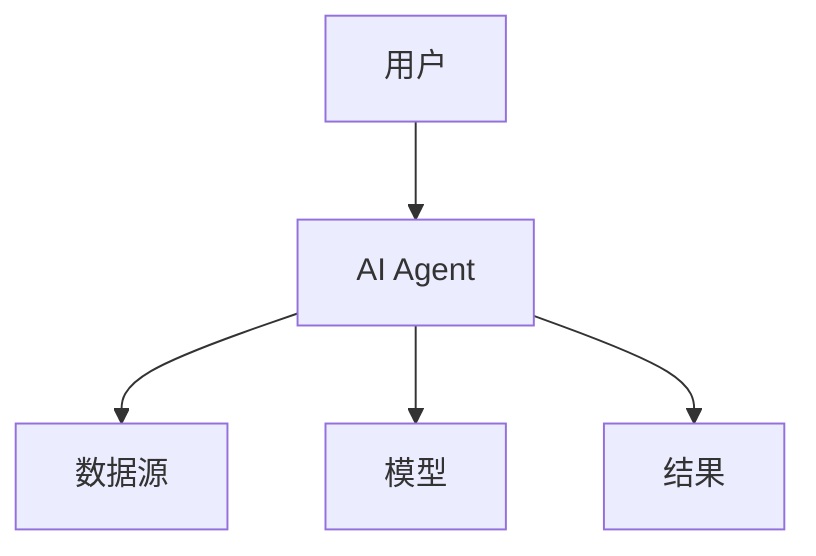
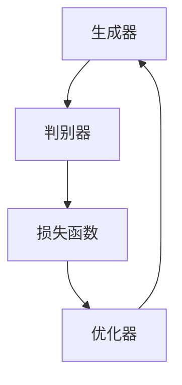
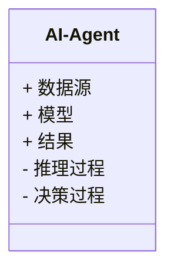
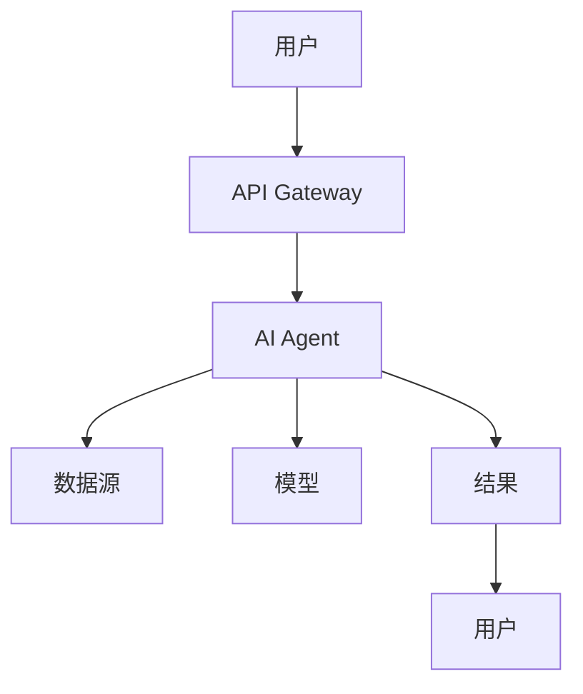
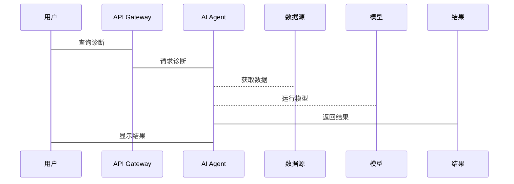

                 


# 可信AI：构建值得信赖的AI Agent系统

---

## 关键词
可信AI, AI Agent, 可解释性, 数据安全, 算法透明, 系统架构, 实践案例

---

## 摘要
可信AI是人工智能领域的重要研究方向，旨在构建值得信赖的AI系统。本文聚焦于可信AI Agent系统的构建，从背景、核心概念、算法原理到系统架构和项目实战，全面探讨如何确保AI Agent的可解释性、可控制性和可预测性。通过案例分析和实践总结，本文为读者提供构建可信AI Agent系统的实用指导。

---

# 第一部分: 可信AI的背景与核心概念

## 第1章: 可信AI的背景与挑战

### 1.1 人工智能的快速发展与问题背景

#### 1.1.1 人工智能的现状与趋势
- 人工智能技术的快速发展，如深度学习、自然语言处理和计算机视觉的广泛应用。
- 信任危机：AI系统的决策缺乏透明性和可解释性，导致用户不信任。

#### 1.1.2 可信AI的定义与内涵
- 可信AI：AI系统在决策过程中具备可解释性、可控制性和可预测性。
- 可信AI的核心目标：确保AI系统的输出符合用户预期，并能在出现问题时进行追溯和修正。

#### 1.1.3 可信AI的核心问题与挑战
- 技术挑战：如何实现AI系统的可解释性。
- 用户信任：如何通过技术手段赢得用户的信任。
- 社会影响：可信AI对社会伦理和法律的遵守。

### 1.2 AI Agent系统的定义与特点

#### 1.2.1 AI Agent的基本概念
- AI Agent：智能体，能够感知环境并自主决策。
- 特点：自主性、反应性、目标导向、社交能力。

#### 1.2.2 AI Agent的核心功能与应用场景
- 核心功能：感知、推理、决策、执行。
- 应用场景：自动驾驶、智能助手、医疗诊断、金融投资。

#### 1.2.3 可信AI Agent的必要性与重要性
- 必要性：AI Agent的决策直接影响用户安全和利益。
- 重要性：确保AI Agent的行为符合伦理和法律要求。

### 1.3 可信AI的边界与外延

#### 1.3.1 可信AI的边界条件
- 系统范围：仅限于AI Agent的决策过程。
- 时间范围：从开发到部署的全生命周期。

#### 1.3.2 可信AI的外延与相关领域
- 相关领域：数据安全、隐私保护、伦理AI。
- 外延：可信AI不仅关注技术，还涉及社会影响。

#### 1.3.3 可信AI与其他技术的关系
- 数据安全：可信AI的基础。
- 伦理AI：可信AI的延伸。

### 1.4 本章小结
本章介绍了可信AI的背景、AI Agent的定义与特点，以及可信AI的边界与外延。可信AI的核心目标是确保AI系统的可解释性和可控制性。

---

## 第2章: 可信AI的核心概念与联系

### 2.1 可信AI的核心概念

#### 2.1.1 可信AI的属性特征对比

| 属性 | 不可信AI | 可信AI |
|------|----------|--------|
| 可解释性 | 低       | 高     |
| 可控制性 | 低       | 高     |
| 可预测性 | 低       | 高     |
| 透明性 | 低       | 高     |

#### 2.1.2 可信AI的实体关系图


### 2.2 可信AI的算法原理

#### 2.2.1 对抗训练原理


#### 2.2.2 联邦学习的实现原理
- 分布式数据训练：数据不集中，通过加密通信进行模型更新。
- 数据隐私保护：通过隐私计算技术确保数据安全。

### 2.3 可信AI的数学模型

#### 2.3.1 对抗训练的数学公式
$$ \text{损失函数} = \log(D(x)) + \log(1 - D(G(z))) $$

---

# 第二部分: 可信AI的算法实现

## 第3章: 可信AI的算法实现

### 3.1 算法原理

#### 3.1.1 对抗训练原理
- 生成器和判别器的博弈过程：生成器生成样本，判别器判断真假。
- 平衡点：生成器和判别器达到纳什均衡。

#### 3.1.2 联邦学习的实现原理
- 分布式训练：多个参与方本地训练模型，然后聚合模型参数。
- 联邦聚合：使用联邦平均算法（FedAvg）更新全局模型。

#### 3.1.3 可解释性算法的实现
- 例如：使用SHAP值解释模型的决策过程。

### 3.2 算法实现代码示例

#### 3.2.1 对抗训练代码
```python
import torch
import torch.nn as nn

class Generator(nn.Moudle):
    def __init__(self):
        super(Generator, self).__init__()
        self.fc = nn.Linear(100, 128)
        self.leakyrelu = nn.LeakyReLU(0.2)
        self.fc2 = nn.Linear(128, 28*28)
        self.sigmoid = nn.Sigmoid()

    def forward(self, z):
        x = self.fc(z)
        x = self.leakyrelu(x)
        x = self.fc2(x)
        x = self.sigmoid(x)
        return x.view(-1, 28, 28)

class Discriminator(nn.Module):
    def __init__(self):
        super(Discriminator, self).__init__()
        self.fc = nn.Linear(28*28, 128)
        self.leakyrelu = nn.LeakyReLU(0.2)
        self.fc2 = nn.Linear(128, 1)
        self.sigmoid = nn.Sigmoid()

    def forward(self, x):
        x = x.view(-1, 28*28)
        x = self.fc(x)
        x = self.leakyrelu(x)
        x = self.fc2(x)
        x = self.sigmoid(x)
        return x
```

### 3.3 本章小结
本章详细讲解了可信AI的算法实现，包括对抗训练和联邦学习的原理和代码示例。

---

## 第4章: 可信AI的系统架构

### 4.1 系统分析与设计

#### 4.1.1 问题场景介绍
- 医疗诊断中的AI Agent：帮助医生进行疾病诊断和治疗建议。

#### 4.1.2 系统功能设计


#### 4.1.3 系统架构设计


#### 4.1.4 系统接口设计
- 输入接口：用户查询。
- 输出接口：诊断结果和解释。

#### 4.1.5 系统交互设计


### 4.2 本章小结
本章设计了一个AI Agent系统的架构，包括功能设计、架构图和接口设计。

---

## 第5章: 可信AI的项目实战

### 5.1 环境安装与配置

#### 5.1.1 安装依赖
```bash
pip install torch==1.9.0
pip install numpy==1.21.2
pip install matplotlib==3.5.1
```

#### 5.1.2 环境配置
- 安装PyTorch、NumPy和Matplotlib。

### 5.2 系统核心实现

#### 5.2.1 核心代码实现
```python
import torch
import torch.nn as nn

class AIAgent:
    def __init__(self, model):
        self.model = model

    def infer(self, input_data):
        with torch.no_grad():
            output = self.model(input_data)
            return output
```

#### 5.2.2 代码功能解读
- 初始化AI Agent，加载模型。
- infer方法：输入数据，返回推理结果。

### 5.3 项目实战案例

#### 5.3.1 案例分析
- 医疗诊断中的AI Agent：基于患者的症状和病史，诊断疾病并提供建议。

#### 5.3.2 详细讲解
- 数据预处理：清洗和标注医疗数据。
- 模型训练：使用对抗训练优化模型。
- 结果展示：可视化推理过程和结果。

### 5.4 本章小结
本章通过一个医疗诊断的案例，展示了如何构建可信的AI Agent系统。

---

## 第6章: 可信AI的最佳实践

### 6.1 最佳实践 tips

#### 6.1.1 技术层面
- 确保模型的可解释性。
- 使用隐私保护技术。

#### 6.1.2 用户层面
- 提供清晰的解释和反馈。
- 保障用户隐私。

### 6.2 本章小结
总结了构建可信AI Agent系统的关键点和注意事项。

### 6.3 拓展阅读
- 《可解释的人工智能：模型、方法和应用》
- 《可信AI的伦理与法律框架》

---

## 第三部分: 总结与展望

### 结语
可信AI是人工智能技术发展的重要方向，本文从背景、核心概念、算法原理到系统架构和项目实战，全面探讨了如何构建可信的AI Agent系统。通过实践案例和最佳实践，为读者提供了实用的指导。

---

## 附录
### 附录A: 术语解释
- AI Agent：智能体。
- 可信AI：具备可解释性和可控制性的AI系统。

### 附录B: 参考文献
1. Goodfellow, I., et al. "Generative Adversarial Nets." arXiv, 2014.
2. Papernot, N., et al. "Differentially Private Federated Learning: A Survey, Experiments, and New Directions." arXiv, 2021.

---

## 结束语
通过本文的详细讲解，读者可以全面了解可信AI Agent系统的构建方法，并能够实际操作相关技术。未来，可信AI将继续推动人工智能技术的发展，为社会创造更多价值。

