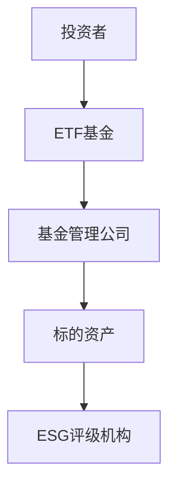

                 

# 可持续发展主题ETF的构建与表现分析

> 关键词：可持续发展，ETF，ESG投资，绿色金融，投资组合优化

> 摘要：本文系统地探讨了可持续发展主题ETF的构建方法与表现分析，从核心概念到实际操作，结合数学模型和案例分析，深入剖析了可持续发展主题ETF的投资逻辑和潜在价值。

---

# 第一部分: 可持续发展主题ETF的背景与概念

## 第1章: 可持续发展主题ETF概述

### 1.1 ETF的基本概念与特点
ETF（Exchange-Traded Fund）是一种在交易所上市交易的基金，兼具开放式基金和封闭式基金的特点。以下是ETF的几个关键属性：

- **透明性**：ETF的净值和成分股实时公开，投资者可以随时了解基金的持仓情况。
- **流动性**：ETF在交易所上市，投资者可以在交易时间内随时买卖，交易灵活。
- **分散化**：通过投资多个标的资产，降低单一资产的风险。
- **成本低**：ETF通常采用被动投资策略，管理费用较低。

### 1.2 可持续发展投资的核心概念
可持续发展投资强调在追求财务回报的同时，考虑环境、社会和公司治理（ESG）因素。以下是相关的核心概念：

- **ESG投资**：基于环境、社会和公司治理三个维度对上市公司进行评分，选择表现优异的企业进行投资。
- **绿色金融**：通过金融工具支持绿色产业，推动可持续发展。
- **可持续发展目标**：联合国提出的17个可持续发展目标（SDGs），为全球可持续发展提供了框架。

### 1.3 可持续发展主题ETF的定义与分类
可持续发展主题ETF是指以可持续发展相关产业或公司为投资标的ETF。根据投资策略的不同，可持续发展主题ETF可以分为以下几类：

- **行业主题ETF**：专注于某一个可持续发展行业，如新能源、环保等。
- **策略型ETF**：采用特定的ESG筛选策略，如排除高碳排放企业。
- **指数型ETF**：跟踪某个可持续发展主题指数，如ESG指数。

### 1.4 可持续发展主题ETF的市场背景与发展趋势
随着全球对可持续发展的关注增加，可持续发展主题ETF的市场规模迅速增长。以下是其发展的主要驱动力：

- **政策支持**：各国政府出台相关政策，鼓励绿色投资。
- **投资者需求**：越来越多的投资者关注ESG因素，推动了相关ETF的发展。
- **技术创新**：大数据和人工智能技术的应用，提升了ETF的投资效率和精准度。

---

## 第2章: 可持续发展主题ETF的核心概念与联系

### 2.1 可持续发展主题ETF的核心要素
构建可持续发展主题ETF需要考虑以下几个核心要素：

- **投资标的**：选择与可持续发展目标相关的行业或公司。
- **ESG评分体系**：采用ESG评分标准对标的资产进行筛选。
- **指数设计**：构建反映可持续发展主题的指数。

### 2.2 可持续发展主题ETF的实体关系图
以下是一个简化的实体关系图，展示了可持续发展主题ETF的主要参与方及其关系：

### 2.3 可持续发展主题ETF的系统架构
以下是可持续发展主题ETF的系统架构图：

---

## 第3章: 可持续发展主题ETF的构建方法

### 3.1 数据收集与处理
构建可持续发展主题ETF的第一步是数据的收集与处理。以下是关键步骤：

- **数据来源**：从金融数据库、ESG评级机构等获取相关数据。
- **数据清洗**：去除缺失值和异常值，确保数据质量。
- **特征提取**：提取与可持续发展相关的特征，如碳排放、社会责任评分等。

### 3.2 可持续发展主题指数的设计
指数设计是构建ETF的核心环节。以下是设计步骤：

- **指数构建**：基于ESG评分和行业权重，构建反映可持续发展主题的指数。
- **权重分配**：根据标的资产的市场资本化和ESG评分，分配权重。
- **指数表现评估**：定期评估指数的表现，并进行必要的调整。

### 3.3 投资组合优化与风险控制
投资组合优化是确保ETF收益最大化和风险最小化的关键。以下是优化方法：

- **目标函数**：最大化收益，同时最小化风险。
  $$ \text{目标函数: } \min \sum_{i=1}^n w_i \times \text{风险指标} $$
- **约束条件**：满足资产配置比例和流动性要求。

---

## 第4章: 可持续发展主题ETF的表现分析

### 4.1 ETF表现的评估指标
评估ETF表现需要考虑以下几个指标：

- **收益率**：衡量基金的盈利能力。
- **波动率**：反映基金的风险水平。
- **夏普比率**：衡量风险调整后的超额收益。

### 4.2 可持续发展主题ETF的业绩分析
通过历史数据分析，可持续发展主题ETF在不同市场环境下的表现如下：

- **牛市**：与市场整体表现持平。
- **熊市**：由于ESG因素的筛选，表现相对稳健。

### 4.3 可持续发展主题ETF的风险分析
风险分析是评估ETF表现的重要环节。以下是主要风险类型：

- **系统性风险**：市场整体波动带来的风险。
- **非系统性风险**：特定行业或公司的风险。

---

## 第5章: 可持续发展主题ETF的未来展望

### 5.1 技术创新对ETF的影响
大数据和人工智能技术的应用将推动ETF投资的精准化和智能化。

### 5.2 可持续发展主题ETF的扩展应用
未来，可持续发展主题ETF将扩展到更多领域，如绿色科技、可持续农业等。

### 5.3 投资者行为的变化
随着ESG投资理念的普及，更多投资者将选择可持续发展主题ETF。

---

## 结语

可持续发展主题ETF不仅是投资工具，更是推动社会可持续发展的重要力量。通过科学的构建方法和表现分析，投资者可以在追求收益的同时，为社会和环境做出贡献。未来，随着技术的进步和理念的普及，可持续发展主题ETF将发挥更大的作用。

--- 

以上是文章的详细目录和内容框架，每章内容将根据实际需求进一步扩展和详细阐述。

