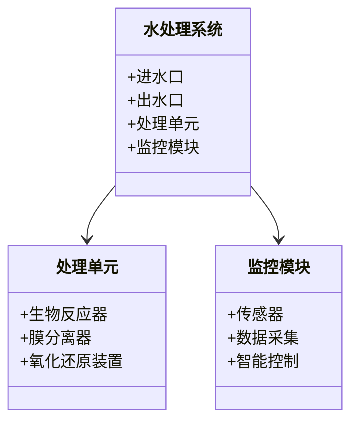
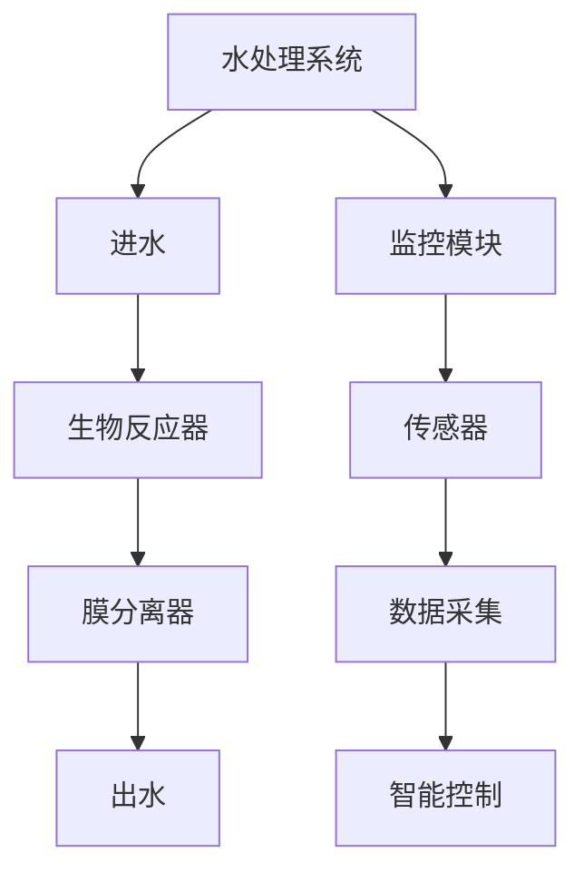
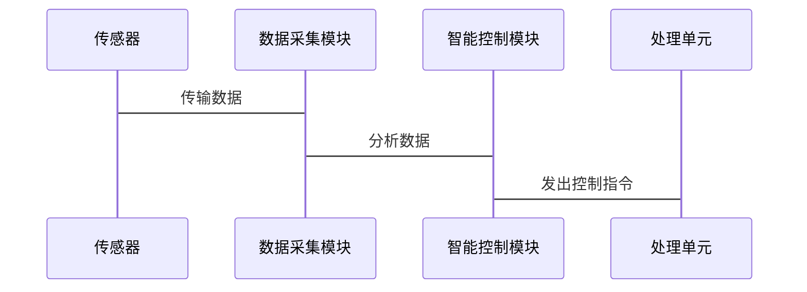

                 

# 可持续水处理技术的全球市场需求分析

## 关键词：
可持续水处理、全球市场需求、技术分析、创新、区域差异

## 摘要：
本文从全球水资源现状出发，分析了可持续水处理技术的核心概念、市场需求驱动因素、主要技术及其创新方向。通过对全球不同区域市场的特点与需求进行深入探讨，揭示了可持续水处理技术在全球范围内的发展潜力与挑战。结合实际案例，本文提出了可持续水处理技术的解决方案，并对未来技术发展趋势进行了展望。

---

## 第1章：全球水资源现状与可持续水处理的重要性

### 1.1 全球水资源现状

#### 1.1.1 水资源短缺的全球性问题
全球水资源分布极不均匀，许多地区面临水资源短缺的问题。根据联合国数据，到2025年，全球将有超过一半的人口生活在缺水地区。水资源短缺不仅影响经济发展，还威胁到社会稳定和人类健康。

#### 1.1.2 水资源污染的现状与趋势
工业废水、农业污染和生活污水的排放导致水资源质量下降。据统计，全球80%的废水未经处理就排放到环境中，严重威胁生态系统和人类健康。

#### 1.1.3 可持续水处理的定义与目标
可持续水处理是指在满足当前用水需求的同时，保护水资源和生态环境的技术与方法。其目标是实现水资源的高效利用、污染物的有效去除以及能源的节约。

---

### 1.2 可持续水处理技术的核心概念

#### 1.2.1 可持续水处理的基本原理
可持续水处理技术强调技术创新与环境友好，通过物理、化学和生物方法结合，实现水的净化和再利用。

#### 1.2.2 可持续水处理与传统水处理的对比
传统水处理技术注重污染物去除，而可持续水处理技术更关注整个处理过程的资源节约和环境友好。例如，传统技术可能需要大量能源，而可持续技术则通过优化设计减少能源消耗。

#### 1.2.3 可持续水处理的环境与经济效益
可持续水处理技术不仅可以减少污染物排放，还可以通过水资源的循环利用降低企业的运营成本，同时减少对环境的负担。

---

## 第2章：全球水处理市场的背景与驱动因素

### 2.1 全球水处理市场的现状

#### 2.1.1 全球水处理市场的规模与增长
根据市场研究机构的数据，全球水处理市场规模预计将以年均5%的速度增长，到2030年市场规模将超过1万亿美元。

#### 2.1.2 不同区域市场的特点与发展趋势
- **北美市场**：技术创新能力强，市场需求主要由工业和市政水处理驱动。
- **欧洲市场**：严格的环保法规推动市场需求，企业社会责任感强烈。
- **亚洲市场**：新兴经济体快速发展，水处理需求快速增长，尤其是中国和印度市场。

#### 2.1.3 市场的主要参与者与竞争格局
主要参与者包括通用电气、陶氏化学、西门子等跨国公司，以及一些区域性企业。

---

### 2.2 可持续水处理技术的市场需求驱动因素

#### 2.2.1 环境政策与法规的推动
各国政府通过制定严格的环保法规，推动企业采用可持续水处理技术。例如，欧盟的REACH法规和美国的Clean Water Act。

#### 2.2.2 企业社会责任与可持续发展的需求
越来越多的企业将可持续发展作为核心战略，通过采用可持续水处理技术提升品牌形象。

#### 2.2.3 技术进步与成本下降的推动
随着技术的进步，可持续水处理技术的成本逐渐降低，使得更多企业能够负担得起。

---

## 第3章：可持续水处理技术的核心技术

### 3.1 常见的可持续水处理技术

#### 3.1.1 生物处理技术
利用微生物分解有机污染物，适用于处理工业废水和市政污水。

#### 3.1.2 物理化学处理技术
通过过滤、沉淀、吸附等物理方法和氧化还原等化学方法去除污染物。

#### 3.1.3 膜分离技术
利用膜的过滤作用分离水中的杂质，广泛应用于海水淡化和纯水制备。

#### 3.1.4 智能化水处理技术
结合人工智能和物联网技术，实现水处理过程的智能化监控和优化。

---

### 3.2 各种技术的优缺点对比

#### 3.2.1 生物处理技术的适用场景与局限性
- **优点**：处理成本低，适合处理有机污染物。
- **缺点**：处理效率较低，需要较长的处理时间。

#### 3.2.2 物理化学处理技术的成本与效率分析
- **优点**：处理效率高，适用于多种污染物。
- **缺点**：成本较高，可能对环境造成二次污染。

#### 3.2.3 膜分离技术的高效性与维护成本
- **优点**：分离效率高，操作简单。
- **缺点**：膜组件更换成本高，需要定期维护。

#### 3.2.4 智能化水处理技术的创新与应用前景
- **优点**：通过智能化监控优化处理过程，提高效率。
- **缺点**：技术复杂，初期投入较高。

---

## 第4章：技术创新与未来发展方向

### 4.1 可持续水处理技术的创新方向

#### 4.1.1 新型材料在水处理中的应用
- 开发高效、低成本的吸附材料，如纳米材料和复合材料。

#### 4.1.2 智能化与数字化技术的融合
- 利用人工智能和大数据分析优化水处理过程。

#### 4.1.3 微生物工程在水处理中的创新应用
- 通过基因工程技术开发更高效的微生物。

---

### 4.2 可持续水处理技术的未来发展趋势

#### 4.2.1 技术集成化与模块化的发展
- 将多种技术集成到一个系统中，提高处理效率。

#### 4.2.2 绿色能源驱动的水处理技术
- 利用太阳能、风能等可再生能源驱动水处理过程。

#### 4.2.3 全球化与区域化市场的技术适配
- 根据不同区域的水质和需求，开发定制化技术。

---

## 第5章：全球可持续水处理市场的区域分析

### 5.1 主要区域市场的特点与需求

#### 5.1.1 北美市场
- 技术创新能力强，市场需求主要由工业和市政水处理驱动。

#### 5.1.2 欧洲市场
- 严格的环保法规推动市场需求，企业社会责任感强烈。

#### 5.1.3 亚洲市场
- 新兴经济体快速发展，水处理需求快速增长，尤其是中国和印度市场。

---

### 5.2 区域市场需求的驱动因素

#### 5.2.1 经济发展水平与水处理需求的关系
- 经济发达地区对水处理技术的需求较高，而经济欠发达地区则更关注基础的水资源供给。

#### 5.2.2 政策法规对市场需求的推动
- 各国政府通过制定严格的环保法规，推动企业采用可持续水处理技术。

---

## 第6章：项目实战与解决方案

### 6.1 环境问题背景介绍
假设某工业园区面临严重的水污染问题，需要采用可持续水处理技术进行治理。

---

### 6.2 系统功能设计

#### 6.2.1 领域模型（Mermaid 类图）

---

### 6.3 系统架构设计

#### 6.3.1 系统架构图（Mermaid 架构图）

---

### 6.4 系统接口设计

#### 6.4.1 系统接口
- **进水接口**：连接进水管道。
- **出水接口**：连接出水管道。
- **监控接口**：连接传感器和数据采集模块。

---

### 6.5 系统交互设计

#### 6.5.1 系统交互图（Mermaid 序列图）

---

### 6.6 项目实战总结

#### 6.6.1 项目小结
通过实际案例分析，我们可以看到可持续水处理技术在实际应用中的巨大潜力。通过技术创新和系统优化，可以显著提高水处理效率并降低成本。

#### 6.6.2 最佳实践 Tips
- 在选择水处理技术时，需要综合考虑技术的效率、成本和环境影响。
- 定期维护和更新系统，以确保其长期稳定运行。

---

## 第7章：未来展望与结论

### 7.1 未来技术发展趋势
随着技术的进步，可持续水处理技术将更加高效、智能和环保。未来的发展方向包括绿色能源驱动、智能化监控和新型材料的应用。

### 7.2 全球市场需求的未来预测
随着全球水资源问题的加剧，可持续水处理技术的市场需求将稳步增长。特别是在新兴经济体，市场潜力巨大。

### 7.3 结论
可持续水处理技术是解决全球水资源问题的关键。通过技术创新和政策支持，我们可以实现水资源的高效利用和环境保护。

---

## 参考文献
（此处列出相关的学术论文、行业报告和技术文档）

---

**本文通过系统分析可持续水处理技术的全球市场需求，结合技术分析和实际案例，为相关领域的研究和实践提供了有价值的参考。**

