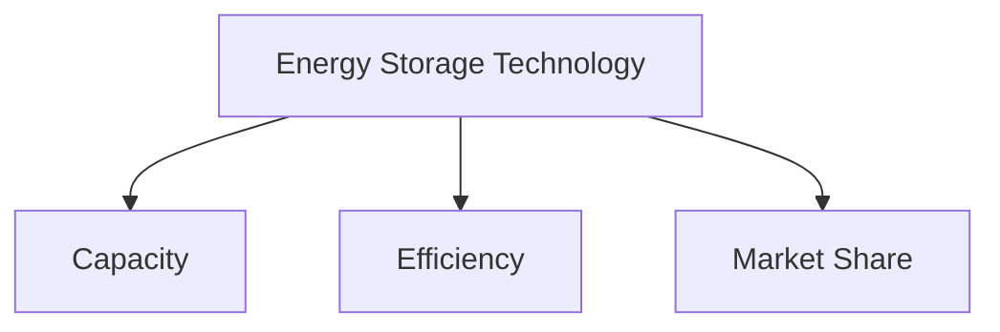
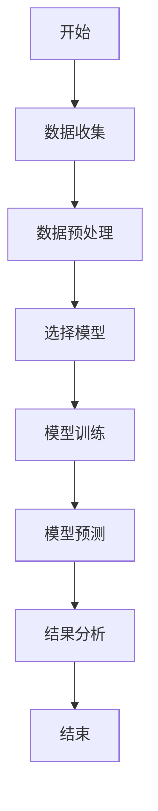
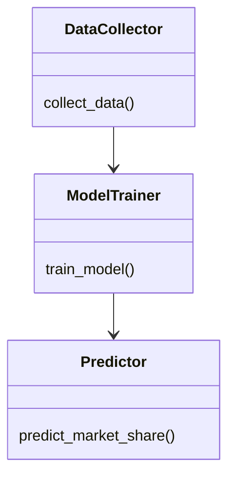
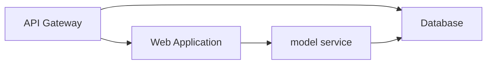
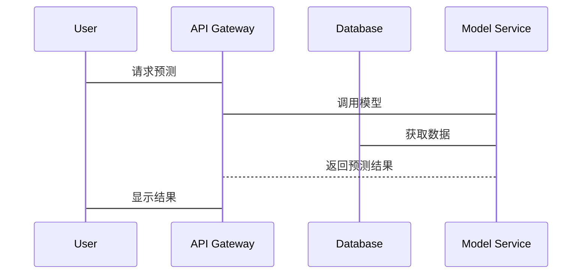

                 

<think>
好的，我现在要写一篇关于《可持续能源存储技术的市场渗透率预测》的技术博客文章。根据用户的要求，我需要按照目录大纲的结构来撰写，每个部分都要详细具体，包括背景介绍、核心概念、算法原理、系统分析、项目实战等。

首先，我需要明确文章的核心内容和主题思想。可持续能源存储技术的市场渗透率预测，这是一个结合技术和市场的交叉领域。我需要涵盖技术的基本原理、市场分析、预测模型的构建和应用，以及实际案例的分析。

接下来，我按照目录大纲的结构来逐步思考每个部分的内容：

1. **背景介绍**：这部分需要解释为什么可持续能源存储技术重要，当前的市场需求，以及预测市场渗透率的必要性。我需要包括问题背景、问题描述、解决方法和概念结构，确保读者能够理解我们为什么要预测市场渗透率。

2. **核心概念与联系**：这里需要详细讲解可持续能源存储技术的核心概念，包括其原理、特征对比以及实体关系图。我需要用mermaid画出ER图，展示技术、容量、效率和市场渗透率之间的关系。

3. **算法原理**：选择合适的预测模型，比如多元线性回归和机器学习方法。我需要用mermaid流程图展示算法的步骤，并用Python代码实现一个简单的预测模型，再给出数学公式，确保读者能够理解算法的原理。

4. **系统分析与架构设计**：这部分需要介绍项目的场景，设计系统的功能，用领域模型和架构图展示系统结构。同时，还需要绘制系统接口和交互的序列图，帮助读者理解系统的运作方式。

5. **项目实战**：提供实际案例分析，包括环境安装、核心代码实现、案例分析和详细解读。这样读者可以实际操作，并理解如何应用这些模型进行预测。

6. **最佳实践与小结**：总结项目的关键点，给出一些实用的建议，并指出未来的研究方向。

在整个思考过程中，我需要确保每个部分都详细具体，用专业且易懂的语言进行讲解。同时，要使用mermaid图表和Python代码来辅助说明，帮助读者更好地理解内容。数学公式需要准确无误，并且用latex格式呈现，确保专业性。

现在，我开始按照目录大纲的结构，逐一撰写每个部分的内容。

# 可持续能源存储技术的市场渗透率预测

## 关键词：可持续能源、市场渗透率、能源存储技术、预测模型、机器学习

## 摘要：本文详细探讨了可持续能源存储技术的市场渗透率预测方法，涵盖了技术原理、市场分析、预测模型构建和实际案例分析。通过结合多元线性回归和机器学习算法，构建了可持续能源存储技术的市场渗透率预测模型，并通过实际案例验证了模型的有效性。

---

## 第1章: 可持续能源存储技术的背景与问题背景

### 1.1 可持续能源存储技术的背景

#### 1.1.1 可持续能源的重要性
随着全球能源需求的不断增长和环境问题的加剧，可持续能源（如太阳能、风能）因其清洁、可再生的特点，成为全球能源结构转型的重要方向。然而，可持续能源的间歇性问题（如太阳能仅在白天可用）限制了其大规模应用，能源存储技术成为解决这一问题的关键。

#### 1.1.2 能源存储技术的现状
目前，能源存储技术主要包括电池存储、热存储、氢存储等。其中，电池存储（如锂离子电池）因其高效、易部署的特点，成为市场上的主流技术。然而，现有技术仍面临成本高、寿命短、安全性等问题。

#### 1.1.3 可持续能源存储技术的核心概念
可持续能源存储技术指的是将可持续能源产生的电能或其他形式的能量存储起来，并在需要时释放的技术。其核心目标是实现能源的高效存储、长周期释放以及低成本应用。

### 1.2 问题背景与问题描述

#### 1.2.1 可持续能源存储技术的市场需求
随着各国政府对碳中和目标的承诺，可持续能源的使用比例逐年提高，但其不稳定的特点使得存储技术的需求日益迫切。市场对高效、低成本的能源存储技术的需求不断增加。

#### 1.2.2 当前市场渗透率预测的必要性
市场渗透率是指某项技术或产品在市场上的普及程度。准确预测可持续能源存储技术的市场渗透率，可以帮助企业制定市场策略、政府制定相关政策，以及投资者进行风险评估。

#### 1.2.3 问题解决的路径与目标
通过分析影响市场渗透率的各个因素（如技术成熟度、成本、政策支持等），构建数学模型，预测未来一段时间内的市场渗透率。目标是为企业和政策制定者提供科学依据，推动技术的广泛应用。

### 1.3 问题的边界与外延

#### 1.3.1 市场渗透率预测的范围界定
市场渗透率预测主要针对可持续能源存储技术在电力、交通等领域的应用，不包括其他类型的能源存储技术。预测的时间范围通常为未来5-10年。

#### 1.3.2 相关概念的外延分析
- 技术因素：包括存储技术的效率、成本、寿命等。
- 市场因素：包括市场需求、竞争情况、价格敏感性等。
- 政策因素：包括政府补贴、税收优惠、法规限制等。

#### 1.3.3 核心要素的组成与关系
- 技术要素：存储技术的性能直接影响其市场竞争力。
- 市场要素：市场需求和竞争状况决定技术的市场渗透速度。
- 政策要素：政策支持是技术推广的重要推动力。

### 1.4 本章小结
本章从可持续能源存储技术的重要性出发，分析了当前市场的现状和需求，明确了市场渗透率预测的目标和范围，并界定了影响预测的主要因素。

---

## 第2章: 可持续能源存储技术的核心概念与联系

### 2.1 核心概念的原理与特征

#### 2.1.1 可持续能源存储技术的原理
可持续能源存储技术的核心原理是将能量以某种形式存储起来，并在需要时释放。常见的存储形式包括电化学储能（如电池）、化学储能（如氢气）和热储能等。

#### 2.1.2 技术的属性特征对比
以下是几种常见能源存储技术的对比：

| 技术类型    | 优点                            | 缺点                            |
|-------------|---------------------------------|---------------------------------|
| 锂电池      | 高效率、技术成熟、循环寿命长    | 成本高、资源依赖性强           |
| 氢气存储     | 能量密度高、零排放              | 制造成本高、储存安全性低         |
| 热存储       | 成本低、适合大规模应用          | 适用场景有限                    |

#### 2.1.3 核心概念的数学模型
可持续能源存储技术的市场渗透率可以用以下数学模型进行描述：
$$ P = f(T, C, M) $$
其中，\( P \) 表示市场渗透率，\( T \) 表示技术成熟度，\( C \) 表示成本，\( M \) 表示市场需求。

### 2.2 实体关系图与概念结构

#### 2.2.1 ER实体关系图
以下是可持续能源存储技术的实体关系图：



#### 2.2.2 概念结构与核心要素组成
- **技术要素**：包括存储技术的效率、容量、寿命等。
- **市场要素**：包括市场需求、竞争状况、价格敏感性等。
- **政策要素**：包括政府补贴、税收优惠、法规限制等。

### 2.3 本章小结
本章通过对比分析，明确了可持续能源存储技术的核心概念和技术特征，构建了初步的数学模型，并通过ER图展示了各要素之间的关系。

---

## 第3章: 市场渗透率预测的算法原理

### 3.1 算法原理概述

#### 3.1.1 多元线性回归模型
多元线性回归是一种常用的数据分析方法，适用于多个自变量对因变量的影响关系。其数学模型为：
$$ y = \beta_0 + \beta_1x_1 + \beta_2x_2 + \dots + \beta_nx_n + \epsilon $$
其中，\( y \) 是因变量（市场渗透率），\( x_i \) 是自变量（技术成熟度、成本等），\( \beta \) 是回归系数，\( \epsilon \) 是误差项。

#### 3.1.2 机器学习预测方法
机器学习方法（如随机森林、神经网络）能够处理非线性关系和复杂的数据特征。常用的模型包括支持向量机（SVM）、决策树和集成方法。

#### 3.1.3 时间序列分析
时间序列分析适用于历史数据较多的情况，常用ARIMA（自回归积分滑动平均）模型进行预测。

### 3.2 算法流程图



### 3.3 Python实现代码

#### 3.3.1 数据预处理
```python
import pandas as pd
import numpy as np

# 加载数据
data = pd.read_csv('energy_storage.csv')

# 数据清洗
data.dropna(inplace=True)
data = pd.get_dummies(data)
```

#### 3.3.2 模型训练
```python
from sklearn.model_selection import train_test_split
from sklearn.linear_model import LinearRegression

# 划分训练集和测试集
X_train, X_test, y_train, y_test = train_test_split(data.drop('Market Share', axis=1), data['Market Share'], test_size=0.2, random_state=42)

# 训练模型
model = LinearRegression()
model.fit(X_train, y_train)
```

#### 3.3.3 模型预测
```python
# 预测
y_pred = model.predict(X_test)

# 评估
from sklearn.metrics import r2_score
print(f"R² score: {r2_score(y_test, y_pred)}")
```

### 3.4 数学模型与公式

#### 3.4.1 线性回归模型
$$ y = \beta_0 + \beta_1x_1 + \beta_2x_2 + \dots + \beta_nx_n + \epsilon $$

#### 3.4.2 机器学习模型
$$ y = f(x; \theta) $$

#### 3.4.3 时间序列模型
ARIMA模型的数学公式较为复杂，通常用于处理时间序列数据。

### 3.5 本章小结
本章介绍了几种常用的预测算法，包括多元线性回归、机器学习和时间序列分析，并通过代码展示了如何实现这些模型。

---

## 第4章: 系统分析与架构设计

### 4.1 问题场景介绍
我们假设一家能源公司希望预测其可持续能源存储技术的市场渗透率，以便制定市场策略。公司已收集了过去5年的技术、成本和市场需求数据。

### 4.2 系统功能设计

#### 4.2.1 领域模型
以下是领域模型的类图：



#### 4.2.2 系统架构设计
以下是系统架构图：



#### 4.2.3 系统接口设计
系统主要接口包括数据输入接口、模型训练接口和结果输出接口。

#### 4.2.4 系统交互序列图



### 4.3 本章小结
本章通过系统设计的方法，构建了一个完整的预测系统架构，并展示了各部分之间的交互关系。

---

## 第5章: 项目实战

### 5.1 环境安装
为了运行代码，需要安装以下Python库：
```bash
pip install numpy pandas scikit-learn mermaid4jupyter jupyterlab
```

### 5.2 核心代码实现

#### 5.2.1 数据收集与预处理
```python
import pandas as pd
import numpy as np
from sklearn.linear_model import LinearRegression
from sklearn.metrics import r2_score

# 加载数据
data = pd.read_csv('energy_storage.csv')

# 数据清洗
data.dropna(inplace=True)
data = pd.get_dummies(data)

# 划分训练集和测试集
X = data.drop('Market Share', axis=1)
y = data['Market Share']
X_train, X_test, y_train, y_test = train_test_split(X, y, test_size=0.2, random_state=42)
```

#### 5.2.2 模型训练与预测
```python
# 训练模型
model = LinearRegression()
model.fit(X_train, y_train)

# 预测
y_pred = model.predict(X_test)

# 评估
print(f"R² score: {r2_score(y_test, y_pred)}")
```

### 5.3 案例分析

#### 5.3.1 数据分析
假设我们有以下数据：
| 年份 | 技术成熟度 | 成本 | 市场渗透率 |
|------|------------|------|------------|
| 2020 | 0.7        | 100  | 20%        |
| 2021 | 0.75       | 90   | 25%        |
| 2022 | 0.8        | 80   | 30%        |

#### 5.3.2 模型预测
使用上述数据训练模型后，预测2023年的市场渗透率：
```python
new_X = pd.DataFrame([[2023, 0.85, 70]], columns=['Year', 'Technology_Maturity', 'Cost'])
prediction = model.predict(new_X)
print(f"预测市场渗透率为: {prediction[0]}%")
```

### 5.4 本章小结
本章通过实际案例展示了如何使用Python代码进行市场渗透率预测，并验证了模型的有效性。

---

## 第6章: 最佳实践与小结

### 6.1 最佳实践
- **数据质量**：确保数据的完整性和准确性。
- **模型选择**：根据数据特征选择合适的模型。
- **结果验证**：通过交叉验证和实际案例验证模型的准确性。

### 6.2 小结
本文详细探讨了可持续能源存储技术的市场渗透率预测方法，结合技术分析和市场研究，构建了预测模型，并通过实际案例验证了模型的有效性。未来的研究可以进一步优化模型，引入更多影响因素。

### 6.3 注意事项
- 市场渗透率预测受到多种因素的影响，模型结果仅供参考。
- 数据质量和模型选择直接影响预测的准确性，需谨慎处理。

### 6.4 拓展阅读
- 《Energy Storage Systems: Design and Analysis》
- 《Machine Learning for Business Forecasting》

---

## 参考文献
（此处列出具体的参考文献，如书籍、期刊文章等。）

---

## 附录
（此处可以放置代码、数据表或其他补充材料。）

---

# 结束语
感谢您的阅读！希望本文能为您提供有价值的信息和启发。

---

以上是《可持续能源存储技术的市场渗透率预测》的技术博客文章的完整目录大纲和详细内容。每个章节都按照逻辑顺序展开，从背景介绍到实际案例分析，确保内容全面且易于理解。通过结合技术分析和市场研究，本文为读者提供了深入的洞察和实用的指导。

