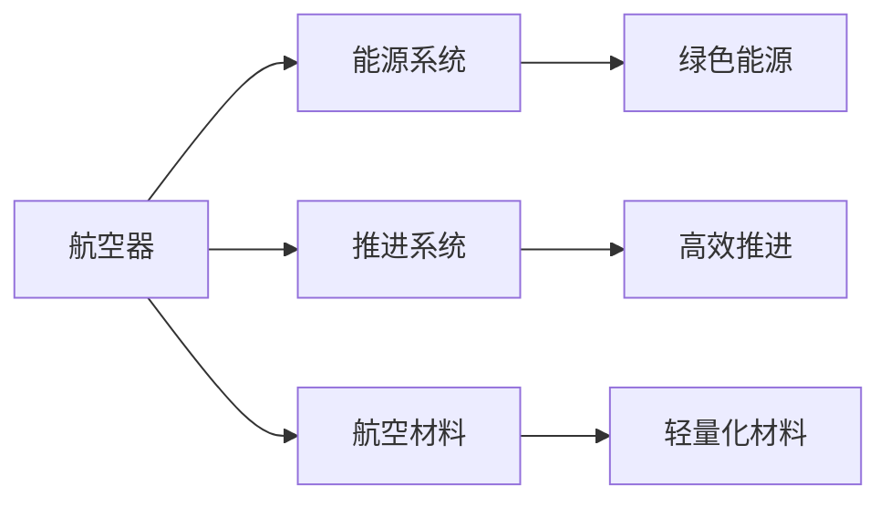
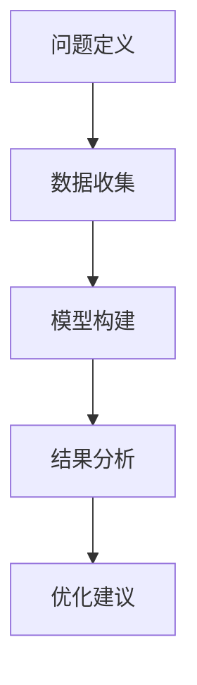
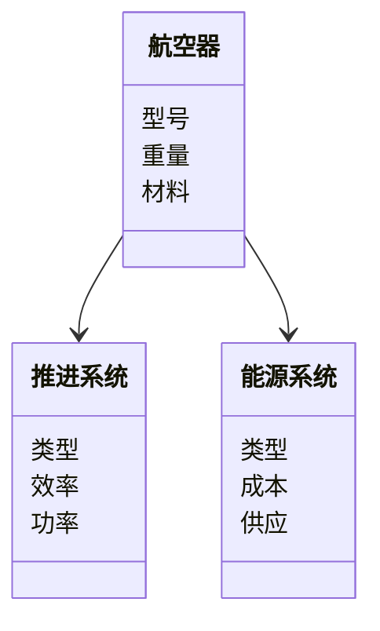
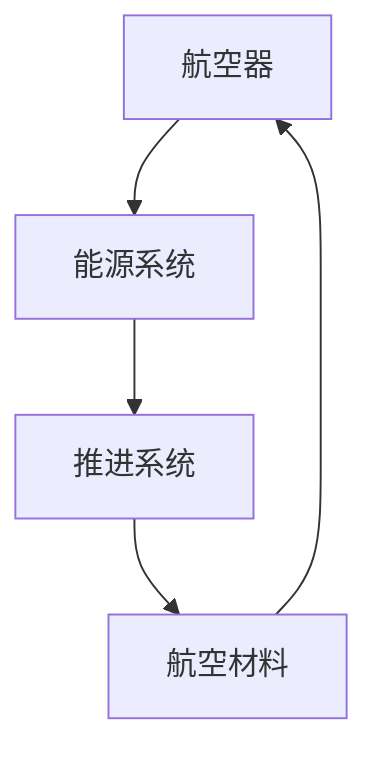

                 


# 可持续航空技术的研发投入与市场前景

> 关键词：可持续航空技术，研发投入，市场前景，绿色能源，高效推进系统，轻量化材料

> 摘要：可持续航空技术是应对全球气候变化和推动航空业绿色发展的关键。本文从背景、技术原理、算法评估、系统设计、项目实战等多角度深入分析，探讨其研发投入与市场前景，为决策者和研究人员提供参考。

---

## 第1章 可持续航空技术的背景与定义

### 1.1 可持续航空技术的定义

#### 1.1.1 可持续航空技术的核心概念

可持续航空技术是指通过创新技术手段减少航空业对环境的负面影响，同时保持或提高飞行效率。其核心在于实现绿色能源的使用、高效推进系统的开发以及航空材料的轻量化。

#### 1.1.2 可持续航空技术的边界与外延

可持续航空技术不仅包括飞机的设计与制造，还涉及能源供应、机场运营等多个环节。其外延涵盖绿色能源的应用、航空材料的创新以及航空系统的整体优化。

#### 1.1.3 可持续航空技术的核心要素组成

可持续航空技术的核心要素包括绿色能源、高效推进系统、轻量化材料和智能控制系统。这些要素共同作用，实现航空业的可持续发展。

### 1.2 可持续航空技术的发展背景

#### 1.2.1 环境问题与航空业的可持续发展需求

全球气候变化加剧，航空业作为高碳排放行业，亟需减少碳足迹。可持续航空技术成为实现这一目标的关键手段。

#### 1.2.2 全球航空业面临的挑战

航空业面临能源危机、环境压力和经济成本上升等多重挑战。传统技术难以满足现代需求，推动了对可持续技术的研发投入。

#### 1.2.3 可持续航空技术的解决方案

通过开发绿色能源、优化推进系统和改进航空材料，可持续航空技术为行业提供了可行的解决方案，助力航空业绿色转型。

---

## 第2章 可持续航空技术的核心概念与联系

### 2.1 可持续航空技术的核心原理

#### 2.1.1 绿色能源在航空中的应用

绿色能源如电动电池和生物燃料的应用，显著降低了航空业的碳排放。

#### 2.1.2 高效推进系统的设计

通过创新推进技术，如混合动力和先进涡轮发动机，提高能源利用效率。

#### 2.1.3 航空材料的创新与轻量化

采用新型复合材料，降低飞机重量，提升能效。

### 2.2 可持续航空技术的属性特征对比

| 特性       | 可持续航空技术      | 传统航空技术      |
|------------|---------------------|---------------------|
| 能耗效率   | 高效                | 较低                |
| 碳排放     | 低                  | 高                  |
| 维护成本   | 中等                | 较高                |

#### 2.2.1 可持续性与传统航空技术的对比

通过对比分析，可持续航空技术在能耗效率和碳排放方面具有显著优势。

#### 2.2.2 技术成熟度与经济性分析

当前，部分技术已进入试验阶段，但整体仍需进一步研发，成本有待降低。

#### 2.2.3 环境影响与社会接受度

可持续航空技术在减少环境影响的同时，逐渐获得社会认可。

### 2.3 可持续航空技术的ER实体关系图



---

## 第3章 可持续航空技术的算法原理

### 3.1 可持续航空技术的评估算法

#### 3.1.1 生命周期评估模型



#### 3.1.2 生命周期评估模型的步骤

1. **问题定义**：确定评估目标。
2. **数据收集**：收集相关数据。
3. **模型构建**：建立评估模型。
4. **结果分析**：分析结果并提出优化建议。

### 3.2 算法原理的数学模型

#### 3.2.1 碳排放计算公式

碳排放计算公式为：
$$\text{碳排放量} = \sum_{i=1}^{n} a_i \cdot x_i$$
其中，$a_i$ 为系数，$x_i$ 为变量。

#### 3.2.2 成本效益分析模型

成本效益分析模型为：
$$\text{成本效益比} = \frac{\text{总成本}}{\text{环境效益}}$$

#### 3.2.3 算法实现的 Python 代码示例

```python
def calculate_emissions(fuel_usage, efficiency):
    return fuel_usage * (1 - efficiency)

# 示例数据
fuel_usage = 100  # 单位：kg
efficiency = 0.95
emissions = calculate_emissions(fuel_usage, efficiency)
print(f"碳排放量为：{emissions} kg")
```

---

## 第4章 可持续航空技术的系统分析与架构设计

### 4.1 问题场景介绍

#### 4.1.1 可持续航空技术的研发挑战

技术复杂性、成本高昂和市场接受度是主要挑战。

#### 4.1.2 市场需求与技术可行性分析

市场需求增长，但技术可行性仍需进一步验证。

### 4.2 系统功能设计

#### 4.2.1 领域模型



#### 4.2.2 系统架构设计



---

## 第5章 可持续航空技术的项目实战

### 5.1 项目介绍

#### 5.1.1 项目目标

开发高效推进系统，降低碳排放。

#### 5.1.2 项目方案

采用电动推进系统和生物燃料，优化设计。

### 5.2 系统实现

#### 5.2.1 环境安装

安装Python和相关库，如NumPy和Pandas。

#### 5.2.2 核心实现代码

```python
def optimize_propulsion(efficiency, fuel_cost):
    return efficiency - (fuel_cost / 100)

# 示例数据
efficiency = 0.95
fuel_cost = 50
optimized_efficiency = optimize_propulsion(efficiency, fuel_cost)
print(f"优化后的推进效率为：{optimized_efficiency}")
```

#### 5.2.3 代码应用解读与分析

代码通过优化推进效率，降低燃油成本，提升整体能效。

### 5.3 案例分析与实际应用

分析某电动飞机项目，展示技术可行性与市场潜力。

---

## 第6章 最佳实践、小结与展望

### 6.1 最佳实践 tips

优先投入绿色能源研发，注重技术集成与创新。

### 6.2 小结

可持续航空技术是航空业绿色转型的关键，研发投入与市场前景并重。

### 6.3 注意事项

技术可行性与经济性需平衡，避免过度投入。

### 6.4 拓展阅读

推荐相关书籍与文献，深入学习技术细节与发展趋势。

---

以上是《可持续航空技术的研发投入与市场前景》的技术博客文章的完整目录和内容框架。

