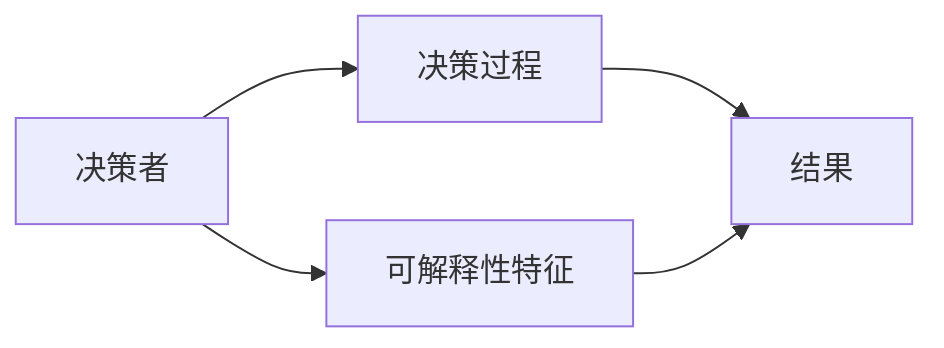
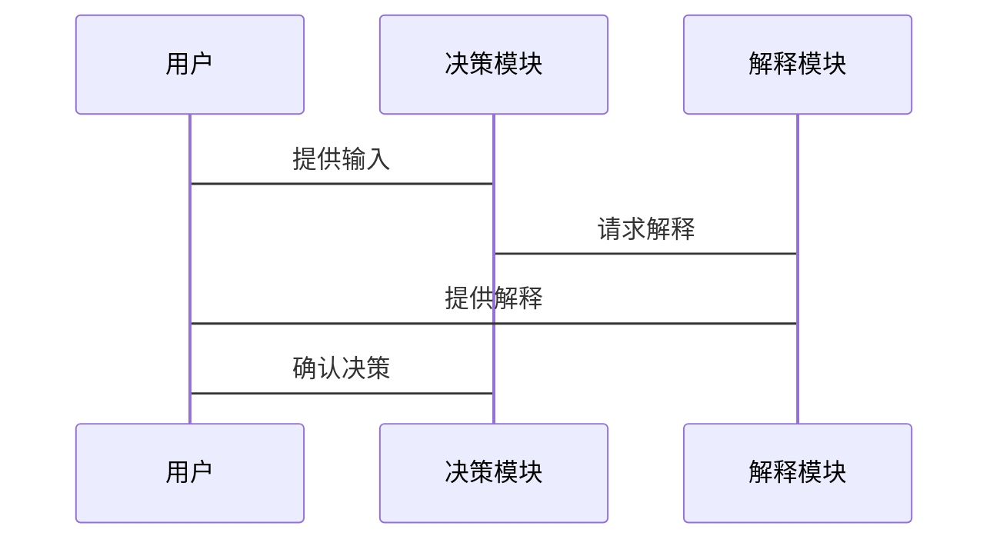

                 


# 可解释性设计：理解AI Agent的决策过程

## 关键词：
可解释性设计, AI Agent, 决策过程, 人工智能, 模型透明性

## 摘要：
在人工智能迅速发展的今天，AI Agent的应用越来越广泛，但其决策过程的不透明性却成为信任和可靠性的重要障碍。可解释性设计是解决这一问题的关键，它通过对AI Agent决策过程的分析和展示，提高决策的透明度和可理解性。本文将从可解释性设计的基本概念入手，探讨其在AI Agent中的应用，详细分析相关算法原理、数学模型，并通过实际案例展示如何在系统中实现可解释性设计，最后总结最佳实践和未来发展方向。

---

# 第1章：可解释性设计的核心概念

## 1.1 问题背景与描述

### 1.1.1 人工智能决策的不透明性
AI Agent通过复杂的算法和数据进行决策，但这些决策过程往往缺乏透明性，导致用户难以理解甚至质疑决策的合理性。

### 1.1.2 可解释性设计的重要性
可解释性设计是解决AI决策不透明性的重要手段，它能够帮助用户理解AI的决策逻辑，增强对系统的信任。

### 1.1.3 问题解决的必要性
在医疗、金融、司法等领域，AI决策的可解释性是确保决策合法性和可靠性的必要条件。

## 1.2 AI Agent的基本概念

### 1.2.1 AI Agent的定义与类型
AI Agent是一种能够感知环境并采取行动以实现目标的智能体，可以分为基于规则、基于逻辑和基于学习的AI Agent。

### 1.2.2 AI Agent的应用场景
AI Agent广泛应用于自动驾驶、智能助手、机器人等领域，其决策过程需要高度透明以确保安全性和可靠性。

### 1.2.3 AI Agent与人类决策的对比
AI Agent的决策速度快、精度高，但缺乏可解释性；人类决策则更具可解释性，但速度和精度较低。

---

# 第2章：可解释性设计的核心概念与联系

## 2.1 可解释性设计的原理

### 2.1.1 可解释性模型的特征
可解释性模型需要具备透明性、可理解性和一致性，以便用户能够理解AI的决策过程。

### 2.1.2 可解释性维度对比
| 模型类型 | 透明性 | 可理解性 | 一致性 |
|----------|--------|----------|--------|
| 基于规则 | 高     | 高       | 高     |
| 基于逻辑 | 中     | 中       | 中     |
| 基于学习 | 低     | 低       | 低     |

### 2.1.3 可解释性与模型复杂性的关系
模型的复杂性越高，其可解释性通常越低。

## 2.2 实体关系图



---

# 第3章：可解释性设计的算法原理

## 3.1 基于规则的可解释性算法

### 3.1.1 算法原理
基于规则的算法通过预定义的条件判断进行决策，具有高度的可解释性。

### 3.1.2 Mermaid流程图


### 3.1.3 Python代码示例

```python
def rule_based_decision(input):
    if input > 0.5:
        return "决策1"
    else:
        return "决策2"
```

---

## 3.2 基于逻辑的可解释性算法

### 3.2.1 算法原理
基于逻辑的算法通过逻辑推理进行决策，具有较高的可解释性。

### 3.2.2 Mermaid流程图


---

## 3.3 基于学习的可解释性算法

### 3.3.1 算法原理
基于学习的算法通过训练模型进行决策，但通常缺乏可解释性。

### 3.3.2 Mermaid流程图


---

# 第4章：可解释性设计的数学模型与公式

## 4.1 基于规则的可解释性模型

### 4.1.1 条件判断的逻辑
$$1+1=2$$

---

## 4.2 基于逻辑的可解释性模型

### 4.2.1 逻辑推理的公式
$$P \rightarrow Q$$

---

## 4.3 基于学习的可解释性模型

### 4.3.1 概率论的公式
$$P(A|B) = \frac{P(B|A)P(A)}{P(B)}$$

---

# 第5章：可解释性设计的系统分析与架构设计

## 5.1 问题场景分析

### 5.1.1 系统功能设计
系统需要具备可解释性设计、用户交互和结果展示功能。

### 5.1.2 系统架构设计


---

## 5.2 系统交互设计

### 5.2.1 序列图



---

# 第6章：可解释性设计的项目实战

## 6.1 环境安装与配置

### 6.1.1 Python环境配置
安装必要的Python库，如`mermaid`和`math`。

---

## 6.2 系统核心实现

### 6.2.1 核心代码实现

```python
def explainable_decision(input):
    if input > 0.5:
        return "决策1", "输入大于0.5"
    else:
        return "决策2", "输入小于等于0.5"
```

---

## 6.3 代码功能解读与分析

### 6.3.1 功能解读
函数返回决策结果和解释，帮助用户理解AI的决策过程。

---

# 第7章：可解释性设计的最佳实践

## 7.1 小结
可解释性设计是提高AI Agent决策透明性和可靠性的关键，需要从算法设计到系统实现的全面考虑。

## 7.2 注意事项
在实际应用中，需要根据具体需求选择合适的可解释性设计方法。

## 7.3 拓展阅读
推荐阅读相关领域的书籍和论文，深入理解可解释性设计的最新进展。

---

# 结语

通过本文的详细讲解，读者可以全面理解可解释性设计在AI Agent中的重要性及其具体实现方法。希望本文能为相关领域的研究和应用提供有价值的参考。

