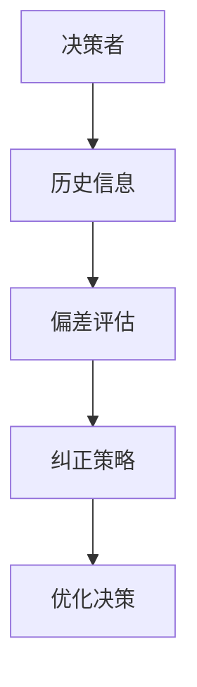

                 


# 后见之明偏差：正确评估历史信息的价值

> 关键词：后见之明偏差、历史信息评估、认知偏差、决策优化、概率思维

> 摘要：后见之明偏差是一种常见的认知偏差，它影响人们对历史信息的评估和决策。本文将深入探讨后见之明偏差的核心概念、形成机制、常见误区、评估方法以及纠正策略。通过结合实际案例和系统架构设计，本文旨在帮助读者正确评估历史信息的价值，避免偏差带来的决策失误。

---

## 第1章: 后见之明偏差的定义与表现

### 1.1 后见之明偏差的定义

#### 1.1.1 什么是后见之明偏差
后见之明偏差（Hindsight Bias），也称为“益我忘初”偏差，是指人们在回顾过去事件时，倾向于认为自己事先已经预料到了结果，而忽视了当时的信息不对称和不确定性。这种偏差使得人们在评估历史信息时，往往高估自己的预测能力，低估事件的复杂性。

#### 1.1.2 后见之明偏差的表现形式
1. **结果归因**：人们倾向于将过去事件的结果归因于自己的预测能力，而忽视了事件发生的偶然性和多因素影响。
2. **选择性记忆**：人们倾向于记住那些与结果一致的信息，而忽略那些与结果不符的信息。
3. **过度自信**：人们在回顾过去时，往往过于自信地认为自己能够预测未来，从而导致决策失误。

#### 1.1.3 后见之明偏差的影响范围
后见之明偏差不仅影响个人决策，还影响组织和团队的决策。它可能导致企业在市场预测、项目评估和风险管理方面出现偏差，从而影响整体业务表现。

### 1.2 后见之明偏差的形成机制

#### 1.2.1 认知偏差的来源
后见之明偏差源于人类认知的局限性。人们在回顾过去时，倾向于将复杂事件简化为因果关系，从而忽略事件发生的多因素和不确定性。

#### 1.2.2 信息不对称的作用
信息不对称是指在决策过程中，人们掌握的信息不完整或不准确，导致对事件的判断出现偏差。后见之明偏差进一步加剧了这种信息不对称的影响。

#### 1.2.3 结果可预测性的错觉
人们倾向于认为过去事件的结果是可预测的，从而低估了事件的不确定性和复杂性。这种错觉导致人们在评估历史信息时出现偏差。

---

## 第2章: 后见之明偏差的核心概念

### 2.1 后见之明偏差的核心要素

#### 2.1.1 偏差的主体
后见之明偏差的主体是人类决策者。无论是个人还是团队，都可能受到这种偏差的影响。

#### 2.1.2 偏差的对象
偏差的对象是历史信息，尤其是那些与结果相关的信息。人们倾向于选择性地评估这些信息，从而影响决策的准确性。

#### 2.1.3 偏差的结果
偏差的结果是决策失误。由于人们高估了自己的预测能力，他们可能会做出错误的决策，从而影响个人或组织的长期发展。

### 2.2 后见之明偏差与相关概念的对比

#### 2.2.1 与选择性记忆偏差的对比
选择性记忆偏差是指人们倾向于记住那些与自己观点一致的信息，而忽略那些与自己观点不符的信息。后见之明偏差则更倾向于将结果归因于自己的预测能力，从而影响记忆的选择性。

#### 2.2.2 与确认性偏差的对比
确认性偏差是指人们倾向于寻找和记住那些支持自己已有观点的信息。后见之明偏差则更倾向于将结果归因于自己的预测能力，从而影响信息的选择和评估。

#### 2.2.3 与归因偏差的对比
归因偏差是指人们倾向于将成功归因于自己的能力，而将失败归因于外部因素。后见之明偏差则更倾向于将结果归因于自己的预测能力，从而影响决策的准确性。

---

## 第3章: 后见之明偏差的理论模型

### 3.1 偏差的理论框架

#### 3.1.1 认知心理学视角
认知心理学认为，后见之明偏差源于人们在回顾过去时，倾向于简化复杂事件的因果关系。人们倾向于将结果归因于自己的预测能力，从而忽视了事件的复杂性和不确定性。

#### 3.1.2 决策理论视角
决策理论认为，后见之明偏差影响了人们对历史信息的评估和未来决策的准确性。人们在回顾过去时，倾向于高估自己的预测能力，从而影响未来的决策。

#### 3.1.3 统计学视角
统计学视角认为，后见之明偏差与事件的可预测性密切相关。人们倾向于认为过去事件的结果是可预测的，从而低估了事件的不确定性和复杂性。

### 3.2 偏差的数学模型

#### 3.2.1 基于概率的模型
$$P(\text{偏差}) = \frac{\text{预测正确数}}{\text{总预测数}}$$

#### 3.2.2 基于贝叶斯的模型
$$P(A|B) = \frac{P(B|A)P(A)}{P(B)}$$

#### 3.2.3 基于逻辑回归的模型
$$P(Y=1) = \frac{e^{\beta X}}{1 + e^{\beta X}}$$

---

## 第4章: 后见之明偏差的评估方法

### 4.1 偏差的评估指标

#### 4.1.1 偏差强度的度量
偏差强度可以通过以下公式计算：
$$\text{偏差强度} = \sum_{i=1}^{n} |P_i - P_i'|$$

#### 4.1.2 偏差发生频率的度量
偏差发生频率可以通过以下公式计算：
$$\text{偏差频率} = \frac{\text{偏差发生次数}}{\text{总事件数}}$$

#### 4.1.3 偏差影响范围的度量
偏差影响范围可以通过以下公式计算：
$$\text{偏差影响范围} = \frac{\text{偏差影响事件数}}{\text{总事件数}}$$

### 4.2 偏差的评估工具

#### 4.2.1 问卷调查法
通过设计问卷，收集受访者对历史事件的预测和评估，分析偏差的发生情况。

#### 4.2.2 实验法
通过设计实验，观察受访者在回顾过去事件时的行为和决策，分析偏差的发生情况。

#### 4.2.3 日志分析法
通过分析决策日志，评估历史事件的预测和评估，分析偏差的发生情况。

---

## 第5章: 后见之明偏差的纠正策略

### 5.1 纠正偏差的理论基础

#### 5.1.1 提高信息透明度
通过提高信息透明度，减少信息不对称，从而降低后见之明偏差的影响。

#### 5.1.2 建立决策日志
通过建立决策日志，记录决策过程和相关信息，从而提高决策的透明度和可追溯性。

#### 5.1.3 引入外部专家意见
通过引入外部专家意见，丰富决策信息，从而减少偏差的影响。

### 5.2 纠正偏差的具体方法

#### 5.2.1 使用概率思维
通过概率思维，评估历史事件的不确定性和复杂性，从而减少偏差的影响。

#### 5.2.2 构建评估框架
通过构建评估框架，系统地评估历史事件的预测和评估，从而减少偏差的影响。

#### 5.2.3 引入反馈机制
通过引入反馈机制，评估决策的准确性和效果，从而减少偏差的影响。

---

## 第6章: 后见之明偏差的系统架构设计

### 6.1 系统功能设计

#### 6.1.1 信息收集与处理
系统需要收集和处理历史事件的相关信息，包括事件的起因、过程和结果。

#### 6.1.2 偏差评估与分析
系统需要评估和分析后见之明偏差的发生情况，包括偏差强度、发生频率和影响范围。

#### 6.1.3 偏差纠正与优化
系统需要提出纠正偏差的具体方法和策略，优化决策过程和评估框架。

### 6.2 系统架构设计



---

## 第7章: 后见之明偏差的项目实战

### 7.1 项目背景介绍
通过一个实际案例，分析后见之明偏差对决策的影响，并提出纠正策略。

### 7.2 核心代码实现
```python
def calculate_bias(events, predictions):
    bias = 0
    for event, prediction in zip(events, predictions):
        if event != prediction:
            bias += 1
    return bias / len(events)

events = [1, 0, 1, 1, 0]
predictions = [1, 1, 1, 0, 0]
bias = calculate_bias(events, predictions)
print(bias)
```

### 7.3 实际案例分析
通过具体案例分析，展示后见之明偏差的影响及其纠正策略。

---

## 第8章: 总结与展望

### 8.1 总结
本文系统地探讨了后见之明偏差的核心概念、形成机制、评估方法和纠正策略。通过结合实际案例和系统架构设计，本文旨在帮助读者正确评估历史信息的价值，避免偏差带来的决策失误。

### 8.2 未来研究方向
未来研究可以进一步探讨后见之明偏差与其他认知偏差的相互作用，以及在复杂系统中的应用和影响。

---

通过以上章节的详细分析和探讨，我们可以更好地理解后见之明偏差的本质和影响，从而在实际决策中避免偏差带来的问题，提高决策的准确性和可靠性。

