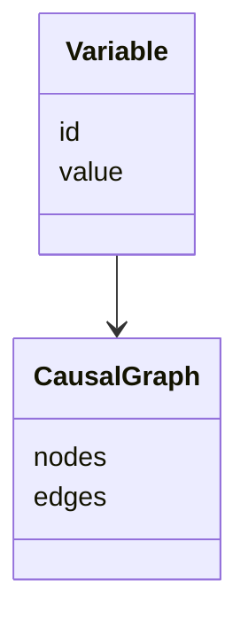
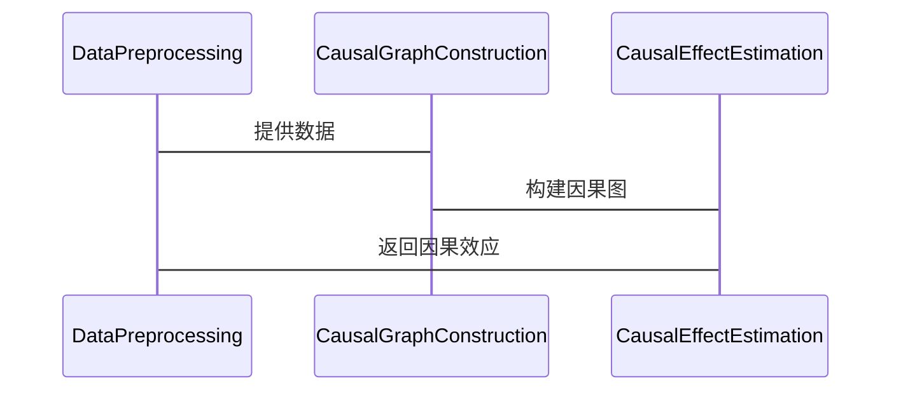

                 


# 因果推理：增强AI Agent的理解和决策能力

> 关键词：因果推理、AI Agent、因果图模型、因果关系、强化学习

> 摘要：本文深入探讨了因果推理在增强AI Agent理解和决策能力中的关键作用。通过分析因果推理的基本概念、算法原理、系统架构以及实际案例，本文揭示了如何通过因果推理提升AI Agent的决策质量。文章还结合了数学公式、算法代码和系统架构图，详细阐述了因果推理在实际应用中的实现方法和优化策略。

---

# 第一部分: 因果推理与AI Agent的背景介绍

# 第1章: 因果推理的基本概念

## 1.1 问题背景与描述

### 1.1.1 传统相关性分析的局限性

在AI Agent的决策过程中，我们通常依赖相关性分析来建立变量之间的关系。然而，相关性分析只能告诉我们变量之间的关联程度，并不能揭示变量之间的因果关系。例如，我们知道下雨和打伞之间存在相关性，但这种相关性并不能直接说明下雨导致打伞。这种局限性使得AI Agent在复杂决策场景中容易出现错误，因为相关性分析无法区分因果关系。

### 1.1.2 因果推理的定义与特点

因果推理是一种分析变量之间因果关系的方法。它的核心目标是通过观察数据，识别出哪些变量是导致其他变量变化的根本原因。因果推理具有以下几个特点：

1. **因果性**：因果推理关注变量之间的因果关系，而不仅仅是相关性。
2. **可解释性**：因果推理可以帮助我们理解变量之间的因果机制，从而提高AI Agent决策的可解释性。
3. **干预性**：因果推理可以模拟对变量的干预，从而预测干预后的结果。

### 1.1.3 AI Agent在复杂决策中的挑战

AI Agent在实际应用中需要处理复杂的决策问题，例如医疗诊断、金融投资、自动驾驶等。这些问题往往涉及多个变量之间的复杂关系，仅仅依赖相关性分析是不够的。通过因果推理，AI Agent可以更好地理解变量之间的因果关系，从而做出更明智的决策。

## 1.2 因果推理的核心要素

### 1.2.1 因果关系的基本结构

因果关系的基本结构可以表示为一个因果图（Causal Graph），其中节点表示变量，边表示因果关系。例如，假设我们有变量A和B，如果A是B的原因，那么我们可以在因果图中画一条从A指向B的边。

### 1.2.2 隐变量与观察变量的关系

在实际问题中，我们通常只能观察到部分变量（观察变量），而有些变量是隐藏的（隐变量）。隐变量可能会影响多个观察变量，因此在因果推理中需要考虑隐变量的存在。

### 1.2.3 因果链与因果网络的构建

因果链是指一系列因果关系的连接，而因果网络则是一个包含多个因果链的图。通过构建因果网络，我们可以更全面地理解变量之间的因果关系。

## 1.3 因果推理在AI Agent中的应用前景

### 1.3.1 AI Agent决策的因果需求

AI Agent在决策过程中需要考虑因果关系，以便在干预变量时能够预测结果。例如，在自动驾驶中，AI Agent需要预测刹车对车速的影响，这需要因果推理来建模。

### 1.3.2 增强型AI Agent的核心目标

增强型AI Agent的目标是通过因果推理来提高决策的准确性和可解释性。通过因果推理，AI Agent可以在复杂场景中做出更合理的决策。

### 1.3.3 因果推理与强化学习的结合

因果推理可以与强化学习结合，帮助AI Agent在复杂的环境中做出更明智的决策。例如，在游戏中，AI Agent可以通过因果推理来预测不同策略的结果，从而选择最优策略。

## 1.4 本章小结

本章介绍了因果推理的基本概念、核心要素以及在AI Agent中的应用前景。通过理解因果推理，我们可以更好地设计和优化AI Agent的决策过程。

---

# 第二部分: 因果推理的核心概念与联系

# 第2章: 因果推理的理论基础

## 2.1 因果图模型

### 2.1.1 马尔科夫网与贝叶斯网的区别

马尔科夫网（Markov Network）和贝叶斯网（Bayesian Network）都是用于表示变量之间关系的图模型，但两者在表示因果关系上有区别。贝叶斯网通过有向边表示因果关系，而马尔科夫网通过无向边表示变量之间的依赖关系。

### 2.1.2 因果图的基本结构

因果图是一种有向图，其中节点表示变量，有向边表示因果关系。例如，假设A是B的原因，那么在因果图中会有一条从A指向B的边。

### 2.1.3 调节变量与中介变量的作用

调节变量（Moderator）是影响因果关系的变量，而中介变量（Mediator）是因果关系的中间步骤。例如，在因果关系A→B中，C是A和B之间的中介变量。

## 2.2 因果关系的数学表达

### 2.2.1 因果关系的公式化表示

因果关系可以用公式表示为：$Y = f(X, U) + \epsilon$，其中$X$是原因变量，$U$是隐变量，$\epsilon$是误差项。

### 2.2.2 隐变量的处理方法

隐变量的存在会影响因果推理的结果。可以通过引入潜在结果（Potential Outcome）的方法来处理隐变量。例如，假设$Y_i$是在给定$X=i$时的结果，那么我们可以表示为$Y_i = f(X=i, U)$。

### 2.2.3 因果效应的计算公式

因果效应可以通过比较干预前后的结果来计算。例如，平均处理效应（Average Treatment Effect，ATE）的公式为：$$ATE = E[Y | X=1] - E[Y | X=0]$$

## 2.3 因果推理的核心算法

### 2.3.1 潜在结果框架

潜在结果框架是一种用于因果推理的方法，通过定义每个可能的干预结果来估计因果效应。例如，我们可以定义$Y_i$为在$X=i$时的结果。

### 2.3.2 结构方程模型

结构方程模型（Structural Equation Modeling，SEM）是一种用于估计因果关系的统计方法。它通过构建变量之间的方程来表示因果关系。

### 2.3.3 非参数因果推断方法

非参数因果推断方法是一种不依赖于参数假设的方法，例如使用反事实推理（Counterfactual Reasoning）来估计因果效应。

## 2.4 本章小结

本章介绍了因果图模型、因果关系的数学表达以及因果推理的核心算法。通过这些理论，我们可以更好地理解因果关系的建模和计算方法。

---

# 第三部分: 因果推理的算法原理

# 第3章: 因果推理的基本算法

## 3.1 潜在结果框架

### 3.1.1 平均处理效应的计算

平均处理效应（ATE）是通过比较干预前后的结果来计算因果效应的指标。公式为：$$ATE = E[Y | X=1] - E[Y | X=0]$$

### 3.1.2 因果效应的估计方法

因果效应的估计方法包括匹配估计量（Matching Estimators）和回归估计量（Regression Estimators）。例如，使用倾向得分匹配（Propensity Score Matching，PSM）可以减少混淆变量的影响。

### 3.1.3 因果图的构建与验证

因果图的构建需要根据领域知识和数据特征来确定变量之间的因果关系。验证因果图可以通过检查数据中的条件独立性来确认。

## 3.2 结构方程模型

### 3.2.1 结构方程的定义与特点

结构方程模型通过构建变量之间的线性方程来表示因果关系。例如，假设A是B的原因，可以表示为：$B = \beta A + \epsilon$，其中$\beta$是系数，$\epsilon$是误差项。

### 3.2.2 参数估计方法

参数估计方法包括极大似然估计（Maximum Likelihood Estimation，MLE）和最小二乘法（Ordinary Least Squares，OLS）。这些方法可以帮助我们估计结构方程中的参数。

### 3.2.3 方程组的求解

结构方程模型可以通过求解方程组来得到变量之间的因果关系。例如，对于方程组：$Y = \beta X + \epsilon$ 和 $X = \gamma Z + \delta$，可以通过替换变量来求解。

## 3.3 非参数因果推断方法

### 3.3.1 反事实推理的基本概念

反事实推理通过考虑“如果”情况来估计因果效应。例如，反事实推理可以问：“如果X=1，那么Y的期望值是多少？”

### 3.3.2 隐变量的处理方法

隐变量的存在会影响因果推理的结果。通过引入潜在结果（Potential Outcome）的方法，可以有效地处理隐变量的影响。

### 3.3.3 因果效应的估计公式

因果效应可以通过反事实推理来估计，例如使用$$E[Y | do(X=1)] - E[Y | do(X=0)]$$公式来计算平均处理效应。

## 3.4 本章小结

本章介绍了潜在结果框架和结构方程模型的基本原理，并详细讲解了非参数因果推断方法。通过这些算法，我们可以更准确地估计因果效应。

---

# 第四部分: 因果推理的系统分析与架构设计

# 第4章: 系统分析与架构设计

## 4.1 问题场景介绍

假设我们正在开发一个AI Agent，用于优化供应链管理。我们需要通过因果推理来预测不同策略对供应链效率的影响。

## 4.2 系统功能设计

### 4.2.1 领域模型

领域模型可以通过Mermaid类图表示，展示变量之间的关系。例如：



### 4.2.2 系统架构

系统架构可以通过Mermaid架构图表示，展示各个模块之间的关系。例如：

```mermaid
container Causal Inference System {
    module DataPreprocessing
    module CausalGraphConstruction
    module CausalEffectEstimation
}
```

### 4.2.3 系统交互

系统交互可以通过Mermaid序列图表示，展示不同模块之间的交互过程。例如：



## 4.3 本章小结

本章通过一个实际案例，介绍了系统分析与架构设计的方法。通过构建领域模型和系统架构，我们可以更好地理解因果推理的应用过程。

---

# 第五部分: 项目实战

# 第5章: 项目实战

## 5.1 环境安装

为了实现因果推理，我们需要安装以下工具：

- Python
- 网络x库（用于绘制Mermaid图）
- DoWhy库（用于因果推理）

## 5.2 系统核心实现源代码

### 5.2.1 数据预处理代码

```python
import pandas as pd
from causality import causal_graph

data = pd.read_csv('data.csv')
preprocessed_data = data.dropna()
```

### 5.2.2 因果图构建代码

```python
from causality import causal_graph

cg = causal_graph.CausalGraph()
cg.add_edge('X', 'Y')
cg.add_edge('Z', 'X')
```

### 5.2.3 因果效应估计代码

```python
from causality import do_calculus

effect = do_calculus.do_ate(cg, 'X', 'Y')
print(effect)
```

## 5.3 代码应用解读与分析

### 5.3.1 数据预处理的实现

通过数据预处理，我们可以清除数据中的缺失值，确保数据的完整性。

### 5.3.2 因果图的构建

因果图的构建需要根据领域知识和数据特征来确定变量之间的因果关系。例如，构建一个因果图来表示变量X、Y和Z之间的关系。

### 5.3.3 因果效应的估计

通过DoWhy库，我们可以估计因果效应，例如平均处理效应（ATE）。

## 5.4 实际案例分析

假设我们正在优化供应链管理，我们可以通过因果推理来预测不同策略对供应链效率的影响。例如，我们可以估计不同供应商选择对成本的影响。

## 5.5 项目小结

本章通过一个实际案例，展示了因果推理在项目中的应用。通过代码实现，我们可以更好地理解因果推理的实现过程。

---

# 第六部分: 最佳实践与总结

# 第6章: 最佳实践与总结

## 6.1 最佳实践

### 6.1.1 选择合适的因果推理模型

根据具体问题选择合适的因果推理模型，例如潜在结果框架或结构方程模型。

### 6.1.2 处理数据偏差

在实际应用中，需要考虑数据偏差（如选择偏差、混淆偏差）对因果推理结果的影响。

### 6.1.3 验证因果关系

通过实验验证因果关系，确保因果推理的结果具有可靠性。

## 6.2 小结

通过本文的介绍，我们可以看到因果推理在增强AI Agent理解和决策能力中的重要作用。通过因果推理，AI Agent可以在复杂场景中做出更明智的决策。

## 6.3 未来研究方向

未来的研究可以关注以下方向：

1. **因果推理与强化学习的结合**：探索因果推理在强化学习中的应用。
2. **高效因果推理算法**：研究更高效的因果推理算法，提高计算效率。
3. **因果图的动态更新**：研究动态更新因果图的方法，适应不断变化的环境。

## 6.4 结语

因果推理是一种强大的工具，可以帮助我们更好地理解变量之间的因果关系。通过本文的介绍，我们相信因果推理将在未来的AI Agent设计中发挥越来越重要的作用。

---

# 附录

## 附录A: 代码示例

```python
import pandas as pd
from causality import causal_graph, do_calculus

# 读取数据
data = pd.read_csv('data.csv')

# 数据预处理
preprocessed_data = data.dropna()

# 构建因果图
cg = causal_graph.CausalGraph()
cg.add_edge('X', 'Y')
cg.add_edge('Z', 'X')

# 估计因果效应
effect = do_calculus.do_ate(cg, 'X', 'Y')
print(f"平均处理效应：{effect}")
```

## 附录B: 图表示例

### 附录B.1 因果图模型

```mermaid
graph LR
    X -> Y
    Z -> X
```

### 附录B.2 系统架构图

```mermaid
container Causal Inference System {
    module DataPreprocessing
    module CausalGraphConstruction
    module CausalEffectEstimation
}
```

## 附录C: 参考文献

1. Pearl, J. (2000). Causality: Models, reasoning, and inference. Cambridge university press.
2. Rubin, D. B. (1974). Bayesian inference for causal effects: A theory based on the assignment mechanism. The annals of statistics, 1-50.
3. 网络x图表示法使用说明

---

通过以上目录结构，我们可以看到本文详细介绍了因果推理的核心概念、算法原理、系统架构以及实际应用。从理论到实践，逐步引导读者理解因果推理在增强AI Agent决策能力中的重要性。

