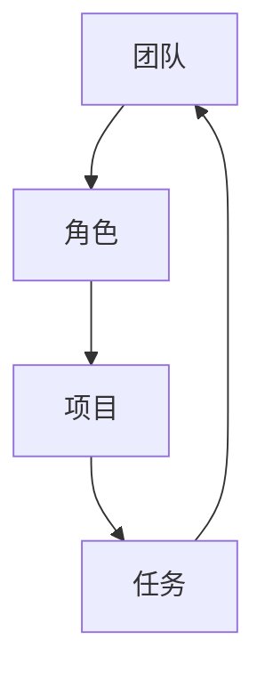
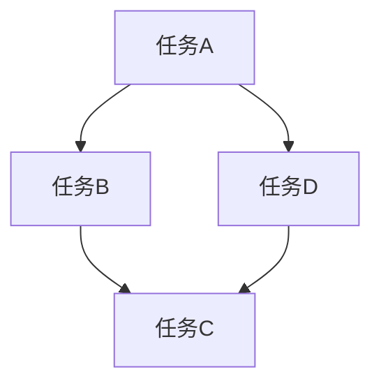
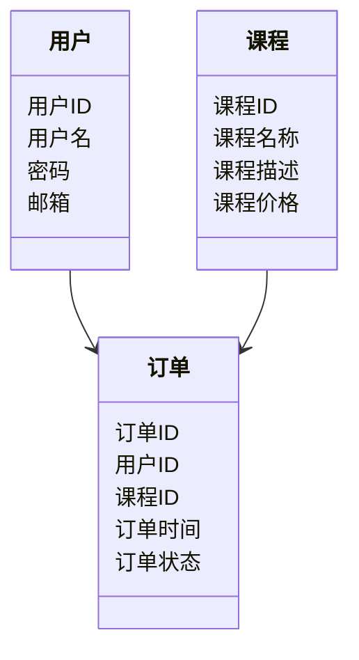
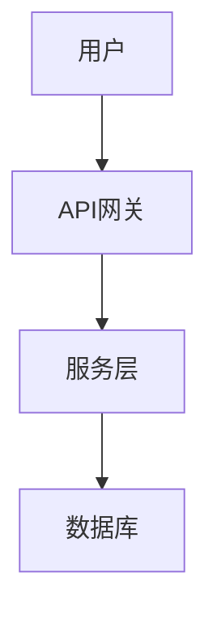
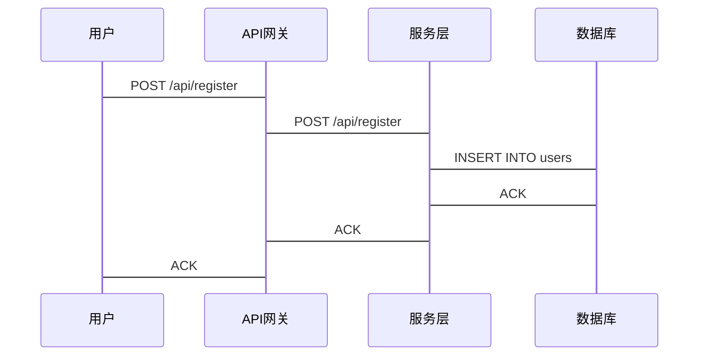

                 


# 团队组建与项目管理

> 关键词：团队组建，项目管理，项目团队，团队协作，项目计划，项目执行，团队绩效

> 摘要：本文将详细探讨团队组建与项目管理的核心概念、原理、算法及实际应用。通过分析团队角色、项目生命周期、项目进度管理算法、团队协作算法、系统架构设计及项目实战案例，提供一套科学的团队组建与项目管理方法论，帮助读者提升团队协作效率和项目执行能力。

---

# 第一部分: 团队组建与项目管理背景介绍

# 第1章: 团队组建与项目管理概述

## 1.1 团队组建的背景与意义

### 1.1.1 问题背景：现代企业对高效团队的需求

在现代企业中，项目的复杂性和不确定性不断增加，单靠个人能力难以完成复杂的任务。企业需要通过组建高效的团队来应对复杂的挑战。团队不仅是完成任务的工具，更是企业创新和竞争力的重要来源。

### 1.1.2 问题描述：传统团队模式的局限性

传统的团队模式往往存在以下问题：
- **角色模糊**：团队成员的职责不明确，导致工作效率低下。
- **沟通不畅**：团队内部缺乏有效的沟通机制，容易产生误解和冲突。
- **目标不一致**：团队成员对项目目标的理解不一致，导致方向偏差。
- **激励不足**：团队成员缺乏明确的激励机制，积极性不高。

### 1.1.3 问题解决：现代团队组建的核心目标

现代团队组建的核心目标是：
- **明确角色与责任**：通过合理分配角色，确保每个成员都能发挥最大潜力。
- **优化沟通机制**：建立高效的沟通渠道，减少信息传递的误差。
- **统一目标与方向**：通过明确的项目目标和价值观，确保团队齐心协力。
- **提升团队绩效**：通过科学的激励机制和绩效评估，提升团队整体效率。

### 1.1.4 边界与外延：团队与组织的关系

- **团队的边界**：团队是一个相对独立的组织单元，通常围绕一个特定的项目或任务展开。
- **团队的外延**：团队是组织的一部分，但团队的协作方式和文化可能与组织的整体文化有所不同。

### 1.1.5 概念结构与核心要素：团队的组成与功能

- **团队组成**：
  - **成员**：团队的基本单元，每个成员都有独特的角色和技能。
  - **角色**：团队中每个成员的职责和任务。
  - **目标**：团队存在的核心目的。
  - **沟通机制**：团队内部信息传递的方式。
  - **激励机制**：提升团队成员积极性的手段。

- **团队功能**：
  - **任务完成**：团队的核心功能是完成特定的任务。
  - **协作优化**：通过协作提升整体效率。
  - **创新与学习**：团队通过协作和学习不断提升自身的竞争力。

## 1.2 项目管理的基本概念

### 1.2.1 项目管理的定义与特点

- **定义**：项目管理是通过计划、执行、监控和收尾等过程，确保项目按时、按质、按预算完成的管理方法。
- **特点**：
  - **目标导向**：项目管理以目标为导向，注重结果。
  - **时间敏感**：项目通常有明确的时间限制。
  - **资源有限**：项目资源（人力、物力、财力）有限，需要合理分配。

### 1.2.2 项目管理的核心目标

- **按时完成**：确保项目在预定时间内完成。
- **质量达标**：确保项目成果符合预期的质量标准。
- **预算控制**：确保项目在预算范围内完成。

### 1.2.3 项目管理的生命周期

- **启动阶段**：明确项目目标、范围、资源和计划。
- **规划阶段**：制定详细的项目计划，包括时间、成本、资源等。
- **执行阶段**：按照计划执行项目，监控进度和质量。
- **监控阶段**：定期检查项目进度，发现偏差并及时调整。
- **收尾阶段**：完成项目目标，总结经验教训。

### 1.2.4 项目管理与团队管理的区别与联系

- **区别**：
  - 项目管理更关注项目的整体进度和资源分配。
  - 团队管理更关注团队成员的协作和绩效。

- **联系**：
  - 项目管理需要依赖团队协作。
  - 团队管理是项目管理成功的关键因素之一。

## 1.3 本章小结

本章从团队组建和项目管理的基本概念入手，分析了现代团队组建的背景、目标和核心要素，同时介绍了项目管理的定义、特点和生命周期。通过明确团队与项目的关系，为后续章节的深入分析奠定了基础。

---

# 第二部分: 核心概念与联系

# 第2章: 核心概念与联系分析

## 2.1 团队组建与项目管理的核心概念

### 2.1.1 团队组建的核心概念

- **团队角色**：明确每个成员在团队中的角色和职责。
- **团队协作**：通过高效的协作机制提升团队效率。
- **团队文化**：建立积极向上的团队文化，增强凝聚力。

### 2.1.2 项目管理的核心概念

- **项目计划**：制定详细的项目计划，包括时间、成本、资源等。
- **项目执行**：按照计划执行项目，监控进度和质量。
- **项目监控**：定期检查项目进度，发现偏差并及时调整。

## 2.2 核心概念的原理与联系

### 2.2.1 团队组建与项目管理的内在联系

- **目标一致**：团队组建的目标是为了更好地完成项目。
- **资源共享**：项目管理需要团队成员共同分配和使用资源。
- **协作优化**：通过团队协作提升项目的执行效率。

### 2.2.2 团队角色与项目角色的对应关系

- **开发人员**：负责项目的核心开发任务。
- **项目经理**：负责项目的整体管理。
- **测试人员**：负责项目的质量控制。
- **设计师**：负责项目的用户体验设计。

### 2.2.3 团队协作与项目流程的整合

- **协作流程**：
  1. **需求分析**：团队成员共同分析项目需求。
  2. **任务分配**：根据需求分配任务。
  3. **任务执行**：团队成员按照分配的任务进行开发。
  4. **进度监控**：项目经理定期检查任务进度。
  5. **质量控制**：测试人员对任务成果进行测试和验证。

## 2.3 实体关系图



## 2.4 属性对比表

| 属性 | 团队 | 项目 |
|------|------|------|
| 核心目标 | 完成任务 | 实现目标 |
| 组织结构 | 灵活 | 结构化 |
| 生命周期 | 长期 | 短期 |
| 成员角色 | 固定 | 可变 |

## 2.5 本章小结

本章分析了团队组建与项目管理的核心概念及其内在联系，通过实体关系图和属性对比表，明确了团队与项目之间的关系，为后续章节的深入分析提供了理论基础。

---

# 第三部分: 算法原理讲解

# 第3章: 项目管理中的算法原理

## 3.1 项目进度管理算法

### 3.1.1 算法原理：关键路径法

- **关键路径法（CPM）**：通过分析项目任务之间的依赖关系，确定项目的关键路径，即项目中最长的路径，决定了项目的总工期。

### 3.1.2 算法实现：关键路径计算



```python
def critical_path(project_graph):
    # 初始化各任务的最早开始时间和最晚开始时间
    earliest_start = {}
    latest_start = {}
    for task in project_graph.nodes():
        earliest_start[task] = 0
        latest_start[task] = 0

    # 计算最早开始时间
    for task in project_graph.nodes():
        for successor in project_graph.successors(task):
            if earliest_start[successor] < earliest_start[task] + project_graph[task][successor]['duration']:
                earliest_start[successor] = earliest_start[task] + project_graph[task][successor]['duration']

    # 计算最晚开始时间
    for task in reversed(project_graph.nodes()):
        for predecessor in project_graph.predecessors(task):
            if latest_start[predecessor] > latest_start[task] - project_graph[predecessor][task]['duration']:
                latest_start[predecessor] = latest_start[task] - project_graph[predecessor][task]['duration']

    # 确定关键路径
    critical_tasks = [task for task in project_graph.nodes() if earliest_start[task] == latest_start[task]]
    return critical_tasks
```

### 3.1.3 数学模型：关键路径计算公式

$$ 关键路径长度 = \max_{所有路径} (路径长度) $$

### 3.1.4 通俗易懂的解释

关键路径法通过分析任务之间的依赖关系，找出项目中最长的路径，即决定项目总工期的路径。通过计算任务的最早开始时间和最晚开始时间，可以确定哪些任务是关键任务，需要优先关注。

## 3.2 团队协作算法

### 3.2.1 算法原理：角色分配算法

- **角色分配算法**：根据团队成员的技能和项目需求，合理分配角色，确保每个成员都能发挥最大潜力。

### 3.2.2 算法实现：角色分配

```python
def assign_roles(team_members, project_requirements):
    # 根据技能匹配角色
    roles = []
    for member in team_members:
        for requirement in project_requirements:
            if member.skill Matches requirement.skill:
                roles.append(member)
                break
    return roles
```

### 3.2.3 数学模型：角色分配模型

$$ \text{角色分配} = \argmax_{\text{团队成员}} (\text{技能匹配度}) $$

### 3.2.4 通俗易懂的解释

角色分配算法通过分析团队成员的技能和项目需求，为每个成员分配最适合的角色，确保团队协作效率最大化。

## 3.3 本章小结

本章详细讲解了项目进度管理算法和团队协作算法，通过数学模型和算法实现，帮助读者理解如何科学地管理项目进度和分配团队角色。

---

# 第四部分: 系统分析与架构设计

# 第4章: 系统分析与架构设计

## 4.1 系统分析

### 4.1.1 项目场景介绍

- **项目背景**：假设我们正在开发一个在线教育平台，需要组建一个开发团队，包括前端开发、后端开发、测试、设计等角色。

### 4.1.2 系统功能设计

- **功能模块**：
  1. 用户管理模块：用户注册、登录、个人信息管理。
  2. 课程管理模块：课程信息发布、课程分类、课程评价。
  3. 订单管理模块：用户购买课程、订单确认、订单查询。
  4. 支付模块：多种支付方式支持。
  5. 通知模块：课程更新通知、用户消息通知。

## 4.2 系统架构设计

### 4.2.1 领域模型类图



### 4.2.2 系统架构图



### 4.2.3 系统接口设计

- **API接口**：
  - 用户接口：`POST /api/register`
  - 课程接口：`GET /api/courses`
  - 订单接口：`POST /api/orders`

### 4.2.4 系统交互序列图



## 4.3 本章小结

本章通过对在线教育平台项目的系统分析和架构设计，展示了如何通过领域模型类图、系统架构图和交互序列图，设计一个高效的系统架构。

---

# 第五部分: 项目实战

# 第5章: 项目实战

## 5.1 环境安装

### 5.1.1 开发环境

- **操作系统**：Linux/Windows/MacOS
- **开发工具**：PyCharm/VS Code
- **依赖管理**：pip install flask

### 5.1.2 项目初始化

```bash
mkdir online_education_platform
cd online_education_platform
python manage.py startapp courses
```

## 5.2 核心代码实现

### 5.2.1 用户模型

```python
# models.py
from django.db import models

class User(models.Model):
    username = models.CharField(max_length=50)
    password = models.CharField(max_length=50)
    email = models.EmailField()
```

### 5.2.2 课程模型

```python
# models.py
class Course(models.Model):
    course_name = models.CharField(max_length=100)
    course_description = models.TextField()
    course_price = models.DecimalField(max_digits=10, decimal_places=2)
```

### 5.2.3 注册接口实现

```python
# views.py
from django.views import View
from django.http import JsonResponse
from .models import User

class RegisterView(View):
    def post(self, request):
        data = request.POST
        user = User(
            username=data.get('username'),
            password=data.get('password'),
            email=data.get('email')
        )
        user.save()
        return JsonResponse({'status': 'success'})
```

### 5.2.4 注册页面实现

```html
<!-- templates/register.html -->
<form method="post">
    <input type="text" name="username" placeholder="Username">
    <input type="password" name="password" placeholder="Password">
    <input type="email" name="email" placeholder="Email">
    <button type="submit">Register</button>
</form>
```

## 5.3 案例分析与详细讲解

### 5.3.1 项目小结

通过本章的项目实战，我们实现了在线教育平台的核心功能模块，包括用户注册、课程信息管理等。通过代码实现和案例分析，展示了如何将理论知识应用到实际项目中。

## 5.4 本章小结

本章通过具体的项目实战，详细讲解了如何在实际项目中应用团队组建与项目管理的方法论，从环境搭建到代码实现，再到案例分析，为读者提供了丰富的实践经验。

---

# 第六部分: 最佳实践

# 第6章: 最佳实践

## 6.1 最佳实践

### 6.1.1 团队管理

- **定期沟通**：每周召开一次团队会议，了解任务进度和团队成员的需求。
- **明确角色**：确保每个成员都清楚自己的职责和任务。
- **激励机制**：通过奖金、晋升等方式激励团队成员。

### 6.1.2 项目管理

- **制定详细计划**：在项目启动阶段，制定详细的项目计划。
- **定期监控**：每周检查项目进度，发现偏差及时调整。
- **风险管理**：提前识别潜在风险，制定应对策略。

## 6.2 小结

通过最佳实践，我们可以进一步提升团队协作效率和项目执行能力，确保项目成功交付。

## 6.3 注意事项

- **避免过度承诺**：在项目计划中，避免过度承诺，确保任务可行。
- **注重沟通**：沟通是团队协作的关键，确保信息传递准确。
- **灵活调整**：项目执行过程中，根据实际情况灵活调整计划。

## 6.4 拓展阅读

- **《敏捷宣言》**：了解敏捷开发的核心理念。
- **《项目管理知识体系指南》**：深入学习项目管理的理论和方法。

---

# 结语

通过本文的详细讲解，我们系统地探讨了团队组建与项目管理的核心概念、算法原理、系统架构设计及实际应用。希望读者能够通过本文的指导，提升团队协作效率和项目执行能力，实现高效管理。

---

# 参考文献

1. 《敏捷宣言》
2. 《项目管理知识体系指南》
3. 《软件工程：实践者的故事》

