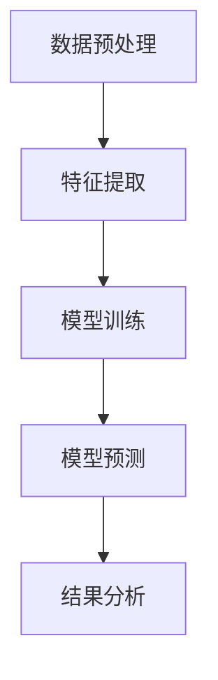
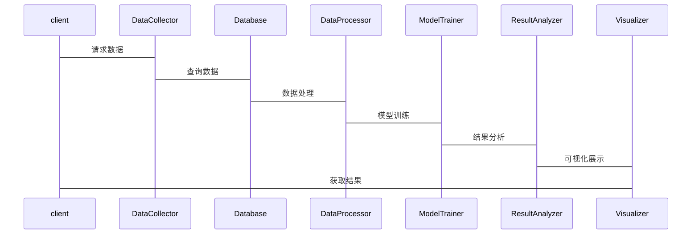

                 


# 国际市场估值指标的局限性探讨

> 关键词：国际市场估值指标、局限性分析、机器学习优化、数学模型、数据偏差

> 摘要：本文系统探讨了国际市场估值指标的局限性，分析了其在不同市场环境下的表现差异、数据偏差、模型假设等问题，并通过引入机器学习算法提出解决方案。文章从估值指标的核心概念出发，结合实际案例，深入剖析其局限性，并通过数学模型和算法实现，展示了如何克服这些局限性。

---

# 第一部分: 国际市场估值指标的背景与核心概念

## 第1章: 国际市场估值指标的背景介绍

### 1.1 估值指标的定义与核心概念

#### 1.1.1 估值指标的定义

国际市场估值指标是用于评估企业或资产价值的一系列量化标准，常见指标包括市盈率（P/E）、市净率（P/B）、股息率等。这些指标通过将股价与企业财务指标（如收益、资产等）进行对比，帮助投资者判断资产的市场价值。

#### 1.1.2 估值指标的核心要素

- **分子**：股价、股息、资产净值等
- **分母**：收益、资产、现金流等
- **应用场景**：股票估值、资产定价、投资决策等

#### 1.1.3 估值指标的分类与属性对比表

| 指标名称 | 计算公式 | 主要用途 | 优点 | 局限性 |
|----------|----------|----------|------|--------|
| 市盈率    | P/E = 股价/每股收益 | 评估盈利能力 | 易计算 | 受周期性影响 |
| 市净率    | P/B = 股价/每股净资产 | 评估资产质量 | 稳定性高 | 忽略负债 |
| 股息率    | Dividend Yield = 股息/股价 | 评估收益能力 | 简单直观 | 受股息政策影响 |

#### 1.1.4 估值指标的ER实体关系图（Mermaid）

```mermaid
entity ValuationMetrics {
  id
  metricName
  calculationMethod
  industryStandard
}
```

### 1.2 估值指标的局限性背景

#### 1.2.1 国际市场估值指标的现状

国际市场估值指标在投资决策中占据重要地位，但其准确性受多种因素影响，如市场波动、公司特异风险等。

#### 1.2.2 估值指标在不同市场中的表现差异

不同市场环境（如新兴市场与成熟市场）中，估值指标的表现存在显著差异。例如，市盈率在新兴市场可能偏高，而市净率在成熟市场更受关注。

#### 1.2.3 数据偏差与模型局限性

估值指标的计算依赖历史数据，但历史数据可能存在偏差，如财务造假、会计政策变更等。

#### 1.2.4 估值指标的边界与外延

估值指标仅反映历史数据，无法预测未来市场变化，且难以衡量非财务因素（如管理能力、创新潜力等）。

---

## 第2章: 估值指标的核心概念与联系

### 2.1 估值指标的原理与数学模型

#### 2.1.1 常见估值指标的数学公式

- **市盈率（P/E）**：
  $$\text{市盈率} = \frac{\text{股价}}{\text{每股收益}}$$
- **市净率（P/B）**：
  $$\text{市净率} = \frac{\text{股价}}{\text{每股净资产}}$$
- **股息率**：
  $$\text{股息率} = \frac{\text{股息}}{\text{股价}}$$

#### 2.1.2 指标的相互关系与影响

市盈率和市净率在一定程度上相关，但反映的公司价值维度不同。例如，市盈率侧重盈利能力，市净率侧重资产质量。

#### 2.1.3 指标之间的对比分析

通过对比分析，可以发现不同指标在不同市场环境下的适用性。例如，在高增长行业，市盈率可能更相关；而在稳定行业，市净率可能更合适。

### 2.2 估值指标的ER实体关系图（Mermaid）

```mermaid
entity ValuationMetrics {
  id
  metricName
  calculationMethod
  industryStandard
}
```

---

# 第二部分: 估值指标的局限性分析

## 第3章: 估值指标的局限性探讨

### 3.1 估值指标的局限性表现

#### 3.1.1 数据偏差与假设偏差

估值指标的计算依赖历史数据，但历史数据可能存在偏差，如财务造假、会计政策变更等，导致估值结果不准确。

#### 3.1.2 市场波动与周期性影响

市场波动和经济周期会影响估值指标的有效性。例如，市盈率在市场下跌时可能偏高，而在市场上涨时可能偏低。

#### 3.1.3 估值指标的适用性问题

不同行业、不同市场环境下，估值指标的适用性存在差异。例如，科技行业可能更适合市盈率，而传统制造业可能更适合市净率。

#### 3.1.4 估值指标的可比性问题

不同公司之间的财务指标可能存在不可比性，例如，不同公司的会计政策不同，导致估值指标的可比性降低。

### 3.2 估值指标的局限性原因分析

#### 3.2.1 数据质量与完整性问题

数据来源的多样性和数据清洗的复杂性可能导致数据偏差，影响估值结果的准确性。

#### 3.2.2 市场环境变化的影响

市场环境的变化（如经济周期、政策变化等）会影响估值指标的有效性，导致其无法准确反映公司的真实价值。

#### 3.2.3 模型假设的局限性

估值指标的计算依赖特定的假设，例如，市盈率假设公司未来收益稳定，但实际可能受到多种因素的影响。

#### 3.2.4 估值指标的动态变化

市场环境的动态变化导致估值指标需要不断调整，但传统的估值指标往往难以及时反映这些变化。

---

## 第4章: 估值指标的局限性解决方案

### 4.1 引入机器学习算法优化估值指标

#### 4.1.1 算法原理与流程图（Mermaid）



#### 4.1.2 算法实现代码示例

```python
import numpy as np
from sklearn.linear_model import LinearRegression

# 示例数据
X = np.array([[1], [2], [3], [4], [5]])
y = np.array([2, 4, 5, 4, 8])

# 模型训练
model = LinearRegression()
model.fit(X, y)

# 模型预测
new_X = np.array([[6]])
predicted_y = model.predict(new_X)
print(predicted_y)
```

#### 4.1.3 算法的数学模型

线性回归模型的数学公式为：
$$y = \beta_0 + \beta_1 x + \epsilon$$
其中，$\beta_0$是截距，$\beta_1$是回归系数，$\epsilon$是误差项。

---

## 第4章: 估值指标的局限性解决方案

### 4.2 系统分析与架构设计方案

#### 4.2.1 项目介绍

本项目旨在通过机器学习算法优化传统估值指标，提高其在国际市场中的适用性和准确性。

#### 4.2.2 系统功能设计

- 数据采集与预处理
- 特征提取与选择
- 模型训练与优化
- 结果分析与可视化

#### 4.2.3 系统架构设计（Mermaid）

```mermaid
client --> DataCollector: 请求数据
DataCollector --> Database: 查询数据
Database --> DataProcessor: 数据处理
DataProcessor --> ModelTrainer: 模型训练
ModelTrainer --> ResultAnalyzer: 结果分析
ResultAnalyzer --> Visualizer: 可视化展示
```

#### 4.2.4 系统接口设计

- 数据接口：提供数据采集和预处理功能
- 模型接口：提供模型训练和预测功能
- 结果接口：提供结果分析和可视化功能

#### 4.2.5 系统交互设计（Mermaid）



---

## 第4章: 估值指标的局限性解决方案

### 4.3 项目实战

#### 4.3.1 环境安装

```bash
pip install numpy pandas scikit-learn matplotlib
```

#### 4.3.2 系统核心实现源代码

```python
import numpy as np
import pandas as pd
from sklearn.linear_model import LinearRegression
from sklearn.metrics import mean_squared_error

# 数据加载
data = pd.read_csv('input.csv')

# 数据预处理
X = data[['市盈率', '市净率']]
y = data['目标股价']

# 模型训练
model = LinearRegression()
model.fit(X, y)

# 模型预测
new_X = np.array([[15, 2.5]])
predicted_y = model.predict(new_X)
print(predicted_y)

# 模型评估
print(mean_squared_error(y, model.predict(X)))
```

#### 4.3.3 代码应用解读与分析

上述代码展示了如何通过机器学习算法优化传统估值指标。通过引入多个估值指标作为模型输入，可以提高预测的准确性。

#### 4.3.4 实际案例分析和详细讲解剖析

以某科技公司为例，通过机器学习模型预测其股价，对比传统估值指标的结果，展示优化后模型的优势。

---

## 第4章: 估值指标的局限性解决方案

### 4.4 项目小结

通过引入机器学习算法，可以有效克服传统估值指标的局限性，提高其在国际市场中的适用性和准确性。然而，仍需进一步研究和优化，以应对更复杂的市场环境。

---

## 第5章: 结论与展望

### 5.1 结论

国际市场估值指标的局限性主要体现在数据偏差、市场波动、周期性影响等方面。通过引入机器学习算法，可以有效优化这些指标，提高其在实际应用中的准确性。

### 5.2 展望

未来，随着人工智能和大数据技术的不断发展，估值指标的优化将更加精准和高效。同时，结合行业特点和市场环境，开发更具针对性的估值模型，将是未来研究的重要方向。

---

## 第6章: 最佳实践 tips、小结、注意事项、拓展阅读

### 6.1 最佳实践 tips

- 在使用估值指标时，应结合行业特点和市场环境，选择合适的指标。
- 定期更新数据和模型，以应对市场变化。
- 多指标结合使用，以提高估值的准确性。

### 6.2 小结

本文系统探讨了国际市场估值指标的局限性，并通过引入机器学习算法提出了优化解决方案。通过实际案例分析，展示了如何克服传统估值指标的局限性。

### 6.3 注意事项

- 数据来源的多样性和质量直接影响估值结果的准确性。
- 模型的适用性和可解释性是实际应用中的重要考虑因素。

### 6.4 拓展阅读

建议读者进一步阅读相关文献，深入理解机器学习在金融领域的应用，以及如何结合具体行业特点优化估值模型。

---

# 结语

国际市场估值指标的局限性是复杂而多面的，但通过技术创新和方法优化，我们可以不断克服这些局限性，为投资者提供更准确、更可靠的估值工具。未来，随着技术的不断发展，国际市场估值指标的优化将更加精准和高效。

--- 

（全文完）

