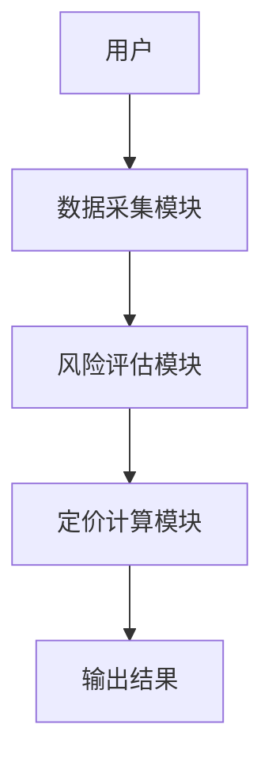

                 


# 地缘政治风险定价：如何在投资决策中考虑政治因素

> **关键词**：地缘政治风险、投资决策、风险定价、政治因素、资产定价模型、风险评估、政治稳定性

> **摘要**：地缘政治风险是投资决策中不可忽视的重要因素。本文将详细探讨地缘政治风险的定义、分类及其对投资的影响，介绍地缘政治风险定价的方法和模型，通过实际案例分析和系统架构设计，展示如何在投资决策中有效考虑政治因素，提供详细的数学模型和公式，以及项目实战的代码实现和应用解读。最后，总结最佳实践和未来展望。

---

## 第1章: 引言

### 1.1 地缘政治风险定价的定义与重要性

地缘政治风险是指由于政治因素（如战争、政策变化、国际关系紧张等）可能导致的投资损失或收益波动的风险。在投资决策中，地缘政治风险的定价是评估和量化这些风险的关键步骤，帮助投资者制定更稳健的投资策略。

### 1.2 问题背景与目标

投资决策中，地缘政治风险的影响往往被低估，但其潜在损失可能巨大。本文旨在探讨如何通过数学模型和系统架构，有效评估和定价地缘政治风险，为投资者提供科学依据。

---

## 第2章: 地缘政治风险的定义与分类

### 2.1 地缘政治风险的定义

地缘政治风险涉及国家间的冲突、政策变化、国际关系紧张等因素，影响资产的价值和投资回报。

### 2.2 地缘政治风险的分类

地缘政治风险可以分为国家风险、主权风险、政治风险等，每种风险都有其独特的评估指标和影响因素。

---

## 第3章: 地缘政治风险定价的核心概念

### 3.1 核心概念与术语

- **政治稳定性**：国家政治环境的稳定性，影响投资风险。
- **国际关系**：国家间的互动和冲突，影响地缘政治风险。
- **经济政策**：政府的经济政策变化，影响市场和资产价格。

### 3.2 地缘政治风险的量化指标

- **政治风险指数**：衡量国家政治风险的指标。
- **经济政策风险指数**：评估经济政策变化带来的风险。

---

## 第4章: 地缘政治风险定价的数学模型

### 4.1 风险定价的基本原理

风险定价基于风险中性原理，考虑风险溢价和资产定价模型。

### 4.2 资产定价模型

$$ P = \frac{C}{1 + r} $$

其中，\( r \) 包括地缘政治风险溢价。

### 4.3 风险溢价的计算

风险溢价可以通过历史数据和统计模型计算，例如：

$$ \text{风险溢价} = \alpha + \beta \times \text{风险指标} $$

---

## 第5章: 地缘政治风险定价的系统架构设计

### 5.1 系统功能设计

- **数据采集**：收集地缘政治事件和相关数据。
- **风险评估**：使用模型评估风险。
- **定价计算**：根据评估结果计算资产价格。

### 5.2 系统架构图



---

## 第6章: 项目实战与案例分析

### 6.1 案例分析

假设投资于某国家的债券，需考虑其政治稳定性。使用模型评估风险溢价，调整资产价格。

### 6.2 环境安装

安装Python和相关库，如NumPy和Pandas。

### 6.3 代码实现

```python
import numpy as np
import pandas as pd

# 示例数据
data = {'国家': ['A', 'B', 'C'], '风险指标': [0.8, 0.5, 0.7]}
df = pd.DataFrame(data)

# 计算风险溢价
alpha = 0.05
beta = 0.2
df['风险溢价'] = alpha + beta * df['风险指标']

# 计算资产价格
df['资产价格'] = 100 / (1 + df['风险溢价'])
print(df)
```

### 6.4 结果解读

通过代码计算出各国家的资产价格，帮助投资者调整投资策略。

---

## 第7章: 总结与展望

### 7.1 小结

本文详细探讨了地缘政治风险定价的方法和模型，通过案例分析和系统设计，展示了如何在投资决策中考虑政治因素。

### 7.2 注意事项

- 数据准确性影响结果，需谨慎处理。
- 模型需定期更新，以适应变化的地缘政治环境。

### 7.3 未来展望

未来，结合人工智能和大数据技术，进一步提升地缘政治风险定价的准确性和效率。

---

通过本文的分析，投资者可以更好地理解和量化地缘政治风险，制定更稳健的投资策略。

