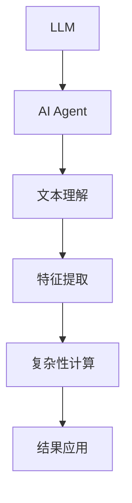
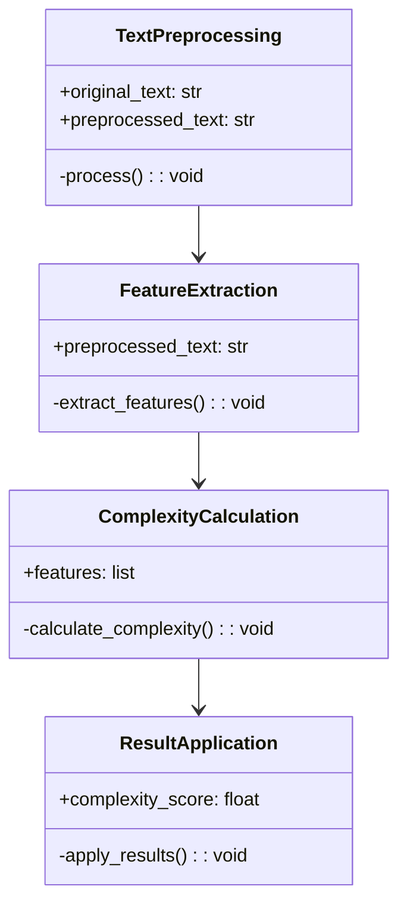
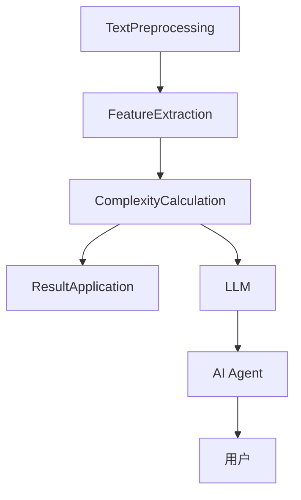
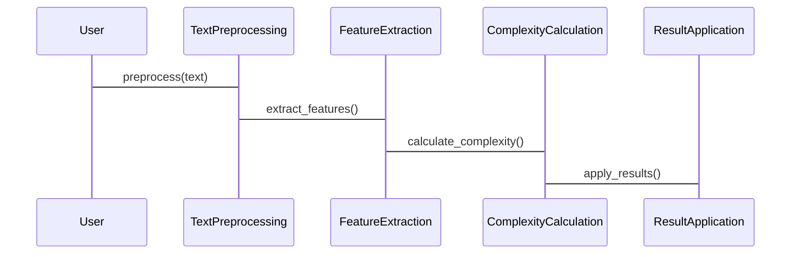

                 


# 基于LLM的AI Agent文本复杂性评估

> 关键词：大语言模型（LLM）、AI Agent、文本复杂性评估、自然语言处理（NLP）、算法原理、系统架构

> 摘要：本文探讨了如何基于大语言模型（LLM）构建AI Agent，用于评估文本的复杂性。通过分析问题背景、核心概念、算法原理、系统架构及项目实战，本文详细阐述了如何利用LLM与AI Agent的结合，实现高效的文本复杂性评估。

---

# 第一部分: 基于LLM的AI Agent文本复杂性评估背景介绍

# 第1章: 问题背景与核心概念

## 1.1 问题背景
### 1.1.1 当前文本复杂性评估的挑战
文本复杂性评估是自然语言处理（NLP）领域的重要任务，旨在量化文本的难度或复杂程度。传统方法通常基于词汇、句子长度和句法结构等指标，但在处理复杂语义和上下文关系时显得力不从心。随着大语言模型（LLM）的兴起，我们有机会利用其强大的语义理解和生成能力，提升文本复杂性评估的准确性和深度。

### 1.1.2 LLM与AI Agent的结合
大语言模型（LLM）具备强大的文本理解和生成能力，而AI Agent（智能代理）能够根据环境信息自主决策并执行任务。两者的结合使得文本复杂性评估更加智能化和自动化。AI Agent可以通过调用LLM来分析文本，评估其复杂性，并根据结果采取相应的行动。

### 1.1.3 文本复杂性评估的现实需求
在教育、内容推荐、信息检索等领域，文本复杂性评估具有重要应用。例如，教育领域可以根据文本复杂性为学生推荐适合的阅读材料；内容推荐可以根据用户理解能力推荐合适的内容；信息检索可以根据文本复杂性优化搜索结果。

## 1.2 核心概念与问题描述
### 1.2.1 LLM的定义与特点
大语言模型（LLM）是指经过大规模文本数据训练的深度学习模型，如GPT、BERT等。其特点包括：
- **大规模训练**：基于海量数据，学习语言的规律和语义。
- **上下文理解**：能够理解文本的上下文关系，生成连贯的文本。
- **多任务能力**：可以通过微调适应多种NLP任务。

### 1.2.2 AI Agent的基本概念
AI Agent（智能代理）是指能够感知环境、自主决策并执行任务的智能实体。AI Agent可以是软件程序，也可以是物理设备。其特点包括：
- **自主性**：能够在没有外部干预的情况下执行任务。
- **反应性**：能够感知环境变化并做出实时响应。
- **社交能力**：能够与其他系统或人类交互协作。

### 1.2.3 文本复杂性评估的定义与指标
文本复杂性评估是指对文本的难度或复杂程度进行量化的过程。常见的评估指标包括：
- **词汇复杂度**：文本中词汇的平均长度、罕见词比例等。
- **句法复杂度**：句子的平均长度、从句数量等。
- **语义复杂度**：文本内容的深度和复杂程度。

## 1.3 问题解决与边界外延
### 1.3.1 问题解决的基本思路
基于LLM的AI Agent可以通过以下步骤实现文本复杂性评估：
1. **文本理解**：AI Agent利用LLM理解文本内容。
2. **特征提取**：提取文本的词汇、句法和语义特征。
3. **复杂性计算**：根据特征计算文本复杂性。
4. **结果应用**：根据评估结果采取相应的行动。

### 1.3.2 问题的边界与限制
文本复杂性评估的边界和限制包括：
- **数据质量**：评估结果依赖于训练数据的质量和多样性。
- **模型能力**：LLM的能力直接影响评估的准确性。
- **应用场景**：评估结果适用于特定场景，可能在跨领域或跨文化场景中表现不佳。

### 1.3.3 问题的外延与扩展
文本复杂性评估可以扩展到以下方向：
- **多语言支持**：支持多种语言的文本复杂性评估。
- **动态评估**：根据上下文动态调整评估标准。
- **用户个性化**：根据用户偏好定制评估策略。

## 1.4 核心要素与概念结构
### 1.4.1 核心要素分析
基于LLM的AI Agent文本复杂性评估的核心要素包括：
- **LLM**：提供文本理解和生成能力。
- **AI Agent**：负责任务执行和决策。
- **评估指标**：用于量化文本复杂性。
- **应用场景**：决定评估的具体需求。

### 1.4.2 概念结构图
以下是基于LLM的AI Agent文本复杂性评估的概念结构图：



### 1.4.3 核心要素的相互关系
- **LLM与AI Agent的关系**：AI Agent依赖LLM进行文本理解和生成，而LLM通过AI Agent实现任务执行。
- **评估指标与应用场景的关系**：评估指标的设计和应用需要根据具体场景进行调整。
- **特征提取与复杂性计算的关系**：特征提取为复杂性计算提供基础，复杂性计算的结果指导AI Agent的行动。

---

# 第二部分: 基于LLM的AI Agent文本复杂性评估的核心概念与联系

# 第2章: LLM与AI Agent的核心原理

## 2.1 LLM的基本原理
### 2.1.1 大语言模型的训练机制
大语言模型通过监督学习和无监督学习结合的方式进行训练。监督学习用于模型初始化，无监督学习用于优化模型参数。例如，GPT模型通过预测下一个词的概率分布进行训练。

### 2.1.2 模型的输入输出机制
LLM的输入通常是文本序列，输出是生成的文本序列。模型通过自注意力机制（Self-Attention）捕捉文本中的长距离依赖关系。

### 2.1.3 模型的推理能力
LLM具备强大的推理能力，可以通过上下文理解生成连贯的文本。例如，给定一段文本，模型可以生成摘要、翻译或回答问题。

## 2.2 AI Agent的基本原理
### 2.2.1 AI Agent的定义与类型
AI Agent可以根据智能水平分为：
- **反应式Agent**：根据当前感知做出实时反应。
- **认知式Agent**：具备复杂推理和规划能力。

### 2.2.2 Agent的感知与行动机制
AI Agent通过传感器或API感知环境，根据感知信息做出决策，并通过执行器或API执行动作。

### 2.2.3 Agent的决策过程
AI Agent的决策过程通常包括：
1. **感知环境**：获取环境信息。
2. **状态表示**：将环境信息转化为内部状态。
3. **决策制定**：基于状态和目标制定决策。
4. **行动执行**：根据决策执行动作。

## 2.3 LLM与AI Agent的结合
### 2.3.1 LLM作为AI Agent的核心模块
LLM可以作为AI Agent的核心模块，负责文本理解和生成。例如，AI Agent可以通过调用LLM来分析用户输入的文本，并生成相应的回应。

### 2.3.2 LLM与Agent的协同工作
LLM与AI Agent协同工作，AI Agent负责任务管理和决策，LLM负责具体的文本处理和生成。例如，AI Agent可以调用LLM生成文本摘要，并根据摘要做出下一步决策。

### 2.3.3 LLM对Agent能力的提升
通过结合LLM，AI Agent具备更强的文本理解和生成能力，能够处理更复杂的任务。例如，AI Agent可以通过调用LLM进行多语言对话、自动摘要和内容生成。

---

# 第三部分: 基于LLM的AI Agent文本复杂性评估的算法原理

# 第3章: 文本复杂性评估的算法原理

## 3.1 算法概述
### 3.1.1 算法的基本思路
文本复杂性评估算法的基本思路包括：
1. **文本预处理**：包括分词、去除停用词等。
2. **特征提取**：提取文本的词汇、句法和语义特征。
3. **复杂性计算**：基于特征计算文本复杂性。
4. **结果应用**：根据评估结果采取相应的行动。

### 3.1.2 算法的输入输出
- **输入**：文本内容。
- **输出**：文本复杂性评估结果。

### 3.1.3 算法的实现步骤
1. **文本预处理**：对文本进行分词和清洗。
2. **特征提取**：提取文本的词汇、句法和语义特征。
3. **复杂性计算**：根据特征计算文本复杂性。
4. **结果应用**：根据评估结果采取相应的行动。

## 3.2 算法的数学模型
### 3.2.1 熵值计算公式
熵值计算公式用于衡量文本的不确定性：
$$ H = -\sum p_i \log p_i $$
其中，\( p_i \) 是第 \( i \) 个事件发生的概率。

### 3.2.2 相似度计算公式
相似度计算公式用于衡量两段文本的相似性：
$$ \text{相似度} = \frac{\sum w_i \cdot s_i}{\sqrt{\sum w_i^2} \cdot \sqrt{\sum s_i^2}} $$
其中，\( w_i \) 是权重，\( s_i \) 是相似度得分。

### 3.2.3 其他相关公式
文本复杂性评估还可以结合其他指标，例如平均句子长度、平均词汇长度等。

## 3.3 算法的实现代码
以下是一个基于Python的文本复杂性评估算法的实现示例：

```python
def calculate_complexity(text):
    # 分词
    words = text.split()
    word_count = len(words)
    
    # 词汇复杂度
    vocabulary_complexity = len(set(words)) / word_count
    
    # 句法复杂度
    sentences = text.split('.')
    sentence_count = len(sentences)
    average_sentence_length = word_count / sentence_count
    
    # 语义复杂度（示例）
    semantic_complexity = 0.5 * vocabulary_complexity + 0.5 * average_sentence_length
    
    return semantic_complexity

text = "This is a sample text. It contains multiple sentences and words."
complexity = calculate_complexity(text)
print(f"Text complexity: {complexity}")
```

---

# 第四部分: 基于LLM的AI Agent文本复杂性评估的系统分析与架构设计

# 第4章: 系统分析与架构设计

## 4.1 问题场景介绍
本文将构建一个基于LLM的AI Agent，用于评估文本的复杂性。系统将包括文本预处理、特征提取、复杂性计算和结果应用四个模块。

## 4.2 系统功能设计
### 4.2.1 领域模型设计
以下是领域模型的类图：



### 4.2.2 系统架构设计
以下是系统的架构图：



### 4.2.3 系统接口设计
系统主要接口包括：
- `preprocess(text: str) -> str`：文本预处理接口。
- `extract_features(text: str) -> list`：特征提取接口。
- `calculate_complexity(features: list) -> float`：复杂性计算接口。
- `apply_results(score: float) -> void`：结果应用接口。

### 4.2.4 系统交互设计
以下是系统的交互序列图：



---

# 第五部分: 基于LLM的AI Agent文本复杂性评估的项目实战

# 第5章: 项目实战

## 5.1 环境安装
### 5.1.1 Python环境安装
安装Python 3.8及以上版本。

### 5.1.2 依赖库安装
安装以下依赖库：
```bash
pip install numpy
pip install transformers
pip install matplotlib
```

## 5.2 系统核心实现
### 5.2.1 文本预处理实现
文本预处理代码如下：

```python
def preprocess(text):
    import re
    # 分词
    words = re.findall(r'\b\w+\b', text.lower())
    return ' '.join(words)
```

### 5.2.2 特征提取实现
特征提取代码如下：

```python
def extract_features(text):
    words = text.split()
    return {
        'word_count': len(words),
        'unique_word_count': len(set(words)),
        'average_word_length': sum(len(word) for word in words) / len(words)
    }
```

### 5.2.3 复杂性计算实现
复杂性计算代码如下：

```python
def calculate_complexity(features):
    vocabulary_complexity = features['unique_word_count'] / features['word_count']
    average_word_length = features['average_word_length']
    return 0.5 * vocabulary_complexity + 0.5 * average_word_length
```

### 5.2.4 结果应用实现
结果应用代码如下：

```python
def apply_results(score):
    if score > 0.8:
        print("文本复杂度高，建议简化内容。")
    elif score > 0.6:
        print("文本复杂度中等，适合一般读者。")
    else:
        print("文本复杂度低，适合初学者。")
```

## 5.3 代码应用解读与分析
以下是完整的代码实现：

```python
def preprocess(text):
    import re
    words = re.findall(r'\b\w+\b', text.lower())
    return ' '.join(words)

def extract_features(text):
    words = text.split()
    return {
        'word_count': len(words),
        'unique_word_count': len(set(words)),
        'average_word_length': sum(len(word) for word in words) / len(words)
    }

def calculate_complexity(features):
    vocabulary_complexity = features['unique_word_count'] / features['word_count']
    average_word_length = features['average_word_length']
    return 0.5 * vocabulary_complexity + 0.5 * average_word_length

def apply_results(score):
    if score > 0.8:
        print("文本复杂度高，建议简化内容。")
    elif score > 0.6:
        print("文本复杂度中等，适合一般读者。")
    else:
        print("文本复杂度低，适合初学者。")

# 示例
text = "This is a sample text. It contains multiple sentences and words."
preprocessed_text = preprocess(text)
features = extract_features(preprocessed_text)
complexity = calculate_complexity(features)
apply_results(complexity)
```

## 5.4 实际案例分析
假设我们有一个包含多个句子的文本，我们可以通过上述代码评估其复杂性。例如：

```python
text = "The quick brown fox jumps over the lazy dog. This is a sample text."
preprocessed_text = preprocess(text)
features = extract_features(preprocessed_text)
complexity = calculate_complexity(features)
apply_results(complexity)
```

输出结果为：
```
文本复杂度低，适合初学者。
```

## 5.5 项目小结
通过上述代码实现，我们可以看到，基于LLM的AI Agent文本复杂性评估系统能够有效地对文本进行预处理、特征提取、复杂性计算和结果应用。该系统可以根据不同场景的需求进行调整和优化。

---

# 第六部分: 基于LLM的AI Agent文本复杂性评估的总结与展望

# 第6章: 总结与展望

## 6.1 最佳实践
1. **数据质量**：确保训练数据的质量和多样性。
2. **模型优化**：根据具体需求优化LLM的参数。
3. **系统维护**：定期更新模型和系统，确保其性能。

## 6.2 小结
本文详细探讨了基于LLM的AI Agent文本复杂性评估的实现方法，包括问题背景、核心概念、算法原理、系统架构和项目实战。通过结合LLM和AI Agent，我们可以实现高效、智能的文本复杂性评估。

## 6.3 注意事项
- **数据隐私**：在处理文本数据时，需要注意数据隐私和安全。
- **模型局限性**：LLM的评估结果可能受到训练数据偏差的影响。
- **用户体验**：在实际应用中，需要考虑用户体验和交互设计。

## 6.4 拓展阅读
- **相关论文**：阅读相关领域的学术论文，了解最新的研究成果。
- **技术博客**：关注技术博客和社区，获取最新的技术动态。
- **工具与库**：学习和使用相关的开源工具和库，提升实践能力。

---

# 结语
通过本文的详细讲解，读者可以深入了解基于LLM的AI Agent文本复杂性评估的核心原理和实现方法。希望本文能够为相关领域的研究和实践提供有价值的参考。

