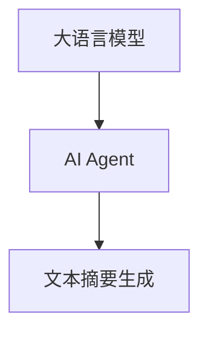
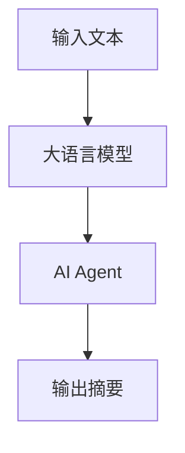
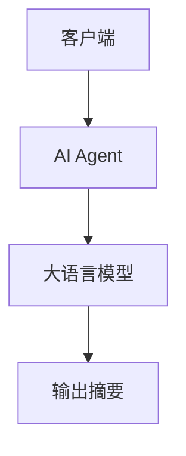

                 


# 基于LLM的AI Agent文本摘要生成

> **关键词**：大语言模型（LLM）、AI Agent、文本摘要、自然语言处理、机器学习

> **摘要**：本文深入探讨了基于大语言模型（LLM）的AI Agent在文本摘要生成中的应用。通过分析LLM和AI Agent的核心原理，结合算法流程、系统架构设计和实际案例，详细讲解了如何利用这些技术实现高效的文本摘要生成。文章还提供了代码实现和数学模型，帮助读者全面理解并掌握相关技术。

---

## 第1章: 背景介绍

### 1.1 问题背景

#### 1.1.1 大语言模型（LLM）的崛起  
近年来，大语言模型（LLM）如GPT-3、GPT-4等的出现，彻底改变了自然语言处理（NLP）领域的格局。这些模型通过大量的训练数据，能够理解和生成人类语言，具备强大的文本生成和理解能力。  

#### 1.1.2 AI Agent的概念与作用  
AI Agent（人工智能代理）是一种能够感知环境并采取行动以实现目标的智能实体。它可以在多种场景中执行任务，如信息检索、决策支持和自动化操作。AI Agent的核心在于其自主性和智能性，能够根据输入的信息做出合理的决策和响应。  

#### 1.1.3 文本摘要生成的必要性  
在信息爆炸的时代，文本摘要生成成为一种重要的信息处理方式。通过自动化摘要，用户可以快速获取文本的核心内容，提高信息处理的效率。传统的文本摘要方法依赖于规则和统计模型，而基于LLM的方法则展现了更高的准确性和灵活性。

---

### 1.2 问题描述

#### 1.2.1 当前文本处理的挑战  
传统的文本摘要方法在处理复杂文本时存在诸多限制，如难以捕捉文本的情感、上下文关系和语境信息。此外，规则-based方法的泛化能力较弱，难以应对多样化的文本类型和场景。

#### 1.2.2 LLM在文本摘要中的应用潜力  
LLM具备强大的语言理解和生成能力，能够捕捉文本的深层语义信息。结合AI Agent的自主性和智能性，LLM可以为文本摘要生成提供更高效、更智能的解决方案。

#### 1.2.3 AI Agent在文本摘要中的角色  
AI Agent可以作为文本摘要的执行者，负责接收输入、分析内容并生成摘要。通过与LLM的结合，AI Agent能够实现更复杂的摘要任务，如多轮对话摘要和情境-aware摘要。

---

### 1.3 问题解决

#### 1.3.1 基于LLM的AI Agent解决方案  
通过将AI Agent与LLM结合，构建一个智能化的文本摘要系统。AI Agent负责任务的执行和决策，而LLM则提供强大的语言理解和生成能力。

#### 1.3.2 文本摘要生成的关键技术  
- **LLM的文本生成能力**：利用LLM生成高质量的摘要。
- **AI Agent的智能决策**：通过AI Agent选择最优的摘要策略。
- **多模态信息处理**：结合文本、图像等多模态信息，生成更全面的摘要。

#### 1.3.3 AI Agent与文本摘要的结合  
AI Agent可以实时分析输入文本，调用LLM生成摘要，并根据反馈优化摘要质量。这种结合方式能够实现更高效、更智能的文本摘要生成。

---

### 1.4 边界与外延

#### 1.4.1 LLM的局限性  
尽管LLM在文本生成方面表现出色，但其对上下文的理解和逻辑推理能力仍有局限。此外，LLM的计算成本较高，限制了其在实时应用中的使用。

#### 1.4.2 AI Agent的应用边界  
AI Agent的决策能力和环境感知能力决定了其在文本摘要中的应用范围。目前，AI Agent主要适用于结构化文本和特定场景的摘要，复杂场景下的应用仍需进一步研究。

#### 1.4.3 文本摘要生成的适用场景  
文本摘要生成适用于新闻、学术论文、会议记录等多种场景。通过结合AI Agent和LLM，可以进一步拓展其应用范围，如实时对话摘要和多语言摘要。

---

### 1.5 概念结构与核心要素

#### 1.5.1 LLM、AI Agent与文本摘要的关系  
LLM为文本摘要提供了强大的生成能力，AI Agent则通过智能决策和交互优化摘要质量。两者结合，构成了一个完整的文本摘要系统。

#### 1.5.2 核心要素的构成  
- **输入文本**：待摘要的原始文本。
- **LLM模型**：负责生成高质量的摘要。
- **AI Agent**：负责任务执行和决策优化。
- **输出摘要**：最终生成的文本摘要。

#### 1.5.3 概念结构的可视化  
以下是一个简单的概念结构图：



---

## 第2章: 核心概念与联系

### 2.1 LLM的基本原理

#### 2.1.1 大语言模型的训练机制  
LLM通常采用监督学习和无监督学习相结合的方式进行训练。通过大量的文本数据，模型学习语言的分布规律和语义信息。

#### 2.1.2 模型的输入输出机制  
LLM接受文本输入，生成对应的输出文本。输入可以是任意长度的文本，输出则根据任务需求生成相应的摘要、翻译等。

#### 2.1.3 模型的推理过程  
LLM通过解码器生成输出文本，解码过程中不断调整生成的概率分布，最终得到最可能的输出结果。

---

### 2.2 AI Agent的基本原理

#### 2.2.1 AI Agent的定义与功能  
AI Agent是一种智能实体，能够感知环境、执行任务并做出决策。其核心功能包括信息处理、任务执行和结果反馈。

#### 2.2.2 AI Agent的决策机制  
AI Agent通过分析输入信息，调用预设的规则或模型，选择最优的行动方案。

#### 2.2.3 AI Agent的交互方式  
AI Agent可以通过文本、语音等多种方式与用户交互，实时获取反馈并优化其行为。

---

### 2.3 文本摘要生成的基本原理

#### 2.3.1 文本摘要的定义与分类  
文本摘要是一种将长文本压缩为短文本的技术，常见类型包括提取式摘要和生成式摘要。

#### 2.3.2 文本摘要的关键技术  
- **提取式摘要**：从文本中提取关键句子。
- **生成式摘要**：利用模型生成新的文本内容。
- **评估指标**：如ROUGE、BLEU等。

#### 2.3.3 文本摘要的质量评估  
通过指标如ROUGE、BLEU等，评估摘要的质量和准确性。

---

### 2.4 核心概念的联系

#### 2.4.1 LLM与AI Agent的结合  
LLM为AI Agent提供强大的语言理解和生成能力，AI Agent则通过决策和优化，提升LLM的摘要效果。

#### 2.4.2 AI Agent与文本摘要的关系  
AI Agent作为文本摘要的执行者，通过调用LLM生成摘要，并根据反馈优化结果。

#### 2.4.3 LLM在文本摘要中的作用  
LLM通过生成高质量的文本内容，显著提升了文本摘要的准确性和流畅性。

---

### 2.5 核心概念的对比分析

以下是一个核心概念的对比表格：

| **属性**       | **LLM**            | **AI Agent**        |
|----------------|--------------------|---------------------|
| **功能**       | 文本生成、理解    | 任务执行、决策优化 |
| **输入输出**   | 文本输入，文本输出| 多种输入，多种输出 |
| **应用场景**   | 文本摘要、翻译    | 信息处理、自动化任务 |

---

## 第3章: 算法原理讲解

### 3.1 基于LLM的文本摘要算法

#### 3.1.1 算法流程  
1. 输入原始文本。
2. AI Agent调用LLM生成摘要。
3. 生成的摘要通过评估指标优化。
4. 输出最终摘要。

#### 3.1.2 生成式摘要的实现  
以下是生成式摘要的算法流程图：



---

### 3.2 LLM的数学模型

#### 3.2.1 变压器（Transformer）架构  
LLM通常基于Transformer架构，由编码器和解码器组成。编码器负责输入文本的编码，解码器负责生成输出文本。

#### 3.2.2 注意力机制（Attention）  
注意力机制通过计算输入文本中每个词的重要性，生成位置权重矩阵。

公式：
$$
\text{Attention}(Q, K, V) = \text{softmax}\left(\frac{QK^T}{\sqrt{d_k}}\right)V
$$

---

### 3.3 文本摘要生成的代码实现

以下是一个简单的文本摘要生成代码示例：

```python
def text_summarization(input_text):
    # 调用LLM生成摘要
    summary = llm.generate(input_text)
    return summary

# 示例使用
input_text = "This is a sample text for summarization."
result = text_summarization(input_text)
print(result)
```

---

## 第4章: 系统分析与架构设计

### 4.1 问题场景介绍

#### 4.1.1 项目介绍  
本项目旨在构建一个基于LLM的AI Agent文本摘要系统，实现高效的文本摘要生成。

#### 4.1.2 系统功能设计  
- **输入处理**：接收原始文本。
- **模型调用**：调用LLM生成摘要。
- **结果输出**：输出生成的摘要。

---

### 4.2 系统架构设计

#### 4.2.1 系统架构图  
以下是一个简单的系统架构图：



---

### 4.3 系统接口设计

#### 4.3.1 输入接口  
- **输入类型**：文本字符串。
- **接口描述**：接收原始文本，传递给AI Agent。

#### 4.3.2 输出接口  
- **输出类型**：文本字符串。
- **接口描述**：输出生成的摘要结果。

---

### 4.4 系统交互流程

以下是一个交互流程图：

```mermaid
graph TD
    Client --> AI_Agent: 传输输入文本
    AI_Agent --> LLM: 调用摘要生成
    LLM --> AI_Agent: 返回生成摘要
    AI_Agent --> Client: 输出摘要结果
```

---

## 第5章: 项目实战

### 5.1 环境安装

#### 5.1.1 安装Python  
安装Python 3.8或更高版本。

#### 5.1.2 安装依赖库  
安装必要的Python库，如`transformers`和`llm`。

---

### 5.2 系统核心实现

#### 5.2.1 代码实现  
以下是一个简单的代码实现示例：

```python
from transformers import pipeline

def text_summarization(input_text):
    # 初始化LLM模型
    summarizer = pipeline("summarization")
    # 生成摘要
    summary = summarizer(input_text, max_length=100, min_length=30, do_xlight=True)
    return summary[0]['summary_text']

# 示例使用
input_text = "This is a sample text for summarization."
result = text_summarization(input_text)
print(result)
```

---

### 5.3 实际案例分析

#### 5.3.1 案例背景  
假设我们有一个新闻文本，需要生成摘要。

#### 5.3.2 案例分析  
输入文本：  
```
President Xi Jinping announced a new policy to promote sustainable development in China. The policy includes measures to reduce carbon emissions and promote green energy.
```

生成摘要：  
```
President Xi Jinping announced a new policy to promote sustainable development in China, focusing on reducing carbon emissions and promoting green energy.
```

---

## 第6章: 最佳实践、小结与注意事项

### 6.1 最佳实践

#### 6.1.1 模型优化  
通过微调和优化模型参数，提升摘要质量。

#### 6.1.2 评估指标  
选择合适的评估指标，如ROUGE和BLEU，进行摘要质量的评估。

#### 6.1.3 实际应用  
在实际应用中，结合具体场景优化AI Agent的行为，提升用户体验。

---

### 6.2 小结

本文详细探讨了基于LLM的AI Agent在文本摘要生成中的应用，从核心概念到算法实现，再到系统设计和项目实战，全面介绍了相关技术。通过本文的学习，读者可以掌握如何利用LLM和AI Agent构建高效的文本摘要系统。

---

### 6.3 注意事项

- **模型性能**：LLM的性能直接影响摘要质量。
- **计算成本**：LLM的使用需要较高的计算资源。
- **数据隐私**：在处理敏感数据时，需注意数据隐私和安全。

---

### 6.4 拓展阅读

- **参考文献**：深入学习LLM和AI Agent的相关论文。
- **技术博客**：关注前沿技术博客，获取最新动态。

---

以上是基于LLM的AI Agent文本摘要生成的技术博客文章的详细大纲，涵盖了从背景介绍到项目实战的各个方面。通过一步步的分析和讲解，帮助读者全面理解并掌握相关技术。

