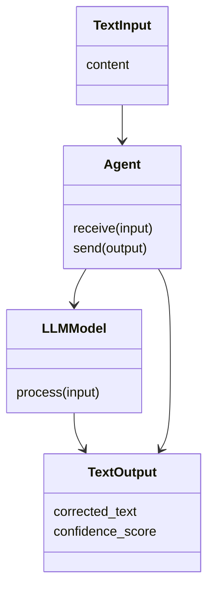
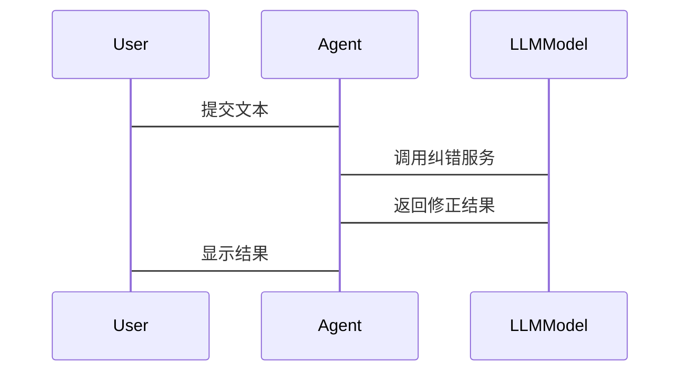

                 


# 基于LLM的AI Agent文本纠错系统

## 关键词：LLM, AI Agent, 文本纠错, 大语言模型, 自然语言处理, 系统架构

## 摘要：  
本文探讨了如何利用大语言模型（LLM）和AI Agent构建高效的文本纠错系统。文章从背景介绍、核心概念、算法原理、系统架构到项目实战，全面解析了基于LLM的AI Agent文本纠错系统的实现过程，帮助读者深入了解其技术细节和应用场景。

---

# 第一部分: 基于LLM的AI Agent文本纠错系统背景介绍

## 第1章: 问题背景与描述

### 1.1 问题背景

#### 1.1.1 当前文本纠错技术的发展现状
文本纠错是自然语言处理（NLP）领域的重要任务，传统方法依赖于词典、语法分析和规则匹配，存在纠错范围有限、效率低下的问题。近年来，随着深度学习技术的发展，基于神经网络的文本纠错模型逐渐成为研究热点。

#### 1.1.2 LLM在文本纠错中的优势
大语言模型（LLM）通过海量数据训练，具备强大的上下文理解和生成能力，能够处理复杂的语言现象，提供更精准的纠错结果。

#### 1.1.3 AI Agent在文本纠错中的角色
AI Agent作为系统的核心组件，负责接收用户的输入、调用纠错模型并返回结果，能够实现人机交互和任务自动化。

### 1.2 问题描述

#### 1.2.1 文本纠错的核心问题
文本纠错旨在检测并修正文本中的语法错误、拼写错误和表达不清的问题，提升文本的质量。

#### 1.2.2 基于LLM的文本纠错挑战
LLM在处理复杂语境时可能存在误判，如何优化模型的纠错准确性是当前研究的难点。

#### 1.2.3 AI Agent在纠错中的任务定义
AI Agent需要解析用户意图，调用纠错模型，并以自然语言形式反馈结果。

## 第2章: 问题解决与边界

### 2.1 问题解决思路

#### 2.1.1 基于LLM的文本纠错方法
通过预训练的LLM生成候选修正，并结合置信度评估选择最优结果。

#### 2.1.2 AI Agent在纠错中的具体实现
AI Agent负责接收输入、调用纠错模型、返回结果，并处理用户反馈。

#### 2.1.3 系统设计的整体思路
系统采用模块化设计，包括输入解析、纠错模型调用、结果反馈和用户交互等模块。

### 2.2 系统边界与外延

#### 2.2.1 系统功能边界
系统专注于文本纠错，不涉及语法解释或改写服务。

#### 2.2.2 系统适用场景
适用于多种文本类型，包括英文和中文，支持长文本处理。

#### 2.2.3 系统的可扩展性
系统设计支持模型迭代和功能扩展，便于集成其他NLP任务。

## 第3章: 核心概念与要素

### 3.1 核心概念

#### 3.1.1 大语言模型（LLM）的定义
LLM是基于Transformer架构的大规模预训练模型，能够处理复杂的语言任务。

#### 3.1.2 AI Agent的基本概念
AI Agent是一种智能体，能够感知环境、执行任务并与其他实体交互。

#### 3.1.3 文本纠错系统的构成要素
系统包括输入模块、纠错模型、结果反馈模块和用户交互模块。

### 3.2 核心要素对比

#### 3.2.1 LLM与传统NLP模型的对比
| 对比维度 | LLM | 传统NLP模型 |
|----------|-----|-------------|
| 数据量   | 大  | 小          |
| 任务通用性 | 高 | 低          |
| 模型复杂度 | 高 | 中          |

#### 3.2.2 AI Agent与传统文本纠错工具的对比
| 对比维度 | AI Agent | 传统工具 |
|----------|-----------|----------|
| 智能性   | 高        | 低       |
| 交互性   | 高        | 低       |
| 可扩展性 | 高        | 低       |

---

# 第二部分: 核心概念与联系

## 第4章: LLM与AI Agent的核心原理

### 4.1 LLM的基本原理

#### 4.1.1 大语言模型的训练机制
LLM通过自监督学习，在海量数据上预训练，学习语言的分布特征。

#### 4.1.2 模型的编码与解码过程
编码器将输入文本转化为隐藏层表示，解码器生成修正后的文本。

#### 4.1.3 模型的注意力机制
注意力机制帮助模型关注输入中的重要部分，提升生成质量。

### 4.2 AI Agent的基本原理

#### 4.2.1 AI Agent的定义与功能
AI Agent通过感知环境和执行动作，完成用户指定的任务。

#### 4.2.2 Agent的感知与决策过程
Agent接收用户输入，调用纠错模型，分析结果并返回给用户。

#### 4.2.3 Agent与用户交互的实现
通过自然语言接口，Agent与用户进行实时交互，提供纠错服务。

## 第5章: 算法原理与实现

### 5.1 基于LLM的文本纠错算法

#### 5.1.1 模型输入与输出
输入：原始文本；输出：修正后的文本及置信度分数。

#### 5.1.2 模型调优策略
采用交叉验证和损失函数优化，提升模型的纠错准确率。

#### 5.1.3 置信度评估
通过概率分布计算生成文本的置信度，选择最优结果。

### 5.2 AI Agent的实现细节

#### 5.2.1 用户输入解析
解析用户的输入内容，识别需要纠错的部分。

#### 5.2.2 模型调用与结果处理
将解析后的文本输入纠错模型，获取修正结果并格式化输出。

#### 5.2.3 系统反馈机制
根据用户反馈优化模型参数，提升纠错效果。

---

# 第三部分: 系统分析与架构设计

## 第6章: 系统分析

### 6.1 问题场景介绍
系统需要支持多种语言和文本类型，具备高可用性和可扩展性。

### 6.2 系统功能设计

#### 6.2.1 领域模型类图


### 6.3 系统架构设计

#### 6.3.1 系统架构图
```mermaid
client
    interface
        Agent
    server
        LLMModel
```

#### 6.3.2 接口设计
- 输入接口：接收用户文本请求。
- 输出接口：返回纠错结果和置信度评分。

### 6.4 系统交互序列图

#### 6.4.1 纠错流程


---

# 第四部分: 项目实战

## 第7章: 环境安装与核心代码实现

### 7.1 环境安装
安装Python、LLM库（如Hugging Face）和相关依赖。

### 7.2 核心代码实现

#### 7.2.1 输入解析模块
```python
def parse_input(text):
    return text.strip()
```

#### 7.2.2 模型调用模块
```python
from transformers import pipeline

corrector = pipeline("text-generation", model="gpt2")
```

#### 7.2.3 结果处理模块
```python
def process_output(outputs):
    return outputs[0].generated_text
```

### 7.3 代码解读与分析
详细解释每个模块的功能，确保读者能够理解代码逻辑。

## 第8章: 实际案例分析

### 8.1 案例分析
通过具体案例展示系统的纠错过程和结果。

### 8.2 优化与调整
根据测试结果优化模型参数，提升纠错准确率。

---

# 第五部分: 总结与展望

## 第9章: 总结

### 9.1 最佳实践 tips
- 定期更新模型，保持纠错能力。
- 优化用户交互体验，提升系统易用性。

### 9.2 系统小结
基于LLM的AI Agent文本纠错系统具备高准确率和良好的扩展性。

### 9.3 注意事项
注意模型的训练数据质量和用户反馈的及时性。

## 第10章: 拓展阅读

### 10.1 相关技术
推荐相关的技术文献和工具，帮助读者深入研究。

### 10.2 未来发展方向
探讨LLM和AI Agent在其他NLP任务中的应用潜力。

---

通过以上步骤，我们可以构建一个基于LLM的AI Agent文本纠错系统，为用户提供高效、准确的纠错服务。

