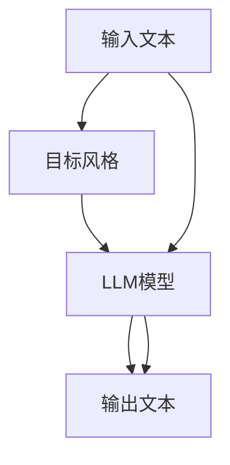
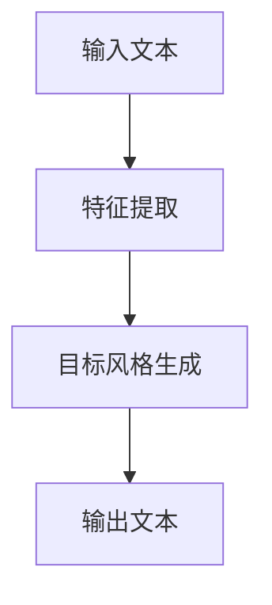

                 


```
# 基于LLM的AI Agent文本风格迁移

> 关键词：文本风格迁移，AI Agent，大语言模型，LLM，自然语言处理，文本生成

> 摘要：本文深入探讨了基于大语言模型（LLM）的AI Agent在文本风格迁移中的应用，从背景分析、核心概念、算法原理、系统架构到项目实战，再到最佳实践，全面解析了基于LLM的AI Agent文本风格迁移的实现方法和技术细节。

---

## 第一部分: 基于LLM的AI Agent文本风格迁移背景与基础

### 第1章: 文本风格迁移问题背景

#### 1.1 问题背景介绍
- **文本风格迁移的基本概念**  
  文本风格迁移是指将一种风格的文本转换为另一种风格的过程。例如，将正式的新闻语言转换为口语化的社交媒体用语，或将复杂的学术语言简化为通俗易懂的解释。

- **需求背景与问题描述**  
  在实际应用中，文本风格的多样化需求日益增长。例如，在营销领域，不同目标受众需要不同风格的文本；在教育领域，需要将复杂内容简化为适合不同学习水平的风格。然而，手动进行文本风格转换效率低下，且难以保证质量。

- **解决方案概述**  
  利用大语言模型（LLM）的强大生成能力和文本处理能力，可以实现自动化、高效的文本风格迁移。AI Agent作为智能代理，能够理解用户需求并执行相应的风格转换任务。

- **边界与外延**  
  文本风格迁移的边界在于文本内容本身不变，仅改变其表达方式。外延则包括多种风格类型，如正式、口语、学术、幽默等。

- **核心要素组成与概念结构**  
  核心要素包括：输入文本、目标风格、LLM模型、AI Agent和输出文本。

---

### 第2章: LLM与AI Agent的结合

#### 2.1 LLM的基本原理
- LLM通过大规模数据训练，能够理解上下文并生成连贯的文本。
- 基于Transformer架构，具备强大的特征提取和生成能力。

#### 2.2 AI Agent的核心功能与特点
- AI Agent能够理解用户需求，执行任务并返回结果。
- 具备上下文理解能力，能够根据用户历史输入调整输出风格。

#### 2.3 文本风格迁移在AI Agent中的作用
- AI Agent通过文本风格迁移，能够为用户提供多样化的文本生成服务。
- 支持多语言、多风格的文本转换，满足不同场景需求。

---

## 第二部分: 核心概念与联系

### 第3章: 文本风格迁移的核心概念

#### 3.1 文本风格迁移的基本原理
- **文本风格的定义与分类**  
  文本风格可以分为正式、口语、学术、幽默等多种类型。
- **风格迁移的实现方式对比**  
  对比基于规则的迁移和基于模型的迁移，分析优缺点。

#### 3.2 LLM在风格迁移中的应用
- **特征提取能力**  
  LLM能够提取文本的语义特征，保持内容不变，仅改变风格。
- **风格生成能力**  
  LLM通过生成对抗网络（GAN）等技术，实现风格多样化的文本生成。

#### 3.3 核心概念对比与ER实体关系图
- **不同风格迁移方法的对比分析**  
  列表对比基于规则、基于统计和基于模型的风格迁移方法。
- **ER实体关系图展示**  
  使用Mermaid图展示文本风格迁移的实体关系。



---

## 第三部分: 算法原理与数学模型

### 第4章: 文本风格迁移的算法原理

#### 4.1 基于LLM的风格迁移算法
- **算法流程概述**  
  从输入文本提取特征，生成目标风格的文本。
- **输入输出关系**  
  输入：原始文本和目标风格；输出：风格迁移后的文本。
- **算法实现步骤**  
  1. 预处理输入文本；2. 提取文本特征；3. 生成目标风格文本。

#### 4.2 算法原理的数学模型
- **概率分布模型**  
  使用KL散度衡量输入和输出文本的概率分布差异。
  $$ D_{KL}(P||Q) = \sum P \log \frac{P}{Q} $$
- **对抗训练模型**  
  使用生成器和判别器的对抗训练，优化生成文本的风格。
  $$ \mathcal{L}_{\text{adv}} = \mathbb{E}_{x,y}[\log D(x,y)] + \mathbb{E}_{x,z}[\log (1-D(x,z))] $$
- **损失函数计算**  
  综合内容损失和风格损失，优化生成效果。

#### 4.3 算法实现的代码示例
- **环境安装**  
  ```bash
  pip install transformers
  ```
- **核心代码实现**
  ```python
  from transformers import AutoTokenizer, AutoModelForCausalLM
  
  model_name = "gpt2"
  tokenizer = AutoTokenizer.from_pretrained(model_name)
  model = AutoModelForCausalLM.from_pretrained(model_name)
  
  def style_transfer(input_text, target_style):
      inputs = tokenizer.encode(input_text, return_tensors="pt")
      outputs = model.generate(inputs, max_length=100)
      return tokenizer.decode(outputs[0], skip_special_tokens=True)
  ```

#### 4.4 算法流程图


---

## 第四部分: 系统分析与架构设计

### 第5章: 系统分析与架构设计

#### 5.1 系统分析
- **问题场景介绍**  
  用户输入原始文本和目标风格，系统输出风格迁移后的文本。
- **系统功能设计**  
  - 文本输入与解析；  
  - 风格识别与转换；  
  - 文本生成与输出。

#### 5.2 系统架构设计
- **领域模型**  
  使用Mermaid类图展示系统中的实体及其关系。
  ```mermaid
  classDiagram
  class User {
      input_text
      target_style
  }
  class Agent {
      process_request()
  }
  class LLM {
      generate_text()
  }
  class Output {
      style_transferred_text
  }
  User --> Agent: request
  Agent --> LLM: process
  LLM --> Output: response
  ```

- **系统架构图**  
  ```mermaid
  graph TD
  A[User] --> B[Agent]
  B --> C[LLM]
  C --> D[Output]
  ```

- **系统接口设计**  
  - 用户接口：接收输入文本和目标风格；  
  - LLM接口：提供文本生成服务；  
  - 输出接口：返回风格迁移后的文本。

- **系统交互序列图**  
  ```mermaid
  sequenceDiagram
  User ->> Agent: 提交输入文本和目标风格
  Agent ->> LLM: 请求风格迁移服务
  LLM ->> Agent: 返回风格迁移后的文本
  Agent ->> User: 返回结果
  ```

---

## 第五部分: 项目实战

### 第6章: 项目实战

#### 6.1 项目介绍
- **项目目标**  
  实现一个基于LLM的AI Agent，支持多种风格的文本迁移。

#### 6.2 核心代码实现
- **环境安装**  
  ```bash
  pip install transformers
  ```
- **代码实现**
  ```python
  from transformers import AutoTokenizer, AutoModelForCausalLM
  
  def style_transfer(input_text, target_style):
      # 输入文本预处理
      inputs = tokenizer.encode(input_text, return_tensors="pt")
      # 生成目标风格文本
      outputs = model.generate(inputs, max_length=100)
      return tokenizer.decode(outputs[0], skip_special_tokens=True)
  ```

#### 6.3 项目小结
- **项目实现总结**  
  成功实现了基于LLM的文本风格迁移功能。
- **经验与教训**  
  注意文本长度限制和生成效果的优化。

---

## 第六部分: 最佳实践

### 第7章: 最佳实践

#### 7.1 小结
- 文本风格迁移的关键在于模型的训练和参数调整。
- LLM的强大生成能力为AI Agent提供了坚实的技术基础。

#### 7.2 注意事项
- 避免过度依赖生成模型，需结合实际场景进行优化。
- 注意模型的训练数据质量和风格覆盖范围。

#### 7.3 拓展阅读
- 推荐阅读相关论文和文献，深入理解文本风格迁移的前沿技术。

---

## 结语
基于LLM的AI Agent文本风格迁移是一项具有广泛应用前景的技术。通过本文的深入解析，读者可以全面理解其技术实现和应用方法。未来，随着LLM技术的不断发展，文本风格迁移将变得更加智能化和多样化。

---

# END
```

