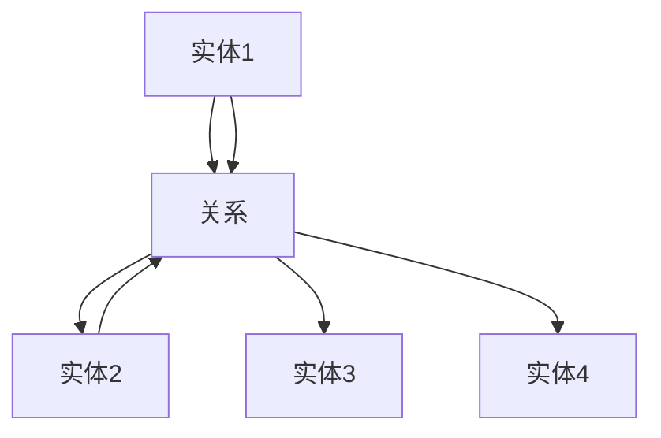
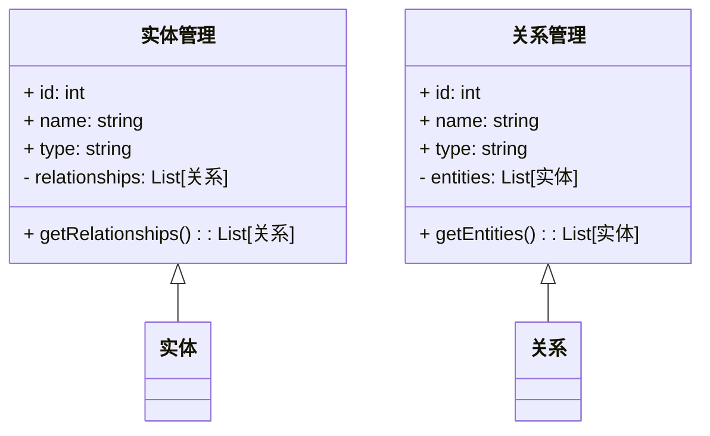

                 


# 基于LLM的AI Agent知识图谱构建

> 关键词：LLM, AI Agent, 知识图谱, 大语言模型, 知识构建, 实体关系, 图嵌入

> 摘要：本文详细探讨了基于大语言模型（LLM）构建AI Agent知识图谱的方法，从问题背景、核心概念到算法原理、系统架构，再到项目实战，全面解析知识图谱构建的流程和应用。

---

# 第一部分: 基于LLM的AI Agent知识图谱构建背景与核心概念

## 第1章: 问题背景与目标

### 1.1 问题背景

#### 1.1.1 知识图谱的定义与作用
知识图谱是一种以结构化形式表示知识的图数据库，通过三元组（实体-关系-实体）描述世界，广泛应用于搜索引擎、智能推荐和自然语言处理等领域。

#### 1.1.2 大语言模型（LLM）的崛起
大语言模型如GPT-3、PaLM等，具备强大的文本生成和理解能力，能够处理复杂语义，为知识图谱构建提供了新的可能性。

#### 1.1.3 AI Agent在智能系统中的角色
AI Agent作为智能系统的执行者，依赖知识图谱进行推理和决策，提升任务处理能力。

### 1.2 问题描述

#### 1.2.1 知识图谱构建的挑战
知识图谱构建涉及数据多样性、语义复杂性和知识覆盖性等问题，传统方法效率低下。

#### 1.2.2 LLM在知识图谱构建中的优势
LLM具备强大的上下文理解和生成能力，能够从文本中提取实体和关系，提高构建效率。

#### 1.2.3 AI Agent与知识图谱的结合需求
AI Agent需要实时更新的知识图谱支持，以适应动态环境和复杂任务需求。

### 1.3 问题解决与目标

#### 1.3.1 知识图谱构建的核心目标
构建动态、可扩展的知识图谱，支持AI Agent的智能决策。

#### 1.3.2 LLM在AI Agent中的具体应用
通过LLM提取知识图谱中的实体和关系，增强AI Agent的理解和推理能力。

#### 1.3.3 知识图谱构建的边界与外延
明确知识图谱的构建范围，确保覆盖所需领域，避免信息冗余。

## 第2章: 核心概念与联系

### 2.1 核心概念原理

#### 2.1.1 知识图谱的三元组表示
知识图谱由实体（node）和关系（edge）构成，三元组表示为（头实体，关系，尾实体）。

#### 2.1.2 大语言模型的文本理解能力
LLM能够理解上下文，提取实体和关系，为知识图谱构建提供语义支持。

#### 2.1.3 AI Agent的知识驱动机制
AI Agent通过知识图谱进行推理和决策，实现任务执行和问题解答。

### 2.2 核心概念属性对比

| 概念       | 特性1          | 特性2          | 特性3          |
|------------|---------------|---------------|---------------|
| 知识图谱    | 结构化表示      | 动态更新        | 可扩展性        |
| LLM        | 强大学习能力    | 多语言支持      | 实时生成能力    |
| AI Agent    | 自主决策能力    | 任务驱动        | 人机交互能力    |

### 2.3 ER实体关系图



---

# 第二部分: 知识图谱构建算法原理

## 第3章: 算法原理讲解

### 3.1 知识抽取算法

#### 3.1.1 基于LLM的实体识别
利用LLM识别文本中的实体，例如从句子中提取“苹果”作为实体。

#### 3.1.2 关系抽取的流程
通过LLM识别实体间的语义关系，例如“苹果”和“公司”之间的关系。

#### 3.1.3 实体链接算法
将实体映射到知识图谱中的标准实体，解决命名实体歧义问题。

### 3.2 知识融合算法

#### 3.2.1 基于向量的相似度计算
使用向量空间模型计算实体向量的相似度，例如余弦相似度。

#### 3.2.2 基于图的三元组合并
通过图结构合并相似的三元组，减少冗余信息。

#### 3.2.3 知识冲突的解决方法
通过投票机制或权重计算解决知识冲突，例如多数投票法。

### 3.3 知识表示与推理

#### 3.3.1 向量空间模型
使用向量表示实体和关系，例如词嵌入（Word2Vec）。

#### 3.3.2 图嵌入算法
通过图嵌入算法生成节点和边的向量表示，例如GraphSAGE。

#### 3.3.3 基于知识图谱的推理流程
通过路径分析和逻辑推理，从已知事实推导出新知识。

## 第4章: 数学模型与公式

### 4.1 向量空间模型

#### 4.1.1 向量表示公式
$$ \text{向量} = [w_1, w_2, ..., w_n] $$

#### 4.1.2 相似度计算公式
$$ \text{余弦相似度} = \frac{\vec{A} \cdot \vec{B}}{|\vec{A}| |\vec{B}|} $$

### 4.2 图嵌入算法

#### 4.2.1 节点嵌入公式
$$ e_v = \text{模型}(\text{输入}) $$

#### 4.2.2 边嵌入公式
$$ e_{u,v} = \text{模型}(\text{输入}) $$

---

# 第三部分: 系统分析与架构设计

## 第5章: 系统分析

### 5.1 问题场景介绍
构建一个支持动态更新的知识图谱系统，用于AI Agent的知识查询和推理。

### 5.2 系统功能设计

#### 5.2.1 领域模型


#### 5.2.2 系统架构


### 5.3 系统接口设计

#### 5.3.1 实体管理接口
```mermaid
sequenceDiagram
    客户端 -> API Gateway: 请求创建实体
    API Gateway -> 实体管理服务: 创建实体请求
    实体管理服务 -> 数据库: 储存实体
    返回客户端: 创建成功
```

---

## 第6章: 项目实战

### 6.1 环境安装

```bash
pip install python-mermaid
pip install spacy
pip install transformers
```

### 6.2 系统核心实现

```python
from transformers import pipeline
from spacy import load

def extract_entities(text):
    nlp = load("en_core_web_sm")
    doc = nlp(text)
    return [ent.text for ent in doc.ents]

def extract_relations(text):
    nlp = load("en_core_web_sm")
    doc = nlp(text)
    relations = []
    for i, token in enumerate(doc):
        if token.dep_ == 'ROOT':
            relations.append((token.lemma_, doc[i-1].lemma_, doc[i+1].lemma_))
    return relations
```

### 6.3 实际案例分析

#### 6.3.1 案例分析
案例文本：苹果公司是一家美国的科技公司。
- 实体：苹果公司、美国、科技公司
- 关系：苹果公司是美国的科技公司。

#### 6.3.2 详细讲解
通过LLM和NLP库提取实体和关系，构建动态知识图谱，支持AI Agent的智能决策。

---

## 第7章: 最佳实践与总结

### 7.1 最佳实践 tips
- 定期更新知识图谱以保持准确性。
- 使用分布式计算优化大规模知识图谱构建。
- 结合规则和LLM输出结果，提升准确性。

### 7.2 小结
本文详细介绍了基于LLM的AI Agent知识图谱构建方法，从理论到实践，全面解析了构建过程中的关键点。

### 7.3 注意事项
- 数据质量直接影响知识图谱的准确性。
- 注意模型的计算效率和资源消耗。

### 7.4 拓展阅读
- 《Large Language Models for Knowledge Graph Construction》
- 《Building Smart Agents with Knowledge Graphs》

---

# 结语

通过本文的系统介绍，读者可以全面了解基于LLM的AI Agent知识图谱构建方法，从理论到实践，掌握构建过程中的关键技术和注意事项。希望本文能为相关领域的研究和应用提供有价值的参考。

