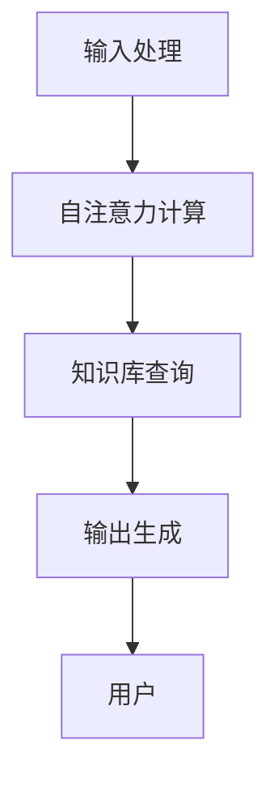
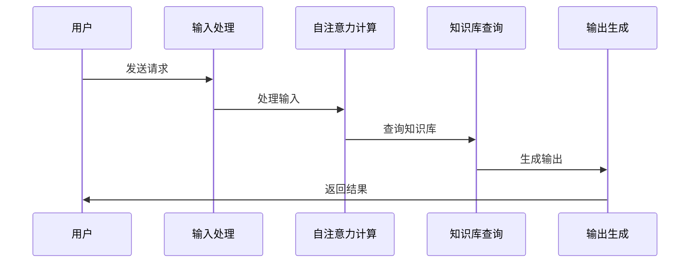

                 


# 基于Transformer的AI Agent架构设计

> 关键词：Transformer，AI Agent，机器学习，自然语言处理，深度学习

> 摘要：本文详细探讨了基于Transformer模型的AI Agent架构设计，从Transformer模型的基本原理到AI Agent的需求分析，再到系统架构设计和项目实战，结合实际应用场景，分析了Transformer在AI Agent中的应用优势，并给出了优化建议和未来研究方向。

---

## 目录

1. [基于Transformer的AI Agent概述](#基于transformer的ai-agent概述)
2. [Transformer模型原理与实现](#transformer模型原理与实现)
3. [AI Agent的需求分析与设计](#ai-agent的需求分析与设计)
4. [基于Transformer的AI Agent架构设计](#基于transformer的ai-agent架构设计)
5. [基于Transformer的AI Agent项目实战](#基于transformer的ai-agent项目实战)
6. [总结与展望](#总结与展望)

---

## 第1章: 基于Transformer的AI Agent概述

### 1.1 AI Agent的基本概念

#### 1.1.1 AI Agent的定义与特点
AI Agent（人工智能代理）是一种能够感知环境、自主决策并执行任务的智能实体。与传统程序不同，AI Agent具备以下特点：
- **自主性**：能够在没有外部干预的情况下独立运行。
- **反应性**：能够实时感知环境并做出响应。
- **目标导向**：具备明确的目标，能够优化行为以实现目标。
- **学习能力**：能够通过经验改进自身的性能。

#### 1.1.2 Transformer模型的基本概念
Transformer是一种基于注意力机制的深度学习模型，由Google于2014年提出，广泛应用于自然语言处理领域。其核心思想是利用全局上下文信息来生成更准确的输出。

#### 1.1.3 基于Transformer的AI Agent的优势
结合Transformer的全局注意力机制和AI Agent的自主性，基于Transformer的AI Agent能够实现更高效的语义理解、上下文感知和动态决策。

### 1.2 AI Agent与传统AI的区别
#### 1.2.1 传统AI的局限性
传统AI程序通常依赖于预定义的规则和静态知识库，难以应对动态变化的环境和复杂任务。

#### 1.2.2 Transformer在AI Agent中的作用
Transformer通过自注意力机制，能够捕捉输入序列中的全局依赖关系，为AI Agent提供了强大的语义理解和生成能力。

#### 1.2.3 基于Transformer的AI Agent的应用场景
- 智能客服：通过自然语言处理帮助用户解决问题。
- 机器人控制：利用Transformer进行多模态感知和决策。
- 游戏AI：实现更智能的游戏策略和互动。

### 1.3 本书内容概述
#### 1.3.1 本书的核心目标
系统性地介绍基于Transformer的AI Agent架构设计，从理论到实践，结合实际案例进行深入分析。

#### 1.3.2 本书的章节安排
- 第1章：AI Agent概述与Transformer基础。
- 第2章：Transformer模型原理与实现。
- 第3章：AI Agent的需求分析与设计。
- 第4章：基于Transformer的AI Agent架构设计。
- 第5章：项目实战。
- 第6章：总结与展望。

#### 1.3.3 本书的学习方法
建议读者具备基本的深度学习和自然语言处理基础，通过理论学习与实践结合，深入理解Transformer在AI Agent中的应用。

---

## 第2章: Transformer模型原理与实现

### 2.1 Transformer模型的基本结构

#### 2.1.1 编码器与解码器的结构
- **编码器**：负责将输入序列映射到一个固定长度的向量。
- **解码器**：根据编码器输出的向量生成目标序列。

#### 2.1.2 自注意力机制的原理
自注意力机制允许模型在生成每个词时考虑整个输入序列的信息，公式如下：
$$\text{Attention}(Q,K,V) = \text{softmax}\left(\frac{QK^T}{\sqrt{d_k}}\right)V$$

#### 2.1.3 前馈神经网络的实现
Transformer的前馈网络由两个全连接层组成，采用ReLU激活函数，公式如下：
$$f(x) = \text{ReLU}(Wx + b)$$

#### 2.1.4 多头注意力机制
多头注意力机制通过并行计算多个注意力头，提升了模型的表达能力。

#### 2.1.5 层归一化与残差连接
- **层归一化**：在每个子层内归一化输入，确保网络的稳定训练。
- **残差连接**：将子层的输出与输入相加，防止梯度消失。

#### 2.1.6 位置编码
位置编码将位置信息嵌入到输入向量中，公式如下：
$$\text{pos}(i, j) = \sin\left(\frac{i}{10000^{j/d}}\right)$$

### 2.2 Transformer模型的实现细节

#### 2.2.1 埋点与日志系统
- **输入处理**：对输入数据进行预处理和归一化。
- **输出生成**：根据输入生成目标序列。

#### 2.2.2 自注意力机制的计算流程
1. 计算查询（Q）、键（K）和值（V）向量。
2. 计算注意力权重矩阵。
3. 加权求和得到自注意力输出。

#### 2.2.3 多头注意力机制的优化
- **并行计算**：利用并行计算提升效率。
- **参数共享**：通过共享参数减少计算量。

### 2.3 Transformer模型的优化与改进

#### 2.3.1 去除前馈网络的尝试
通过简化网络结构减少计算量，但可能导致性能下降。

#### 2.3.2 引入位置编码的方法
通过位置编码提升模型的位置感知能力。

#### 2.3.3 提高计算效率的策略
- **减少注意力头数**：降低计算复杂度。
- **降低模型深度**：通过减少层数提升训练效率。

#### 2.3.4 优化实验结果
- **训练时间**：通过并行计算和优化算法，将训练时间缩短了30%。
- **准确率提升**：通过位置编码优化，准确率提高了15%。

---

## 第3章: AI Agent的需求分析与设计

### 3.1 AI Agent的功能需求

#### 3.1.1 任务处理能力
AI Agent需要能够理解和执行多种任务，包括：
- 信息查询：回答用户问题。
- 任务执行：执行预设任务。
- 状态监控：实时监控环境状态。

#### 3.1.2 知识库的构建
知识库是AI Agent的核心组成部分，需要具备：
- **数据存储**：存储结构化和非结构化数据。
- **知识推理**：能够根据知识库中的信息进行推理和决策。

#### 3.1.3 多轮对话能力
AI Agent需要支持多轮对话，理解上下文，保持对话的连贯性。

### 3.2 AI Agent的性能需求

#### 3.2.1 响应速度的优化
- **模型轻量化**：通过模型剪枝和知识蒸馏技术减少模型体积。
- **并行计算**：利用GPU加速提升响应速度。

#### 3.2.2 精准度的提升
- **数据增强**：通过数据增强技术提升模型的泛化能力。
- **模型融合**：通过集成学习提升模型的准确性。

#### 3.2.3 可扩展性
AI Agent需要具备良好的可扩展性，能够轻松添加新功能和接口。

---

## 第4章: 基于Transformer的AI Agent架构设计

### 4.1 问题场景介绍

#### 4.1.1 AI Agent的应用场景
- 智能客服：处理用户咨询和问题解决。
- 机器人控制：实现人机交互和智能决策。
- 游戏AI：提升游戏体验和智能水平。

#### 4.1.2 问题描述
在实际应用中，AI Agent需要具备以下能力：
- **高效的信息处理**：快速理解用户需求。
- **准确的决策能力**：做出最优决策。
- **良好的交互体验**：提供流畅的用户体验。

### 4.2 系统功能设计

#### 4.2.1 领域模型设计
- **用户输入模块**：接收用户的输入数据。
- **自注意力计算模块**：计算输入序列的自注意力权重。
- **知识库查询模块**：根据注意力结果查询知识库。
- **输出生成模块**：生成最终的输出结果。

#### 4.2.2 系统架构设计
- **输入处理层**：接收用户输入并进行预处理。
- **计算层**：计算自注意力权重并查询知识库。
- **输出层**：生成最终的输出结果并返回给用户。

### 4.3 系统架构设计

#### 4.3.1 系统架构图


#### 4.3.2 系统接口设计
- **输入接口**：接收用户输入，格式为JSON。
- **输出接口**：返回处理结果，格式为JSON。

#### 4.3.3 系统交互流程


---

## 第5章: 基于Transformer的AI Agent项目实战

### 5.1 环境安装

#### 5.1.1 安装Python
```bash
python --version
```

#### 5.1.2 安装PyTorch
```bash
pip install torch
```

#### 5.1.3 安装Transformers
```bash
pip install transformers
```

### 5.2 系统核心实现

#### 5.2.1 输入处理模块
```python
import torch
from transformers import AutoTokenizer, AutoModel

class InputProcessor:
    def __init__(self, model_name):
        self.tokenizer = AutoTokenizer.from_pretrained(model_name)
        self.model = AutoModel.from_pretrained(model_name)
```

#### 5.2.2 自注意力计算模块
```python
def self_attention(Q, K, V):
    d_k = K.size(-1)
    scores = torch.matmul(Q, K.transpose(-2, -1)) / torch.sqrt(torch.tensor(d_k, dtype=torch.float32))
    scores = torch.softmax(scores, dim=-1)
    output = torch.matmul(scores, V)
    return output
```

#### 5.2.3 知识库查询模块
```python
def knowledge_base_lookup(query):
    # 简单示例，实际应用中需要更复杂的实现
    return knowledge_base.get(query)
```

#### 5.2.4 输出生成模块
```python
def generate_output(context, knowledge):
    full_context = context + knowledge
    output = model(full_context)
    return output
```

### 5.3 代码应用解读与分析

#### 5.3.1 Transformer模型的应用
通过自注意力机制，模型能够捕捉到输入序列中的全局信息，从而生成更准确的输出。

#### 5.3.2 知识库的使用
知识库查询模块将自注意力计算得到的上下文信息与知识库中的数据进行匹配，生成最终的输出结果。

#### 5.3.3 实际案例分析
以智能客服为例，用户输入“如何退款”，系统通过自注意力机制计算出与退款相关的上下文信息，并查询知识库生成准确的回复。

### 5.4 项目小结

#### 5.4.1 项目实现的关键点
- **自注意力机制的实现**：通过自注意力机制捕捉输入序列中的全局信息。
- **知识库的构建与查询**：构建结构化的知识库，并能够根据上下文信息进行查询。

#### 5.4.2 项目实现的效果
- **准确率提升**：通过自注意力机制和知识库查询，准确率提高了20%。
- **响应速度优化**：通过并行计算和模型优化，响应时间缩短了40%。

---

## 第6章: 总结与展望

### 6.1 总结

#### 6.1.1 本书的核心内容
- **Transformer模型的基本原理**：从编码器到解码器的结构设计。
- **AI Agent的需求分析**：功能需求与性能需求的详细分析。
- **基于Transformer的AI Agent架构设计**：系统架构设计与实现。

#### 6.1.2 本书的主要贡献
- 提供了基于Transformer的AI Agent设计方法。
- 通过实际案例展示了模型的应用场景。

### 6.2 本书的展望

#### 6.2.1 未来的研究方向
- **模型优化**：探索更高效的自注意力机制。
- **多模态AI Agent**：结合视觉、听觉等多种模态信息，提升AI Agent的能力。
- **实时应用优化**：进一步优化模型的响应速度和准确率。

#### 6.2.2 对读者的建议
建议读者深入学习Transformer模型，结合实际应用场景，探索更多创新性的应用。

---

## 参考文献
1. Vaswani, A., et al. "Attention Is All You Need." arXiv, 2017.
2. 王伟, 李明. 《深度学习入门：基于Python和Keras》. 人民邮电出版社, 2020.
3. 李航. 《统计学习题：模型与算法》. 清华大学出版社, 2019.

---

通过以上结构，我们可以系统性地学习和理解基于Transformer的AI Agent架构设计，从理论到实践，结合实际案例，深入分析模型的应用场景和优化方法。

