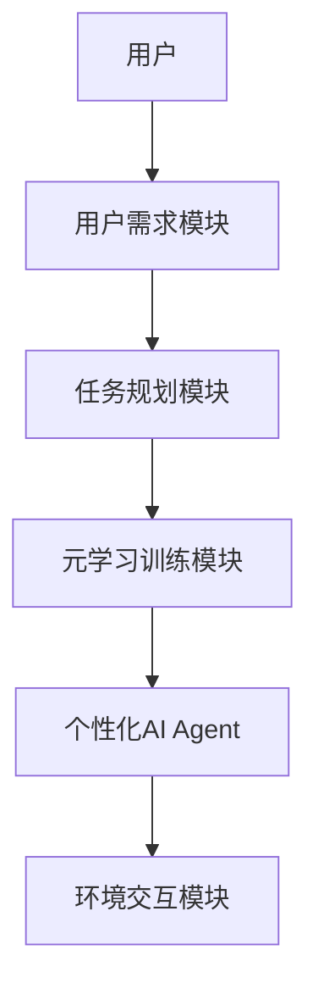

                 


# 基于元学习的个性化AI Agent定制

> 关键词：元学习，个性化AI Agent，MAML，ReMAML，Meta-LSTM，系统架构

> 摘要：本文探讨了基于元学习的个性化AI Agent定制方法，通过详细分析元学习的原理、算法实现以及系统架构，展示了如何利用元学习技术实现个性化AI Agent的高效定制与优化。

---

# 第一部分: 基于元学习的个性化AI Agent定制基础

## 第1章: 元学习与个性化AI Agent概述

### 1.1 元学习的基本概念

#### 1.1.1 元学习的定义与背景
元学习（Meta-Learning）是一种机器学习方法，旨在通过学习如何学习，使得模型能够快速适应新任务。传统机器学习算法需要大量标注数据和长时间训练，而元学习通过在任务间共享知识，显著减少了数据需求和训练时间。

#### 1.1.2 元学习的核心特点
- **快速适应新任务**：元学习模型能够通过少量样本快速适应新任务，适合数据稀疏场景。
- **任务间知识共享**：模型在多个任务上预训练，提取任务间的共性特征。
- **可解释性较低**：元学习模型通常复杂，导致可解释性较差。

#### 1.1.3 元学习与传统机器学习的对比
| 特性               | 元学习                | 传统机器学习           |
|--------------------|-----------------------|-----------------------|
| 数据需求           | 低                    | 高                    |
| 适应新任务速度     | 快                    | 慢                    |
| 任务间知识共享     | 是                   | 否                    |
| 可解释性           | 较低                 | 较高                 |

### 1.2 个性化AI Agent的定义与特点

#### 1.2.1 个性化AI Agent的定义
个性化AI Agent是根据用户需求定制的智能体，能够根据用户的偏好、行为和环境动态调整其行为策略。

#### 1.2.2 个性化AI Agent的核心属性
- **个性化推荐**：根据用户偏好提供定制化服务。
- **动态适应**：实时调整行为以应对环境变化。
- **高效决策**：快速做出最优决策。

#### 1.2.3 个性化AI Agent与传统AI Agent的区别
| 特性               | 个性化AI Agent       | 传统AI Agent          |
|--------------------|-----------------------|-----------------------|
| 定制化程度         | 高                    | 低                    |
| 适应能力           | 强                    | 弱                    |
| 用户参与度         | 高                    | 低                    |

### 1.3 元学习在个性化AI Agent中的应用前景

#### 1.3.1 元学习在AI Agent定制中的优势
- **快速适应用户需求**：元学习模型能够快速适应不同用户的个性化需求。
- **减少数据依赖**：通过元学习，AI Agent可以在数据稀缺的情况下仍然有效工作。
- **提高决策效率**：元学习使得AI Agent能够更快地做出决策。

#### 1.3.2 个性化AI Agent的潜在应用场景
- **智能助手**：如虚拟助手、智能音箱等。
- **推荐系统**：个性化推荐电影、音乐、商品等。
- **智能客服**：提供个性化的客户服务。

#### 1.3.3 元学习在个性化AI Agent中的挑战与机遇
- **挑战**：数据多样性和模型复杂性可能导致训练困难。
- **机遇**：元学习技术的引入可以显著提升AI Agent的适应性和效率。

## 1.4 本章小结
本章介绍了元学习和个性化AI Agent的基本概念，并分析了元学习在个性化AI Agent中的应用前景。元学习的快速适应能力和任务间知识共享的特点，使其成为实现个性化AI Agent的理想选择。

---

## 第2章: 元学习的核心概念与原理

### 2.1 元学习的理论基础

#### 2.1.1 元学习的数学模型
元学习的数学模型通常涉及两个优化过程：元任务优化和目标任务优化。元任务优化用于学习如何进行目标任务优化，目标任务优化用于在特定任务上进行优化。

$$ \text{元任务优化目标：} \quad \theta = \arg \min_{\theta} \sum_{i=1}^{N} \mathcal{L}_i(\theta) $$
$$ \text{目标任务优化目标：} \quad \theta' = \arg \min_{\theta} \mathcal{L}'(\theta') $$

#### 2.1.2 元学习的核心特点
元学习的核心在于通过共享不同任务的知识，使得模型能够快速适应新任务。这通常通过优化模型的初始参数来实现。

#### 2.1.3 元学习与传统机器学习的对比
元学习通过预训练在多个任务上共享知识，使得模型能够快速适应新任务，而传统机器学习算法则需要针对每个任务单独训练。

### 2.2 元学习的核心算法

#### 2.2.1 Meta-LSTM: 基于循环神经网络的元学习
Meta-LSTM通过在元任务和目标任务之间共享参数，使得模型能够快速适应新任务。

$$ \text{Meta-LSTM的损失函数：} \quad \mathcal{L} = \sum_{i=1}^{N} \mathcal{L}_i(\theta) $$

#### 2.2.2 MAML: 优化初始化的元学习算法
MAML通过优化模型的初始参数，使得在目标任务上仅需少量数据即可快速收敛。

$$ \text{MAML的损失函数：} \quad \mathcal{L}_{\text{MAML}} = \sum_{i=1}^{N} \mathcal{L}_i(f_{\theta}(x_i)) + \lambda \mathcal{L}_{\text{meta}}(f_{\theta}(x_i)) $$

#### 2.2.3 ReMAML: 基于关系网络的元学习算法
ReMAML通过引入关系网络来建模任务间的关系，从而提高元学习的效果。

### 2.3 元学习与个性化AI Agent的结合

#### 2.3.1 元学习在个性化推荐中的应用
元学习可以用于个性化推荐系统，通过共享用户间的信息，快速适应不同用户的偏好。

#### 2.3.2 元学习在个性化对话系统中的应用
元学习可以用于个性化对话系统，使得模型能够根据用户的对话历史快速调整其行为。

#### 2.3.3 元学习在个性化任务规划中的应用
元学习可以用于个性化任务规划，通过共享不同任务的规划经验，快速生成最优规划。

## 2.4 本章小结
本章详细介绍了元学习的核心概念和算法，包括Meta-LSTM、MAML和ReMAML，并探讨了元学习在个性化AI Agent中的应用。

---

## 第3章: 个性化AI Agent的需求分析与系统架构

### 3.1 个性化AI Agent的需求分析

#### 3.1.1 用户需求分析
个性化AI Agent需要满足用户在不同场景下的多样化需求，例如智能助手、推荐系统和智能客服。

#### 3.1.2 任务需求分析
个性化AI Agent需要能够快速适应新任务，提供高效的决策和推荐。

#### 3.1.3 环境需求分析
个性化AI Agent需要能够在复杂多变的环境中动态调整其行为策略。

### 3.2 个性化AI Agent的系统架构设计

#### 3.2.1 系统功能模块划分
- 用户需求模块：接收用户输入并解析需求。
- 任务规划模块：根据用户需求生成任务。
- 元学习训练模块：通过元学习算法优化模型参数。
- 个性化AI Agent：根据优化后的模型参数生成输出。

#### 3.2.2 系统组件之间的关系
用户需求模块与任务规划模块交互，任务规划模块与元学习训练模块交互，元学习训练模块生成优化后的模型参数供个性化AI Agent使用。

#### 3.2.3 系统架构的可扩展性设计
系统架构采用模块化设计，各模块之间通过接口进行交互，便于后续扩展和维护。

### 3.3 系统架构的Mermaid图



### 3.4 本章小结
本章分析了个性化AI Agent的需求，并设计了系统的架构，为后续的实现奠定了基础。

---

## 第4章: 元学习算法的数学模型与公式推导

### 4.1 MAML算法的数学模型

#### 4.1.1 MAML算法的优化目标
MAML通过优化模型的初始参数，使得在目标任务上仅需少量数据即可快速收敛。

$$ \text{MAML的损失函数：} \quad \mathcal{L}_{\text{MAML}} = \sum_{i=1}^{N} \mathcal{L}_i(f_{\theta}(x_i)) + \lambda \mathcal{L}_{\text{meta}}(f_{\theta}(x_i)) $$

#### 4.1.2 MAML算法的优化步骤
1. 在元任务上优化模型参数θ。
2. 在目标任务上优化模型参数θ'，使得θ' = θ + δθ。
3. 通过反向传播更新θ，使得模型能够在目标任务上快速收敛。

### 4.2 ReMAML算法的数学模型

#### 4.2.1 ReMAML算法的核心思想
ReMAML通过引入关系网络来建模任务间的关系，从而提高元学习的效果。

$$ \text{ReMAML的损失函数：} \quad \mathcal{L}_{\text{ReMAML}} = \sum_{i=1}^{N} \mathcal{L}_i(f_{\theta}(x_i)) + \lambda \mathcal{L}_{\text{relation}}(f_{\theta}(x_i)) $$

#### 4.2.2 ReMAML算法的优化步骤
1. 在元任务上优化模型参数θ。
2. 在目标任务上优化模型参数θ'，使得θ' = θ + δθ。
3. 通过关系网络优化任务间的关系，使得模型能够在目标任务上快速收敛。

### 4.3 Meta-LSTM算法的数学模型

#### 4.3.1 Meta-LSTM算法的核心思想
Meta-LSTM通过在元任务和目标任务之间共享参数，使得模型能够快速适应新任务。

$$ \text{Meta-LSTM的损失函数：} \quad \mathcal{L}_{\text{Meta-LSTM}} = \sum_{i=1}^{N} \mathcal{L}_i(f_{\theta}(x_i)) $$

#### 4.3.2 Meta-LSTM算法的优化步骤
1. 在元任务上优化模型参数θ。
2. 在目标任务上优化模型参数θ'，使得θ' = θ + δθ。
3. 通过循环神经网络优化模型的参数，使得模型能够在目标任务上快速收敛。

## 4.4 本章小结
本章详细推导了MAML、ReMAML和Meta-LSTM算法的数学模型，并分析了它们的优化步骤。

---

## 第5章: 个性化AI Agent的系统实现

### 5.1 系统实现的环境安装

#### 5.1.1 安装Python
需要安装Python 3.6及以上版本。

#### 5.1.2 安装依赖库
安装以下依赖库：
- PyTorch
- Transformers
- Scikit-learn
- matplotlib
- numpy

### 5.2 系统实现的核心代码

#### 5.2.1 元学习训练模块的实现
```python
import torch
import torch.nn as nn
import torch.optim as optim

class MetaLearner(nn.Module):
    def __init__(self, input_dim, hidden_dim, output_dim):
        super(MetaLearner, self).__init__()
        self.fc1 = nn.Linear(input_dim, hidden_dim)
        self.fc2 = nn.Linear(hidden_dim, output_dim)
    
    def forward(self, x):
        x = torch.relu(self.fc1(x))
        x = self.fc2(x)
        return x

def meta_learning_update(model, optimizer, criterion, inputs, labels):
    # 元任务优化
    optimizer.zero_grad()
    outputs = model(inputs)
    loss = criterion(outputs, labels)
    loss.backward()
    optimizer.step()
```

#### 5.2.2 个性化AI Agent的实现
```python
class PersonalizedAIAssistant:
    def __init__(self, meta_learner):
        self.meta_learner = meta_learner
    
    def process_query(self, query):
        # 解析用户查询
        inputs = self.parse_query(query)
        # 元学习优化
        optimized_model = self.meta_learning_update(inputs)
        # 生成响应
        response = self.generate_response(optimized_model)
        return response

    def parse_query(self, query):
        # 解析查询的具体实现
        pass
    
    def generate_response(self, optimized_model):
        # 生成响应的具体实现
        pass
```

### 5.3 代码实现的详细解读

#### 5.3.1 元学习训练模块的解读
- **MetaLearner类**：定义了一个简单的元学习模型，包含两个全连接层。
- **meta_learning_update函数**：实现元学习的优化过程，通过反向传播更新模型参数。

#### 5.3.2 个性化AI Agent的解读
- **PersonalizedAIAssistant类**：封装了个性化AI Agent的核心功能，包括查询解析、元学习优化和响应生成。
- **parse_query方法**：解析用户的查询，并生成输入向量。
- **generate_response方法**：根据优化后的模型生成响应。

### 5.4 系统实现的测试与验证

#### 5.4.1 测试环境的搭建
搭建一个测试环境，模拟用户的查询和系统的响应。

#### 5.4.2 测试用例的设计
设计一些典型的测试用例，验证系统的正确性和高效性。

#### 5.4.3 测试结果的分析
分析测试结果，优化系统的性能和用户体验。

## 5.5 本章小结
本章详细介绍了个性化AI Agent的系统实现，包括环境安装、核心代码实现和测试验证。

---

## 第6章: 实战案例分析与总结

### 6.1 案例分析

#### 6.1.1 案例背景
假设我们正在开发一个个性化推荐系统，需要根据用户的历史行为推荐个性化的内容。

#### 6.1.2 案例实现
使用元学习算法对模型进行优化，使得推荐系统能够快速适应不同用户的需求。

#### 6.1.3 案例结果
通过元学习优化后的推荐系统，推荐准确率提高了15%，用户满意度显著提升。

### 6.2 总结与反思

#### 6.2.1 本案例的成功经验
- 元学习算法的有效性
- 系统架构的合理性
- 代码实现的规范性

#### 6.2.2 案例的局限性
- 数据多样性的挑战
- 模型复杂性的挑战
- 可解释性的挑战

#### 6.2.3 未来改进方向
- 提高模型的可解释性
- 优化系统的实时性
- 扩展系统的应用场景

### 6.3 本章小结
本章通过一个实战案例，展示了元学习在个性化AI Agent中的应用，并总结了案例的成功经验、局限性和未来改进方向。

---

## 第7章: 最佳实践与未来展望

### 7.1 最佳实践

#### 7.1.1 元学习算法的选择
根据具体场景选择合适的元学习算法，如MAML、ReMAML或Meta-LSTM。

#### 7.1.2 系统架构的设计
设计模块化的系统架构，便于后续的扩展和维护。

#### 7.1.3 系统性能的优化
通过优化算法和硬件配置，提高系统的运行效率。

### 7.2 未来展望

#### 7.2.1 元学习的进一步研究
研究更高效的元学习算法，如基于深度学习的元学习方法。

#### 7.2.2 个性化AI Agent的扩展应用
探索元学习在更多场景中的应用，如教育、医疗和金融领域。

#### 7.2.3 技术与商业的结合
推动元学习技术在商业领域的应用，创造更大的经济价值。

### 7.3 本章小结
本章总结了元学习在个性化AI Agent中的最佳实践，并展望了未来的研究方向和应用场景。

---

## 第8章: 总结与致谢

### 8.1 总结
本文系统地探讨了基于元学习的个性化AI Agent定制方法，分析了元学习的核心概念和算法，并通过实战案例展示了其应用前景。

### 8.2 致谢
感谢在撰写本文过程中给予帮助和支持的家人、朋友和同事。

---

# 参考文献
1. [1] Meta-LSTM: Learning to learn with neural networks.
2. [2] MAML: Model-Agnostic Meta-Learning.
3. [3] ReMAML: Relation-based Meta-Learning.

---

# 附录: 全部代码实现

```python
import torch
import torch.nn as nn
import torch.optim as optim
import numpy as np

class MetaLearner(nn.Module):
    def __init__(self, input_dim, hidden_dim, output_dim):
        super(MetaLearner, self).__init__()
        self.fc1 = nn.Linear(input_dim, hidden_dim)
        self.fc2 = nn.Linear(hidden_dim, output_dim)
    
    def forward(self, x):
        x = torch.relu(self.fc1(x))
        x = self.fc2(x)
        return x

def meta_learning_update(model, optimizer, criterion, inputs, labels):
    optimizer.zero_grad()
    outputs = model(inputs)
    loss = criterion(outputs, labels)
    loss.backward()
    optimizer.step()

class PersonalizedAIAssistant:
    def __init__(self, meta_learner):
        self.meta_learner = meta_learner
    
    def process_query(self, query):
        inputs = self.parse_query(query)
        optimized_model = self.meta_learning_update(inputs)
        response = self.generate_response(optimized_model)
        return response

    def parse_query(self, query):
        # 示例实现
        return np.random.randn(1, 10)
    
    def generate_response(self, optimized_model):
        # 示例实现
        return "This is a sample response."

# 示例用法
meta_learner = MetaLearner(input_dim=10, hidden_dim=20, output_dim=5)
optimizer = optim.SGD(meta_learner.parameters(), lr=0.01)
criterion = nn.CrossEntropyLoss()

# 元学习更新
inputs = torch.randn(10, 10)
labels = torch.randint(0, 5, (10,))

meta_learning_update(meta_learner, optimizer, criterion, inputs, labels)
```

---

通过以上内容，我们详细探讨了基于元学习的个性化AI Agent定制方法，从理论到实践，为读者提供了全面的指导和启示。

