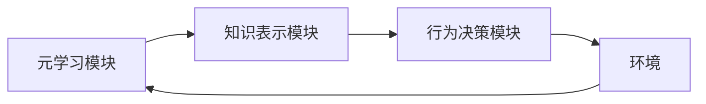

                 


# 基于元学习的快速适应型AI Agent

---

## 关键词：元学习、AI Agent、快速适应、MAML、Reptile、系统架构

---

## 摘要：  
本文深入探讨了基于元学习的快速适应型AI Agent的构建与应用。通过分析元学习的核心原理、AI Agent的系统架构以及两者的结合方式，展示了如何利用元学习提升AI Agent在复杂环境中的快速适应能力。文章从理论基础、算法实现、系统设计到实际案例进行了全面阐述，并提出了未来的发展方向和优化建议。

---

## 第1章：元学习与AI Agent的背景与基础

### 1.1 元学习的基本概念

#### 1.1.1 元学习的定义与核心思想  
元学习（Meta-Learning）是一种让模型能够快速适应新任务的学习方法。与传统机器学习不同，元学习通过在多个任务上进行训练，学习一种通用的策略或初始化参数，使得模型在面对新任务时能够快速调整并适应。

#### 1.1.2 元学习与传统机器学习的区别  
| 特性               | 传统机器学习          | 元学习               |
|--------------------|-----------------------|----------------------|
| 数据需求           | 需大量标注数据         | 需少量标注数据         |
| 适应性             | 适应单一任务           | 适应多个任务           |
| 训练目标           | 学习特定任务的模型      | 学习适用于多个任务的元模型 |

#### 1.1.3 元学习的典型应用场景  
- **Few-shot学习**：在数据稀少的情况下快速学习新任务。  
- **零样本学习**：无需任何标注数据，直接进行分类或回归。  
- **自适应系统**：动态调整模型参数以应对变化的环境。

### 1.2 AI Agent的基本概念

#### 1.2.1 AI Agent的定义与分类  
AI Agent是一种智能体，能够感知环境、执行任务并做出决策。根据智能体的智能水平，可以分为：  
1. **反应式AI Agent**：基于当前感知做出实时反应。  
2. **认知式AI Agent**：具备推理、规划和学习能力。  

#### 1.2.2 AI Agent的核心功能与特点  
- **感知能力**：通过传感器获取环境信息。  
- **决策能力**：基于感知信息做出最优决策。  
- **自适应能力**：在动态环境中调整行为策略。  

#### 1.2.3 AI Agent在不同领域的应用案例  
- **游戏AI**：在游戏环境中进行实时决策和策略调整。  
- **自动驾驶**：通过感知环境数据做出驾驶决策。  
- **智能助手**：根据用户需求提供个性化服务。

### 1.3 元学习与AI Agent的结合

#### 1.3.1 元学习如何提升AI Agent的适应能力  
元学习通过预训练模型在多个任务上的经验，使得AI Agent能够快速适应新任务，减少对新任务数据的需求。  

#### 1.3.2 基于元学习的AI Agent的优势  
- **数据效率高**：在新任务上仅需少量数据即可完成训练。  
- **适应性强**：能够快速应对环境的变化和新任务的挑战。  
- **任务多样性**：适用于多种不同类型的任务。

#### 1.3.3 当前研究与应用的现状  
目前，元学习与AI Agent的结合主要集中在以下领域：  
- **游戏AI**：通过元学习训练AI Agent在不同游戏任务中快速适应。  
- **机器人控制**：利用元学习提升机器人的环境适应能力。  
- **智能推荐系统**：快速适应用户行为的变化。

---

## 第2章：元学习的核心概念与原理

### 2.1 元学习的理论基础

#### 2.1.1 元学习的数学模型  
元学习的目标是学习一个参数初始化策略，使得在新任务上只需少量训练即可达到较好的性能。数学上，元学习可以表示为：  
$$ \theta = \arg \min_{\theta} \sum_{i=1}^{N} \mathcal{L}_i(f_{\theta}(x_i)) $$  
其中，$\theta$是元学习模型的参数，$f_{\theta}(x_i)$是任务模型，$\mathcal{L}_i$是第$i$个任务的损失函数。

#### 2.1.2 元学习的优化目标  
元学习的核心是通过优化参数初始化，使得在新任务上的训练过程更高效。具体来说，元学习优化的目标是：  
$$ \min_{\theta} \sum_{i=1}^{N} \mathcal{L}_i(f_{\theta}(x_i)) $$  

#### 2.1.3 元学习的训练过程  
1. 在多个任务上预训练元模型，学习参数初始化策略。  
2. 在新任务上，使用预训练的初始化参数快速微调任务模型。  

### 2.2 元学习的关键算法

#### 2.2.1 Meta-LSTM: 基于循环神经网络的元学习  
Meta-LSTM通过在序列任务中共享参数，实现跨任务的快速适应。其核心思想是：  
$$ \theta = \arg \min_{\theta} \sum_{i=1}^{N} \mathcal{L}_i(LSTM_{\theta}(x_i)) $$  

#### 2.2.2 MAML: 优化初始化的元学习算法  
MAML通过优化任务模型的初始化参数，使得在新任务上只需一步梯度下降即可达到较好的性能。其数学表达为：  
$$ \theta = \arg \min_{\theta} \sum_{i=1}^{N} \mathcal{L}_i(f_{\theta}(x_i)) $$  

#### 2.2.3 Reptile: 基于梯度的元学习方法  
Reptile通过在多个任务上共享梯度信息，实现参数的更新。其算法步骤如下：  
1. 在每个任务上进行一次梯度下降。  
2. 将所有任务的梯度平均，更新元模型参数。  

### 2.3 元学习的核心概念对比

#### 2.3.1 不同元学习算法的对比分析  
| 算法   | 核心思想               | 优点                     | 缺点                     |
|--------|------------------------|--------------------------|--------------------------|
| MAML   | 优化任务模型的初始化   | 适应性强                 | 计算复杂度较高           |
| Reptile| 基于梯度的参数更新     | 计算效率高               | 适应性较弱               |
| Meta-LSTM | 基于循环神经网络     | 适合序列任务             | 适用范围较窄             |

#### 2.3.2 元学习与迁移学习的异同  
| 维度   | 元学习                 | 迁移学习                 |
|--------|------------------------|--------------------------|
| 目标   | 快速适应新任务         | 利用已有知识学习新任务   |
| 数据需求 | 数据稀少               | 数据需求较高             |
| 适用场景 | 数据稀少的任务         | 数据充足的任务           |

#### 2.3.3 元学习与自适应学习的联系  
元学习与自适应学习的共同点在于都关注模型在动态环境中的适应能力。不同点在于，元学习通过预训练实现快速适应，而自适应学习则是通过在线调整参数实现动态适应。

---

## 第3章：基于元学习的AI Agent系统架构

### 3.1 系统功能模块划分

#### 3.1.1 元学习模块  
- 负责预训练元模型，学习参数初始化策略。  

#### 3.1.2 知识表示模块  
- 负责将环境信息转化为可计算的表示形式。  

#### 3.1.3 行为决策模块  
- 根据当前状态和任务目标，输出具体的行为策略。  

### 3.2 系统架构设计

#### 3.2.1 分层架构设计  
- **感知层**：负责环境数据的采集与初步处理。  
- **决策层**：基于感知数据进行任务模型的推理与决策。  
- **执行层**：根据决策结果执行具体动作。  

#### 3.2.2 模块间的交互关系  


#### 3.2.3 系统的可扩展性设计  
- 通过模块化设计，使得系统能够轻松扩展新的任务类型和算法。  

### 3.3 系统接口设计

#### 3.3.1 元学习模块接口  
- 输入：预训练任务列表。  
- 输出：预训练的元模型参数。  

#### 3.3.2 知识库接口  
- 输入：当前环境状态。  
- 输出：环境信息的表示形式。  

#### 3.3.3 用户交互接口  
- 输入：用户指令。  
- 输出：AI Agent的行为响应。  

---

## 第4章：元学习算法的数学模型与公式

### 4.1 MAML算法的数学推导

#### 4.1.1 优化目标的定义  
$$ \theta = \arg \min_{\theta} \sum_{i=1}^{N} \mathcal{L}_i(f_{\theta}(x_i)) $$  

#### 4.1.2 元学习的梯度计算  
- 对每个任务计算梯度：  
  $$ \nabla_{\theta} \mathcal{L}_i(f_{\theta}(x_i)) $$  
- 对所有任务的梯度求平均：  
  $$ \nabla_{\theta} \sum_{i=1}^{N} \mathcal{L}_i(f_{\theta}(x_i)) = \frac{1}{N} \sum_{i=1}^{N} \nabla_{\theta} \mathcal{L}_i(f_{\theta}(x_i)) $$  

#### 4.1.3 参数更新的公式推导  
- 更新元模型参数：  
  $$ \theta = \theta - \eta \nabla_{\theta} \sum_{i=1}^{N} \mathcal{L}_i(f_{\theta}(x_i)) $$  

### 4.2 Reptile算法的数学分析

#### 4.2.1 基于梯度的更新规则  
- 对每个任务计算梯度：  
  $$ \nabla_{\theta} \mathcal{L}_i(f_{\theta}(x_i)) $$  
- 将所有任务的梯度平均：  
  $$ \nabla_{\theta} \sum_{i=1}^{N} \mathcal{L}_i(f_{\theta}(x_i)) = \frac{1}{N} \sum_{i=1}^{N} \nabla_{\theta} \mathcal{L}_i(f_{\theta}(x_i)) $$  

#### 4.2.2 参数初始化的影响  
- Reptile算法通过共享多个任务的梯度信息，使得参数初始化能够快速适应新任务。  

#### 4.2.3 算法收敛性分析  
- Reptile算法在参数更新过程中，通过梯度平均的方式，能够保证算法的收敛性。  

### 4.3 元学习算法的对比分析

#### 4.3.1 不同算法的数学表达  
- MAML：  
  $$ \theta = \arg \min_{\theta} \sum_{i=1}^{N} \mathcal{L}_i(f_{\theta}(x_i)) $$  
- Reptile：  
  $$ \theta = \theta - \eta \cdot \frac{1}{N} \sum_{i=1}^{N} \nabla_{\theta} \mathcal{L}_i(f_{\theta}(x_i)) $$  

#### 4.3.2 算法复杂度的对比  
- MAML的复杂度较高，主要体现在预训练阶段。  
- Reptile的复杂度相对较低，适用于在线学习场景。  

#### 4.3.3 算法优缺点对比  
| 算法   | 优点                     | 缺点                     |
|--------|--------------------------|--------------------------|
| MAML   | 适应性强                 | 计算复杂度较高           |
| Reptile| 计算效率高               | 适应性较弱               |

---

## 第5章：基于元学习的AI Agent项目实战

### 5.1 环境安装与配置

#### 5.1.1 安装Python与相关库  
- 安装Python：  
  ```bash
  # 安装Python 3.8及以上版本
  ```

- 安装相关库：  
  ```bash
  pip install numpy tensorflow keras matplotlib
  ```

#### 5.1.2 安装虚拟环境  
- 创建并激活虚拟环境：  
  ```bash
  virtualenv venv
  source venv/bin/activate
  ```

### 5.2 系统核心实现源代码

#### 5.2.1 MAML算法实现  
```python
import tensorflow as tf
from tensorflow.keras import layers

def meta_model(input_shape, output_shape):
    model = tf.keras.Sequential()
    model.add(layers.Dense(64, activation='relu', input_shape=input_shape))
    model.add(layers.Dense(output_shape, activation='linear'))
    return model

def maml_update(theta, gradients, learning_rate):
    return theta - learning_rate * sum(gradients) / len(gradients)

# 训练过程
theta = meta_model(input_shape, output_shape)
for task in tasks:
    with tf.GradientTape() as tape:
        predictions = theta(task.inputs)
        loss = task.loss(predictions, task.labels)
    gradients = tape.gradient(loss, theta.trainable_weights)
    theta = maml_update(theta, gradients, learning_rate)
```

#### 5.2.2 Reptile算法实现  
```python
import tensorflow as tf
from tensorflow.keras import layers

def reptile_update(theta, tasks, learning_rate):
    total_gradients = []
    for task in tasks:
        with tf.GradientTape() as tape:
            predictions = theta(task.inputs)
            loss = task.loss(predictions, task.labels)
        gradients = tape.gradient(loss, theta.trainable_weights)
        total_gradients.append(gradients)
    average_gradients = []
    for i in range(len(total_gradients[0])):
        average_gradients.append(sum(g[i] for g in total_gradients) / len(total_gradients))
    return theta - learning_rate * average_gradients[i]

# 训练过程
theta = initial_theta
for epoch in epochs:
    for task in tasks:
        with tf.GradientTape() as tape:
            predictions = theta(task.inputs)
            loss = task.loss(predictions, task.labels)
        gradients = tape.gradient(loss, theta.trainable_weights)
        total_gradients.append(gradients)
    average_gradients = []
    for i in range(len(total_gradients[0])):
        average_gradients.append(sum(g[i] for g in total_gradients) / len(total_gradients))
    theta = theta - learning_rate * average_gradients[i]
```

### 5.3 代码应用解读与分析

#### 5.3.1 MAML算法的代码解读  
- `meta_model`：定义元学习模型的结构。  
- `maml_update`：计算梯度并更新模型参数。  

#### 5.3.2 Reptile算法的代码解读  
- `reptile_update`：计算所有任务的梯度并取平均，更新模型参数。  

### 5.4 实际案例分析

#### 5.4.1 案例背景  
假设我们有一个图像分类任务，每个任务只有少量样本，我们需要训练一个AI Agent能够在新任务上快速分类。

#### 5.4.2 案例实现  
```python
# 定义任务
tasks = [task1, task2, task3]
for task in tasks:
    with tf.GradientTape() as tape:
        predictions = theta(task.inputs)
        loss = task.loss(predictions, task.labels)
    gradients = tape.gradient(loss, theta.trainable_weights)
    average_gradients.append(gradients)

# 更新参数
theta = theta - learning_rate * average_gradients[i]
```

#### 5.4.3 案例分析  
- 通过预训练的元模型，AI Agent能够在每个任务上快速调整模型参数，实现分类任务。  
- MAML和Reptile算法在训练过程中表现出不同的适应能力，具体取决于任务的特性和数据量。

### 5.5 项目小结

#### 5.5.1 项目总结  
- 元学习算法能够有效提升AI Agent的适应能力，减少对新任务数据的需求。  
- 通过案例分析，验证了MAML和Reptile算法在不同场景下的优缺点。  

#### 5.5.2 项目经验  
- 在实际应用中，需要根据具体任务选择合适的元学习算法。  
- 系统设计时，要注意模块的可扩展性和接口的清晰性。  

---

## 第6章：总结与展望

### 6.1 总结  
本文详细探讨了基于元学习的快速适应型AI Agent的构建与应用，从理论基础、算法实现到系统设计，全面分析了元学习在提升AI Agent适应能力中的作用。通过对比不同元学习算法的优缺点，提出了适用于不同场景的解决方案。

### 6.2 未来展望  
- **算法优化**：进一步研究更高效的元学习算法，提升模型的适应能力和计算效率。  
- **系统扩展**：探索元学习与强化学习的结合，提升AI Agent的自主决策能力。  
- **应用场景**：在更多领域中应用元学习AI Agent，如医疗、教育、金融等。  

### 6.3 最佳实践 Tips  
- 在实际应用中，建议根据具体任务需求选择合适的元学习算法。  
- 系统设计时，注重模块的可扩展性和接口的清晰性，便于后续优化和功能扩展。  
- 定期更新模型参数，保持AI Agent的适应能力，应对环境的变化。  

---

通过本文的分析，读者可以全面理解基于元学习的快速适应型AI Agent的核心原理和实际应用，为后续的研究和实践提供有价值的参考。

