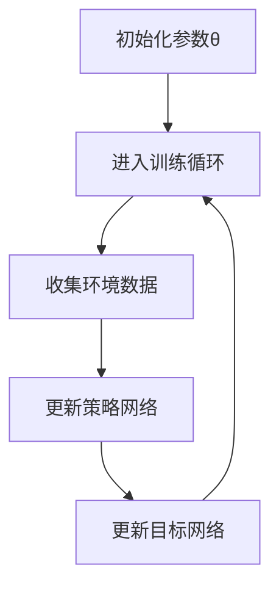
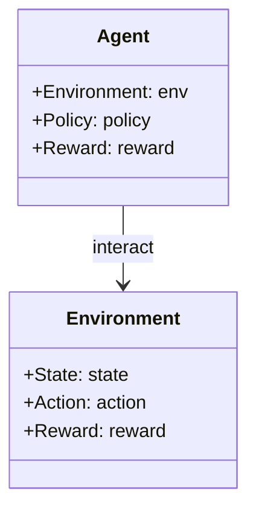
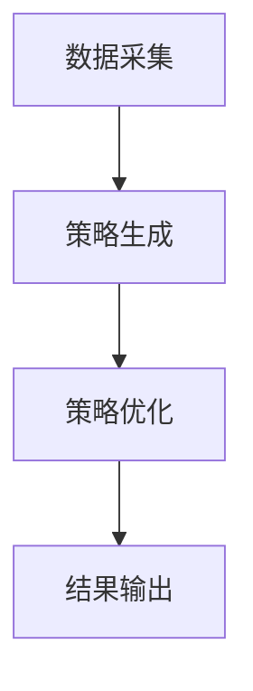
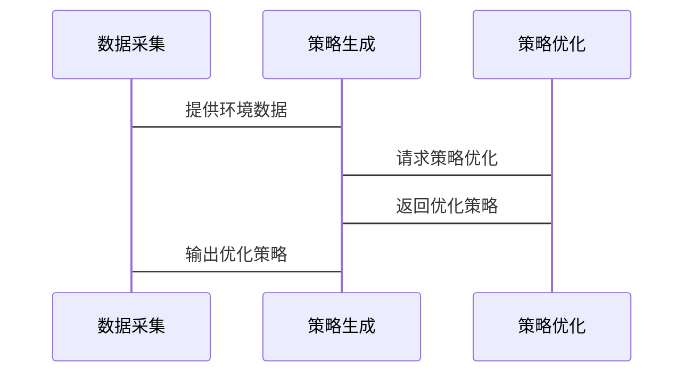

                 


# 基于元强化学习的AI Agent策略生成

> 关键词：元强化学习，AI Agent，策略生成，算法原理，系统架构

> 摘要：本文详细介绍了基于元强化学习的AI Agent策略生成方法。首先，从背景和概念入手，阐述了元强化学习与传统强化学习的区别及其在AI Agent中的重要性。接着，通过数学模型和算法流程图，深入分析了元强化学习的实现原理。最后，结合实际项目案例，展示了系统架构设计和代码实现，帮助读者从理论到实践全面掌握相关内容。

---

# 第一部分: 元强化学习与AI Agent策略生成背景

# 第1章: 元强化学习与AI Agent概述

## 1.1 元强化学习的定义与特点
### 1.1.1 强化学习的基本概念
强化学习是一种机器学习范式，通过智能体与环境交互，逐步学习最优策略，以最大化累计奖励。核心要素包括状态空间、动作空间和奖励函数。

### 1.1.2 元强化学习的定义
元强化学习（Meta-Reinforcement Learning）是在强化学习基础上，进一步优化策略生成的方法。它通过学习如何调整策略参数，以适应不同环境或任务的变化。

### 1.1.3 元强化学习的核心特点
- **元学习能力**：能够快速适应新任务，减少训练时间。
- **策略复用**：通过共享参数，提高不同任务的策略生成效率。
- **动态调整**：实时根据环境反馈优化策略。

## 1.2 AI Agent策略生成的背景与意义
### 1.2.1 AI Agent的基本概念
AI Agent是一种智能体，能够在环境中感知、决策和行动，以实现特定目标。

### 1.2.2 策略生成在AI Agent中的重要性
策略生成决定了AI Agent的行为模式，直接影响其在复杂环境中的表现。

### 1.2.3 元强化学习在策略生成中的应用前景
随着环境动态变化的加剧，元强化学习在策略生成中的应用前景广阔，特别是在多任务和复杂决策场景中。

---

# 第二部分: 元强化学习的核心概念与联系

# 第2章: 元强化学习与强化学习的关系
## 2.1 强化学习的基本原理
- **状态空间**：智能体所处的环境状态。
- **动作空间**：智能体可执行的动作。
- **奖励函数**：定义每个动作的奖励值，指导学习方向。

## 2.2 元强化学习与强化学习的对比分析
| 特性             | 强化学习                      | 元强化学习                  |
|------------------|------------------------------|-----------------------------|
| 学习目标         | 优化单一策略                 | 优化策略生成方法            |
| 适应性           | 针对特定任务                  | 跨任务策略生成              |
| 算法复杂度       | 较低                        | 较高                       |

## 2.3 元强化学习的核心优势
- **快速适应**：能够在新任务中快速调整策略。
- **通用性**：适用于多种任务和环境。

# 第3章: 元强化学习的数学模型与算法原理
## 3.1 元强化学习的数学模型
- **状态转移方程**：$P(s' | s, a)$，表示从状态$s$执行动作$a$后转移到状态$s'$的概率。
- **奖励函数**：$r(s, a)$，定义在状态$s$执行动作$a$的奖励值。
- **策略优化**：通过优化策略参数$\theta$，最大化累积奖励。

## 3.2 元强化学习的算法流程
使用mermaid流程图展示算法步骤：



---

# 第三部分: 元强化学习算法的实现与应用

# 第4章: 元强化学习算法的实现
## 4.1 算法实现的步骤
- **环境搭建**：定义环境接口和状态空间。
- **策略网络构建**：使用深度神经网络表示策略。
- **训练过程**：通过梯度下降优化策略参数。

## 4.2 Python代码实现
```python
import torch
import torch.nn as nn

class PolicyNetwork(nn.Module):
    def __init__(self, state_dim, action_dim):
        super(PolicyNetwork, self).__init__()
        self.fc1 = nn.Linear(state_dim, 64)
        self.fc2 = nn.Linear(64, action_dim)
    
    def forward(self, x):
        x = torch.relu(self.fc1(x))
        x = torch.sigmoid(self.fc2(x))
        return x

# 初始化网络
state_dim = 10
action_dim = 4
policy_net = PolicyNetwork(state_dim, action_dim)
```

---

# 第5章: 元强化学习在AI Agent中的应用
## 5.1 AI Agent的领域模型设计
使用mermaid类图展示领域模型：



## 5.2 元强化学习在策略生成中的应用案例
### 5.2.1 案例背景介绍
以机器人导航任务为例，机器人需要在动态环境中规划路径。

### 5.2.2 策略生成过程分析
- **数据收集**：在多个环境中收集导航数据。
- **策略优化**：利用元强化学习优化策略参数，适应不同环境变化。

### 5.2.3 实验结果与分析
实验结果显示，元强化学习生成的策略在复杂环境中表现更优，适应性更强。

---

# 第四部分: 系统架构与项目实战

# 第6章: 系统架构设计
## 6.1 系统功能设计
- **功能模块划分**：数据采集、策略生成、策略优化。
- **模块关系**：数据采集模块提供输入，策略生成模块处理数据，策略优化模块更新参数。

## 6.2 系统架构设计
使用mermaid架构图展示系统设计：



## 6.3 系统交互流程
使用mermaid序列图展示交互流程：



---

# 第五部分: 项目实战

# 第7章: 项目实战与代码实现
## 7.1 环境安装
安装必要的库：
```bash
pip install torch matplotlib numpy
```

## 7.2 系统核心实现源代码
```python
import torch
import torch.optim as optim

def train(policy_net, optimizer, env):
    for epoch in range(num_epochs):
        state = env.reset()
        while not done:
            action = policy_net.act(state)
            next_state, reward, done, _ = env.step(action)
            policy_net.update(policy_net, optimizer, reward)
```

## 7.3 代码应用解读与分析
- **数据收集**：通过环境交互收集状态、动作、奖励数据。
- **策略更新**：利用梯度下降优化策略网络参数。
- **结果分析**：监控累积奖励，评估策略优化效果。

## 7.4 实际案例分析和详细讲解剖析
以机器人导航为例，展示如何通过元强化学习生成适应不同环境的导航策略。

---

# 第六部分: 最佳实践

# 第8章: 小结与注意事项
## 8.1 小结
- 元强化学习能够有效提升AI Agent的策略生成能力。
- 通过数学模型和算法实现，可以实现高效的策略优化。

## 8.2 注意事项
- 确保环境数据的多样性和代表性。
- 调参时注意平衡训练速度和策略稳定性。

## 8.3 拓展阅读
建议阅读相关论文和文献，深入理解元强化学习的最新进展和应用。

---

通过以上目录结构，读者可以系统地了解基于元强化学习的AI Agent策略生成的理论基础、算法实现和实际应用。

