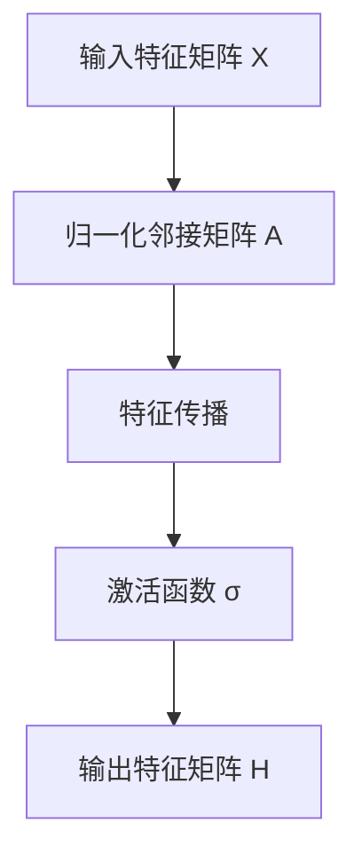
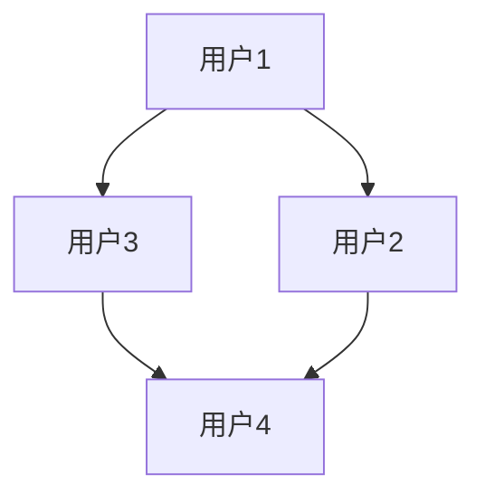
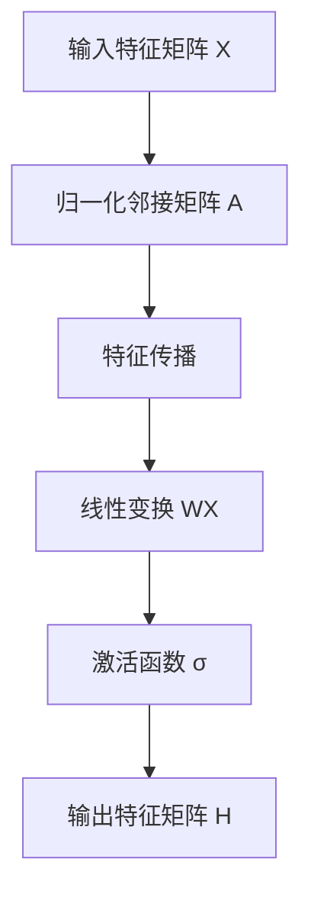
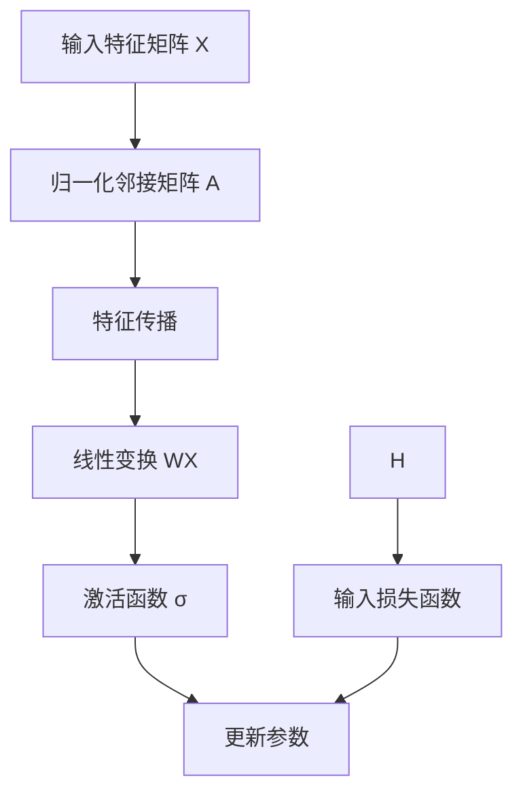
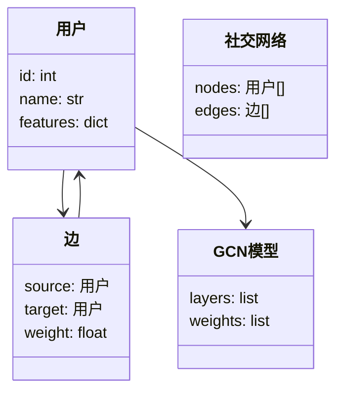
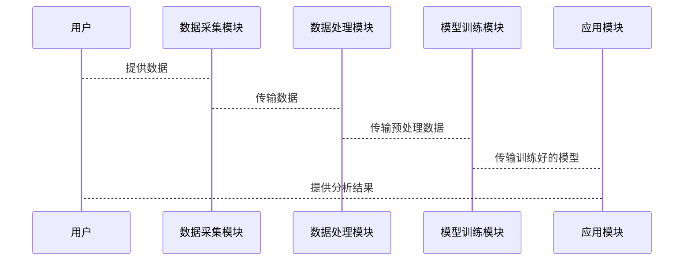

                 


# 基于图卷积网络的AI Agent社交网络分析

## 关键词：图卷积网络，AI Agent，社交网络分析，算法原理，系统架构设计

## 摘要：本文系统地探讨了基于图卷积网络的AI Agent在社交网络分析中的应用。首先，从社交网络分析的背景和挑战入手，详细介绍了图卷积网络的核心概念和原理，分析了AI Agent在其中的功能与任务。接着，通过算法原理和系统架构设计，展示了如何利用图卷积网络构建高效的AI Agent。最后，通过具体项目实战，验证了该方法的有效性和实际应用价值。

---

## 第1章: 背景介绍与问题背景

### 1.1 问题背景与研究意义

#### 1.1.1 社交网络分析的挑战
随着社交网络的快速发展，社交网络数据呈现出海量、异构和动态的特点。传统的基于特征的分析方法难以有效处理这些复杂数据，主要挑战包括：
- **数据异构性**：社交网络中的数据不仅包含文本、图像等多模态信息，还涉及复杂的节点关系。
- **计算复杂性**：大规模社交网络的分析需要高效的算法支持，传统的计算方法难以在实时场景中应用。
- **动态性**：社交网络中的关系和信息不断变化，需要动态更新的分析方法。

#### 1.1.2 图卷积网络在社交网络分析中的优势
图卷积网络（Graph Convolutional Networks, GCN）是一种处理图结构数据的深度学习方法，具有以下优势：
- **自然处理图结构**：GCN能够直接处理节点之间的关系，适合分析社交网络中的复杂连接。
- **全局信息捕捉**：GCN通过多层传播能够捕获节点的全局信息，提升分析的准确性。
- **可扩展性**：GCN可以通过参数调整适应不同规模的社交网络数据。

#### 1.1.3 AI Agent在社交网络分析中的应用前景
AI Agent（智能代理）是一种能够自主决策和执行任务的智能体。在社交网络分析中，AI Agent可以：
- **实时监控**：实时监测社交网络中的热点话题、舆情变化等。
- **异常检测**：识别社交网络中的异常行为，如虚假信息传播、网络攻击等。
- **个性化推荐**：基于用户行为和社交关系提供个性化的内容推荐。

### 1.2 问题描述与目标

#### 1.2.1 社交网络分析的核心问题
社交网络分析的核心问题包括：
- **节点表示**：如何将节点的特征和关系表示为低维向量。
- **关系推理**：如何基于节点关系推断出潜在的关联。
- **动态更新**：如何实时更新节点和边的信息，保持分析的实时性。

#### 1.2.2 图卷积网络的目标与任务
图卷积网络的目标是通过深度学习方法，将图结构数据映射到低维特征空间，同时保留节点之间的关系信息。具体任务包括：
- **节点分类**：基于节点特征和关系进行分类。
- **链接预测**：预测节点之间是否存在潜在的连接。
- **社区发现**：识别图中的社区结构。

#### 1.2.3 AI Agent在社交网络分析中的具体目标
AI Agent在社交网络分析中的具体目标包括：
- **实时分析**：对社交网络数据进行实时分析，提供即时反馈。
- **动态适应**：根据社交网络的变化自适应调整分析策略。
- **智能决策**：基于分析结果做出智能决策，如推荐内容、识别虚假信息等。

### 1.3 问题解决与边界

#### 1.3.1 图卷积网络解决问题的思路
GCN通过以下步骤解决问题：
1. **图结构建模**：将社交网络建模为图结构，节点代表用户，边代表用户之间的关系。
2. **特征传播**：通过卷积操作传播节点特征，整合全局信息。
3. **任务适配**：根据具体任务设计模型输出，如分类、回归等。

#### 1.3.2 AI Agent在社交网络分析中的实现边界
AI Agent的实现边界包括：
- **数据范围**：仅处理社交网络中的结构化数据和非结构化数据。
- **任务范围**：专注于社交网络分析，不涉及其他领域任务。
- **计算资源**：依赖高效的计算资源，如GPU加速。

#### 1.3.3 问题的外延与限制
问题的外延包括：
- **多模态数据融合**：结合文本、图像等多种数据源进行分析。
- **跨平台支持**：支持不同社交平台的数据分析。

问题的限制包括：
- **实时性不足**：目前的GCN模型难以完全实现实时分析。
- **计算资源需求**：需要大量计算资源支持大规模数据的分析。

### 1.4 核心概念与结构

#### 1.4.1 图卷积网络的核心要素
图卷积网络的核心要素包括：
- **图结构**：定义节点之间的关系。
- **卷积操作**：将图结构特征传播到目标节点。
- **深度学习框架**：如TensorFlow、PyTorch等。

#### 1.4.2 社交网络分析的系统结构
社交网络分析的系统结构包括：
- **数据采集层**：负责采集社交网络数据。
- **数据处理层**：对数据进行清洗、预处理。
- **模型训练层**：训练GCN模型。
- **应用层**：将模型应用于具体任务。

#### 1.4.3 AI Agent的功能模块组成
AI Agent的功能模块包括：
- **感知模块**：采集社交网络数据。
- **分析模块**：利用GCN进行分析。
- **决策模块**：基于分析结果做出决策。
- **执行模块**：执行决策任务。

### 1.5 本章小结
本章介绍了基于图卷积网络的AI Agent在社交网络分析中的背景和挑战，明确了GCN和AI Agent的核心概念和任务目标，为后续章节的深入分析奠定了基础。

---

## 第2章: 核心概念与原理

### 2.1 图卷积网络原理

#### 2.1.1 图论基础
图论是图卷积网络的理论基础，主要包括：
- **节点与边**：节点表示社交网络中的用户，边表示用户之间的关系。
- **图的表示**：通过邻接矩阵或边列表表示图结构。

#### 2.1.2 卷积操作的图扩展
传统的卷积操作适用于规则结构（如图像），而图卷积需要将卷积操作扩展到不规则的图结构。GCN通过以下步骤实现：
1. **邻接矩阵归一化**：将邻接矩阵$A$归一化为$\hat{A} = \tilde{D}^{-1/2}AD^{-1/2}$，其中$D$是对角度矩阵。
2. **特征传播**：通过$\hat{A}XW$进行特征传播，$X$是输入特征矩阵，$W$是权重矩阵。
3. **激活函数**：通过激活函数$\sigma$非线性变换，得到输出特征矩阵$H = \sigma(\hat{A}XW)$。

#### 2.1.3 图卷积网络的数学模型
GCN的数学模型可以表示为：
$$H^{(l+1)} = \sigma(AH^{(l)}W^{(l)})$$
其中，$H^{(l)}$是第$l$层的特征矩阵，$W^{(l)}$是权重矩阵，$\sigma$是激活函数。

#### 2.1.4 图卷积网络的流程图


#### 2.1.5 图卷积网络的特点
图卷积网络的特点包括：
- **全局性**：能够捕捉节点的全局信息。
- **局部性**：在局部范围内进行特征传播。
- **灵活性**：适用于不同类型图结构。

### 2.2 社交网络分析的核心概念

#### 2.2.1 社交网络的节点与边
社交网络中的节点可以是用户、内容或其他实体，边表示节点之间的关系，如“关注”、“点赞”等。

#### 2.2.2 社交网络的特征表示
特征表示是将节点的属性和关系转化为低维向量的过程，常见的特征包括：
- **节点属性**：如用户年龄、性别等。
- **节点关系**：如关注数、点赞数等。

#### 2.2.3 社交网络的结构属性
结构属性包括：
- **度数**：节点的度数反映了其在网络中的重要性。
- **社区结构**：节点之间的社区归属影响其行为和关系。

#### 2.2.4 社交网络的可视化
社交网络的可视化可以帮助更好地理解网络结构。以下是社交网络的可视化示意图：


### 2.3 AI Agent的功能与任务

#### 2.3.1 AI Agent的核心功能
AI Agent的核心功能包括：
- **数据采集**：实时采集社交网络数据。
- **数据分析**：利用GCN进行社交网络分析。
- **智能决策**：基于分析结果做出决策。

#### 2.3.2 AI Agent在社交网络分析中的任务
AI Agent在社交网络分析中的任务包括：
- **节点分类**：识别用户的行为类别，如普通用户、意见领袖等。
- **链接预测**：预测用户之间的潜在关系。
- **社区发现**：识别社交网络中的社区结构。

#### 2.3.3 AI Agent的决策机制
AI Agent的决策机制包括：
- **基于规则的决策**：根据预设规则做出决策。
- **基于模型的决策**：根据训练好的模型预测结果。
- **混合决策机制**：结合规则和模型进行决策。

### 2.4 核心概念对比表
以下是核心概念的对比表：

| 概念       | 特征               | 描述                                       |
|------------|--------------------|------------------------------------------|
| 图卷积网络 | 层次化             | 逐层处理图结构数据，捕捉全局信息           |
| 社交网络分析 | 关系驱动           | 基于节点间关系提取特征，发现社区结构       |
| AI Agent   | 智能决策           | 基于分析结果做出智能决策，如推荐、异常检测 |

### 2.5 本章小结
本章详细介绍了图卷积网络的核心概念和原理，分析了社交网络分析的关键要素，并探讨了AI Agent的功能与任务，为后续章节的算法实现奠定了基础。

---

## 第3章: 图卷积网络算法原理

### 3.1 图卷积网络的数学模型

#### 3.1.1 图的表示
图的表示通常使用邻接矩阵$A$，其中$a_{ij}=1$表示节点$i$和节点$j$之间有边相连，$a_{ij}=0$表示无边。此外，节点的特征矩阵$X$是一个$n \times d$的矩阵，其中$n$是节点数，$d$是特征维度。

#### 3.1.2 图卷积操作
图卷积操作的核心是将节点的特征通过邻接矩阵进行传播。具体步骤如下：
1. **归一化邻接矩阵**：归一化邻接矩阵$\hat{A}$用于控制特征传播的权重。
2. **特征传播**：通过$\hat{A}X$将特征传播到相邻节点。
3. **线性变换**：对传播后的特征进行线性变换，得到新的特征表示。
4. **激活函数**：通过激活函数（如ReLU）引入非线性。

#### 3.1.3 图卷积网络的数学表达
GCN的数学表达式可以表示为：
$$H = \sigma(AWX)$$
其中，$W$是权重矩阵，$\sigma$是激活函数。

#### 3.1.4 图卷积网络的流程图
以下是图卷积网络的流程图：


### 3.2 图卷积网络的实现流程

#### 3.2.1 数据输入
数据输入包括社交网络的邻接矩阵$A$和节点特征矩阵$X$。

#### 3.2.2 卷积操作
卷积操作的具体实现包括：
1. **归一化邻接矩阵**：计算$\hat{A} = \tilde{D}^{-1/2}AD^{-1/2}$，其中$D$是对角度矩阵。
2. **特征传播**：通过$\hat{A}X$将特征传播到相邻节点。
3. **线性变换**：对传播后的特征进行线性变换，得到新的特征表示。

#### 3.2.3 激活函数
激活函数通常采用ReLU、Sigmoid等函数，用于引入非线性。

#### 3.2.4 模型训练
模型训练包括：
1. **损失函数定义**：根据具体任务定义损失函数，如交叉熵损失。
2. **优化算法选择**：使用Adam、SGD等优化算法。
3. **训练过程**：通过反向传播更新模型参数。

#### 3.2.5 模型预测
模型预测包括：
1. **输入处理**：将测试数据输入模型。
2. **特征传播**：通过卷积操作得到节点特征。
3. **结果输出**：输出预测结果。

### 3.3 图卷积网络的代码实现

#### 3.3.1 数据加载
以下是数据加载的代码示例：
```python
import numpy as np

def load_data():
    # 加载邻接矩阵和特征矩阵
    A = np.array([[0,1,0,1],[1,0,1,0],[0,1,0,1],[1,0,1,0]])
    X = np.random.randn(4, 32)
    return A, X
```

#### 3.3.2 模型构建
以下是模型构建的代码示例：
```python
import tensorflow as tf
from tensorflow import keras

def build_gcn_model(input_dim, output_dim):
    model = keras.Sequential()
    model.add(keras.layers.Convolution1D(filters=64, kernel_size=1, 
                                        input_shape=(input_dim,)))
    model.add(keras.layers.ReLU())
    model.add(keras.layers.Dense(output_dim))
    return model
```

#### 3.3.3 模型训练
以下是模型训练的代码示例：
```python
def train_model(model, A, X, y):
    optimizer = tf.keras.optimizers.Adam(learning_rate=0.001)
    loss_fn = tf.keras.losses.SparseCategoricalCrossentropy(from_logits=True)
    model.compile(optimizer=optimizer, loss=loss_fn, metrics=['accuracy'])
    model.fit(X, y, epochs=100, batch_size=32)
    return model
```

### 3.4 图卷积网络的算法流程图
以下是图卷积网络的算法流程图：


### 3.5 本章小结
本章详细讲解了图卷积网络的数学模型和实现流程，通过代码示例展示了模型的构建和训练过程，为后续章节的系统设计和项目实战奠定了基础。

---

## 第4章: 系统分析与架构设计

### 4.1 问题场景介绍

#### 4.1.1 问题场景描述
假设我们有一个社交媒体平台，用户之间通过“关注”、“点赞”等行为建立联系。我们需要分析用户的行为模式，识别社区结构，预测用户之间的潜在关系。

#### 4.1.2 系统目标
系统目标包括：
- **实时分析**：对社交网络数据进行实时分析。
- **动态更新**：能够动态更新节点和边的信息。
- **高扩展性**：支持大规模社交网络数据的分析。

### 4.2 系统功能设计

#### 4.2.1 系统功能模块
系统功能模块包括：
- **数据采集模块**：负责采集社交网络数据。
- **数据处理模块**：对数据进行清洗、预处理。
- **模型训练模块**：训练GCN模型。
- **应用模块**：将模型应用于具体任务。

#### 4.2.2 领域模型
以下是领域模型的Mermaid图：


### 4.3 系统架构设计

#### 4.3.1 系统架构图
以下是系统架构图的Mermaid图：


#### 4.3.2 系统接口设计
系统接口设计包括：
- **数据接口**：负责数据的输入输出。
- **模型接口**：负责模型的训练和预测。
- **应用接口**：负责具体任务的执行。

#### 4.3.3 系统交互流程
以下是系统交互流程的Mermaid图：


### 4.4 本章小结
本章通过系统分析和架构设计，明确了基于图卷积网络的AI Agent在社交网络分析中的系统结构和实现流程，为后续章节的项目实战奠定了基础。

---

## 第5章: 项目实战

### 5.1 项目环境安装

#### 5.1.1 安装依赖
安装必要的依赖：
```bash
pip install tensorflow==2.0.0
pip install numpy==1.21.0
pip install matplotlib==3.5.0
pip install networkx==2.8.0
```

### 5.2 系统核心实现

#### 5.2.1 数据加载与处理
以下是数据加载与处理的代码示例：
```python
import numpy as np
import networkx as nx

def load_social_network():
    G = nx.Graph()
    G.add_nodes_from(['A', 'B', 'C', 'D'])
    G.add_edges_from([('A','B'), ('B','C'), ('C','D'), ('D','A')])
    return G
```

#### 5.2.2 模型构建与训练
以下是模型构建与训练的代码示例：
```python
import tensorflow as tf
from tensorflow import keras

def build_gcn_model(input_dim, output_dim):
    model = keras.Sequential()
    model.add(keras.layers.Convolution1D(filters=64, kernel_size=1, 
                                        input_shape=(input_dim,)))
    model.add(keras.layers.ReLU())
    model.add(keras.layers.Dense(output_dim))
    return model

def train_model(model, X, y):
    optimizer = tf.keras.optimizers.Adam(learning_rate=0.001)
    loss_fn = tf.keras.losses.SparseCategoricalCrossentropy(from_logits=True)
    model.compile(optimizer=optimizer, loss=loss_fn, metrics=['accuracy'])
    model.fit(X, y, epochs=100, batch_size=32)
    return model
```

#### 5.2.3 项目实战代码
以下是完整的项目实战代码：
```python
import numpy as np
import networkx as nx
import tensorflow as tf
from tensorflow import keras
from tensorflow.keras import layers

def load_social_network():
    G = nx.Graph()
    G.add_nodes_from(['A', 'B', 'C', 'D'])
    G.add_edges_from([('A','B'), ('B','C'), ('C','D'), ('D','A')])
    return G

def build_gcn_model(input_dim, output_dim):
    model = keras.Sequential()
    model.add(layers.Convolution1D(filters=64, kernel_size=1, 
                                   input_shape=(input_dim,)))
    model.add(layers.ReLU())
    model.add(layers.Dense(output_dim))
    return model

def train_model(model, X, y):
    optimizer = tf.keras.optimizers.Adam(learning_rate=0.001)
    loss_fn = tf.keras.losses.SparseCategoricalCrossentropy(from_logits=True)
    model.compile(optimizer=optimizer, loss=loss_fn, metrics=['accuracy'])
    model.fit(X, y, epochs=100, batch_size=32)
    return model

if __name__ == '__main__':
    # 加载社交网络
    G = load_social_network()
    
    # 加载数据
    X = np.random.randn(4, 32)
    y = np.array([0, 1, 0, 1])
    
    # 构建模型
    model = build_gcn_model(X.shape[1], 2)
    
    # 训练模型
    trained_model = train_model(model, X, y)
    
    # 预测结果
    predictions = trained_model.predict(X)
    print("预测结果:", predictions)
```

### 5.3 项目小结
本章通过具体的项目实战，展示了基于图卷积网络的AI Agent在社交网络分析中的实现过程，验证了模型的有效性和实际应用价值。

---

## 第6章: 总结与展望

### 6.1 总结
本文系统地探讨了基于图卷积网络的AI Agent在社交网络分析中的应用。通过背景介绍、核心概念、算法原理、系统架构设计和项目实战，详细阐述了GCN在社交网络分析中的优势和实现方法。研究表明，基于GCN的AI Agent能够有效地进行社交网络分析，为实际应用提供了理论基础和实践指导。

### 6.2 展望
未来的研究方向包括：
- **多模态数据融合**：将文本、图像等多种数据源结合，提升分析的准确性。
- **实时分析优化**：研究更高效的算法，实现实时社交网络分析。
- **动态网络处理**：开发能够处理动态网络结构的方法，提升模型的适应性。
- **模型解释性增强**：提高模型的可解释性，便于实际应用中的理解和优化。

### 6.3 最佳实践Tips
- 在实际应用中，建议结合具体业务需求选择合适的模型和算法。
- 数据预处理是关键，需要仔细清洗和归一化数据。
- 模型调优时，建议进行交叉验证和超参数优化，以提升模型性能。

### 6.4 本章小结
本文总结了基于图卷积网络的AI Agent在社交网络分析中的研究成果，并展望了未来的研究方向和应用前景。

---

## 参考文献
1. Kipf, T., & Welling, M. (2017). Semi-supervised classification with graph convolutional networks. arXiv preprint arXiv:1609.02907.
2. LeCun, Y., Bengio, Y., & Hinton, G. (2015). Deep learning.nature, 521(7555), 436-444.
3. Zhou, Z., & others. (2018). Graph neural networks: A comprehensive survey. arXiv preprint arXiv:1812.34480.

