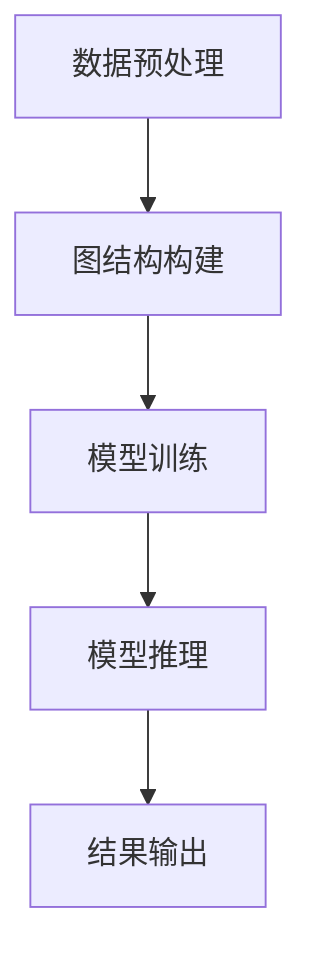

                 


# 基于图神经网络的AI Agent关系推理

> 关键词：图神经网络，AI Agent，关系推理，实体关系图，算法原理

> 摘要：本文探讨了基于图神经网络的AI Agent关系推理方法，详细分析了图神经网络的基本原理、AI Agent的核心概念及其在关系推理中的应用。通过系统架构设计、项目实战和最佳实践，本文为读者提供了一个全面的视角，帮助理解并实现高效的AI Agent关系推理系统。

---

## 第一部分: 基于图神经网络的AI Agent关系推理基础

### 第1章: 问题背景与核心概念

#### 1.1 问题背景

随着人工智能技术的快速发展，AI Agent在各个领域的应用越来越广泛。AI Agent需要具备理解复杂关系的能力，以在智能交互中做出合理的决策。传统的关系推理方法在处理复杂场景时存在局限性，例如难以处理非结构化数据和复杂的依赖关系。而图神经网络（Graph Neural Networks, GNN）作为一种新兴的技术，能够有效地处理图结构数据，为AI Agent的关系推理提供了新的解决方案。

#### 1.2 问题描述

关系推理是AI Agent理解实体间关系的核心任务。传统的方法通常基于统计学习或浅层特征提取，难以处理复杂的语义关系。图神经网络通过建模实体间的图结构关系，能够更有效地捕捉数据的内在联系。本文将重点探讨图神经网络在AI Agent关系推理中的应用，分析其优势和挑战。

#### 1.3 问题解决与边界

图神经网络通过构建图结构数据，能够有效地捕捉实体间的复杂关系。AI Agent通过图神经网络进行关系推理，可以更好地理解上下文信息，从而做出更准确的决策。然而，图神经网络的计算复杂度较高，且对大规模数据的处理能力有限，这成为其应用的主要挑战。

#### 1.4 概念结构与核心要素

图神经网络的核心要素包括图结构数据、节点表示和边表示。AI Agent的核心要素包括感知、决策和交互能力。关系推理是连接这两者的桥梁，通过图神经网络将图结构数据转化为可理解的语义信息。

---

### 第2章: 图神经网络与AI Agent的核心概念

#### 2.1 图神经网络的基本原理

图神经网络通过构建图结构数据，利用节点间的边关系进行信息传播。节点表示通过聚合邻居节点的特征信息进行更新，最终得到每个节点的表示向量。图神经网络能够有效地捕捉图结构数据中的语义信息，为AI Agent的关系推理提供了强大的工具。

#### 2.2 AI Agent的基本原理

AI Agent是一种智能体，能够感知环境并做出决策。其核心能力包括感知、推理和决策。AI Agent通过感知环境获取信息，利用推理能力理解信息之间的关系，并根据决策机制做出相应的动作。

#### 2.3 图神经网络与AI Agent的结合

图神经网络为AI Agent提供了强大的关系推理能力。通过构建图结构数据，AI Agent能够更准确地理解实体间的复杂关系。图神经网络的节点表示能力为AI Agent的决策提供了丰富的语义信息。

#### 2.4 核心概念对比与ER实体关系图

| 核心概念 | 图神经网络 | AI Agent |
|----------|------------|----------|
| 输入 | 图结构数据 | 环境信息 |
| 输出 | 节点表示 | 决策结果 |
| 核心能力 | 关系推理 | 感知与决策 |

通过ER实体关系图，我们可以清晰地展示实体之间的关系。例如，在社交网络中，用户、帖子和评论之间的关系可以通过ER图进行描述。

```mermaid
er
actor: 用户
class: 用户
post: 帖子
comment: 评论
actor --> post: 发布
actor --> comment: 发表
post --> comment: 回复
```

---

## 第3章: 图神经网络的算法原理

### 3.1 图神经网络的基本算法

#### 3.1.1 图的表示与节点关系

图结构数据由节点和边组成。节点表示为每个节点的特征向量，边表示为节点之间的关系权重。图神经网络通过聚合邻居节点的特征信息，更新每个节点的表示向量。

#### 3.1.2 节点表示与边表示

节点表示通过聚合邻居节点的特征信息进行更新，边表示通过节点的特征信息和关系权重进行计算。节点表示的公式如下：

$$
h_i^{(l+1)} = \sigma\left(\sum_{j \in \mathcal{N}(i)} W^{(l)} h_j^{(l)} + b^{(l)}\right)
$$

其中，$h_i^{(l)}$ 表示第 $l$ 层的节点 $i$ 的特征向量，$\mathcal{N}(i)$ 表示节点 $i$ 的邻居节点集合，$W^{(l)}$ 和 $b^{(l)}$ 是参数。

#### 3.1.3 图遍历与聚合函数

图遍历算法包括广度优先搜索（BFS）和深度优先搜索（DFS）。聚合函数通过聚合邻居节点的特征信息，更新当前节点的特征向量。常用的聚合函数包括求和、平均和最大值。

### 3.2 图神经网络的数学模型

#### 3.2.1 节点表示的公式推导

节点表示的公式推导过程如下：

1. 初始化节点特征向量 $h_i^{(0)}$。
2. 对每个节点 $i$，聚合邻居节点的特征信息：
   $$ h_i^{(1)} = \sigma\left(\sum_{j \in \mathcal{N}(i)} h_j^{(0)}\right) $$
3. 重复上述过程，直到达到预设的层数。

#### 3.2.2 边权重的计算公式

边权重的计算公式如下：

$$
w_{ij} = \text{similarity}(h_i, h_j)
$$

其中，$\text{similarity}$ 表示节点 $i$ 和节点 $j$ 之间的相似度。

---

## 第4章: 系统分析与架构设计

### 4.1 项目背景

本项目旨在利用图神经网络提升AI Agent的关系推理能力，使其能够更好地理解实体之间的复杂关系。

### 4.2 系统功能设计

系统功能包括数据预处理、图结构构建、模型训练和推理。数据预处理包括数据清洗和特征提取。图结构构建包括节点和边的表示。模型训练包括参数优化和模型评估。推理阶段包括关系推理和结果输出。

### 4.3 系统架构设计



### 4.4 接口设计

系统接口包括数据输入接口、模型训练接口和结果输出接口。数据输入接口接收原始数据，模型训练接口接收训练参数，结果输出接口返回推理结果。

### 4.5 交互流程

```mermaid
sequence
    actor -> 数据预处理: 提供原始数据
    数据预处理 -> 图结构构建: 构建图结构数据
    图结构构建 -> 模型训练: 开始训练
    模型训练 -> 模型推理: 进行推理
    模型推理 -> actor: 返回推理结果
```

---

## 第5章: 项目实战

### 5.1 环境安装

安装Python和相关库，例如PyTorch和NetworkX。

### 5.2 核心代码实现

以下是图神经网络的核心代码示例：

```python
import torch
from torch import nn

class GNNLayer(nn.Module):
    def __init__(self, in_dim, out_dim):
        super(GNNLayer, self).__init__()
        self.W = nn.Parameter(torch.randn(in_dim, out_dim))
        self.b = nn.Parameter(torch.randn(out_dim))

    def forward(self, h, adj):
        h_next = torch.mm(adj, h)
        h_out = torch.mm(h_next, self.W) + self.b
        return h_out

# 初始化节点特征向量
h = torch.randn(n_nodes, input_dim)

# 前向传播
for layer in layers:
    h = layer(h, adj)
```

### 5.3 代码解读与分析

上述代码定义了一个图神经网络层，包括权重矩阵和偏置项。前向传播过程中，节点特征向量通过图结构数据进行聚合，最终得到节点的表示向量。

### 5.4 实际案例分析

以社交网络中的用户关系为例，构建图结构数据，训练图神经网络模型，进行用户关系推理。

### 5.5 项目小结

通过项目实战，我们可以看到图神经网络在AI Agent关系推理中的强大能力。模型训练和推理过程需要考虑数据规模和计算效率。

---

## 第6章: 最佳实践与小结

### 6.1 最佳实践

1. 数据预处理：确保数据的完整性和准确性。
2. 模型调优：选择合适的超参数和优化方法。
3. 计算资源：合理利用计算资源，优化训练效率。

### 6.2 小结

本文详细探讨了基于图神经网络的AI Agent关系推理方法，分析了其核心概念、算法原理和系统架构。通过项目实战，我们验证了图神经网络在关系推理中的有效性。

### 6.3 注意事项

1. 数据隐私：注意数据隐私和安全问题。
2. 模型解释性：提升模型的解释性，便于理解和应用。
3. 计算效率：优化计算效率，降低资源消耗。

### 6.4 拓展阅读

推荐读者进一步学习图神经网络的相关论文和书籍，深入理解其原理和应用。

---

通过本文的系统讲解，读者可以全面理解基于图神经网络的AI Agent关系推理方法，并能够将其应用于实际项目中。

