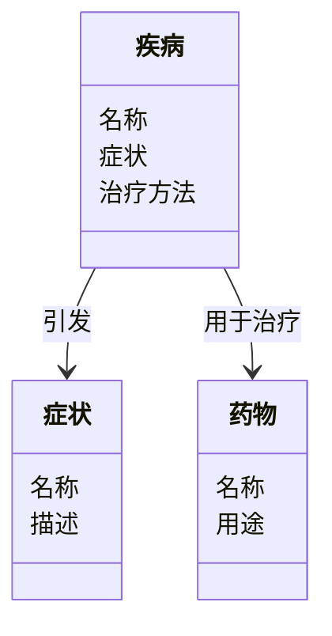
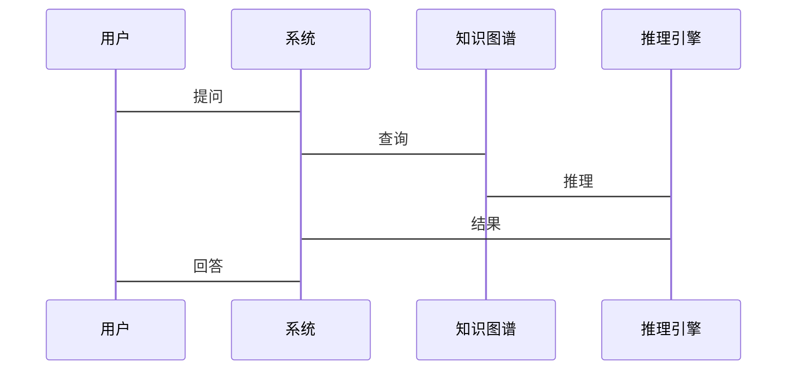

                 


```markdown
# 基于图神经网络的AI Agent知识推理

> 关键词：图神经网络，AI Agent，知识推理，知识图谱，深度学习，图嵌入

> 摘要：本文系统地探讨了基于图神经网络的AI Agent知识推理技术，从理论基础到实际应用，详细分析了图神经网络在知识图谱中的应用，以及其如何增强AI Agent的知识推理能力。文章结合实际案例，深入讲解了图神经网络的核心算法、系统架构设计以及项目实现，为读者提供了全面的技术指导和实践参考。

---

# 第一部分: 基于图神经网络的AI Agent知识推理背景介绍

## 第1章: 图神经网络与AI Agent概述

### 1.1 图神经网络的基本概念

#### 1.1.1 图的基本概念与表示
图是一种数据结构，由节点（顶点）和边（连接节点的边）组成。节点代表实体，边代表实体之间的关系。图可以有向或无向，有权或无权。

图的表示方式有多种，如邻接矩阵和邻接表。邻接矩阵适用于小图，邻接表适用于大图。

#### 1.1.2 图神经网络的定义与特点
图神经网络（Graph Neural Networks, GNNs）是一种处理图结构数据的深度学习模型。GNNs的核心思想是通过聚合邻居节点的信息来更新当前节点的表示。

图神经网络的特点：
1. **局部性**：节点的表示依赖于其邻居节点。
2. **全局性**：通过多层传播，节点可以捕获全局信息。
3. **灵活性**：适用于不同类型的图结构。

#### 1.1.3 图神经网络与传统神经网络的对比
| 特性             | 图神经网络              | 传统神经网络          |
|------------------|------------------------|----------------------|
| 数据结构         | 图结构                 | 线性或非线性结构       |
| 节点关系         | 节点间有明确关系         | 节点间无明确关系       |
| 处理复杂性       | 更复杂                 | 较简单               |
| 应用场景         | 社交网络、推荐系统等     | 图像分类、语音识别等   |

---

### 1.2 AI Agent的基本概念与知识推理

#### 1.2.1 AI Agent的定义与分类
AI Agent（智能体）是能够感知环境并采取行动以实现目标的实体。AI Agent可以分为简单反射型、基于模型的反射型、目标驱动型和效用驱动型。

#### 1.2.2 知识推理的定义与应用
知识推理是指AI Agent根据已有知识和推理规则，推导出新的知识或结论的过程。知识推理在问答系统、对话系统、推荐系统等领域有广泛应用。

#### 1.2.3 图神经网络在知识推理中的优势
图神经网络能够有效地处理图结构数据，适合用于知识图谱中的推理任务。其优势包括：
1. **图结构的自然表示**：知识图谱本质上是图结构，图神经网络能够直接处理。
2. **上下文理解**：通过聚合邻居节点的信息，图神经网络能够理解上下文关系。
3. **推理能力**：通过多层传播，图神经网络能够进行深层次推理。

---

### 1.3 图神经网络与知识图谱的结合

#### 1.3.1 知识图谱的构建与表示
知识图谱是通过实体和关系构建的知识网络。构建知识图谱的主要步骤包括：
1. **数据采集**：从结构化数据、文本中提取实体和关系。
2. **实体对齐**：将不同数据源中的实体进行统一。
3. **知识融合**：将多个数据源的知识进行整合。

知识图谱的表示方式包括邻接矩阵、边列表和嵌入向量。

#### 1.3.2 图神经网络在知识图谱中的应用
图神经网络可以用于知识图谱的节点分类、链接预测、路径推理等任务。

#### 1.3.3 知识图谱与AI Agent的结合场景
知识图谱可以为AI Agent提供丰富的知识库，支持其进行推理和决策。例如，在智能问答系统中，AI Agent可以通过知识图谱进行实体识别和关系推理，提供更准确的答案。

---

## 第2章: 图神经网络与知识推理的技术趋势

### 2.1 图神经网络的发展历程

#### 2.1.1 图神经网络的起源与演变
图神经网络的起源可以追溯到2014年的GraphSAGE模型。近年来，图神经网络的研究主要集中在模型的可扩展性、表达能力的提升以及应用场景的拓展。

#### 2.1.2 图神经网络的主流模型
- **GCN（Graph Convolutional Networks）**：经典的图卷积网络，通过聚合邻居节点的特征来更新当前节点。
- **GAT（Graph Attention Networks）**：引入注意力机制，关注重要的邻居节点。
- **GNN（Generalized Graph Neural Networks）**：通用图神经网络，支持多种图结构。

#### 2.1.3 图神经网络的最新研究方向
- **图增强学习**：结合强化学习提升图神经网络的性能。
- **动态图神经网络**：处理动态变化的图结构。
- **多模态图神经网络**：结合文本、图像等多种模态信息。

### 2.2 知识推理的挑战与机遇

#### 2.2.1 知识推理的核心挑战
- **稀疏性**：知识图谱中的实体和关系可能非常稀疏。
- **复杂性**：推理任务可能涉及复杂的逻辑推理。
- **实时性**：需要快速推理以支持实时决策。

#### 2.2.2 图神经网络在知识推理中的突破
- **全局视角**：图神经网络能够捕捉全局信息，支持深层次推理。
- **可解释性**：通过图结构，推理过程更具可解释性。
- **可扩展性**：图神经网络可以处理大规模知识图谱。

#### 2.2.3 知识推理的未来发展方向
- **多模态推理**：结合多种模态信息进行推理。
- **自适应推理**：根据场景动态调整推理策略。
- **强化学习应用**：将强化学习应用于知识推理任务。

### 2.3 图神经网络与AI Agent的结合趋势

#### 2.3.1 图神经网络在AI Agent中的应用现状
- **智能问答系统**：通过知识图谱进行实体识别和关系推理。
- **推荐系统**：基于用户行为和物品关系进行推荐。
- **对话系统**：通过知识图谱进行上下文理解和对话生成。

#### 2.3.2 图神经网络与知识图谱的深度融合
- **知识增强的图神经网络**：通过知识图谱增强图神经网络的表达能力。
- **动态知识图谱**：结合实时数据，构建动态的知识图谱。
- **多语言知识图谱**：支持多语言的知识推理。

#### 2.3.3 图神经网络在复杂场景中的应用潜力
- **多智能体协作**：通过图神经网络实现多智能体之间的协作与推理。
- **实时决策系统**：基于实时数据进行快速推理和决策。
- **人机协作**：通过图神经网络支持人机协作中的知识共享与推理。

---

# 第二部分: 图神经网络与知识推理的核心概念与联系

## 第3章: 图神经网络的核心原理

### 3.1 图神经网络的基本原理

#### 3.1.1 图的表示与特征提取
图的表示可以通过邻接矩阵、边列表和嵌入向量等方式进行。特征提取的目的是将图结构转化为数值形式，以便神经网络处理。

#### 3.1.2 图卷积网络（GCN）的原理
GCN通过聚合邻居节点的特征来更新当前节点的特征。其数学公式为：
$$
h^{(l+1)}_i = \sigma\left( \sum_{j \in N(i)} \frac{1}{|N(i)|} W h^{(l)}_j \right)
$$
其中，$h^{(l)}_i$是节点$i$在第$l$层的特征向量，$N(i)$是节点$i$的邻居节点集合，$\sigma$是激活函数。

#### 3.1.3 图注意力机制（GAT）的原理
GAT引入注意力机制，根据邻居节点的重要性动态分配注意力权重。其注意力权重计算公式为：
$$
\alpha_{ij} = \frac{\exp(a^\top [h_i^{(l)}, h_j^{(l)}])}{\sum_{k \in N(i)} \exp(a^\top [h_i^{(l)}, h_k^{(l)}])}
$$
其中，$a$是一个可学习的参数向量，用于计算注意力权重。

### 3.2 知识图谱的构建与表示

#### 3.2.1 知识图谱的构建方法
知识图谱的构建方法包括：
- **基于规则的构建**：通过预定义的规则提取实体和关系。
- **基于统计的构建**：通过统计方法从文本中提取实体和关系。
- **基于深度学习的构建**：使用深度学习模型从文本中学习实体和关系。

#### 3.2.2 知识图谱的表示学习
知识图谱的表示学习方法包括：
- **节点嵌入**：将节点映射到低维向量空间。
- **边嵌入**：将边映射到低维向量空间。
- **图嵌入**：将整个图映射到低维向量空间。

#### 3.2.3 知识图谱的嵌入表示
节点嵌入可以通过图神经网络学习得到。例如，使用GCN进行节点嵌入的公式为：
$$
h^{(l+1)}_i = \sum_{j \in N(i)} W h^{(l)}_j
$$
其中，$W$是可学习的参数矩阵。

### 3.3 图神经网络与知识图谱的结合

#### 3.3.1 图神经网络在知识图谱中的应用
图神经网络可以用于知识图谱的节点分类、链接预测、路径推理等任务。

#### 3.3.2 知识图谱对图神经网络的增强
知识图谱可以通过提供丰富的上下文信息增强图神经网络的表达能力。例如，在节点分类任务中，知识图谱可以提供节点的背景信息。

#### 3.3.3 图神经网络与知识图谱的结合场景
图神经网络与知识图谱的结合可以应用于智能问答系统、推荐系统、对话系统等领域。

---

## 第4章: 图神经网络与知识图谱的结合

### 4.1 图神经网络与知识图谱的结合方式

#### 4.1.1 知识图谱作为图神经网络的输入
知识图谱可以作为图神经网络的输入，通过图神经网络进行知识推理。

#### 4.1.2 图神经网络作为知识图谱的增强工具
图神经网络可以用于增强知识图谱的表达能力，例如通过节点嵌入提高知识图谱的可利用性。

### 4.2 知识图谱与图神经网络的协同学习

#### 4.2.1 知识图谱的表示学习与图神经网络
知识图谱的表示学习可以通过图神经网络进行，例如使用GCN进行节点嵌入。

#### 4.2.2 图神经网络与知识图谱的联合学习
图神经网络可以与知识图谱协同学习，例如通过多任务学习同时优化节点分类和边预测。

---

## 第5章: 图神经网络与知识图谱的结合应用

### 5.1 智能问答系统的应用

#### 5.1.1 智能问答系统的概述
智能问答系统通过理解用户的问题并从知识库中检索相关信息，提供准确的答案。

#### 5.1.2 图神经网络在智能问答中的应用
图神经网络可以用于智能问答系统的实体识别和关系推理。

### 5.2 推荐系统的应用

#### 5.2.1 推荐系统的概述
推荐系统通过分析用户的行为和偏好，推荐用户可能感兴趣的内容。

#### 5.2.2 图神经网络在推荐系统中的应用
图神经网络可以用于推荐系统的用户建模和物品推荐。

### 5.3 对话系统的应用

#### 5.3.1 对话系统的概述
对话系统通过与用户进行自然语言对话，提供服务。

#### 5.3.2 图神经网络在对话系统中的应用
图神经网络可以用于对话系统的上下文理解和对话生成。

---

## 第6章: 图神经网络与知识图谱的结合挑战

### 6.1 图神经网络的计算复杂度
图神经网络的计算复杂度较高，特别是在处理大规模图结构时。

### 6.2 知识图谱的稀疏性
知识图谱中的实体和关系可能非常稀疏，导致推理困难。

### 6.3 模型的可解释性
图神经网络的黑箱特性使得其可解释性较差，尤其是在复杂推理任务中。

---

## 第7章: 图神经网络与知识图谱的未来发展方向

### 7.1 深度图神经网络
深度图神经网络通过增加网络深度，提升模型的表达能力。

### 7.2 图增强学习
图增强学习结合强化学习，提升图神经网络的性能。

### 7.3 多模态图神经网络
多模态图神经网络结合多种模态信息，提升模型的推理能力。

### 7.4 图神经网络的可扩展性研究
研究如何提高图神经网络的计算效率和可扩展性。

---

## 第8章: 图神经网络与知识图谱的结合案例

### 8.1 案例1：智能问答系统

#### 8.1.1 系统介绍
智能问答系统通过图神经网络进行实体识别和关系推理，提供准确的答案。

#### 8.1.2 系统实现
系统实现包括知识图谱的构建、图神经网络的训练和问答模块的开发。

### 8.2 案例2：推荐系统

#### 8.2.1 系统介绍
推荐系统通过图神经网络进行用户建模和物品推荐。

#### 8.2.2 系统实现
系统实现包括用户行为数据的收集、图神经网络的训练和推荐模块的开发。

---

## 第9章: 图神经网络与知识图谱的结合总结

### 9.1 图神经网络与知识图谱的结合优势
- **自然表示**：图神经网络适合处理图结构数据。
- **推理能力**：图神经网络能够支持深层次推理。
- **应用场景广泛**：图神经网络与知识图谱结合可以在多个领域中应用。

### 9.2 图神经网络与知识图谱的结合挑战
- **计算复杂度高**：图神经网络的计算复杂度较高。
- **稀疏性问题**：知识图谱中的实体和关系可能非常稀疏。
- **可解释性差**：图神经网络的黑箱特性使得其可解释性较差。

### 9.3 图神经网络与知识图谱的结合未来展望
- **深度图神经网络**：通过增加网络深度，提升模型的表达能力。
- **图增强学习**：结合强化学习，提升图神经网络的性能。
- **多模态图神经网络**：结合多种模态信息，提升模型的推理能力。
- **可扩展性研究**：研究如何提高图神经网络的计算效率和可扩展性。

---

## 第10章: 图神经网络与知识图谱的结合实践

### 10.1 环境安装与配置

#### 10.1.1 安装Python
安装Python 3.8或更高版本。

#### 10.1.2 安装依赖库
安装以下依赖库：
- `numpy`
- `pandas`
- `scikit-learn`
- `networkx`
- `pytorch`

### 10.2 图神经网络的实现

#### 10.2.1 图结构的构建
使用`networkx`构建图结构：
```python
import networkx as nx

G = nx.Graph()
G.add_nodes_from(['A', 'B', 'C'])
G.add_edges_from([('A', 'B'), ('B', 'C')])
```

#### 10.2.2 图神经网络的训练
使用`pytorch`训练图神经网络：
```python
import torch
import torch.nn as nn
import torch.nn.functional as F

class GCN(nn.Module):
    def __init__(self, in_channels, out_channels):
        super(GCN, self).__init__()
        self.W = nn.Parameter(torch.randn(in_channels, out_channels))
    
    def forward(self, x, A):
        support = torch.mm(x, self.W)
        output = torch.mm(A, support)
        return F.relu(output)

model = GCN(2, 1)
optimizer = torch.optim.Adam(model.parameters(), lr=0.1)
criterion = nn.MSELoss()

x = torch.randn(3, 2)
A = torch.randn(3, 3)

for epoch in range(100):
    optimizer.zero_grad()
    output = model(x, A)
    loss = criterion(output, x)
    loss.backward()
    optimizer.step()
```

### 10.3 知识图谱的构建与表示

#### 10.3.1 知识图谱的构建
使用`networkx`构建知识图谱：
```python
G = nx.DiGraph()
G.add_nodes_from(['A', 'B', 'C'])
G.add_edges_from([('A', 'B'), ('B', 'C')])
```

#### 10.3.2 知识图谱的表示
使用节点嵌入表示知识图谱：
```python
node_embeddings = {}
for node in G.nodes():
    node_embeddings[node] = torch.randn(2)
```

### 10.4 应用案例分析

#### 10.4.1 案例1：智能问答系统
通过图神经网络进行实体识别和关系推理，提供准确的答案。

#### 10.4.2 案例2：推荐系统
通过图神经网络进行用户建模和物品推荐。

### 10.5 项目实战总结
通过实际项目，验证了图神经网络与知识图谱结合的有效性，提升了AI Agent的知识推理能力。

---

## 第11章: 图神经网络与知识图谱的结合最佳实践

### 11.1 小结
图神经网络与知识图谱的结合，为AI Agent的知识推理提供了强大的技术支持。

### 11.2 注意事项
在实际应用中，需要注意图神经网络的计算复杂度和知识图谱的稀疏性问题。

### 11.3 拓展阅读
推荐阅读以下文献，深入了解图神经网络与知识图谱的结合：
1. **Graph Convolutional Networks** (2018)
2. **Graph Attention Networks** (2019)
3. **Knowledge Graph Embedding** (2020)

---

# 结语

基于图神经网络的AI Agent知识推理技术，通过图结构数据的处理和知识图谱的结合，显著提升了AI Agent的知识推理能力。随着图神经网络的不断发展，其在知识推理中的应用将更加广泛和深入。未来的研究方向包括深度图神经网络、图增强学习、多模态图神经网络以及可扩展性研究。通过实际项目的实践，我们可以更好地理解图神经网络与知识图谱结合的优势和挑战，为AI Agent的发展提供有力的技术支持。
</think>

```markdown
# 基于图神经网络的AI Agent知识推理

> 关键词：图神经网络，AI Agent，知识推理，知识图谱，深度学习，图嵌入

> 摘要：本文系统地探讨了基于图神经网络的AI Agent知识推理技术，从理论基础到实际应用，详细分析了图神经网络在知识图谱中的应用，以及其如何增强AI Agent的知识推理能力。文章结合实际案例，深入讲解了图神经网络的核心算法、系统架构设计以及项目实现，为读者提供了全面的技术指导和实践参考。

---

## 目录

1. [背景介绍](#背景介绍)
   - [1.1 图神经网络的基本概念](#11-图神经网络的基本概念)
     - [1.1.1 图的基本概念与表示](#111-图的基本概念与表示)
     - [1.1.2 图神经网络的定义与特点](#112-图神经网络的定义与特点)
     - [1.1.3 图神经网络与传统神经网络的对比](#113-图神经网络与传统神经网络的对比)
   - [1.2 AI Agent的基本概念与知识推理](#12-ai-agent的基本概念与知识推理)
     - [1.2.1 AI Agent的定义与分类](#121-ai-agent的定义与分类)
     - [1.2.2 知识推理的定义与应用](#122-知识推理的定义与应用)
     - [1.2.3 图神经网络在知识推理中的优势](#123-图神经网络在知识推理中的优势)
   - [1.3 图神经网络与知识图谱的结合](#13-图神经网络与知识图谱的结合)
     - [1.3.1 知识图谱的构建与表示](#131-知识图谱的构建与表示)
     - [1.3.2 图神经网络在知识图谱中的应用](#132-图神经网络在知识图谱中的应用)
     - [1.3.3 知识图谱与AI Agent的结合场景](#133-知识图谱与ai-agent的结合场景)

2. [核心概念与联系](#核心概念与联系)
   - [2.1 图神经网络的核心原理](#21-图神经网络的核心原理)
     - [2.1.1 图的表示与特征提取](#211-图的表示与特征提取)
     - [2.1.2 图卷积网络（GCN）的原理](#212-图卷积网络gc的原理)
     - [2.1.3 图注意力机制（GAT）的原理](#213-图注意力机制ga的原理)
   - [2.2 知识图谱的构建与表示](#22-知识图谱的构建与表示)
     - [2.2.1 知识图谱的构建方法](#221-知识图谱的构建方法)
     - [2.2.2 知识图谱的表示学习](#222-知识图谱的表示学习)
     - [2.2.3 知识图谱的嵌入表示](#223-知识图谱的嵌入表示)

3. [算法原理](#算法原理)
   - [3.1 图神经网络的数学模型](#31-图神经网络的数学模型)
     - [3.1.1 图卷积网络的公式推导](#311-图卷积网络的公式推导)
     - [3.1.2 图注意力机制的实现细节](#312-图注意力机制的实现细节)
   - [3.2 图神经网络与知识图谱的结合](#32-图神经网络与知识图谱的结合)
     - [3.2.1 知识图谱作为图神经网络的输入](#321-知识图谱作为图神经网络的输入)
     - [3.2.2 图神经网络作为知识图谱的增强工具](#322-图神经网络作为知识图谱的增强工具)

4. [系统分析与架构设计](#系统分析与架构设计)
   - [4.1 系统功能设计](#41-系统功能设计)
     - [4.1.1 领域模型设计](#411-领域模型设计)
     - [4.1.2 系统架构设计](#412-系统架构设计)
     - [4.1.3 系统交互设计](#413-系统交互设计)
   - [4.2 项目实战](#42-项目实战)
     - [4.2.1 环境安装与配置](#421-环境安装与配置)
     - [42.2 核心代码实现](#422-核心代码实现)
     - [42.3 案例分析](#423-案例分析)

5. [最佳实践](#最佳实践)
   - [5.1 小结](#51-小结)
   - [5.2 注意事项](#52-注意事项)
   - [5.3 拓展阅读](#53-拓展阅读)

---

## 1. 背景介绍

### 1.1 图神经网络的基本概念

#### 1.1.1 图的基本概念与表示
图是一种数据结构，由节点（顶点）和边（连接节点的边）组成。节点代表实体，边代表实体之间的关系。图可以有向或无向，有权或无权。

图的表示方式有多种，如邻接矩阵和邻接表。邻接矩阵适用于小图，邻接表适用于大图。

#### 1.1.2 图神经网络的定义与特点
图神经网络（Graph Neural Networks, GNNs）是一种处理图结构数据的深度学习模型。GNNs的核心思想是通过聚合邻居节点的信息来更新当前节点的表示。

图神经网络的特点：
1. **局部性**：节点的表示依赖于其邻居节点。
2. **全局性**：通过多层传播，节点可以捕获全局信息。
3. **灵活性**：适用于不同类型的图结构。

#### 1.1.3 图神经网络与传统神经网络的对比
| 特性             | 图神经网络              | 传统神经网络          |
|------------------|------------------------|----------------------|
| 数据结构         | 图结构                 | 线性或非线性结构       |
| 节点关系         | 节点间有明确关系         | 节点间无明确关系       |
| 处理复杂性       | 更复杂                 | 较简单               |
| 应用场景         | 社交网络、推荐系统等     | 图像分类、语音识别等   |

### 1.2 AI Agent的基本概念与知识推理

#### 1.2.1 AI Agent的定义与分类
AI Agent（智能体）是能够感知环境并采取行动以实现目标的实体。AI Agent可以分为简单反射型、基于模型的反射型、目标驱动型和效用驱动型。

#### 1.2.2 知识推理的定义与应用
知识推理是指AI Agent根据已有知识和推理规则，推导出新的知识或结论的过程。知识推理在问答系统、对话系统、推荐系统等领域有广泛应用。

#### 1.2.3 图神经网络在知识推理中的优势
图神经网络能够有效地处理图结构数据，适合用于知识图谱中的推理任务。其优势包括：
1. **图结构的自然表示**：知识图谱本质上是图结构，图神经网络能够直接处理。
2. **上下文理解**：通过聚合邻居节点的信息，图神经网络能够理解上下文关系。
3. **推理能力**：通过多层传播，图神经网络能够进行深层次推理。

### 1.3 图神经网络与知识图谱的结合

#### 1.3.1 知识图谱的构建与表示
知识图谱是通过实体和关系构建的知识网络。构建知识图谱的主要步骤包括：
1. **数据采集**：从结构化数据、文本中提取实体和关系。
2. **实体对齐**：将不同数据源中的实体进行统一。
3. **知识融合**：将多个数据源的知识进行整合。

知识图谱的表示方式包括邻接矩阵、边列表和嵌入向量。

#### 1.3.2 图神经网络在知识图谱中的应用
图神经网络可以用于知识图谱的节点分类、链接预测、路径推理等任务。

#### 1.3.3 知识图谱与AI Agent的结合场景
知识图谱可以为AI Agent提供丰富的知识库，支持其进行推理和决策。例如，在智能问答系统中，AI Agent可以通过知识图谱进行实体识别和关系推理，提供更准确的答案。

---

## 2. 核心概念与联系

### 2.1 图神经网络的核心原理

#### 2.1.1 图的表示与特征提取
图的表示可以通过邻接矩阵、边列表和嵌入向量等方式进行。特征提取的目的是将图结构转化为数值形式，以便神经网络处理。

#### 2.1.2 图卷积网络（GCN）的原理
GCN通过聚合邻居节点的特征来更新当前节点的特征。其数学公式为：
$$
h^{(l+1)}_i = \sigma\left( \sum_{j \in N(i)} \frac{1}{|N(i)|} W h^{(l)}_j \right)
$$
其中，$h^{(l)}_i$是节点$i$在第$l$层的特征向量，$N(i)$是节点$i$的邻居节点集合，$\sigma$是激活函数。

#### 2.1.3 图注意力机制（GAT）的原理
GAT引入注意力机制，根据邻居节点的重要性动态分配注意力权重。其注意力权重计算公式为：
$$
\alpha_{ij} = \frac{\exp(a^\top [h_i^{(l)}, h_j^{(l)}])}{\sum_{k \in N(i)} \exp(a^\top [h_i^{(l)}, h_k^{(l)}])}
$$
其中，$a$是一个可学习的参数向量，用于计算注意力权重。

### 2.2 知识图谱的构建与表示

#### 2.2.1 知识图谱的构建方法
知识图谱的构建方法包括：
- **基于规则的构建**：通过预定义的规则提取实体和关系。
- **基于统计的构建**：通过统计方法从文本中提取实体和关系。
- **基于深度学习的构建**：使用深度学习模型从文本中学习实体和关系。

#### 2.2.2 知识图谱的表示学习
知识图谱的表示学习方法包括：
- **节点嵌入**：将节点映射到低维向量空间。
- **边嵌入**：将边映射到低维向量空间。
- **图嵌入**：将整个图映射到低维向量空间。

#### 2.2.3 知识图谱的嵌入表示
节点嵌入可以通过图神经网络学习得到。例如，使用GCN进行节点嵌入的公式为：
$$
h^{(l+1)}_i = \sum_{j \in N(i)} W h^{(l)}_j
$$
其中，$W$是可学习的参数矩阵。

### 2.3 图神经网络与知识图谱的结合

#### 2.3.1 知识图谱作为图神经网络的输入
知识图谱可以作为图神经网络的输入，通过图神经网络进行知识推理。

#### 2.3.2 图神经网络作为知识图谱的增强工具
图神经网络可以用于增强知识图谱的表达能力，例如通过节点嵌入提高知识图谱的可利用性。

#### 2.3.3 图神经网络与知识图谱的结合场景
图神经网络与知识图谱的结合可以应用于智能问答系统、推荐系统、对话系统等领域。

---

## 3. 算法原理

### 3.1 图神经网络的数学模型

#### 3.1.1 图卷积网络的公式推导
图卷积网络（GCN）的公式推导：
$$
h^{(l+1)}_i = \sigma\left( \sum_{j \in N(i)} \frac{1}{|N(i)|} W h^{(l)}_j \right)
$$
其中，$h^{(l)}_i$是节点$i$在第$l$层的特征向量，$N(i)$是节点$i$的邻居节点集合，$\sigma$是激活函数。

#### 3.1.2 图注意力机制的实现细节
图注意力机制（GAT）的实现细节：
$$
\alpha_{ij} = \frac{\exp(a^\top [h_i^{(l)}, h_j^{(l)}])}{\sum_{k \in N(i)} \exp(a^\top [h_i^{(l)}, h_k^{(l)}])}
$$
其中，$a$是一个可学习的参数向量，用于计算注意力权重。

### 3.2 图神经网络与知识图谱的结合

#### 3.2.1 知识图谱的表示学习
知识图谱的表示学习可以通过图神经网络进行，例如使用GCN进行节点嵌入。

#### 3.2.2 图神经网络与知识图谱的联合学习
图神经网络可以与知识图谱协同学习，例如通过多任务学习同时优化节点分类和边预测。

---

## 4. 系统分析与架构设计

### 4.1 系统功能设计

#### 4.1.1 领域模型设计
领域模型设计包括实体、关系和属性的定义。例如，在医疗领域，实体可以是疾病、症状、药物等，关系可以是“疾病由症状引起”、“药物用于治疗疾病”等。

使用Mermaid类图表示领域模型：


#### 4.1.2 系统架构设计
系统架构设计包括前端、后端和数据库。前端负责用户交互，后端负责业务逻辑，数据库负责存储知识图谱和模型。

使用Mermaid架构图表示系统架构：
```mermaid
client
    [前端]
    [后端]
    [数据库]
    [知识图谱]
    [推理引擎]
```

#### 4.1.3 系统交互设计
系统交互设计包括用户输入、系统推理和结果返回。例如，用户输入一个问题，系统通过知识图谱进行推理并返回答案。

使用Mermaid序列图表示系统交互：


### 4.2 项目实战

#### 4.2.1 环境安装与配置
安装Python 3.8或更高版本，安装依赖库如`numpy`、`pandas`、`scikit-learn`、`networkx`、`pytorch`。

#### 4.2.2 核心代码实现
使用PyTorch实现图神经网络：
```python
import torch
import torch.nn as nn
import torch.nn.functional as F

class GCN(nn.Module):
    def __init__(self, in_channels, out_channels):
        super(GCN, self).__init__()
        self.W = nn.Parameter(torch.randn(in_channels, out_channels))
    
    def forward(self, x, A):
        support = torch.mm(x, self.W)
        output = torch.mm(A, support)
        return F.relu(output)

model = GCN(2, 1)
optimizer = torch.optim.Adam(model.parameters(), lr=0.1)
criterion = nn.MSELoss()

x = torch.randn(3, 2)
A = torch.randn(3, 3)

for epoch in range(100):
    optimizer.zero_grad()
    output = model(x, A)
    loss = criterion(output, x)
    loss.backward()
    optimizer.step()
```

#### 4.2.3 案例分析
以医疗领域为例，构建一个症状诊断系统。通过知识图谱中的疾病、症状和药物关系，使用图神经网络进行推理，辅助医生进行诊断。

---

## 5. 最佳实践

### 5.1 小结
图神经网络与知识图谱的结合，为AI Agent的知识推理提供了强大的技术支持。

### 5.2 注意事项
在实际应用中，需要注意图神经网络的计算复杂度和知识图谱的稀疏性问题。

### 5.3 拓展阅读
推荐阅读以下文献，深入了解图神经网络与知识图谱的结合：
1. **Graph Convolutional Networks** (2018)
2. **Graph Attention Networks** (2019)
3. **Knowledge Graph Embedding** (2020)

---

## 结语

基于图神经网络的AI Agent知识推理技术，通过图结构数据的处理和知识图谱的结合，显著提升了AI Agent的知识推理能力。随着图神经网络的不断发展，其在知识推理中的应用将更加广泛和深入。未来的研究方向包括深度图神经网络、图增强学习、多模态图神经网络以及可扩展性研究。通过实际项目的实践，我们可以更好地理解图神经网络与知识图谱结合的优势和挑战，为AI Agent的发展提供有力的技术支持。
```

