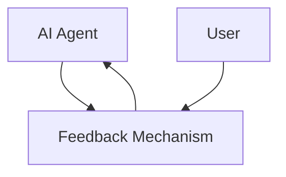
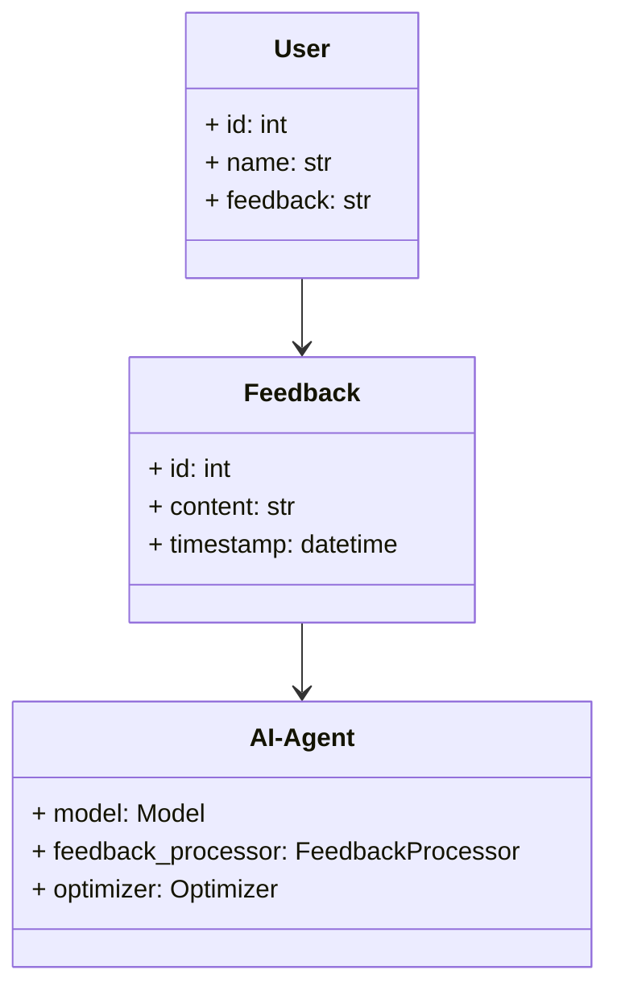
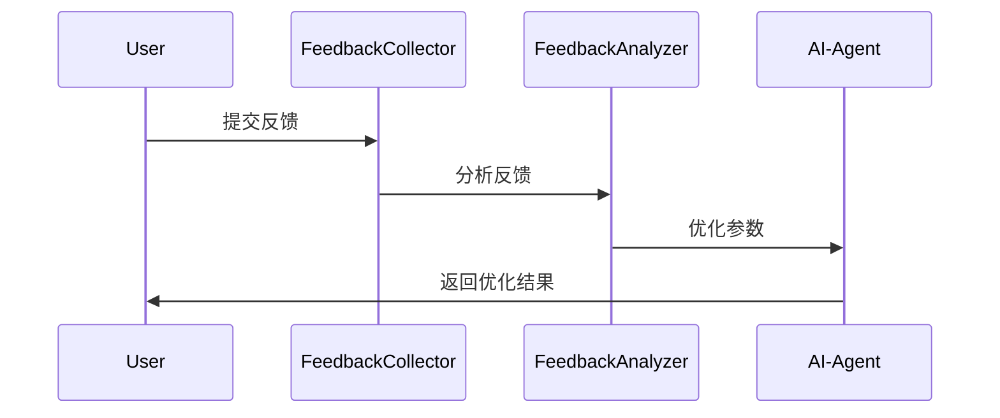

                 


# 基于用户反馈的AI Agent迭代优化流程

> 关键词：AI Agent，用户反馈，迭代优化，机器学习，算法设计

> 摘要：本文详细探讨了基于用户反馈的AI Agent迭代优化流程，从核心概念到算法实现，再到系统架构设计，为读者提供全面的技术指导。通过实际案例分析，展示了如何利用用户反馈提升AI Agent的性能和用户体验。

---

## 第一部分：背景介绍

### 第1章：AI Agent与用户反馈的概述

#### 1.1 问题背景

AI Agent（人工智能代理）是指能够感知环境、自主决策并执行任务的智能体。随着技术的发展，AI Agent在多个领域展现出巨大潜力，但其性能高度依赖于设计和优化。用户反馈作为优化的重要来源，直接影响AI Agent的表现。

#### 1.2 问题描述

用户反馈具有多样性和复杂性，如何有效收集和处理这些反馈是优化的关键。当前AI Agent优化面临数据质量、反馈延迟和模型泛化等挑战。

#### 1.3 问题解决

基于用户反馈的优化方法，如监督学习和强化学习，通过实时调整模型参数，提升AI Agent的表现。同时，结合反馈机制，可以更精准地捕捉用户需求。

#### 1.4 边界与外延

明确用户反馈的边界条件，如实时性、准确性，确定AI Agent的适用范围，并区分相关概念如用户满意度和反馈机制。

---

## 第二部分：核心概念与联系

### 第2章：AI Agent与用户反馈的核心概念

#### 2.1 AI Agent的定义与特征

- **定义**：AI Agent是具备自主决策能力的智能体。
- **特征**：智能性、适应性、自主性、协作性。

| 特征 | 描述 |
|------|------|
| 智能性 | 能够处理复杂任务 |
| 适应性 | 能根据环境调整行为 |
| 自主性 | 无需外部干预 |
| 协作性 | 能与其他系统协同工作 |

#### 2.2 用户反馈的定义与特征

- **定义**：用户在与AI Agent交互后提供的评价或建议。
- **特征**：实时性、准确性、多样性、情感性。

| 特征 | 描述 |
|------|------|
| 实时性 | 反馈即时发生 |
| 准确性 | 反馈真实反映用户需求 |
| 多样性 | 反馈形式多样 |
| 情感性 | 反馈包含情感色彩 |

#### 2.3 AI Agent与用户反馈的关系

通过Mermaid图展示三者的关系：



---

## 第三部分：算法原理讲解

### 第3章：基于用户反馈的AI Agent优化算法

#### 3.1 算法原理

- **监督学习**：利用用户反馈作为标签，训练模型预测用户偏好。
- **强化学习**：通过反馈奖励机制，优化AI Agent的决策策略。

#### 3.2 算法实现

使用Python实现一个简单的优化流程：

```python
def optimize_agent(feedback):
    loss = calculate_loss(agent_prediction, feedback)
    gradients = compute_gradients(loss)
    update_parameters(gradients)
    return agent_prediction

# 示例反馈处理
feedback = get_user_feedback()
optimized_prediction = optimize_agent(feedback)
```

#### 3.3 数学模型与公式

损失函数：

$$ L = \sum_{i=1}^{n} (y_i - \hat{y_i})^2 $$

优化步骤：

1. 计算损失：$$ L = f(x) $$
2. 求导：$$ \frac{dL}{dx} $$
3. 更新参数：$$ x = x - \alpha \frac{dL}{dx} $$

---

## 第四部分：系统分析与架构设计方案

### 第4章：系统分析与架构设计

#### 4.1 问题场景介绍

优化目标是提升AI Agent的响应准确性和用户体验。系统需求包括实时反馈收集、高效处理和持续优化。

#### 4.2 系统功能设计

- 数据采集模块：收集用户反馈。
- 反馈分析模块：处理并解析反馈。
- 优化模块：调整AI Agent参数。

使用Mermaid类图展示领域模型：



#### 4.3 系统架构设计

分层架构：数据层、业务逻辑层、应用层。

使用Mermaid架构图展示：

```mermaid
archi
    顶端: 用户
    顶端连接到 中间层: 反馈收集
    中间层连接到 数据层: 数据存储
    中间层连接到 业务逻辑层: 反馈分析
    业务逻辑层连接到 应用层: 参数优化
```

#### 4.4 系统接口设计

- 数据接口：收集反馈数据。
- API接口：处理反馈并优化AI Agent。

使用Mermaid序列图展示交互流程：



---

## 第五部分：项目实战

### 第5章：基于用户反馈的AI Agent优化实战

#### 5.1 环境搭建

安装必要的库：

```bash
pip install numpy pandas scikit-learn tensorflow
```

#### 5.2 核心代码实现

实现优化函数：

```python
import numpy as np

def optimize_agent(user_feedback):
    # 模拟反馈处理
    feedback_score = np.mean(user_feedback)
    # 模拟优化
    new_params = current_params - 0.1 * feedback_score * gradient
    return new_params

# 示例反馈
user_feedback = np.array([0.8, 0.6, 0.9])
optimized_params = optimize_agent(user_feedback)
```

#### 5.3 实际案例分析

以客服系统为例，展示如何优化AI Agent的响应速度和准确性。

---

## 第六部分：总结与展望

### 第6章：总结与展望

#### 6.1 最佳实践

- 确保反馈数据的高质量。
- 定期更新模型，避免过拟合。
- 保护用户隐私，确保数据安全。

#### 6.2 总结

用户反馈是优化AI Agent的核心，通过有效收集和处理反馈，可以显著提升系统性能和用户体验。

#### 6.3 展望

未来，AI Agent将更加智能化，用户反馈将融入实时优化，推动技术发展。

#### 6.4 拓展阅读

推荐书籍和论文，深入学习AI Agent和反馈机制的相关知识。

---

通过以上步骤，本文系统地阐述了基于用户反馈的AI Agent优化流程，从理论到实践，为技术开发者和研究人员提供了详尽的指导。

