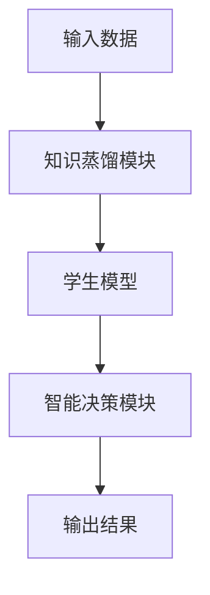

                 


# 基于知识蒸馏的轻量级AI Agent

## 关键词：知识蒸馏、轻量级AI Agent、机器学习、深度学习、模型优化

## 摘要：  
随着人工智能技术的快速发展，轻量级AI Agent的需求日益增长。知识蒸馏作为一种有效的模型压缩技术，能够在保持高性能的同时显著减少模型的大小和计算成本。本文将详细介绍基于知识蒸馏的轻量级AI Agent的核心概念、实现原理、系统设计以及实际应用，探讨如何通过知识蒸馏技术构建高效、轻量且实用的AI Agent系统。文章内容涵盖了从理论到实践的全过程，适合对AI Agent和模型压缩技术感兴趣的读者阅读。

---

## 第1章：背景与核心概念

### 1.1 问题背景与目标

#### 1.1.1 当前AI模型的轻量化需求  
在人工智能领域，模型的复杂性和计算成本不断提高，尤其是在边缘计算和移动端应用中，对轻量级模型的需求尤为迫切。传统的深度学习模型（如BERT、GPT）虽然性能强大，但其计算资源消耗过高，难以在资源受限的环境中部署。因此，如何在保持模型性能的同时实现轻量化，成为当前研究的热点。

#### 1.1.2 知识蒸馏技术的提出背景  
知识蒸馏（Knowledge Distillation）是一种通过教师模型（Teacher）指导学生模型（Student）学习的技术，旨在将复杂模型的知识迁移到更小、更高效的模型中。与传统的模型压缩技术不同，知识蒸馏通过软目标（soft target）的方式，能够更好地保留教师模型的决策边界，从而在保持性能的同时实现模型的轻量化。

#### 1.1.3 轻量级AI Agent的目标与意义  
轻量级AI Agent的目标是在资源受限的环境中，实现高效、实时且准确的智能决策。通过知识蒸馏技术，我们可以将复杂模型的知识迁移到轻量级模型中，使其在边缘设备上实现高效的推理和决策，从而满足实时性和资源效率的要求。

---

### 1.2 核心概念与问题描述

#### 1.2.1 知识蒸馏的定义与核心思想  
知识蒸馏是一种通过教师模型指导学生模型学习的技术。教师模型通常是一个训练好的复杂模型，而学生模型是一个需要优化的小模型。通过蒸馏过程，学生模型可以从教师模型中学习到更精细的知识，从而在保持性能的同时实现轻量化。

#### 1.2.2 轻量级AI Agent的定义与特点  
轻量级AI Agent是一种在资源受限的环境中运行的智能代理系统，具有以下特点：
- **轻量化**：模型大小小，计算成本低。
- **高效性**：能够在边缘设备上实现实时推理。
- **准确性**：在轻量化的同时保持较高的预测精度。
- **可部署性**：适用于资源受限的环境，如移动端、物联网设备等。

#### 1.2.3 问题的边界与外延  
知识蒸馏的核心目标是通过减少模型的复杂性，实现模型的轻量化。然而，如何在蒸馏过程中平衡性能和计算成本，是当前研究中的一个重要挑战。此外，如何在实际应用中选择合适的蒸馏策略，也是需要进一步探讨的问题。

#### 1.2.4 核心概念与联系  
知识蒸馏与轻量级AI Agent之间的关系可以表示为：  
- **教师模型**：复杂模型，提供软目标（soft target）。  
- **学生模型**：轻量级模型，通过蒸馏过程学习教师模型的知识。  
- **蒸馏过程**：通过优化目标函数，将教师模型的知识迁移到学生模型中。  

**对比表格：**

| 对比项       | 教师模型（Teacher） | 学生模型（Student） |
|--------------|---------------------|---------------------|
| 模型复杂度     | 高（复杂）           | 低（轻量化）         |
| 作用          | 提供软目标           | 学习软目标           |
| 训练目标       | 预测准确             | 学习教师知识           |
| 部署环境       | 资源充足             | 资源受限             |

---

## 第2章：知识蒸馏的原理与实现

### 2.1 知识蒸馏的基本原理

#### 2.1.1 教师模型与学生模型的关系  
知识蒸馏的核心思想是通过教师模型的软目标（soft target）来指导学生模型的训练。教师模型通常是一个复杂的预训练模型，而学生模型是一个轻量级的小模型。通过蒸馏过程，学生模型可以从教师模型中学习到更精细的知识，从而在保持性能的同时实现轻量化。

#### 2.1.2 蒸馏过程中的关键步骤  
蒸馏过程通常包括以下步骤：
1. **教师模型的软目标生成**：教师模型对输入数据进行预测，生成软目标（soft target）。
2. **学生模型的损失计算**：学生模型对输入数据进行预测，计算与教师模型软目标之间的损失。
3. **损失优化**：通过优化器对损失函数进行优化，更新学生模型的参数。

### 2.2 知识蒸馏的关键技术

#### 2.2.1 蒸馏过程中的损失函数  
蒸馏的损失函数通常包括两部分：教师模型的损失和学生模型的蒸馏损失。公式如下：

$$L_{total} = L_{teacher} + \alpha L_{distill}$$

其中，$L_{distill}$是蒸馏损失，$\alpha$是蒸馏损失的权重。

蒸馏损失的计算公式为：

$$L_{distill} = -\sum_{i} (p_i \log q_i)$$

其中，$p_i$是教师模型的预测概率，$q_i$是学生模型的预测概率。

#### 2.2.2 知识蒸馏的优化策略  
为了提高蒸馏的效果，可以采用以下优化策略：
- **渐进式蒸馏**：逐步减少教师模型的权重，增加学生模型的权重。
- **动态蒸馏**：根据数据分布的变化，动态调整蒸馏参数。
- **混合蒸馏**：结合硬目标（hard target）和软目标（soft target）进行蒸馏。

### 2.3 知识蒸馏的数学模型

#### 2.3.1 KL散度公式  
KL散度（Kullback-Leibler Divergence）用于衡量两个概率分布之间的差异：

$$D_{KL}(P||Q) = \sum_{i} P_i \log \frac{P_i}{Q_i}$$

在蒸馏过程中，KL散度用于衡量学生模型预测分布与教师模型预测分布之间的差异。

#### 2.3.2 蒸馏损失函数  
蒸馏损失函数可以表示为：

$$L_{distill} = \alpha D_{KL}(P||Q) + (1-\alpha)D_{KL}(Q||P)$$

其中，$\alpha$是平衡系数，$P$是教师模型的预测分布，$Q$是学生模型的预测分布。

---

## 第3章：系统分析与架构设计

### 3.1 系统功能设计

#### 3.1.1 知识蒸馏模块  
知识蒸馏模块负责将教师模型的知识迁移到学生模型中。主要包括：
- 教师模型的软目标生成。
- 学生模型的蒸馏损失计算。
- 蒸馏过程的优化。

#### 3.1.2 智能决策模块  
智能决策模块负责根据输入数据，调用学生模型进行预测，并输出决策结果。

#### 3.1.3 环境交互模块  
环境交互模块负责与外部环境进行交互，接收输入数据并发送决策结果。

### 3.2 系统架构设计

#### 3.2.1 系统架构图  


#### 3.2.2 接口设计  
知识蒸馏模块提供以下接口：
- `get_teacher_prediction(input)`：获取教师模型的软目标。
- `train_student(input, label)`：训练学生模型。
- `predict_student(input)`：预测输入数据的类别。

---

## 第4章：系统实现与项目实战

### 4.1 环境配置

```bash
pip install numpy
pip install tensorflow
pip install matplotlib
```

### 4.2 核心实现代码

#### 4.2.1 教师模型的定义  
```python
import tensorflow as tf

class TeacherModel(tf.keras.Model):
    def __init__(self):
        super(TeacherModel, self).__init__()
        self.dense1 = tf.keras.layers.Dense(256, activation='relu')
        self.dense2 = tf.keras.layers.Dense(10, activation='softmax')
    
    def call(self, inputs):
        x = self.dense1(inputs)
        return self.dense2(x)
```

#### 4.2.2 学生模型的定义  
```python
class StudentModel(tf.keras.Model):
    def __init__(self):
        super(StudentModel, self).__init__()
        self.dense1 = tf.keras.layers.Dense(64, activation='relu')
        self.dense2 = tf.keras.layers.Dense(10, activation='softmax')
    
    def call(self, inputs):
        x = self.dense1(inputs)
        return self.dense2(x)
```

#### 4.2.3 蒸馏过程的实现  
```python
def distillation_loss(y_true, y_pred, teacher logits, alpha=0.5):
    kl_loss = tf.keras.losses.KLDivergence()(y_pred, y_true)
    ce_loss = tf.keras.losses.sparse_categorical_crossentropy(y_true, y_pred)
    return alpha * kl_loss + (1 - alpha) * ce_loss
```

### 4.3 项目实战：问答系统

#### 4.3.1 环境配置  
```bash
pip install numpy
pip install tensorflow
pip install transformers
```

#### 4.3.2 数据预处理  
```python
import numpy as np
from transformers import AutoTokenizer, AutoModelForSequenceClassification

tokenizer = AutoTokenizer.from_pretrained('bert-base-uncased')
model = AutoModelForSequenceClassification.from_pretrained('bert-base-uncased')
```

#### 4.3.3 模型训练  
```python
def train_student_model():
    # 加载教师模型
    teacher_model = AutoModelForSequenceClassification.from_pretrained('bert-base-uncased')
    # 定义学生模型
    student_model = StudentModel()
    # 编译学生模型
    student_model.compile(optimizer='adam', loss=lambda y_true, y_pred: distillation_loss(y_true, y_pred, teacher logits, alpha=0.5))
    # 训练学生模型
    student_model.fit(train_data, train_labels, epochs=10, batch_size=32)
```

#### 4.3.4 环境交互与预测  
```python
def predict_question(question):
    inputs = tokenizer(question, return_tensors='np')
    prediction = student_model.predict(inputs.input_ids)
    return prediction
```

---

## 第5章：总结与展望

### 5.1 总结  
本文详细介绍了基于知识蒸馏的轻量级AI Agent的核心概念、实现原理和系统设计。通过知识蒸馏技术，我们可以将复杂模型的知识迁移到轻量级模型中，从而在保持性能的同时实现模型的轻量化。本文还提供了具体的实现代码和项目案例，帮助读者更好地理解和应用知识蒸馏技术。

### 5.2 未来展望  
尽管知识蒸馏技术在轻量级AI Agent中取得了显著的成果，但仍有许多挑战需要克服：
- 如何进一步优化蒸馏过程，提高蒸馏效率。
- 如何在实际应用中选择合适的蒸馏策略。
- 如何结合其他技术（如量化、剪枝等）进一步优化模型。

未来的研究可以进一步探索这些问题，以实现更高效、更轻量的AI Agent系统。

---

## 小结

通过本文的介绍，读者可以全面了解基于知识蒸馏的轻量级AI Agent的核心技术与实现方法。从理论到实践，本文为读者提供了丰富的知识和代码示例，帮助读者更好地理解和应用知识蒸馏技术。

