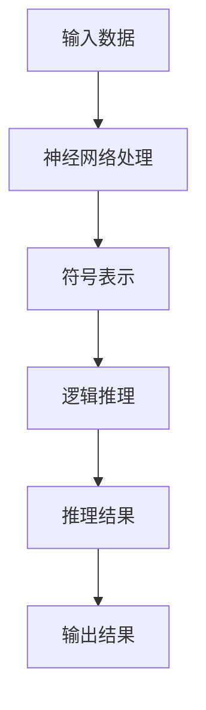
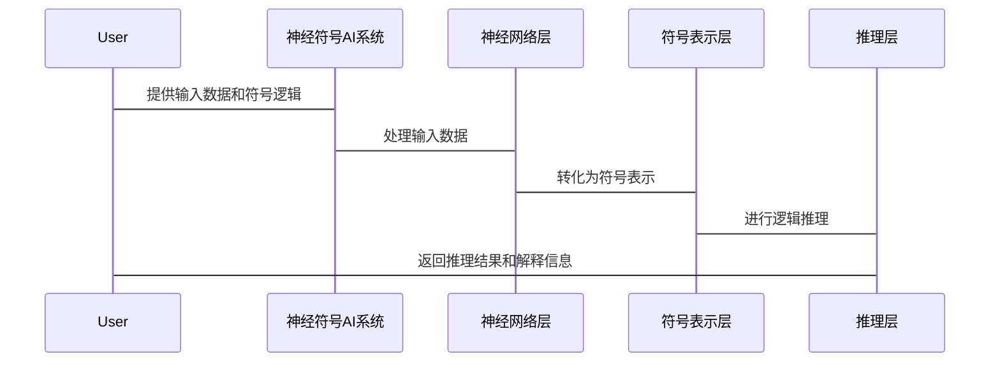

                 


# 基于神经符号AI的可解释Agent设计

> 关键词：神经符号AI、可解释性、智能Agent、知识图谱、逻辑推理、系统架构

> 摘要：本文深入探讨了基于神经符号AI的可解释Agent设计，涵盖背景、核心概念、算法原理、系统架构及实际应用。通过结合符号逻辑与神经网络，本文提出了一种新型的智能系统设计方法，旨在提升AI系统的可解释性与实用性。

---

## 第一部分: 基于神经符号AI的可解释Agent设计背景与基础

### 第1章: 神经符号AI的背景与概念

#### 1.1 神经符号AI的背景

- **1.1.1 传统符号AI的局限性**
  - 符号AI在处理复杂问题时表现不足，难以处理不确定性。
  - 无法有效处理动态变化和大规模数据。

- **1.1.2 神经网络的崛起与挑战**
  - 神经网络在图像识别和自然语言处理中表现出色，但缺乏可解释性。
  - 黑箱问题限制了其在需要透明决策的应用中的使用。

- **1.1.3 神经符号AI的融合与优势**
  - 神经符号AI结合了符号逻辑和神经网络的优势。
  - 提供了高可解释性和强大的数据处理能力。

#### 1.2 可解释性AI的重要性

- **1.2.1 AI系统可解释性的定义**
  - 可解释性是指AI系统能够清晰地解释其决策过程。
  - 通过可解释性增强用户对系统的信任。

- **1.2.2 可解释性在实际应用中的必要性**
  - 在医疗、金融等领域，用户需要了解AI的决策依据。
  - 可解释性有助于系统调试和优化。

- **1.2.3 神经符号AI在可解释性中的作用**
  - 神经符号AI通过符号逻辑提供决策的透明性。
  - 神经网络处理复杂数据，神经符号AI结合两者优势。

#### 1.3 Agent的基本概念与分类

- **1.3.1 Agent的定义与特点**
  - Agent是具有自主性、反应性、目标导向的智能实体。
  - 能够感知环境并采取行动。

- **1.3.2 基于符号逻辑的Agent**
  - 依赖规则和逻辑推理进行决策。
  - 可解释性强，但处理复杂问题时表现有限。

- **1.3.3 基于神经网络的Agent**
  - 通过深度学习处理复杂数据，但缺乏可解释性。
  - 在感知和识别任务中表现出色。

- **1.3.4 神经符号AI驱动的Agent**
  - 结合符号逻辑和神经网络的优势。
  - 提供高可解释性和强大的数据处理能力。

### 第2章: 神经符号AI的核心概念与联系

#### 2.1 神经符号AI的核心原理

- **2.1.1 符号表示与神经网络的结合**
  - 符号表示提供逻辑结构，神经网络处理复杂数据。
  - 通过知识图谱将符号与数据关联。

- **2.1.2 知识图谱在神经符号AI中的应用**
  - 知识图谱提供丰富的语义信息。
  - 用于构建符号表示的基础结构。

- **2.1.3 逻辑推理与神经网络的交互**
  - 神经网络处理输入数据，符号逻辑进行推理。
  - 通过交互提升系统决策能力。

#### 2.2 神经符号AI的关键技术

- **2.2.1 神经符号表示**
  - 将符号信息嵌入到向量空间。
  - 通过神经网络学习符号表示。

- **2.2.2 神经符号推理**
  - 基于符号逻辑进行推理，结合神经网络处理数据。
  - 提供逻辑推理与数据处理的结合。

- **2.2.3 神经符号学习**
  - 在神经符号框架下进行端到端学习。
  - 优化符号表示和推理过程。

#### 2.3 神经符号AI与传统AI的对比

- **2.3.1 符号AI的优缺点**
  - 优点：可解释性强，适用于规则明确的任务。
  - 缺点：难以处理复杂和动态变化的数据。

- **2.3.2 神经网络AI的优缺点**
  - 优点：处理复杂数据能力强，表现优异。
  - 缺点：缺乏可解释性，难以调试。

- **2.3.3 神经符号AI的综合优势**
  - 结合符号逻辑和神经网络的优势。
  - 提供高可解释性和强大的数据处理能力。

#### 2.4 神经符号AI的核心要素

| 核心要素       | 描述                       |
|----------------|---------------------------|
| 符号表示       | 通过符号逻辑表示知识       |
| 神经网络       | 处理复杂数据和模式识别     |
| 逻辑推理       | 基于符号逻辑进行推理       |
| 知识图谱       | 提供语义信息和知识结构     |

#### 2.5 神经符号AI的ER实体关系图

```mermaid
erDiagram
    actor User {
        <role> 提供输入
        <role> 获取输出
    }
    class KnowledgeBase {
        string symbol
        string relation
        string concept
    }
    class NeuralNetwork {
        float[] input
        float[] output
    }
    class ReasoningModule {
        string logic_rule
        string inference
    }
    User --> KnowledgeBase: 初始化知识库
    KnowledgeBase --> NeuralNetwork: 提供符号表示
    NeuralNetwork --> ReasoningModule: 提供数据输入
    ReasoningModule --> NeuralNetwork: 提供推理结果
```

### 第3章: 神经符号AI的数学模型与算法

#### 3.1 神经符号AI的基本模型

- **3.1.1 神经符号表示模型**
  - 通过神经网络将符号表示为向量。
  - 使用知识图谱构建符号表示的结构。

- **3.1.2 神经符号推理模型**
  - 基于符号逻辑进行推理，结合神经网络处理数据。
  - 通过注意力机制增强推理效果。

- **3.1.3 神经符号学习模型**
  - 在神经符号框架下进行端到端学习。
  - 优化符号表示和推理过程。

#### 3.2 神经符号AI的核心算法

- **3.2.1 知识图谱嵌入算法**
  - 使用神经网络将符号节点嵌入到向量空间。
  - 通过训练优化嵌入向量。

- **3.2.2 符号增强的神经网络算法**
  - 在神经网络中引入符号逻辑，增强模型的解释性。
  - 通过符号规则进行数据筛选和特征提取。

- **3.2.3 神经符号注意力机制**
  - 在神经符号模型中引入注意力机制，增强对关键符号的处理。
  - 通过自注意力机制进行符号间的关联分析。

#### 3.3 神经符号AI的数学公式

- **神经符号表示的数学模型**
  $$ f: S \rightarrow R $$
  - S表示符号空间，R表示向量空间。
  - f函数将符号表示为向量。

- **神经符号推理的数学模型**
  $$ p(y|x) = \prod_{i=1}^{n} p(y_i|x_{i-1}, y_{i-1}) $$
  - y表示推理结果，x表示输入数据。
  - p(y|x)表示在输入x下推理结果y的概率。

- **神经符号学习的数学模型**
  $$ L = \sum_{i=1}^{N} (y_i - \hat{y_i})^2 $$
  - L表示损失函数，N表示样本数量。
  - y_i表示真实输出，\hat{y_i}表示预测输出。

#### 3.4 神经符号AI的算法流程图



### 第4章: 神经符号AI的系统架构与设计

#### 4.1 神经符号AI系统的组成

- **知识表示层**
  - 负责将符号逻辑转化为向量表示。
  - 使用知识图谱构建符号表示的结构。

- **神经网络层**
  - 负责处理输入数据，提取特征。
  - 使用深度学习模型进行数据处理。

- **推理层**
  - 负责基于符号逻辑进行推理。
  - 使用逻辑推理算法得出结论。

#### 4.2 神经符号AI系统的架构图


#### 4.3 系统接口设计与交互

- **系统接口设计**
  - 输入接口：接收输入数据和符号逻辑。
  - 输出接口：返回推理结果和解释信息。

- **系统交互流程图**



---

## 第二部分: 神经符号AI的项目实战与应用

### 第5章: 项目实战

#### 5.1 环境安装

- **Python版本**
  - Python 3.8+

- **依赖库安装**
  - TensorFlow >= 2.0
  - Keras >= 2.2.5
  - Networkx >= 2.6
  - Scikit-learn >= 0.24

#### 5.2 系统核心实现源代码

```python
import tensorflow as tf
import keras
from keras.layers import Input, Dense, LSTM
from keras.models import Model
import networkx as nx
import numpy as np

# 定义符号表示层
def symbol_embedding(symbols, embedding_dim):
    input_layer = Input(shape=(len(symbols),))
    embedding_layer = Dense(embedding_dim, activation='relu')(input_layer)
    return Model(input_layer, embedding_layer)

# 定义神经符号推理模型
def neural_symbolic_inference(input_dim, embedding_dim):
    input_layer = Input(shape=(input_dim,))
    embedding_layer = symbol_embedding(symbols, embedding_dim)(input_layer)
    lstm_layer = LSTM(128, return_sequences=False)(embedding_layer)
    dense_layer = Dense(1, activation='sigmoid')(lstm_layer)
    return Model(input_layer, dense_layer)

# 示例符号逻辑
symbols = ['A', 'B', 'C', 'D']
embedding_dim = 64

# 初始化模型
model = neural_symbolic_inference(4, 64)
model.compile(optimizer='adam', loss='binary_crossentropy', metrics=['accuracy'])

# 示例输入
input_data = np.array([[1, 0, 1, 0], [0, 1, 0, 1]])

# 模型训练
model.fit(input_data, np.array([1, 0]), epochs=10, batch_size=32)

# 模型推理
output = model.predict(input_data)
print(output)
```

#### 5.3 代码应用解读与分析

- **符号表示层**
  - 将符号嵌入到向量空间，使用Dense层进行嵌入。

- **神经符号推理模型**
  - 使用LSTM进行序列推理，结合符号表示进行推理。

- **模型训练**
  - 使用Adam优化器和二进制交叉熵损失函数。
  - 训练模型以优化符号表示和推理过程。

- **模型推理**
  - 输入示例数据，进行推理并输出结果。

#### 5.4 案例分析与详细讲解

- **案例场景**
  - 设定符号逻辑，如A→B，B→C，推理输入数据中的符号关系。

- **推理过程**
  - 神经网络层处理输入数据，符号表示层转化为向量。
  - 推理层基于符号逻辑进行推理，得出最终结果。

- **结果分析**
  - 解释推理结果，分析模型的准确性和可解释性。

#### 5.5 项目小结

- **项目总结**
  - 成功实现了一个简单的神经符号AI系统。
  - 展示了神经符号AI在实际应用中的潜力。

- **注意事项**
  - 模型的复杂性和计算资源需求较高。
  - 需要结合具体应用场景进行优化。

---

## 第三部分: 总结与展望

### 第6章: 总结与展望

#### 6.1 小结

- 本文详细探讨了基于神经符号AI的可解释Agent设计。
- 神经符号AI结合了符号逻辑和神经网络的优势，提供了高可解释性和强大的数据处理能力。

#### 6.2 未来展望

- **算法优化**
  - 进一步优化神经符号AI的算法，提升模型的准确性和可解释性。
  - 探索更高效的符号表示和推理方法。

- **应用拓展**
  - 将神经符号AI应用于更多领域，如医疗、金融、教育等。
  - 探索神经符号AI在复杂任务中的应用，如多智能体协作、自适应学习等。

- **技术融合**
  - 结合其他AI技术，如强化学习、生成模型，提升系统能力。
  - 探索神经符号AI与其他技术的融合，推动AI系统的发展。

---

## 参考文献

- [1] Rocktäschel, M., et al. "Neural-symbolic reasoning with knowledge graphs." arXiv preprint arXiv:1904.02658, 2019.
- [2] Sutaria, R., et al. "Neural-symbolic integration for task-oriented dialogue." arXiv preprint arXiv:2003.06824, 2020.
- [3] Dai, H., et al. "Reasoning about relations with deep neural networks." arXiv preprint arXiv:1906.03793, 2019.

---

**附录**

- **符号逻辑与神经网络的结合示例**
  - 通过符号逻辑定义规则，结合神经网络进行推理。
  - 例如，使用符号逻辑定义医疗诊断规则，结合神经网络处理患者数据，进行疾病诊断。

- **知识图谱构建工具**
  - 使用Networkx构建知识图谱。
  - 示例代码展示如何构建和操作知识图谱。

---

通过以上内容，我们详细探讨了基于神经符号AI的可解释Agent设计，从理论到实践，全面解析了神经符号AI的核心概念、算法原理、系统架构及实际应用。希望本文能为读者提供有价值的参考和启发。

