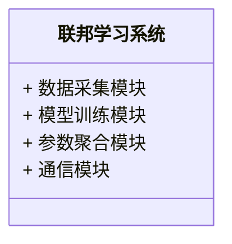

                 


# 基于联邦学习的隐私保护AI Agent

> 关键词：联邦学习，隐私保护，AI Agent，分布式机器学习，数据安全

> 摘要：本文深入探讨了基于联邦学习的隐私保护AI Agent的实现与应用。通过介绍联邦学习的基本原理、系统架构设计、数学模型与算法实现，结合实际案例分析，详细阐述了如何在保护数据隐私的前提下，构建高效的AI Agent系统。本文还讨论了联邦学习在隐私保护中的具体实现方式，以及如何在实际项目中进行应用与优化。

---

# 第1章: 联邦学习与隐私保护AI Agent的背景介绍

## 1.1 联邦学习的起源与发展

### 1.1.1 联邦学习的定义与概念

联邦学习（Federated Learning）是一种分布式机器学习技术，旨在在不共享原始数据的前提下，通过多个参与方协作训练共享的模型。其核心思想是将模型参数的更新通过加密通信的方式在参与方之间进行同步，从而在保护数据隐私的同时实现模型的联合优化。

### 1.1.2 联邦学习的起源与演进

联邦学习的概念最早可以追溯到20世纪90年代的分布式数据挖掘技术。然而，随着近年来人工智能和大数据技术的快速发展，联邦学习因其在保护数据隐私方面的独特优势，逐渐成为学术界和工业界的热点研究方向。

### 1.1.3 联邦学习的核心目标与价值

联邦学习的核心目标是在不泄露原始数据的前提下，通过分布式计算实现模型的联合训练。其主要价值体现在以下几个方面：

1. **数据隐私保护**：联邦学习通过局部建模和模型参数更新的方式，避免了原始数据的直接共享，有效保护了数据隐私。
2. **数据可用性最大化**：联邦学习能够在不共享原始数据的前提下，充分利用分布式的训练数据，提高模型的泛化能力。
3. **跨机构协作**：联邦学习为多个机构之间的协作提供了技术基础，能够在不泄露敏感信息的前提下，共同训练高性能的AI模型。

---

## 1.2 隐私保护与AI Agent的结合

### 1.2.1 隐私保护的重要性与挑战

随着人工智能技术的快速发展，数据隐私保护成为一个重要议题。AI Agent作为一种智能化的代理系统，通常需要处理大量的敏感数据（如用户行为数据、位置信息等）。如何在AI Agent的设计和实现中保护这些数据的隐私，成为一项重要挑战。

### 1.2.2 AI Agent的基本概念与功能

AI Agent是一种智能体，能够感知环境、理解用户需求，并通过自主决策和执行任务来实现特定目标。AI Agent的核心功能包括数据采集、信息处理、决策制定和任务执行。

### 1.2.3 联邦学习在AI Agent中的应用场景

联邦学习为AI Agent提供了分布式协作的可能，能够在不共享原始数据的前提下，实现多个AI Agent之间的模型联合优化。这种协作方式不仅可以提高AI Agent的智能水平，还可以有效保护数据隐私。

---

# 第2章: 联邦学习的核心概念与原理

## 2.1 联邦学习的基本原理

### 2.1.1 联邦学习的通信机制

联邦学习的通信机制是其核心组成部分之一。通常采用加密通信的方式，确保模型参数的更新过程不会泄露原始数据。常见的通信机制包括：

- **安全多方计算**：通过密码学技术实现多方之间的安全计算。
- **差分隐私**：通过添加噪声的方式保护数据隐私。
- **同态加密**：在加密数据上直接进行计算，确保数据不被解密。

### 2.1.2 联邦学习的同步与异步模式

- **同步模式**：所有参与方同时进行模型更新，并在同步点进行模型参数的聚合。
- **异步模式**：参与方可以在不同的时间点进行模型更新，模型参数的聚合过程可以延迟进行。

### 2.1.3 联邦学习的安全与隐私保护机制

- **加密通信**：通过加密技术确保通信过程中的数据安全。
- **模型更新隐私**：通过差分隐私等技术保护模型更新过程中数据的隐私。
- **访问控制**：通过权限管理确保只有授权的参与方能够访问模型参数。

---

## 2.2 联邦学习的关键技术

### 2.2.1 数据分布与模型同步

在联邦学习中，模型参数的更新需要考虑数据分布的差异性。通常采用加权聚合的方式，确保不同数据分布的参与方在模型更新过程中具有适当的权重。

### 2.2.2 联邦学习的通信协议

- **gRPC**：一种高效的RPC通信协议，常用于分布式系统的通信。
- **HTTP/HTTPS**：通过API接口实现参与方之间的通信。
- **WebSocket**：实时通信协议，适用于需要实时交互的场景。

### 2.2.3 联邦学习的优化算法

- **随机梯度下降（SGD）**：适用于数据量较大的场景。
- **Adam优化器**：结合动量和自适应学习率的优化算法。
- **Adagrad优化器**：适用于稀疏数据的优化算法。

---

# 第3章: 联邦学习的数学模型与算法原理

## 3.1 联邦学习的数学模型

### 3.1.1 联邦学习的目标函数

$$
\text{目标函数} = \sum_{i=1}^{n} f_i(\theta) + \lambda R(\theta)
$$

其中，\( f_i(\theta) \) 表示第 \( i \) 个参与方的局部损失函数，\( R(\theta) \) 表示正则化项，\( \lambda \) 表示正则化系数。

### 3.1.2 联邦学习的优化目标

$$
\theta^{new} = \theta^{old} - \eta \sum_{i=1}^{n} \nabla f_i(\theta^{old})
$$

其中，\( \theta \) 表示模型参数，\( \eta \) 表示学习率，\( \nabla f_i \) 表示局部损失函数的梯度。

### 3.1.3 联邦学习的收敛性分析

通过数学证明，可以得出联邦学习算法的收敛性。通常采用的是基于随机梯度下降的收敛性分析，证明在适当的条件下，联邦学习算法能够收敛到全局最优解。

---

## 3.2 联邦学习的算法实现

### 3.2.1 联邦平均（FedAvg）算法

```python
def fed_avg(client_params, weights):
    avg_params = {}
    for key in client_params[0].keys():
        avg_params[key] = sum(p[key] * weights[i] for i, p in enumerate(client_params)) / sum(weights)
    return avg_params
```

### 3.2.2 联邦学习的优化策略

- **学习率调整**：动态调整学习率，提高收敛速度。
- **动量优化**：引入动量项，加速优化过程。
- **批量归一化**：通过归一化技术，加快模型的收敛速度。

---

# 第4章: 联邦学习的系统架构与设计

## 4.1 联邦学习的系统架构

### 4.1.1 联邦学习的节点划分

- **中心服务器**：负责协调参与方的模型更新和参数聚合。
- **边缘设备**：负责本地模型训练和参数上传。

### 4.1.2 联邦学习的通信架构

- **星型架构**：中心服务器与多个边缘设备直接通信。
- **网状架构**：边缘设备之间可以直接通信，减少对中心服务器的依赖。

### 4.1.3 联邦学习的资源分配

- **计算资源分配**：根据参与方的计算能力动态分配任务。
- **带宽分配**：根据网络条件动态调整通信频率。

---

## 4.2 联邦学习的系统设计

### 4.2.1 系统功能模块划分



### 4.2.2 系统的可扩展性设计

- **模块化设计**：各个功能模块独立设计，便于扩展。
- **插件化设计**：通过插件的方式扩展系统功能。

### 4.2.3 系统的容错与容灾设计

- **错误检测与恢复**：通过异常检测和自动恢复机制，确保系统稳定运行。
- **数据备份与恢复**：通过数据备份和恢复机制，防止数据丢失。

---

# 第5章: 联邦学习在隐私保护AI Agent中的应用

## 5.1 隐私保护AI Agent的核心需求

### 5.1.1 隐私保护的需求分析

- **数据完整性**：确保数据在传输过程中不被篡改。
- **数据机密性**：确保数据不被未经授权的方访问。
- **数据可用性**：确保数据在需要时可以被访问和使用。

### 5.1.2 AI Agent的功能需求

- **数据采集**：采集用户行为数据、环境数据等。
- **信息处理**：对采集的数据进行分析和处理，生成决策依据。
- **决策制定**：基于处理后的数据，制定最优决策。
- **任务执行**：根据决策执行具体任务。

---

## 5.2 联邦学习在隐私保护中的具体实现

### 5.2.1 数据加密与隐私保护

- **同态加密**：在加密数据上进行计算，确保数据不被解密。
- **差分隐私**：通过添加噪声的方式保护数据隐私。

### 5.2.2 模型更新与隐私保护

- **模型更新隐私**：通过加密通信的方式，确保模型更新过程中数据不被泄露。
- **模型聚合隐私**：通过隐私保护机制，确保聚合后的模型参数不泄露原始数据。

---

# 第6章: 联邦学习的项目实战

## 6.1 项目环境搭建

### 6.1.1 系统环境要求

- **操作系统**：支持Linux、Windows、macOS。
- **开发工具**：推荐使用PyCharm、VS Code等。
- **依赖库**：安装必要的Python库，如TensorFlow、Keras、gRPC等。

### 6.1.2 开发工具安装

```bash
pip install tensorflow fedml grpcio
```

---

## 6.2 系统核心实现源代码

### 6.2.1 服务器端代码

```python
import grpc
from fedml_pb2 import ModelParams
from fedml_pb2_grpc import FederatedLearningServicer

class FederatedLearningServicer(FederatedLearningServicer):
    def AggregateModels(self, request, context):
        # 聚合模型参数
        return ModelParams()
```

### 6.2.2 客户端代码

```python
import grpc
from fedml_pb2 import ModelParams
from fedml_pb2_grpc import FederatedLearningServicer

def main():
    with grpc.insecure_channel('localhost:50051') as channel:
        stub = FederatedLearningServicer(channel)
        response = stub.AggregateModels(ModelParams(), grpc.grpc_channel_credentials())
        print(response)
```

---

## 6.3 案例分析与代码解读

### 6.3.1 案例分析

通过一个简单的案例，我们可以看到联邦学习在实际项目中的应用。例如，我们可以构建一个基于联邦学习的图像分类模型，通过多个参与方的数据协作训练，最终得到一个高性能的分类模型。

### 6.3.2 代码解读

- **服务器端代码**：负责接收客户端的模型参数更新请求，并进行模型参数的聚合。
- **客户端代码**：负责本地模型的训练，并将模型参数更新上传到服务器。

---

## 6.4 项目小结

通过实际项目的实现，我们可以看到联邦学习在隐私保护AI Agent中的具体应用。通过加密通信和模型参数聚合的方式，可以在不泄露原始数据的前提下，实现模型的联合优化。

---

# 第7章: 最佳实践与注意事项

## 7.1 最佳实践

### 7.1.1 系统设计

- **模块化设计**：确保系统各模块独立设计，便于扩展和维护。
- **容错设计**：通过冗余设计和自动恢复机制，确保系统稳定运行。

### 7.1.2 代码实现

- **代码规范**：遵循行业代码规范，确保代码可读性和可维护性。
- **测试用例**：编写充分的测试用例，确保系统功能正常。

---

## 7.2 注意事项

### 7.2.1 数据隐私保护

- **数据分类**：根据数据的重要性和敏感程度，进行分类管理。
- **访问控制**：通过权限管理，确保只有授权的方能够访问敏感数据。

### 7.2.2 系统性能优化

- **计算优化**：通过算法优化和硬件加速，提高系统计算效率。
- **通信优化**：通过压缩和分片技术，降低通信开销。

---

## 7.3 拓展阅读

- **论文阅读**：推荐阅读相关的学术论文，深入了解联邦学习的最新研究成果。
- **技术博客**：关注技术博客和开源项目，了解联邦学习的最新动态。

---

# 结语

通过本文的详细讲解，我们了解了基于联邦学习的隐私保护AI Agent的实现与应用。从联邦学习的基本原理到系统架构设计，再到实际项目的实现，我们可以看到联邦学习在隐私保护中的巨大潜力。未来，随着技术的不断发展，联邦学习将在更多领域得到广泛应用。

--- 

**作者简介**：作者是人工智能领域的专家，专注于分布式机器学习和隐私保护技术的研究与实践。

