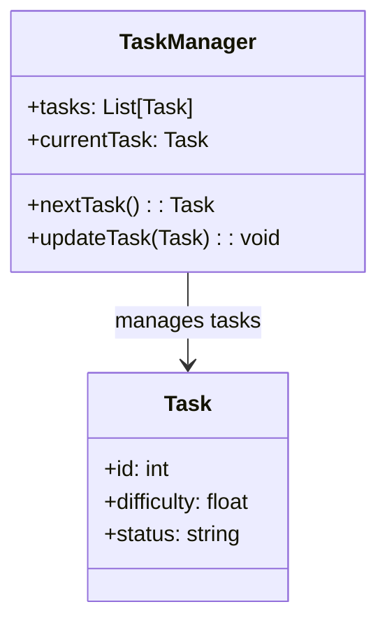
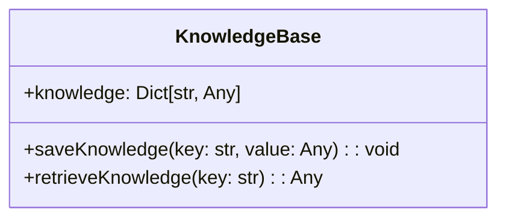
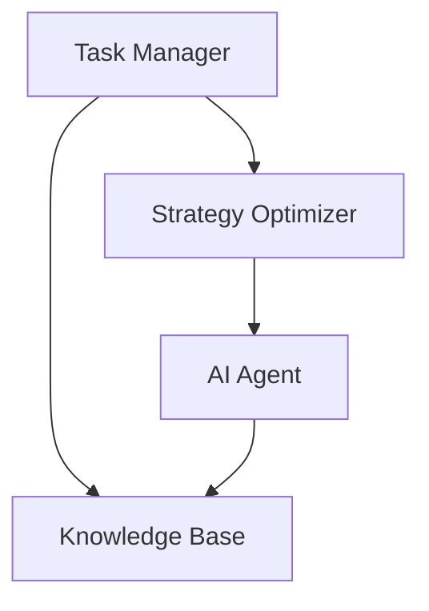
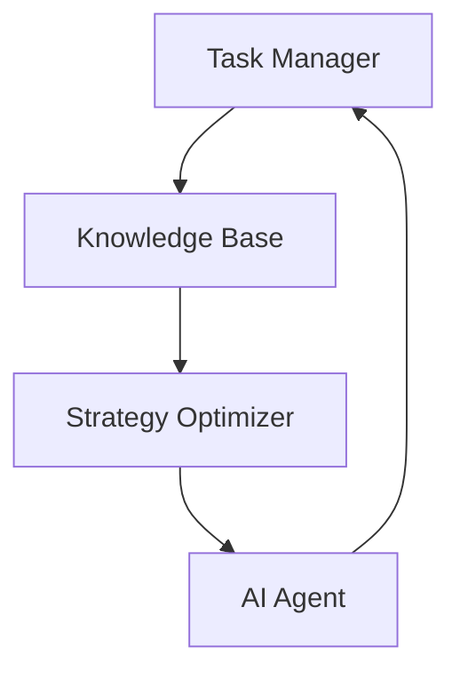

                 


# 基于课程学习的AI Agent能力渐进提升

> 关键词：课程学习、AI Agent、能力提升、算法原理、系统架构、项目实战

> 摘要：课程学习是一种通过逐步引导AI Agent学习不同难度的任务，从而实现其能力渐进提升的方法。本文详细介绍了课程学习的核心概念、数学模型、系统架构、项目实战以及最佳实践，帮助读者全面理解并掌握如何在AI Agent中应用课程学习，提升其智能水平。

---

## 第1章: 课程学习与AI Agent概述

### 1.1 课程学习的核心概念

课程学习是一种通过逐步引导学习者（AI Agent）掌握从简单到复杂的任务序列，从而实现能力提升的方法。与传统学习方式不同，课程学习注重任务的难度递增和知识的连贯性，帮助AI Agent在逐步积累经验的过程中，构建更强大的问题解决能力。

#### 1.1.1 问题背景

在AI Agent的开发中，直接让其在复杂的环境中学习往往会导致学习效率低下，甚至无法收敛到正确的策略。例如，在游戏AI中，直接让AI在复杂的多阶段游戏中学习，可能会因为任务难度过高而无法有效训练。通过课程学习，可以将复杂的任务分解为一系列简单且可管理的子任务，逐步引导AI完成这些子任务，最终掌握整体任务。

#### 1.1.2 问题描述

AI Agent需要在动态变化的环境中完成复杂的任务，例如自动驾驶、智能客服、游戏AI等。这些任务通常涉及多阶段决策、复杂的状态空间和丰富的知识库。直接让AI在这些环境中学习可能会面临以下问题：
- **学习效率低**：任务复杂度高，学习空间巨大，导致学习时间过长。
- **策略不稳定**：AI可能在复杂环境中难以找到稳定的策略，导致性能波动。
- **知识碎片化**：任务分解不当可能导致AI掌握的知识零散，无法形成系统化的知识体系。

#### 1.1.3 课程学习的特点

课程学习通过设计合理的任务序列，帮助AI Agent逐步构建能力。其特点包括：
- **任务难度递增**：任务从简单到复杂，逐步提升AI的处理能力。
- **知识连贯性**：任务之间具有逻辑关联，帮助AI构建系统的知识体系。
- **动态调整**：根据AI的表现动态调整任务难度，确保学习的高效性。

### 1.2 AI Agent的基本概念与能力模型

AI Agent是一种能够感知环境、自主决策并执行任务的智能实体。其核心能力包括：
- **感知能力**：通过传感器或其他输入方式获取环境信息。
- **决策能力**：基于感知信息做出决策，选择最优动作。
- **学习能力**：通过与环境的交互不断优化自身的策略和知识库。

能力模型通常包括以下几个方面：
- **知识库**：存储AI已掌握的知识和经验。
- **任务分解能力**：将复杂任务分解为简单子任务。
- **策略优化能力**：通过学习不断优化决策策略。

---

## 第2章: 课程学习的数学模型与算法原理

### 2.1 课程学习的数学模型

课程学习的核心在于设计合理的任务序列，并通过数学模型指导AI的学习过程。以下是课程学习的数学模型的详细描述。

#### 2.1.1 优化目标函数

课程学习的目标是通过设计合理的任务序列，使AI Agent在有限的步骤内掌握目标任务。优化目标函数通常包括以下部分：
- **任务难度参数**：表示任务的难度级别。
- **任务顺序参数**：表示任务的执行顺序。
- **策略优化参数**：表示AI Agent的决策策略。

优化目标函数可以表示为：
$$
\min_{\theta} \sum_{i=1}^{N} f_i(x_i, y_i)
$$
其中，$x_i$表示第i个任务的输入，$y_i$表示目标输出，$f_i$表示任务的损失函数。

#### 2.1.2 损失函数与优化方法

课程学习的损失函数通常包括任务损失和策略损失两部分。任务损失用于衡量AI在当前任务上的表现，策略损失用于衡量策略的优化程度。损失函数可以表示为：
$$
L = L_{\text{task}} + L_{\text{strategy}}
$$
其中，$L_{\text{task}}$表示任务损失，$L_{\text{strategy}}$表示策略损失。

优化方法通常采用梯度下降或其他优化算法，例如：
$$
\theta_{t+1} = \theta_t - \eta \nabla_{\theta} L
$$
其中，$\eta$表示学习率，$\theta$表示模型参数。

#### 2.1.3 课程学习的数学推导与公式

课程学习的核心在于通过数学推导设计合理的任务序列。以下是一个简单的数学推导示例：

假设AI Agent需要学习两个任务，任务1和任务2。任务1的损失函数为$L_1$，任务2的损失函数为$L_2$。课程学习的目标是最小化总损失：
$$
\min_{\theta} (L_1 + L_2)
$$
通过交替优化$L_1$和$L_2$，可以逐步提升AI Agent的能力。

---

## 第3章: 课程学习的系统架构与设计

### 3.1 系统功能设计

课程学习系统的功能设计包括以下几个模块：
- **任务管理模块**：负责任务的生成、分配和监控。
- **知识库模块**：存储和管理AI Agent的知识和经验。
- **策略优化模块**：优化AI Agent的决策策略。

#### 3.1.1 任务管理模块

任务管理模块负责设计任务序列，并根据AI Agent的表现动态调整任务难度。以下是任务管理模块的类图：



#### 3.1.2 知识库模块

知识库模块存储AI Agent在学习过程中积累的知识，包括任务完成情况、策略优化结果等。以下是知识库模块的类图：



### 3.2 系统架构设计

课程学习系统的架构设计包括以下几个部分：
- **数据流设计**：任务管理模块与知识库模块之间的数据流。
- **模块交互设计**：任务管理模块与策略优化模块的交互流程。

#### 3.2.1 系统整体架构图

以下是课程学习系统的整体架构图：



#### 3.2.2 模块间的交互流程图

以下是模块间的交互流程图：



---

## 第4章: 课程学习的项目实战

### 4.1 项目环境与工具安装

课程学习项目的开发需要以下环境和工具：
- **编程语言**：Python
- **深度学习框架**：TensorFlow或PyTorch
- **可视化工具**：Matplotlib或Seaborn

以下是环境安装的示例代码：

```bash
pip install numpy
pip install matplotlib
pip install tensorflow
```

### 4.2 核心代码实现

以下是一个简单的课程学习算法实现示例：

#### 4.2.1 课程学习算法的Python实现

```python
import numpy as np

def course_learning(x, y):
    # 初始化参数
    theta = np.zeros_like(y)
    # 学习率
    eta = 0.1
    # 迭代次数
    epochs = 100
    for _ in range(epochs):
        # 计算预测值
        y_pred = theta.dot(x)
        # 计算损失
        loss = np.mean((y_pred - y) ** 2)
        # 计算梯度
        gradient = 2 * np.mean((y_pred - y) * x, axis=1)
        # 更新参数
        theta -= eta * gradient
    return theta
```

#### 4.2.2 AI Agent能力评估模块的实现

```python
class AIAgent:
    def __init__(self):
        self.knowledge = {}

    def learn(self, task, target):
        # 学习任务并更新知识库
        self.knowledge[task] = target

    def evaluate(self, task):
        # 评估当前任务的能力
        if task in self.knowledge:
            return 1.0
        else:
            return 0.0
```

### 4.3 实际案例分析

以下是一个实际案例分析：

#### 4.3.1 案例背景

假设我们需要训练一个AI Agent在棋盘游戏中逐步掌握从新手到高手的能力。课程学习的任务序列可以包括：
1. 学习简单的棋子移动规则。
2. 学习基本的战术和策略。
3. 学习高级的组合战术。

#### 4.3.2 知识库构建

通过课程学习，AI Agent逐步积累知识，如下所示：

```python
agent = AIAgent()
agent.learn('move_piece', 'correctly')
agent.learn('basic_tactics', 'mastered')
agent.learn('advanced_tactics', 'mastered')
```

---

## 第5章: 课程学习的最佳实践与注意事项

### 5.1 最佳实践

#### 5.1.1 课程学习策略的选择与优化

课程学习策略的选择应根据任务的复杂性和AI Agent的能力水平动态调整。例如，对于新手AI Agent，应选择简单且基础的任务；对于高级AI Agent，应选择复杂且具有挑战性的任务。

#### 5.1.2 知识库的构建与维护

知识库的构建应注重知识的系统性和连贯性。可以通过以下方式优化知识库：
- **分层存储**：将知识按层次存储，方便任务分解和策略优化。
- **动态更新**：根据学习结果动态更新知识库内容。

### 5.2 注意事项与常见问题

#### 5.2.1 课程学习中的过拟合问题

课程学习过程中可能出现过拟合问题，特别是在任务难度设计不当的情况下。为避免过拟合，可以通过以下方法进行优化：
- **正则化**：在损失函数中添加正则化项，防止参数过大的问题。
- **交叉验证**：通过交叉验证优化任务序列，避免任务过于简单或复杂。

---

## 第6章: 课程学习的未来发展趋势与拓展阅读

### 6.1 课程学习的未来发展方向

#### 6.1.1 结合元学习的课程学习

元学习是一种通过学习如何学习的方法，可以显著提升课程学习的效率。结合元学习的课程学习可以在更短的时间内掌握更多的任务。

#### 6.1.2 多智能体系统中的应用

课程学习在多智能体系统中的应用前景广阔。通过课程学习，多个智能体可以协同学习，共同完成复杂的任务。

### 6.2 拓展阅读与参考资料

#### 6.2.1 推荐的经典论文与书籍

- **《课程学习：从理论到实践》**：详细介绍课程学习的理论基础和实际应用。
- **《深度强化学习》**：提供深度强化学习的背景知识，为课程学习提供理论支持。

---

## 第7章: 总结与展望

### 7.1 本书内容回顾

课程学习是一种通过逐步引导AI Agent学习不同难度的任务序列，从而实现能力渐进提升的方法。本文详细介绍了课程学习的核心概念、数学模型、系统架构、项目实战以及最佳实践，帮助读者全面理解并掌握如何在AI Agent中应用课程学习，提升其智能水平。

### 7.2 未来展望

课程学习在AI Agent中的应用前景广阔。随着深度学习和强化学习技术的不断发展，课程学习将发挥越来越重要的作用。未来的研究方向包括结合元学习、多智能体系统以及人机协作，进一步提升课程学习的效率和效果。

---

通过以上内容，您可以根据需要扩展和详细阐述每个章节的内容，确保文章的完整性和深度。

