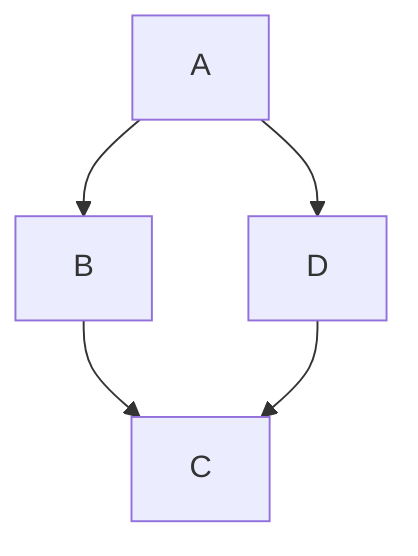
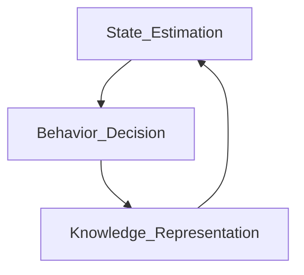
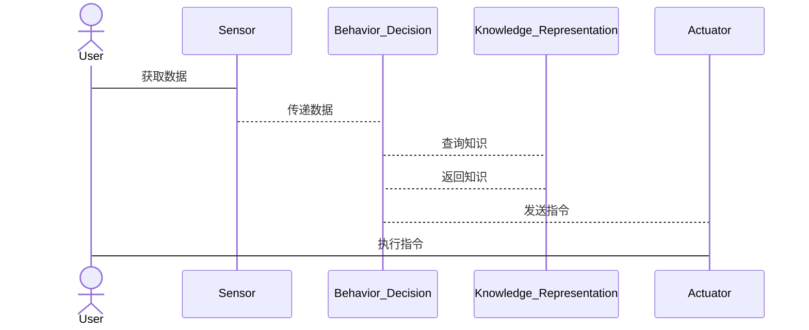

                 


# 基于贝叶斯方法的AI Agent不确定性处理

## 关键词
贝叶斯方法、AI Agent、不确定性处理、概率论、贝叶斯网络

## 摘要
本文详细探讨了基于贝叶斯方法的AI Agent在不确定性处理中的应用。通过分析贝叶斯定理的基本原理，结合AI Agent的实际应用场景，本文介绍了贝叶斯网络的构建与推理过程，并通过实例展示了贝叶斯方法在状态估计、行为决策等方面的优势。文章内容涵盖了贝叶斯方法的数学基础、算法实现、系统设计以及项目实战，旨在帮助读者全面理解贝叶斯方法在AI Agent中的应用及其在处理不确定性问题中的重要性。

---

## 第一部分：贝叶斯方法与AI Agent不确定性处理基础

### 第1章：贝叶斯方法与AI Agent概述

#### 1.1 贝叶斯方法的基本概念
贝叶斯方法是一种基于概率论的推理方法，通过更新概率来反映数据对概率分布的影响。其核心思想是利用先验知识和观测数据来推断后验概率，从而做出最优决策。

- **贝叶斯定理的定义与公式**
  贝叶斯定理公式为：
  $$ P(B|A) = \frac{P(A|B)P(B)}{P(A)} $$
  其中，$P(B|A)$ 是在事件 $A$ 发生的情况下，事件 $B$ 发生的概率；$P(A|B)$ 是在事件 $B$ 发生的情况下，事件 $A$ 发生的概率；$P(B)$ 是事件 $B$ 的先验概率；$P(A)$ 是事件 $A$ 的全概率。

- **贝叶斯方法的核心思想**
  贝叶斯方法的核心思想是通过不断更新概率分布来反映新信息的影响，从而实现对不确定性的有效处理。

- **贝叶斯方法在AI Agent中的应用**
  AI Agent在处理不确定性问题时，可以通过贝叶斯方法进行状态估计、行为决策和知识推理。

#### 1.2 AI Agent的不确定性处理
AI Agent在复杂环境中需要处理多种不确定性，包括环境的不可预测性、信息的不完整性等。贝叶斯方法在这些场景中表现出显著优势。

- **不确定性在AI Agent中的表现形式**
  不确定性主要表现为状态的不确定性、行为的不确定性以及环境的不确定性。

- **贝叶斯方法在不确定性处理中的优势**
  贝叶斯方法能够通过概率分布的形式，量化不确定性，并利用先验知识进行推理，从而提高决策的准确性。

- **贝叶斯方法与其他不确定性处理方法的对比**
  与频率学派相比，贝叶斯方法更适用于处理小样本数据和动态变化的环境。

#### 1.3 本章小结
本章介绍了贝叶斯方法的基本概念及其在AI Agent中的应用，为后续内容奠定了基础。

---

## 第二部分：贝叶斯网络的构建与推理

### 第2章：贝叶斯网络的基本构建步骤

#### 2.1 确定变量与变量之间的关系
构建贝叶斯网络的第一步是确定问题中的变量及其之间的关系。

- **变量的确定**
  通过问题分析，明确需要考虑的变量及其可能的取值范围。

- **变量关系的确定**
  分析变量之间的依赖关系，确定哪些变量之间存在直接或间接的影响。

#### 2.2 定义概率分布
在确定变量及其关系后，需要为每个变量定义其概率分布。

- **条件概率分布的定义**
  确定每个变量在其他变量取特定值时的条件概率分布。

- **联合概率分布的计算**
  根据条件概率分布，计算变量的联合概率分布。

#### 2.3 构建网络结构
根据变量之间的关系，构建贝叶斯网络的有向无环图（DAG）结构。

- **DAG的构建**
  使用mermaid流程图展示贝叶斯网络的结构。



### 第3章：贝叶斯网络的推理算法

#### 3.1 穷举推理算法
穷举推理算法是一种基于全概率公式进行计算的方法。

- **算法步骤**
  1. 确定所有可能的变量取值组合。
  2. 计算每个组合的概率。
  3. 根据目标变量的条件概率分布，计算其后验概率。

- **算法实现**
  使用Python代码实现穷举推理算法，计算目标变量的后验概率分布。

#### 3.2 分层推理算法
分层推理算法是一种基于网络结构进行层次化推理的方法。

- **算法步骤**
  1. 确定网络的层次结构。
  2. 从底向上计算每个节点的条件概率分布。
  3. 根据目标变量的条件概率分布，计算其后验概率。

- **算法实现**
  使用Python代码实现分层推理算法，计算目标变量的后验概率分布。

#### 3.3 连接树算法
连接树算法是一种基于网络结构进行分解推理的方法。

- **算法步骤**
  1. 将网络结构分解为多个独立的子网络。
  2. 对每个子网络进行独立推理。
  3. 根据目标变量的条件概率分布，计算其后验概率。

- **算法实现**
  使用Python代码实现连接树算法，计算目标变量的后验概率分布。

### 第4章：贝叶斯方法在AI Agent中的应用

#### 4.1 状态估计与预测
通过贝叶斯方法，AI Agent可以基于观测数据对状态进行估计和预测。

- **实例分析**
  假设一个AI Agent需要估计当前环境的状态，可以通过贝叶斯定理计算后验概率。

$$ P(state|observation) = \frac{P(observation|state)P(state)}{P(observation)} $$

#### 4.2 行为决策与选择
贝叶斯方法可以帮助AI Agent在不确定性环境下做出最优决策。

- **决策树分析**
  通过构建决策树，分析不同行为的后验概率和期望收益，选择最优行为。

#### 4.3 知识表示与推理
贝叶斯网络可以用于知识表示和推理，帮助AI Agent更好地理解和处理复杂信息。

- **知识图谱构建**
  使用贝叶斯网络构建知识图谱，表示变量之间的关系和概率分布。

### 第5章：贝叶斯方法的数学模型与公式

#### 5.1 贝叶斯定理的数学公式
贝叶斯定理的数学公式为：

$$ P(B|A) = \frac{P(A|B)P(B)}{P(A)} $$

其中，$P(B|A)$ 是后验概率，$P(A|B)$ 是似然，$P(B)$ 是先验概率，$P(A)$ 是全概率。

#### 5.2 贝叶斯网络的数学模型
贝叶斯网络的数学模型由节点和边组成，节点表示变量，边表示变量之间的依赖关系。

- **节点表示**
  每个节点表示一个变量，其概率分布由条件概率表（CPT）定义。

- **边表示**
  边表示变量之间的依赖关系，边的方向表示因果关系。

#### 5.3 贝叶斯网络的推理公式
贝叶斯网络的推理公式基于全概率公式和条件概率公式。

- **全概率公式**
  $$ P(A) = \sum_{B} P(A|B)P(B) $$

- **条件概率公式**
  $$ P(A|B) = \frac{P(A \cap B)}{P(B)} $$

---

## 第三部分：系统分析与架构设计

### 第6章：系统分析与架构设计

#### 6.1 问题场景介绍
假设一个AI Agent需要在动态环境中进行状态估计和行为决策。

- **场景描述**
  AI Agent需要根据传感器数据和环境信息，估计当前状态，并选择最优行为。

#### 6.2 系统功能设计
AI Agent的系统功能设计包括以下几个模块：

- **状态估计模块**
  基于传感器数据，使用贝叶斯方法估计当前状态。

- **行为决策模块**
  根据状态估计结果，选择最优行为。

- **知识表示模块**
  使用贝叶斯网络表示知识和推理。

#### 6.3 系统架构设计
AI Agent的系统架构设计如图所示：



#### 6.4 系统接口设计
系统接口设计包括以下几个接口：

- **传感器接口**
  从传感器获取数据。

- **执行器接口**
  发送决策指令到执行器。

- **知识库接口**
  与知识库交互，获取知识表示。

#### 6.5 系统交互设计
系统交互设计如图所示：



---

## 第四部分：项目实战

### 第7章：项目实战

#### 7.1 环境安装
需要安装以下工具和库：

- **Python**
- **NumPy**
- **pymc**
- **networkx**

#### 7.2 系统核心实现
实现贝叶斯网络的构建与推理。

- **代码实现**
  使用Python代码实现贝叶斯网络的构建和推理。

```python
import numpy as np
from pymc import Model, Bernoulli
from networkx import DiGraph

# 定义贝叶斯网络结构
graph = DiGraph()
graph.nodes = ['A', 'B', 'C']
graph.edges = [('A', 'B'), ('B', 'C')]

# 定义概率分布
model = Model()
model.add_variable(Bernoulli('A', p=0.5))
model.add_variable(Bernoulli('B', p=0.7))
model.add_variable(Bernoulli('C', p=0.6))
```

#### 7.3 代码应用解读
解释代码实现的贝叶斯网络结构和概率分布。

- **代码解读**
  使用pymc库定义变量和概率分布，构建贝叶斯网络结构。

#### 7.4 实际案例分析
通过具体案例分析贝叶斯方法在AI Agent中的应用。

- **案例分析**
  假设AI Agent需要根据传感器数据估计环境状态，使用贝叶斯网络进行推理。

#### 7.5 项目小结
总结项目实现的过程和成果。

---

## 第五部分：总结与展望

### 第8章：总结与展望

#### 8.1 本章总结
总结全文内容，强调贝叶斯方法在AI Agent不确定性处理中的重要性。

#### 8.2 未来研究方向
展望未来的研究方向，包括贝叶斯方法与强化学习的结合、贝叶斯网络的动态更新等。

#### 8.3 最佳实践 tips
提供一些实际应用中的注意事项和建议。

---

通过本文的详细讲解，读者可以全面掌握基于贝叶斯方法的AI Agent不确定性处理的相关知识，包括贝叶斯定理的基本原理、贝叶斯网络的构建与推理、以及在实际应用中的实现方法。希望本文能够为AI Agent的不确定性处理研究和实践提供有价值的参考。

